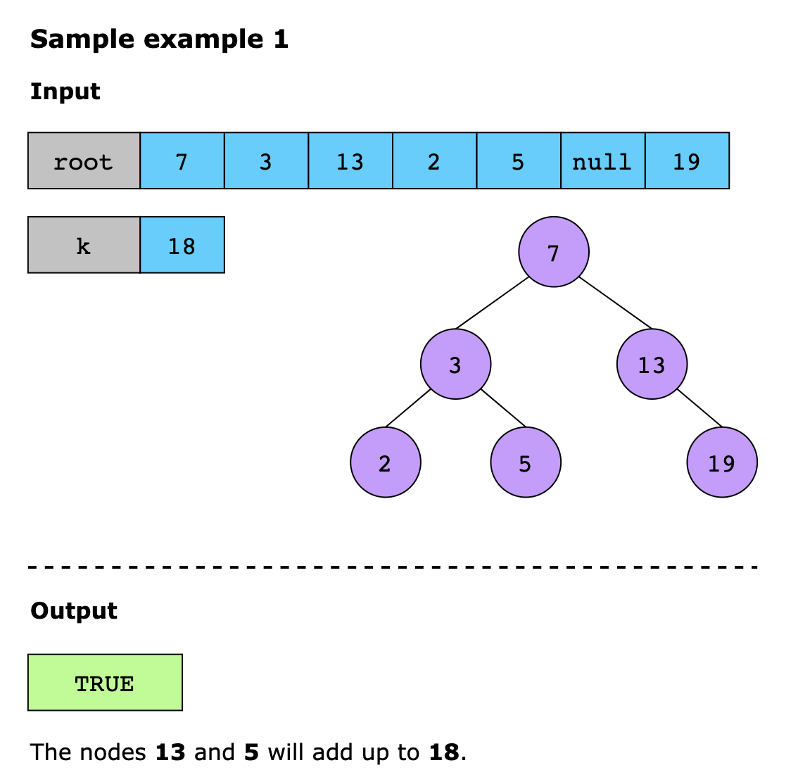
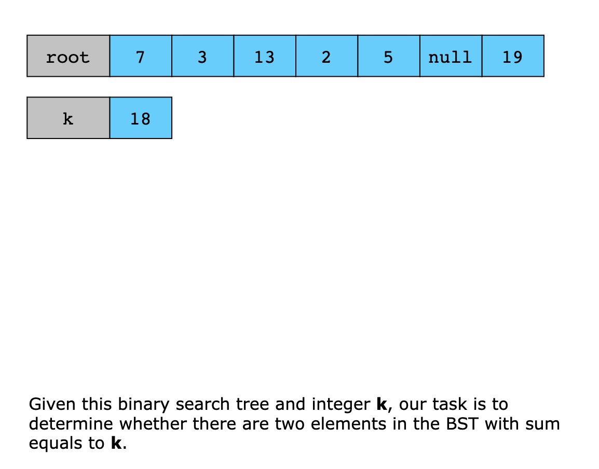
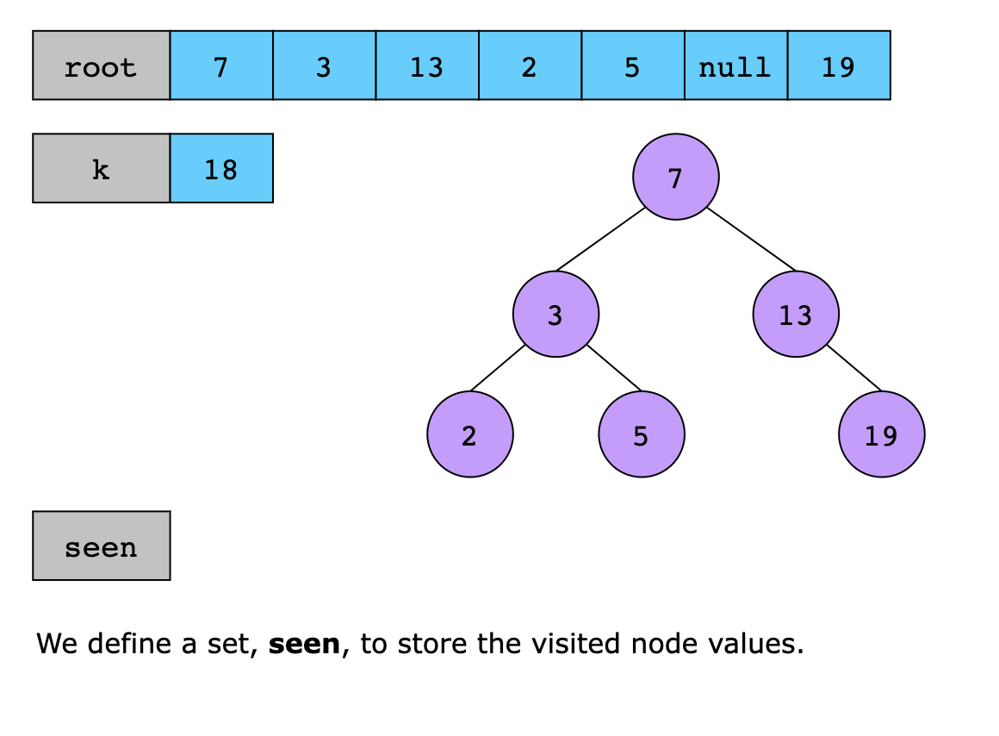
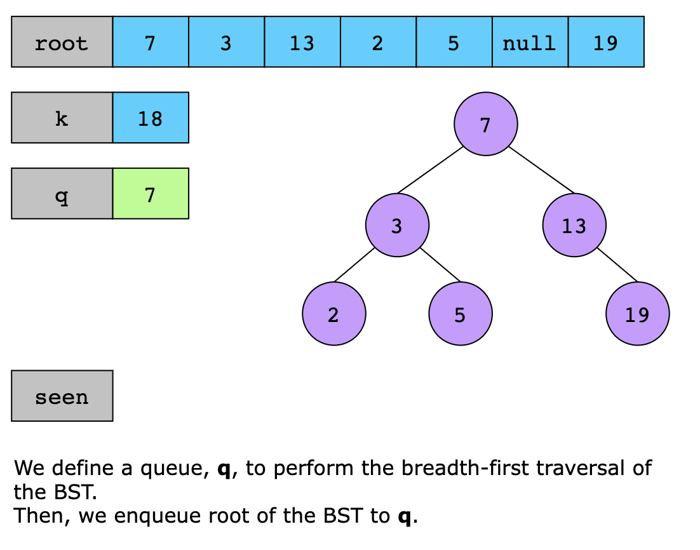
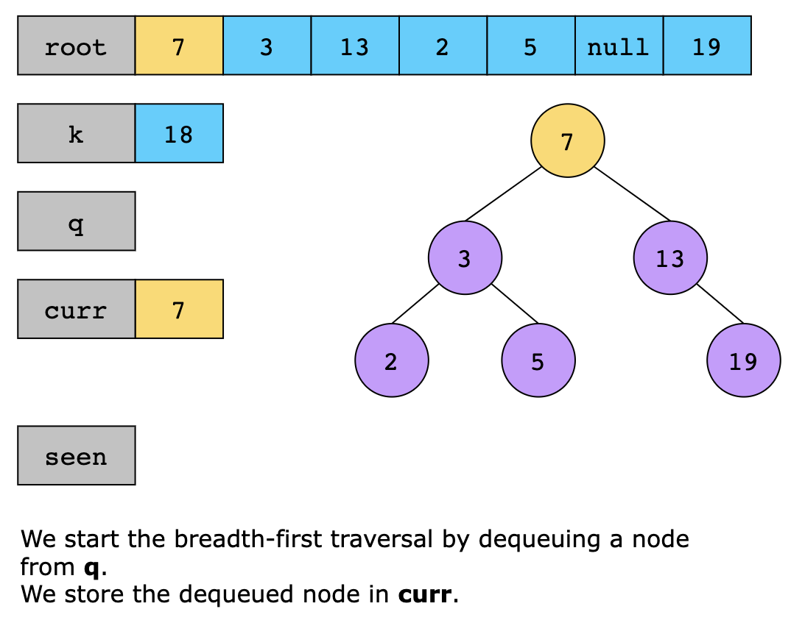
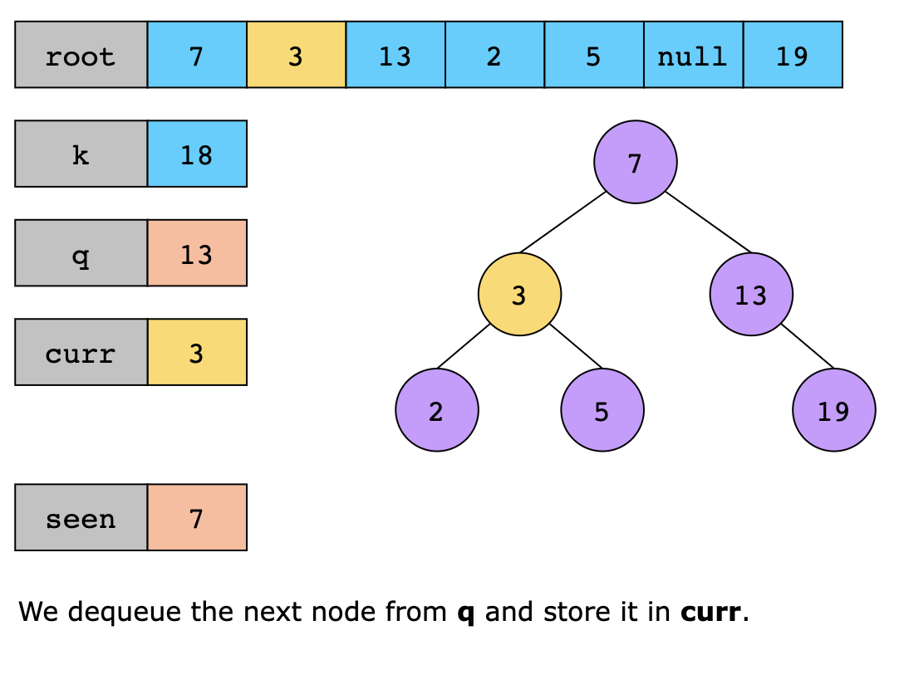
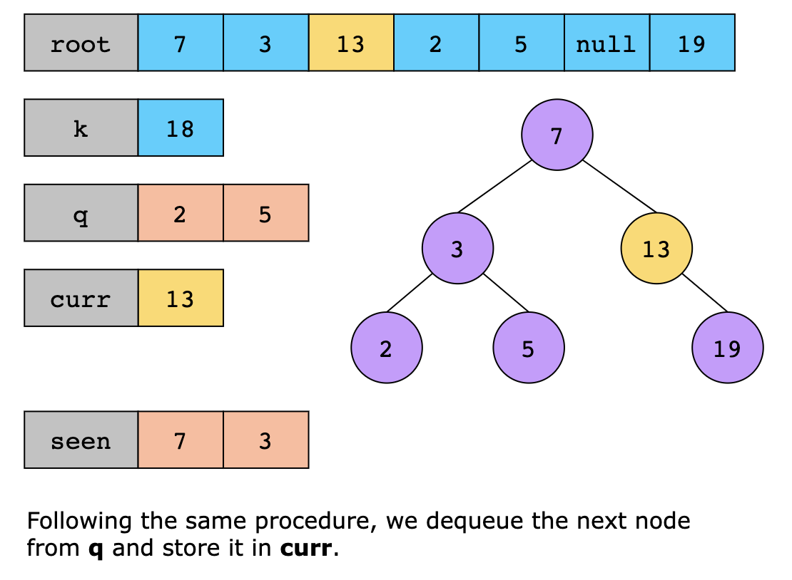

# Two Sum - Input Array Is Sorted

Given a 1-indexed array of integers numbers that is already sorted in non-decreasing order, find two numbers such that
they add up to a specific target number. Let these two numbers be numbers[index1] and numbers[index2] where 1 <=
index1 < index2 <= numbers.length.

Return the indices of the two numbers, index1 and index2, added by one as an integer array [index1, index2] of length 2.

The tests are generated such that there is exactly one solution. You may not use the same element twice.

Your solution must use only constant extra space.

```text

Example 1:

Input: numbers = [2,7,11,15], target = 9
Output: [1,2]
Explanation: The sum of 2 and 7 is 9. Therefore, index1 = 1, index2 = 2. We return [1, 2].
```

```text
Example 2:

Input: numbers = [2,3,4], target = 6
Output: [1,3]
Explanation: The sum of 2 and 4 is 6. Therefore index1 = 1, index2 = 3. We return [1, 3].
```

```text
Example 3:

Input: numbers = [-1,0], target = -1
Output: [1,2]
Explanation: The sum of -1 and 0 is -1. Therefore index1 = 1, index2 = 2. We return [1, 2].
```

---

# Two Sum IV - Input Is a BST

Given the root of a binary search tree and an integer k, determine whether there are two elements in the BST whose sum 
equals k. Return TRUE if such elements exist or FALSE otherwise.

## Constraints

- The number of nodes in the tree is in the range [1, 10^3].
- 10^3 <= Node.data <= 10^3
- root is guaranteed to be a valid binary search tree.
- 10^4 <= k <= 10^4

## Examples




## Solution

The core intuition behind solving this problem is to use a set to track values encountered during a breadth-first search
of the binary search tree (BST). We calculate each node’s complement (i.e., the difference between k and the node’s value)
and check if this complement already exists in the set. If it does, it means there is another node in the BST whose value,
when added to the current node’s value, equals k, and we return TRUE. Otherwise, we add the current node’s value to the set.
If no two nodes with the required sum are found by the end of the traversal, we return FALSE.

Using the intuition above, the solution can be implemented as follows:

1. If the BST is empty, return FALSE.
2. Define a set, seen, to store the visited node values.
3. Define a queue, q, to perform the level-order traversal of the BST.
   - Enqueue root to q to start the traversal from the root node.
4. While the queue is not empty, repeat the following steps:
   - Dequeue a node from the front of the queue.
   - Check if the complement of the current node’s value exists in the seen set. If yes, return TRUE.
   - Add the current node’s value to the seen set.
   - Enqueue its left and right children.
5. If no two nodes with the required sum are found, return FALSE.

Let’s look at the following illustration to get a better understanding of the solution:












### Time Complexity

The algorithm’s time complexity is O(n), where n is the number of nodes in the binary search tree.

### Space Complexity

The algorithm’s space complexity is O(n), as the size of the set can grow up to at most n.

---

## Related Topics

- Array
- Two Pointers
- Binary Search
