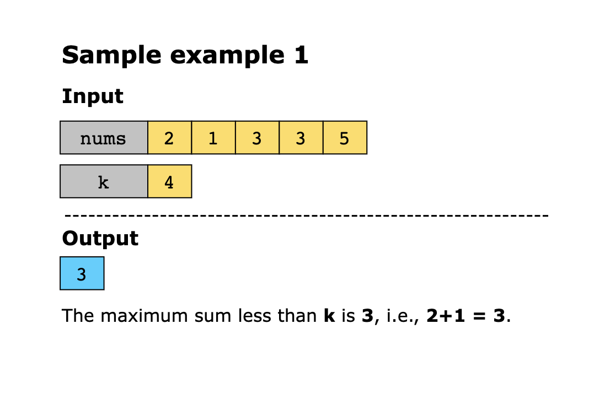
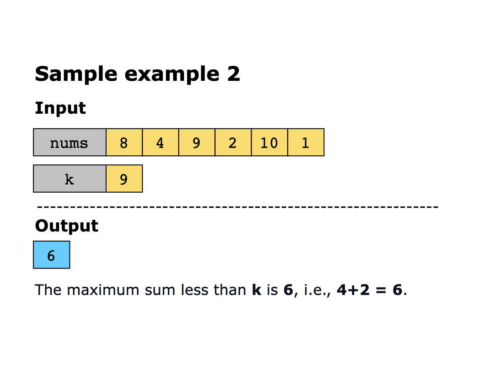
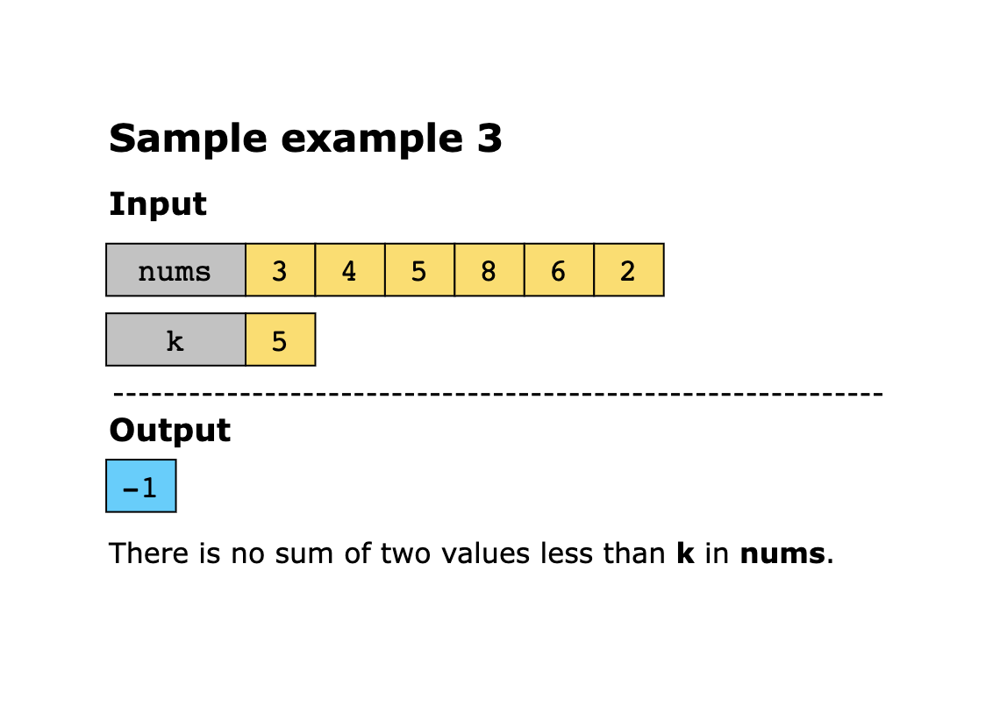

# Two Sum Less Than K

Given an array of integers, nums, and an integer k, find the maximum sum of two elements in nums less than k. Otherwise, 
return −1 if no such pair exists.

Constraints

- 1 ≤ nums.length ≤ 100
- 1 ≤ nums[i] ≤ 10^3
- 1 ≤ k ≤ 10^3

## Examples

## Related Topics

- Array
- Two Pointers
- Binary Search
