# Letter Tile Possibilities

You are given a string, tiles, consisting of uppercase English letters. You can arrange the tiles into sequences of any
length (from 1 to the length of tiles), and each sequence must include at most one tile, tiles[i], from tiles.

Your task is to return the number of possible non-empty unique sequences you can make using the letters represented on
tiles[i].

## Constraints:

- 1 ≤ `tiles.length` ≤ 7
- The `tiles` string consists of uppercase English letters.

## Examples

Example 1:

```text
Input: tiles = "AAB"
Output: 8
Explanation: The possible sequences are "A", "B", "AA", "AB", "BA", "AAB", "ABA", "BAA".
```

Example 2:
```text
Input: tiles = "AAABBC"
Output: 188
```

Example 3:
```text
Input: tiles = "V"
Output: 1
```

## Topics

- Hash Table
- String
- Backtracking
- Counting

## Solutions

### Permutations and Combinations

This problem would have been straightforward if the tiles had no duplicates and we only needed to find sequences of the
same length as the given tiles. In that case, we could simply calculate the total unique sequences using n! (where n is
the length of the tiles).

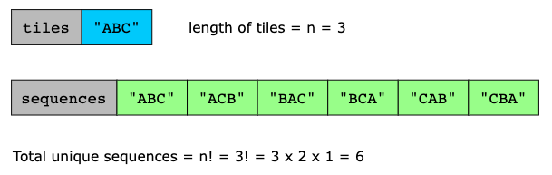

However, in this problem, we need to find all unique sequences of any length—from 1 to the full length of the tiles—while
accounting for duplicate tiles. To achieve this, we take the following approach:

We begin by sorting the letters in tiles so that similar letters are grouped. This allows us to systematically explore
possible letter sets without repeating unnecessary work.

To generate sequences of lengths ranging from 1 to n, we consider each letter one by one. We start with a single
character, determine its possible sequences, then move to two-character combinations, find their possible sequences,
and so on. For each new character, we have two choices: either include the current letter in our selection or skip it
and move to the next one. By exploring both choices, we generate all possible letter sets.

To prevent counting the same sequences multiple times due to duplicate letters, we ensure (in the previous step) that
duplicate letter sets are not counted more than once while generating different letter sets. Then, for each set, we
calculate how many distinct sequences can be formed by applying the updated formula for permutations, which accounts
for repeated letters: `n! / c!`, where c is the count of each repeated letter.

The more repeated letters in a set, the fewer unique ways it can be arranged.

We repeat this process for every possible letter set. Eventually, we sum the count of all these possible sequences to
obtain the total number of unique non-empty sequences. Finally, we subtract one from our final count to exclude the
empty set, as it does not contribute to valid arrangements.

Let’s look at the following illustration to understand this better.

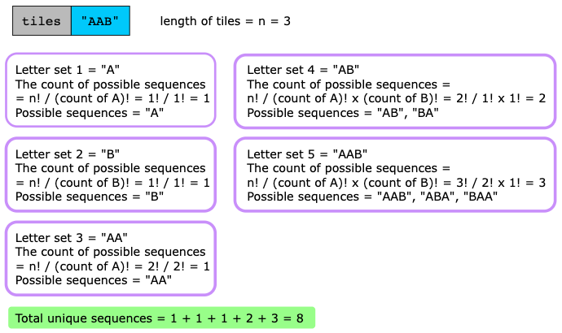

Now, let’s look at the algorithm steps of this solution:

- Initialize a set, unique_letter_sets, to track unique letter sets.
- Sort the input string, tiles, to group identical letters together.
- Generate unique letter sets and count their permutations:
  - The function generate_sequences is used to recursively generate all possible letter subsets.
  - We calculate the number of valid sequences using `count_permutations` for each unique letter set. The
    `count_permutations` uses the helper function `factorial(n)`, which computes the factorial of a given number.
- The recursive function, `generate_sequences(tiles, current_letter_set, index, unique_letter_sets)`, works as follows:
  - **Base case**: If `index` reaches the end of tiles, check if `current_letter_set` is unique. If it is:
    - Add it to `unique_letter_sets`. 
    - Compute its permutations and return the count.
  - **Recursive cases**:
    - Exclude the current character (move to the next index). Store its result in the variable `without_letter`.
    - Include the current character (append it and move to the next index). Store its result in the variable `with_letter`.
  - The sum of both recursive calls gives the total count of valid sequences.
  - Once all the letters in tiles have been explored, return the output. As an empty set is also considered in the
    recursive process, we subtract 1 before returning the output.

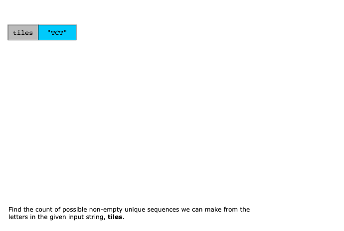
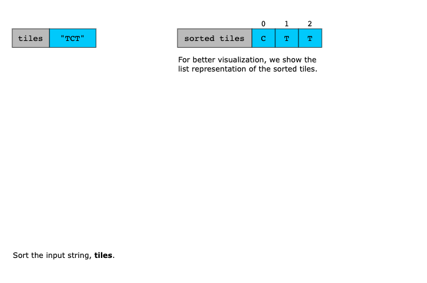
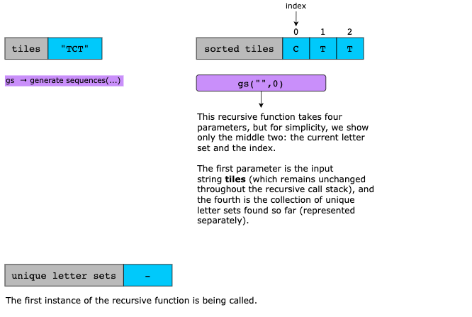
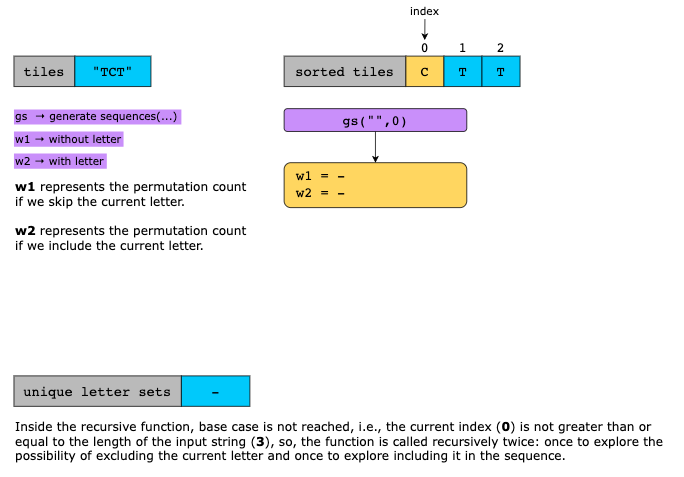
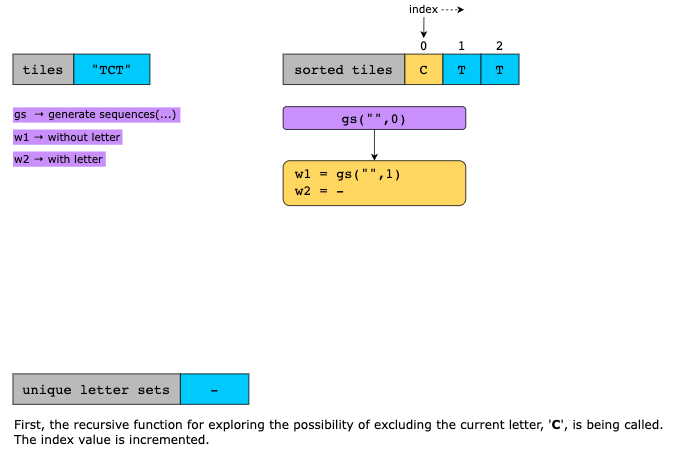
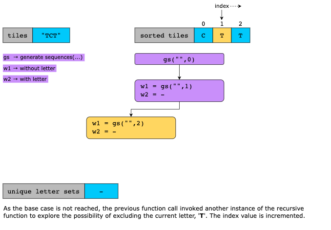
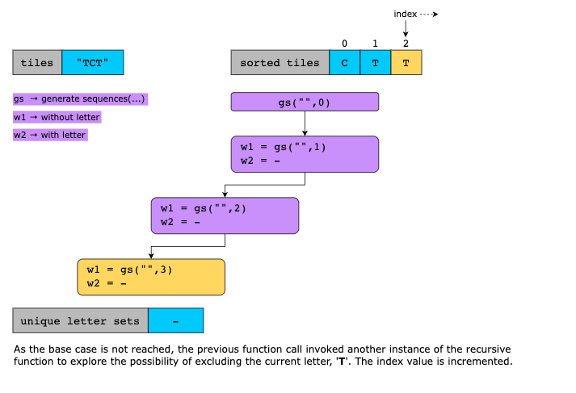
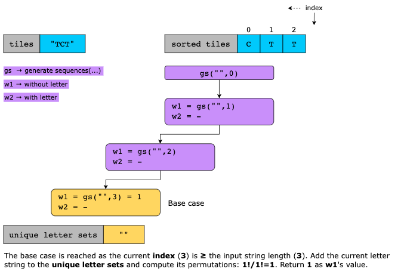
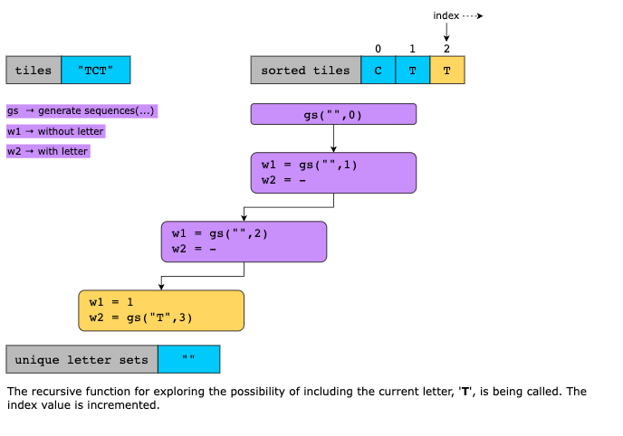
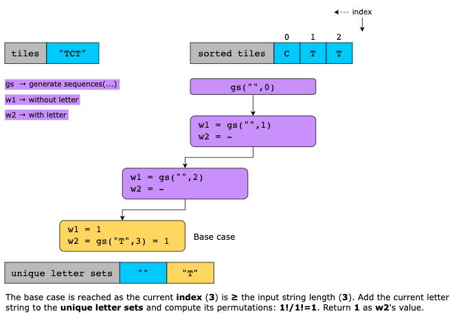
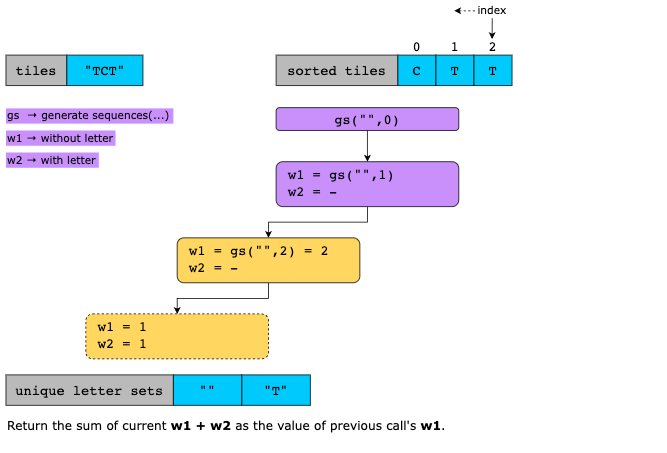
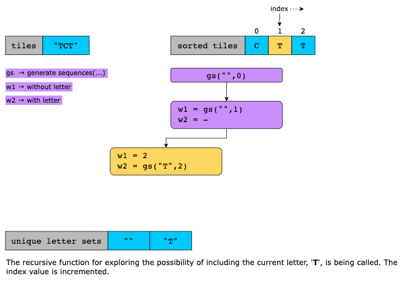
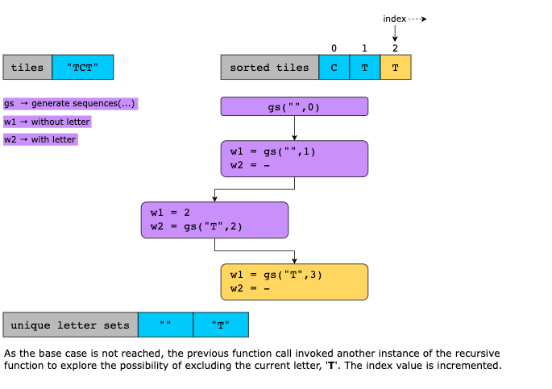
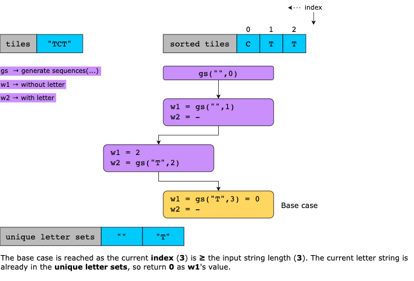
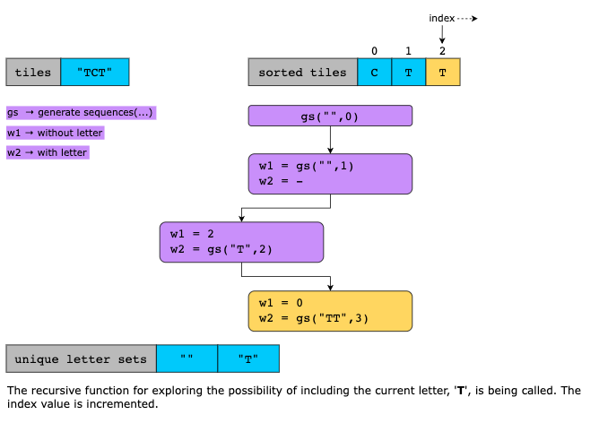
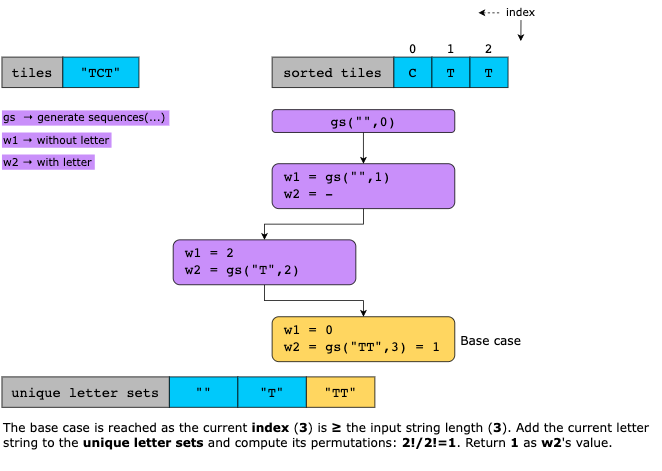
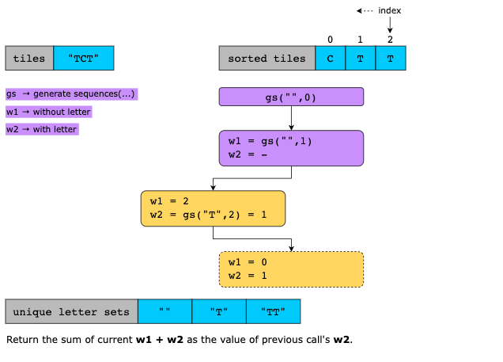
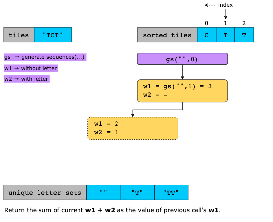
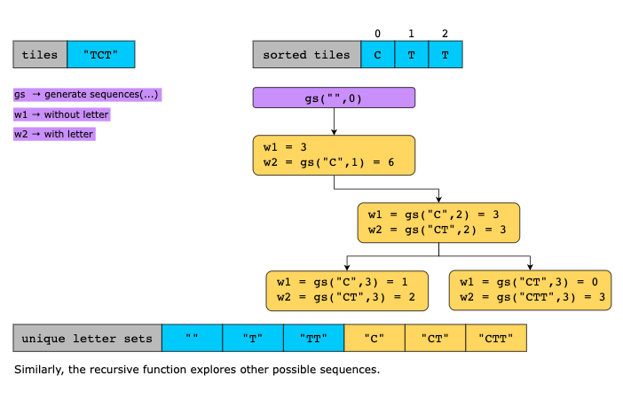
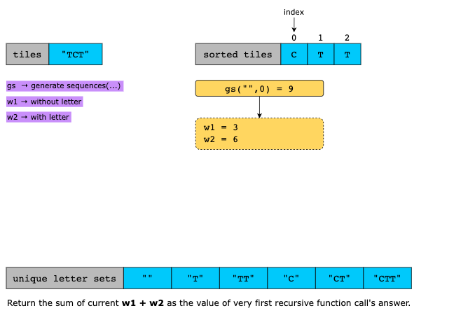
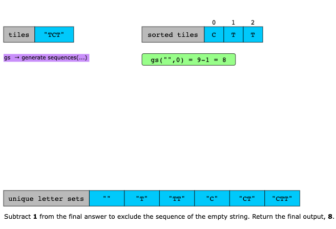

#### Time Complexity

Let’s break down and analyze the time complexity of this solution:
- Sorting the input string takes `O(n log(n))` time, where n is the length of the tiles.
- The recursive function explores all possible subsets of the given tiles. As each tile can either be included or
  skipped, there are 2^n subsets in the worst case.
- For each subset, we calculate the number of unique sequences that can be formed using the formula that accounts for
  duplicate letters. 
  - Computing the factorial and handling character frequencies takes at most `O(n)` time per subset.
  - As we do this for all 2^n subsets, the total time complexity is `O(2 ^n × n)`, which dominates the sorting step.

If we sum these up, the overall time complexity simplifies to:

`O(nlogn) + O(2^n) + O(2^n×n) = O(2^n×n)`

#### Space Complexity
Let’s analyze the space complexity of this solution:
- As the recursion goes as deep as the length of the string n, the worst case space used by the function calls is `O(n)`.
- We store all unique subsets of tiles in a set, which can hold up to O(2^n) subsets in the worst case. Each sequence in
  the set can be up to length n. So, the set uses `O(2^n × n)` space.
- The permutation calculation uses extra space, but this is at most O(n).

If we add these up, the overall space complexity simplifies to:

`O(n) + O(2^n × n) + O(n) = O(2^n × n)`
