# Optimal Account Balancing

Given a list of transactions, where each transaction is represented as transactions[i]=[fromi, toi, amounti], indicating
that the person fromi gave amounti to the person toi.

Return the minimum number of transactions needed to settle all debts.

## Constraints

- 1 ≤ transactions.length ≤ 10
- transactions[i].length == 3
- 0 ≤ fromi, toi ≤ 10
- 1 ≤ amounti ≤ 100 
- fromi ≠ toi

## Examples

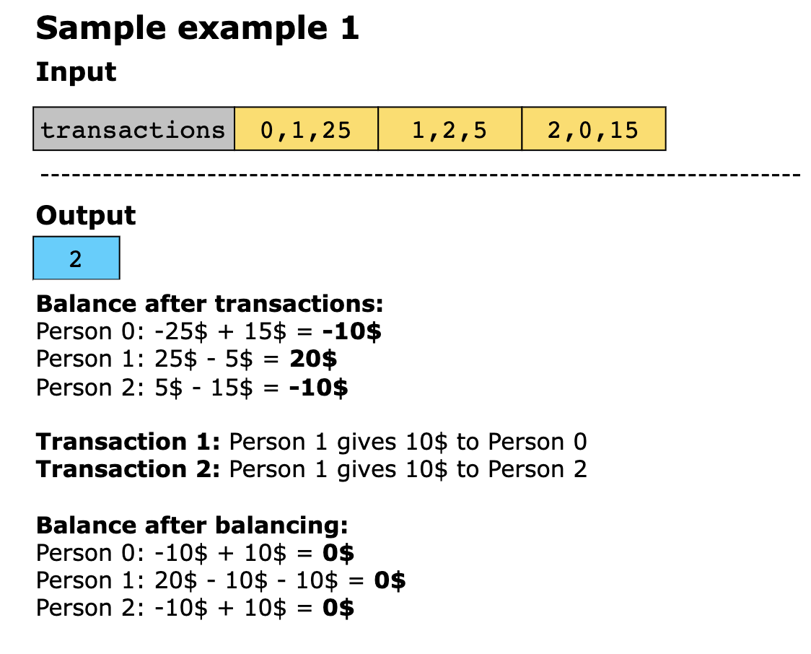
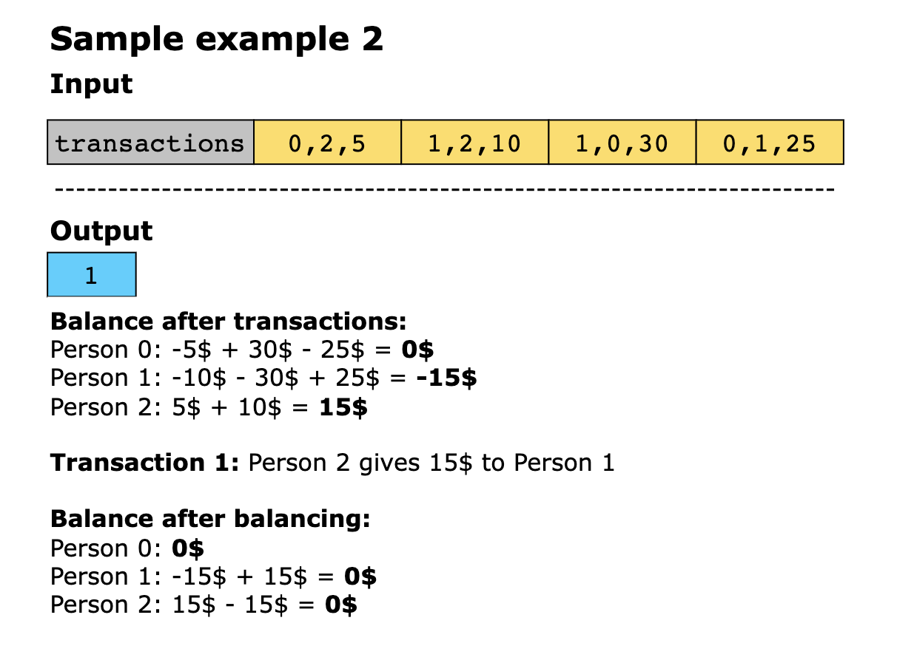
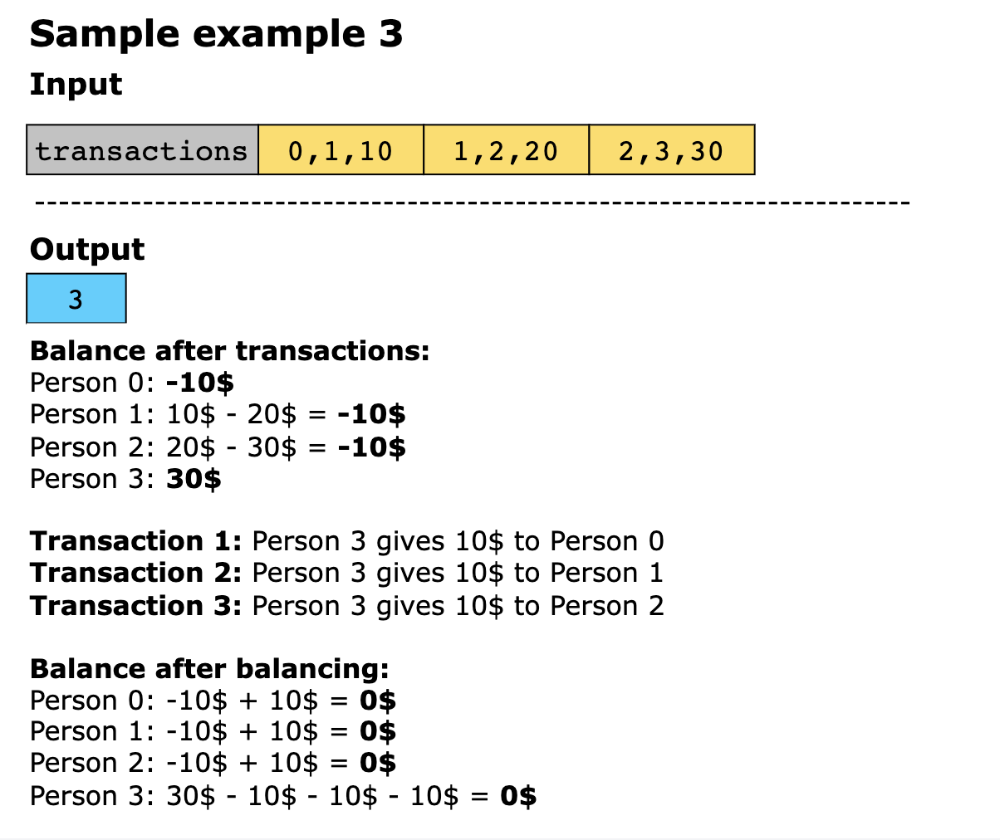

## Solution

This solution calculates the minimum number of transactions required to settle debts among a group of people based on an
initial set of transactions. It begins by computing each person’s net balance, indicating how much they owe or are owed.
Any individuals with a zero net balance are ignored, as they have no outstanding debts or credits.

Once the net balances are calculated, the algorithm uses a recursive approach to settle the remaining balances. It pairs
individuals with opposite balances (i.e., those who owe with those who are owed) to reduce them to zero with the minimum
number of transactions. The solution explores various pairings and tracks each combination’s cost (number of transactions),
ensuring optimal results. If a particular path doesn’t minimize the transactions, it backtracks to explore alternative
pairings.

Here’s the step-by-step implementation of the solution:

- For each transaction, decrease the balance of the person who gave the money and increase the balance of the person who 
  received it.

- Ignore people with a zero balance after all transactions, as they neither owe nor are owed.
- Use depth-first search (DFS) to recursively calculate the minimum number of transactions required to settle all balances. 
  - Base case: If the current person reaches n (number of people with non-zero balances), meaning all balances are zero
    or settled, return 0.
  - For each next person:
    - If the current and next person have opposite sign balance:
      - Temporarily add the current person’s balance to the next person’s balance. 
      - Recursively call DFS with the next person’s index. 
      - Track the minimum of the existing cost and the new cost calculated by DFS. 
      - **Backtrack**: Restore the balance to its original state by reversing the temporary addition.
  - Return the minimum cost for all possible transaction paths.

Let’s look at the following illustration to get a better understanding of the solution:

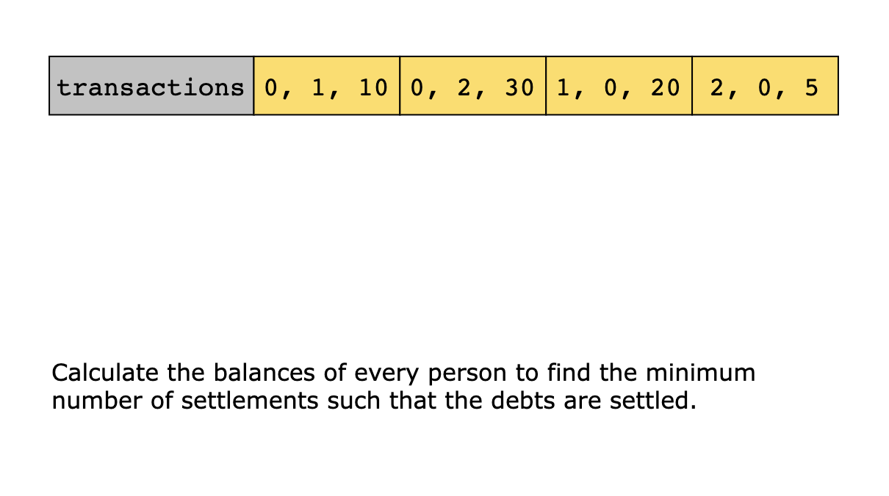
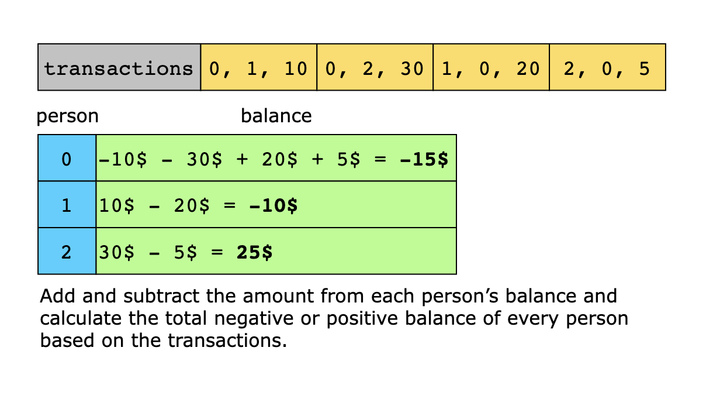
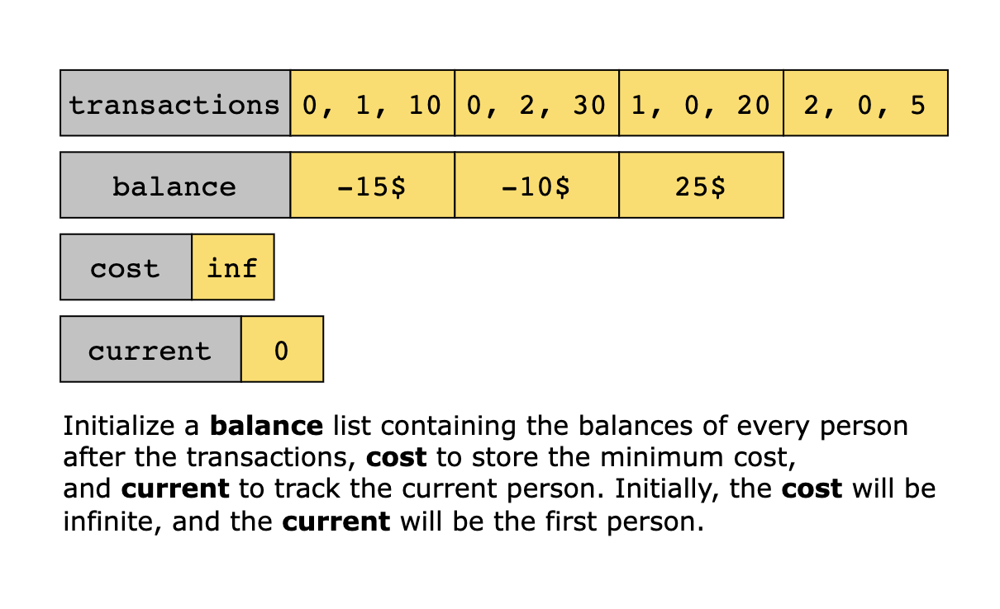
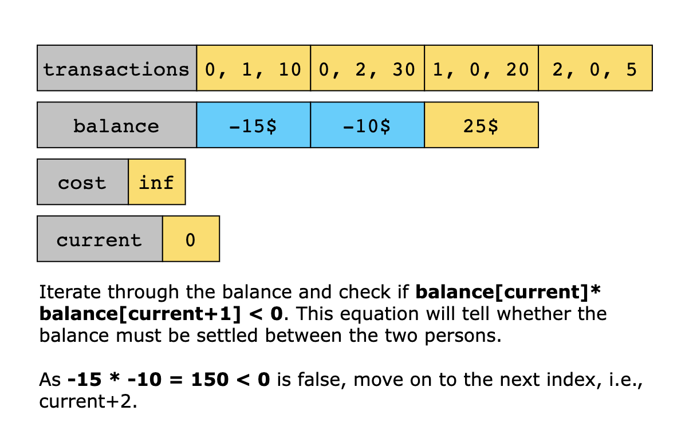
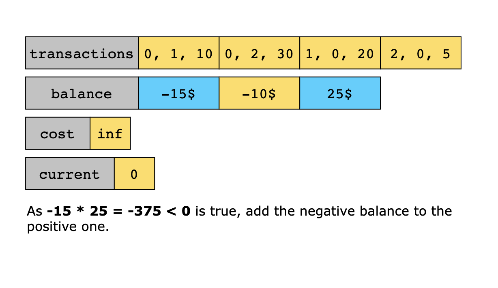
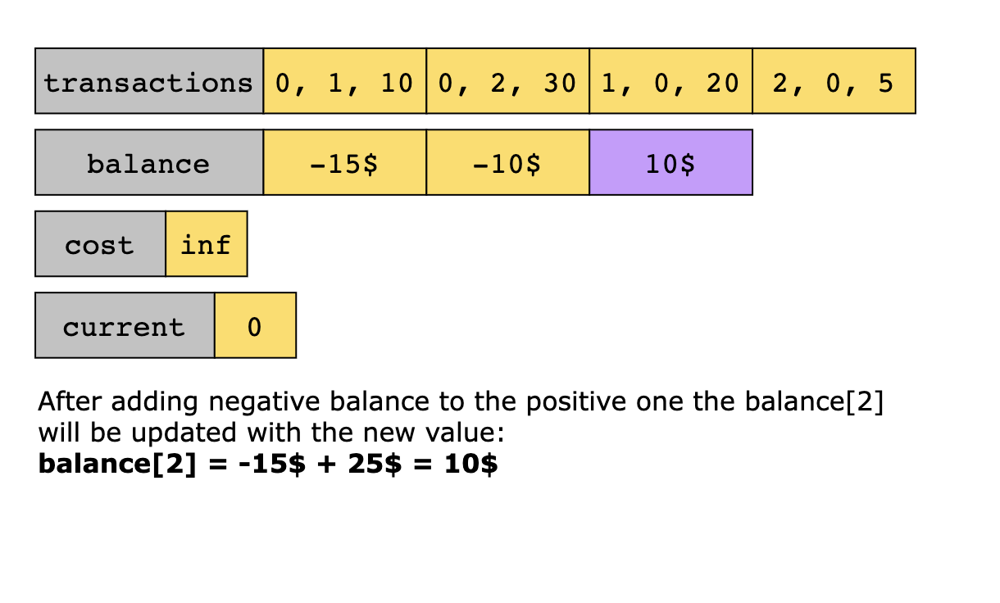
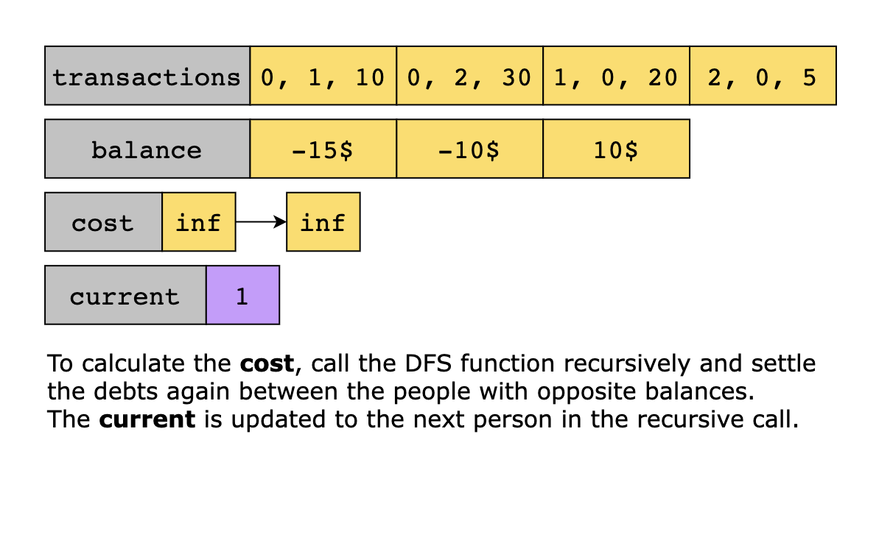
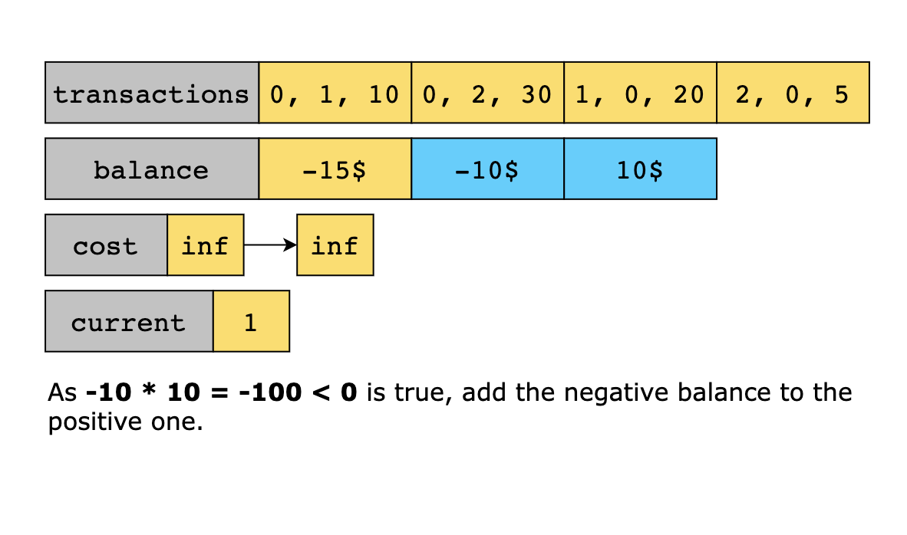
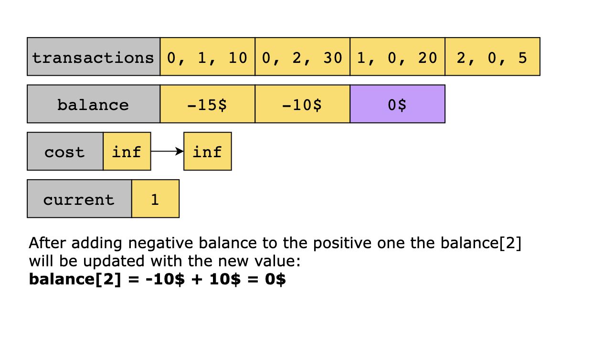
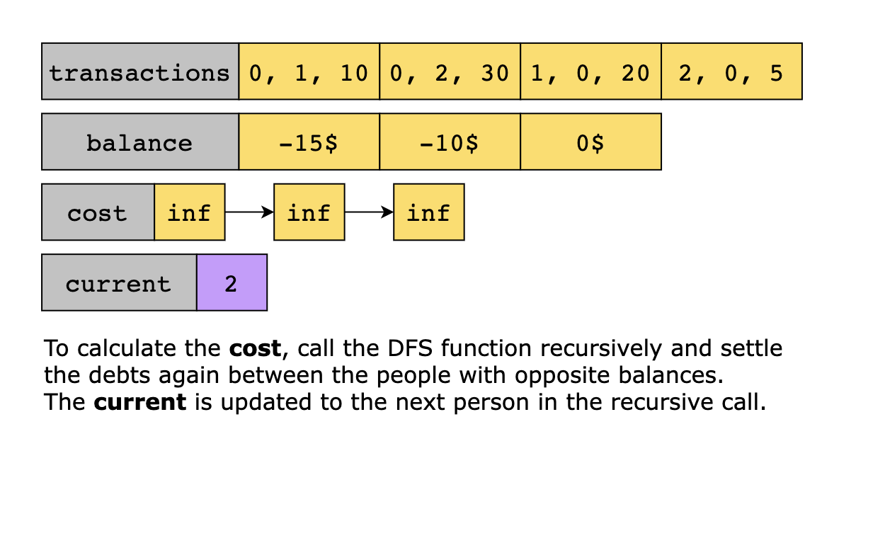
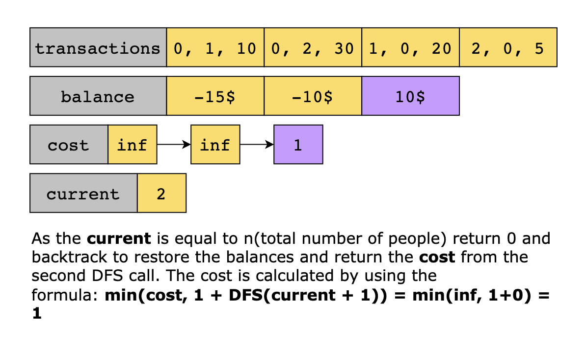
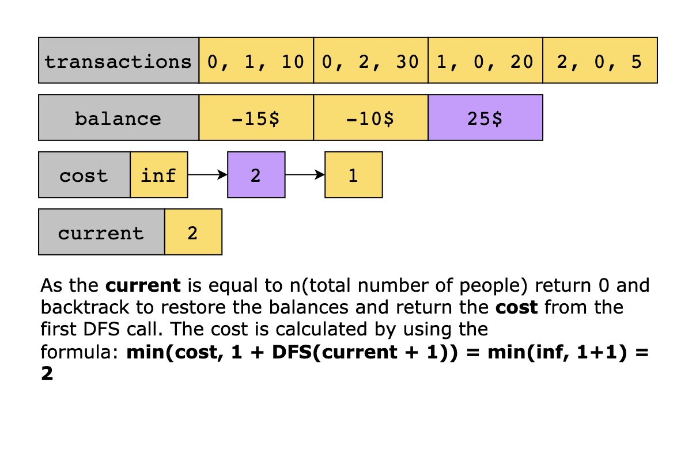
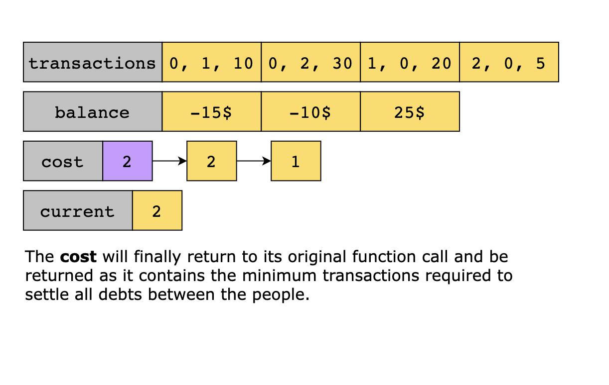

### Time Complexity

The time complexity is O((n−1)!), where n is the number of persons. This complexity arises because, in the initial call
to dfs(0), there are n−1 possible choices for the next person, each leading to a recursive call to dfs(1), and so on.
This results in a chain of recursive calls multiplied by the choices at each level, giving a factorial pattern (n−1)!.

### Space Complexity

The space complexity is O(n), where n is the number of unique amounts. This is because both balance_map and balance can
hold at most n amounts.
