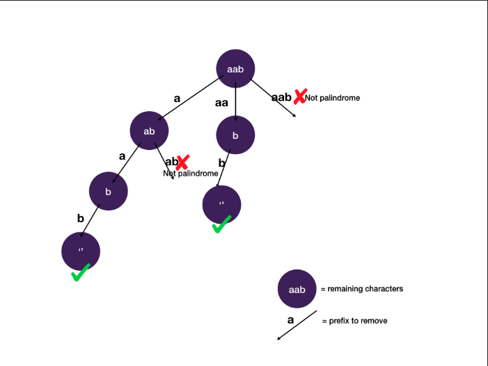

# Partitioning a string into palindromes

Given a string s, partition s such that every substring of the partition is a palindrome.

Return all possible palindrome partitioning of s.

Examples

```plain
Example 1:
Input: aab
Output:
[
    ["aa","b"],
    ["a","a","b"]
]
```

## Solution

We try to remove prefix at each possible position and only continue if the prefix is a palindrome (since every substring
has to be a palindrome to be considered a solution).




We prune the tree by not branching out when the prefix is not a palindrome.

- Time Complexity
  Estimating time complexity of backtracking on a pruned tree is tricky because pruned branches should be excluded from
  the overall time complexity. One way to estimate is to look at the operations we have done on the input. For each
  letter in the input string, we can either include it as a previous string or start a new string with it. With those
  two choices, the total number of operations is 2^n. We also need O(n) to check if the string is a palindrome. In
  total, the complexity is `O(2^n * n)`.

- Space Complexity
  The space complexity depends on the height of the tree , and the height of the state-space tree is worst-case `O(n)`.

## Related Topics

- String
- Backtracking
