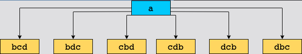
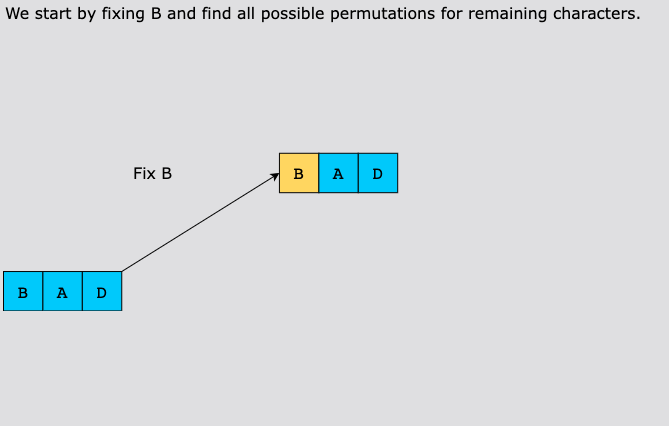
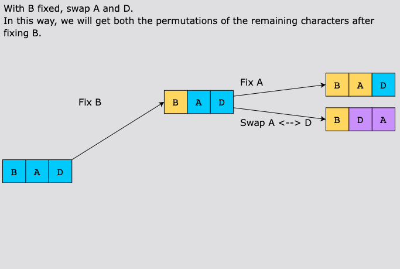
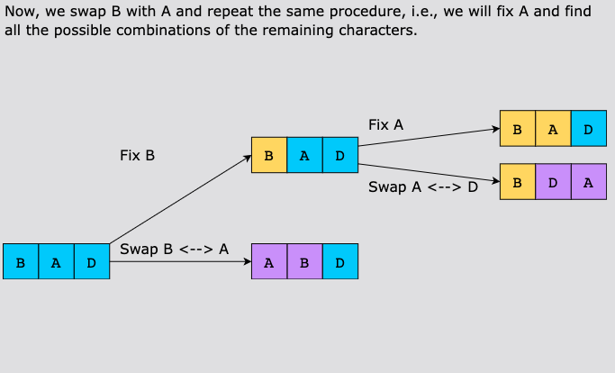
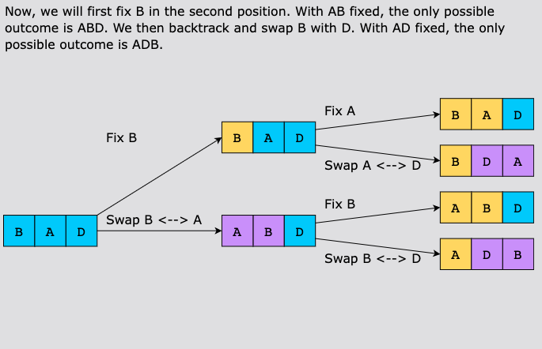
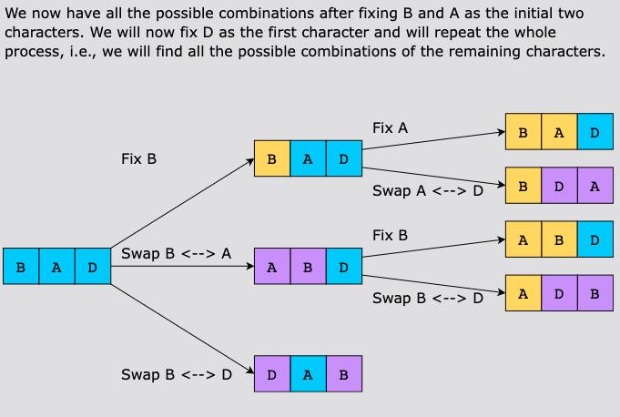
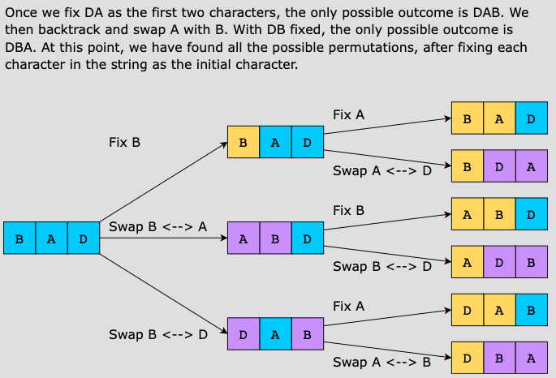
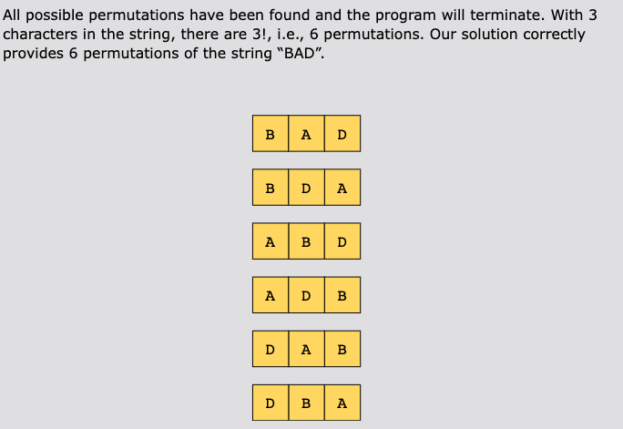

# Generate All Permutations

Given a string of unique letters, find all of its distinct permutations.

Permutation means arranging things with an order. For example, permutations of [1, 2] are [1, 2] and [2, 1].

Input

- letters: a string of unique letters

Output

- all of its distinct permutations

Examples

Example 1:
Input:

1. letters = abc
    - Output: abc acb bac bca cab cba

## Constraints

- All characters in word are unique.
- 1 ≤ word.length ≤ 6
- All characters in word are lowercase English letters.

## Solution

Problems such as this one, where we need to find the combinations or permutations of a given string, are good examples
to solve using the subsets pattern as it describes an efficient Depth-First Search (DFS) approach to handle all these
problems.

Let’s discuss a few basics first. We know that n! is the number of permutations for a set of size n. Another obvious and
important concept is that if we choose an element for the first position, then the total permutations of the remaining
elements are (n−1)!.

For example, if we’re given the string “abcd” and we pick “a” as our first element, then for the remaining elements we
have the following permutations:

Similarly, if we pick “b” as the first element, permute “acd”, and prepend each permutation with “b”, we can observe a
pattern here as shown in the illustration above. That pattern tells us how to find all remaining permutations for each
character in the given string.

We can do this recursively to find all permutations of substrings, such as “bcd”, “acd”, and so on. This implies that
generating all possible permutations of the given string involves exploring different combinations of characters, which
can be done efficiently using the subset technique. The key idea is to take one character of the given string at a time
and find all the permutations that start with this chosen character. For this, imagine filling empty positions equal to
the length of the string in the following manner: place the chosen character at the first position, then against this
character, try all the remaining characters in the second position. Next, for each pair of characters in the first and
second positions, try all the remaining characters in the third position. Keep doing this until we reach the last
position to be filled. This process will allow us to systematically arrange each character in different positions and
generate all possible permutations of the given string.

Here is a visual representation of all recursions for input string “bad”:

We create a recursive function to compute the permutations of the string that has been passed as input. The function
behaves in the following way:

- We fix the first character of the input string and swap it with its immediate next character.
- We swap the indexes and get a new permutation of the string, which is stored in the variable, swapped_str.
- The recursive call for the function increments the index by adding 1 to the current_index variable to compute the next
  permutation.
- All permutations of the string are stored in the result array

### Time Complexity

Let’s anaylze the time complexity of the solution code above:
- `permute_word()`: There are n! (factorial of n) permutations of a string of length n.
- `permute_string()`: This is a recursive function that generates these permutations. For a string of length n, there
  are n recursive calls at the first level, `n-1` calls for the second, and so on. This results in a total of 
  `n * (n-1) * (n-2) * ... * 1 = n!` calls
- `swap_char()`: The swap function has a time complexity of O(n) since it involves creating a list from the string and
  then joining it back into a string after the swap. This operation is done for each recursive call.

So the overall time complexity is O(n * n!)

### Space Complexity

The space complexity of this solution is dependent on the depth of the recursive call stack. The maximum depth of
recursion is n, so the space complexity is O(n).
