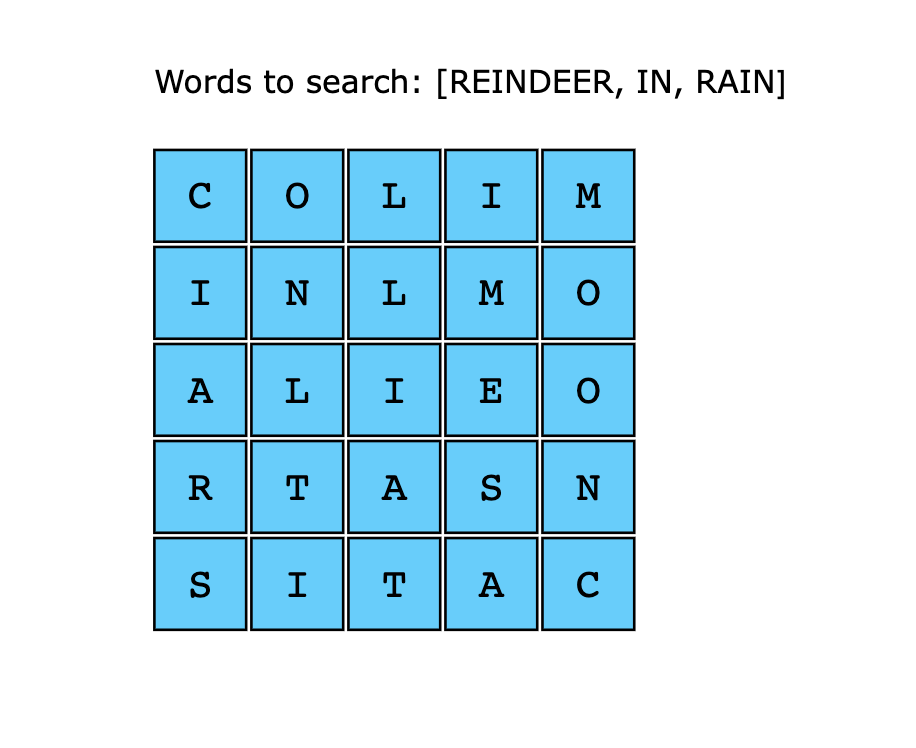
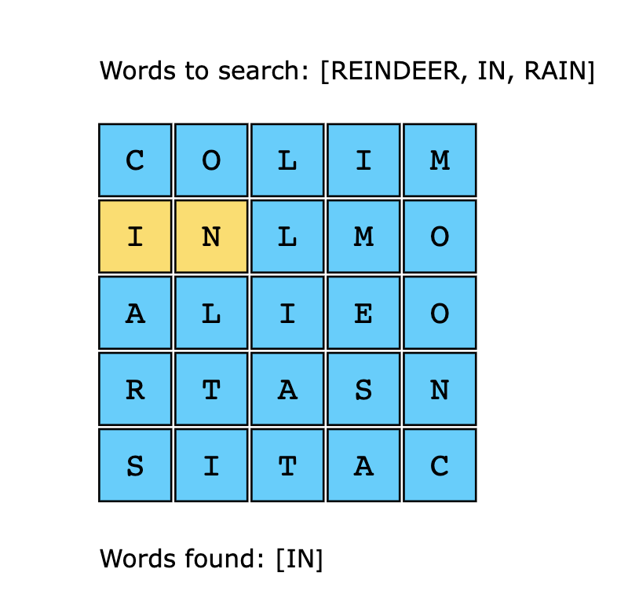
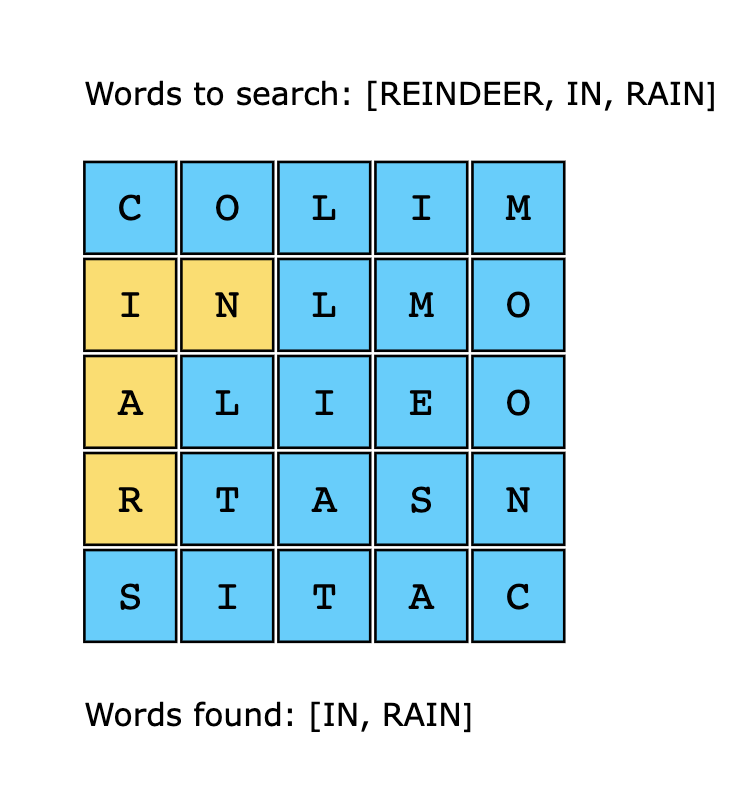
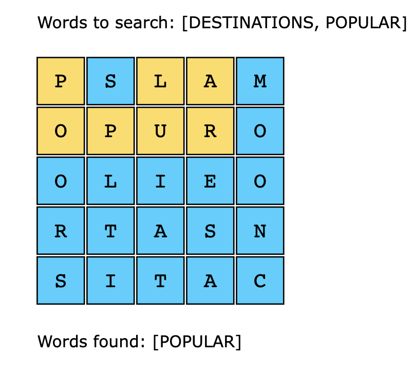

# Word Search

Create a program to solve a word search puzzle.

In word search puzzles you get a square of letters and have to find specific words in them.

For example:

```
jefblpepre
camdcimgtc
oivokprjsm
pbwasqroua
rixilelhrs
wolcqlirpc
screeaumgr
alxhpburyi
jalaycalmp
clojurermt
```

There are several programming languages hidden in the above square.

Words can be hidden in all kinds of directions: left-to-right, right-to-left, vertical and diagonal.

Create a program that given a puzzle and a list of words returns the location of the first and last letter of each word.

You will be provided with a Point(x, y) class which will be used to display the points of the first and last words of
the found words.

You will be required to create a method `search` of class WordSearch that takes in a parameter `word` and searches
through the provided grid for this word. It must return the Points of thw first and last letter of the word if found
else return None.

An e.g.

``` python
puzzle = ('jefblpepre\n'
          'camdcimgtc\n'
          'oivokprjsm\n'
          'pbwasqroua\n'
          'rixilelhrs\n'
          'wolcqlirpc\n'
          'screeaumgr\n'
          'alxhpburyi\n'
          'jalaycalmp\n'
          'clojurermt')

>>> example = WordSearch(puzzle)
>>> example.search('clojure')
(Point(0, 9), Point(6, 9))
```

From the above, from the word `clojure`, **c** can be found at point 0,9 and the last letter **e** can be found at poin
6, 9

> Note: indexes start counting from 0.

----

# Word Search 2

You are given a list of strings that you need to find in a 2D grid of letters such that the string can be constructed 
from letters in sequentially adjacent cells. The cells are considered sequentially adjacent when they are neighbors to 
each other either horizontally or vertically. The solution should return a list containing the strings from the input 
list that were found in the grid.

## Constraints

- 1 <= rows, columns <= 12
- 1 <= words.length <= 3 * 10^3
- 1 <= words[i].length <= 10
- grid[i][j] is an uppercase English letter
- words[i] consists of uppercase English letters
- All the strings are unique

> Note: The order of the strings in the output does not matter.

## Examples







## Solution

By using backtracking, we can explore different paths in the grid to search the string. We can backtrack and explore 
another path if a character is not a part of the search string. However, backtracking alone is an inefficient way to 
solve the problem, since several paths have to be explored to search for the input string.

By using the trie data structure, we can reduce this exploration or search space in a way that results in a decrease in 
the time complexity:

- First, we’ll construct the Trie using all the strings in the list. This will be used to match prefixes. 
- Next, we’ll loop over all the cells in the grid and check if any string from the list starts from the letter that 
  matches the letter of the cell. 
- Once an letter is matched, we use depth-first-search recursively to explore all four possible neighboring directions. 
- If all the letters of the string are found in the grid. This string is stored in the output result array. 
- We continue the steps of all our input strings.

### Time Complexity

The time complexity will be O(n*3^l), where n is equal to rows * columns, and l is the length of the longest string in 
the list. The factor 3^l means that, in the dfs() function, we have four directions to explore initially, but only three
choices remain in each cell because one has already been explored. In the worst case, none of the strings will have the 
same prefix, so we cannot skip any string from the list.

### Space Complexity

The space complexity of this solution is O(m) where m is the total count of all the characters in all the strings 
present in the input list. This is actually the size of the trie data structure that is built on the list of words 
provided in the input.
