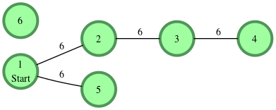

Consider an undirected graph consisting of nodes where each node is labeled from 1 to n and the edge between any two
nodes is always of length 6. We define node s to be the starting position for a BFS. Given a graph, determine the
distances from the start node to each of its descendants and return the list in node number order, ascending. If a node
is disconnected, it's distance should be -1.

For example, there are n=6 nodes in the graph with a starting node s = 1. The list of [[1,2], [2,3], [3,4], [1,5]], and
each has a weight of 6.

Starting from node 1 and creating a list of distances, for nodes 2 through 6 we have distances = [6,12,18,6,-1].

Function Description

Define a Graph class with the required methods to return a list of distances.