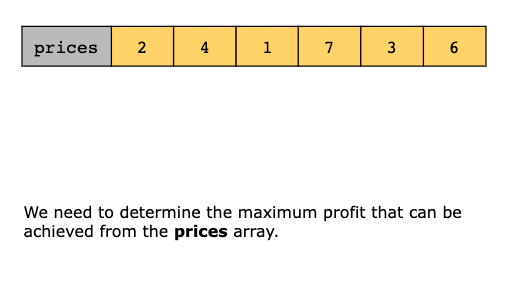
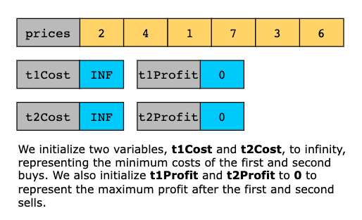
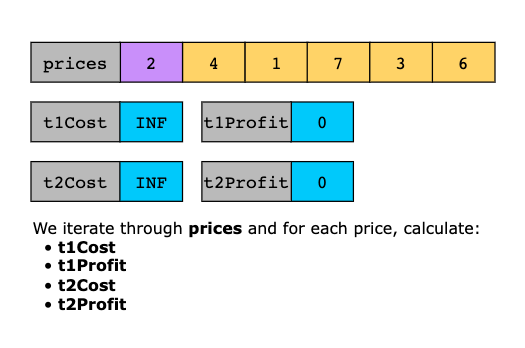
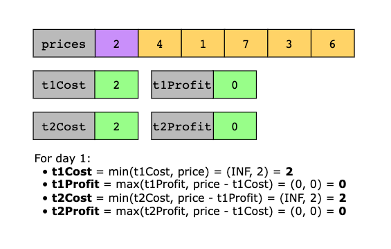
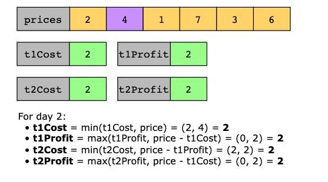
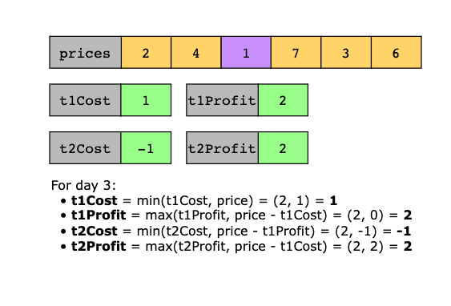
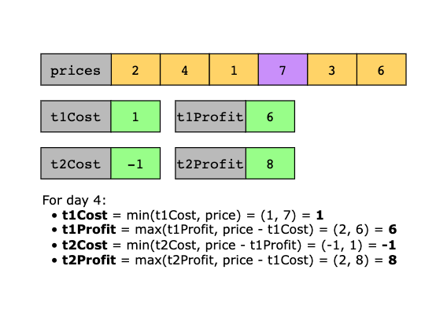
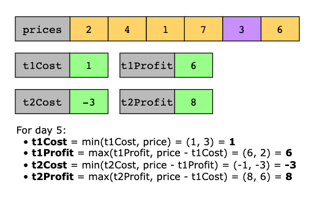
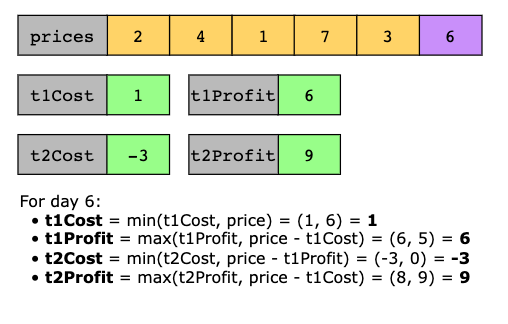
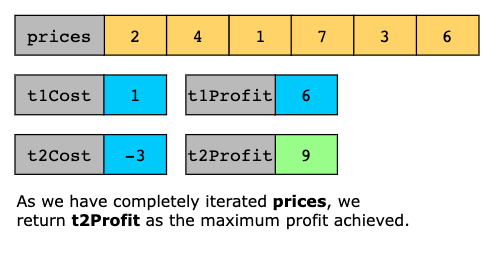

# Best Time to Buy and Sell Stock

You are given an array prices where prices[i] is the price of a given stock on the ith day.

You want to maximize your profit by choosing a single day to buy one stock and choosing a different day in the future to
sell that stock.

Return the maximum profit you can achieve from this transaction. If you cannot achieve any profit, return 0.

```plain
Example 1:

Input: prices = [7,1,5,3,6,4]
Output: 5
Explanation: Buy on day 2 (price = 1) and sell on day 5 (price = 6), profit = 6-1 = 5.
Note that buying on day 2 and selling on day 1 is not allowed because you must buy before you sell.
Example 2:

Input: prices = [7,6,4,3,1]
Output: 0
Explanation: In this case, no transactions are done and the max profit = 0.
```

----

# Best Time to Buy and Sell Stock II

You are given an integer array prices where prices[i] is the price of a given stock on the ith day.

On each day, you may decide to buy and/or sell the stock. You can only hold at most one share of the stock at any time.
However, you can buy it then immediately sell it on the same day.

Find and return the maximum profit you can achieve.

```plain
Example 1:

Input: prices = [7,1,5,3,6,4]
Output: 7
Explanation: Buy on day 2 (price = 1) and sell on day 3 (price = 5), profit = 5-1 = 4.
Then buy on day 4 (price = 3) and sell on day 5 (price = 6), profit = 6-3 = 3.
Total profit is 4 + 3 = 7.

Example 2:

Input: prices = [1,2,3,4,5]
Output: 4
Explanation: Buy on day 1 (price = 1) and sell on day 5 (price = 5), profit = 5-1 = 4.
Total profit is 4.

Example 3:

Input: prices = [7,6,4,3,1]
Output: 0
Explanation: There is no way to make a positive profit, so we never buy the stock to achieve the maximum profit of 0.
```

---

# Best Time to Buy and Sell Stock III

You are given an array prices where prices[i] is the price of a given stock on the ith day.

Find the maximum profit you can achieve. You may complete at most two transactions.

Note: You may not engage in multiple transactions simultaneously (i.e., you must sell the stock before you buy again).

```plain
Example 1:

Input: prices = [3,3,5,0,0,3,1,4]
Output: 6
Explanation: Buy on day 4 (price = 0) and sell on day 6 (price = 3), profit = 3-0 = 3.
Then buy on day 7 (price = 1) and sell on day 8 (price = 4), profit = 4-1 = 3.
Example 2:

Input: prices = [1,2,3,4,5]
Output: 4
Explanation: Buy on day 1 (price = 1) and sell on day 5 (price = 5), profit = 5-1 = 4.
Note that you cannot buy on day 1, buy on day 2 and sell them later, as you are engaging multiple transactions at the
same time. You must sell before buying again.
Example 3:

Input: prices = [7,6,4,3,1]
Output: 0
Explanation: In this case, no transaction is done, i.e. max profit = 0.
```

## Solution

The solution uses a constant space, state-compressed dynamic programming approach to compute the maximum profit
achievable, with at most 2 stock transactions in a single pass through the prices array. The updates are performed each
day greedily, but the underlying logic is dynamic programming: each variable represents the best possible outcome up to
the current point and depends on previously computed states. The core intuition is to model the problem as moving through
four logical states: the cost of the first buy, the profit after the first sell, the effective cost of the second buy
(after reinvesting the first profit), and the profit after the second sell. By continuously updating these values as we
scan prices, we always keep track of the best possible outcome to date. The key insight is that the cost of the second
buy can be reduced by the profit earned from the first transaction, allowing the two transactions to be combined optimally
without overlap. This approach avoids the use of explicit dynamic programming tables and achieves optimal efficiency.

Now, let’s look at the steps of the solution:

1. We initialize four variables: t1Cost and t2Cost to infinity to represent the minimum cost of the first and second
   buys, and t1Profit and t2Profit to 0 to represent the maximum profit after the first and second sells.
2. We iterate through each price[i] in the prices array.
   - We update t1Cost to be the minimum of its current value and the current price, ensuring we always track the lowest
     price to buy the first stock.
   - We update t1Profit to be the maximum of its current value and the profit that would result from selling at the
     current price after buying at t1Cost.
   - Next, we update t2Cost to be the minimum of its current value and (price − t1Profit), which represents the
     effective cost of buying the second stock after reinvesting the profit from the first transaction.
   - We then update t2Profit to be the maximum of its current value and the profit that would result from selling at the
     current price after the second buy.
3. After all prices have been processed, t2Profit contains the maximum profit achievable with at most two non-overlapping
   transactions, and we return this value.












### Time Complexity

The time complexity of this solution is O(n), where n is the length of the input array prices. This is because the
algorithm makes a single pass through the array and, for each price, performs a constant number of arithmetic operations
and comparisons to update the four tracking variables. As no nested loops or additional passes are involved, the total
running time grows linearly with the number of days.

### Space Complexity

The space complexity of this solution is O(1). The solution uses a fixed number of variables regardless of the input
size. No additional data structures proportional to the input size are required, so the extra space used remains
constant even as the input array grows.

---

# Best Time To Buy and Sell Stock With Transaction Fee

You are given an array prices where prices[i] is the price of a given stock on the ith day, and an integer fee
representing a transaction fee.

Find the maximum profit you can achieve. You may complete as many transactions as you like, but you need to pay the
transaction fee for each transaction.

Note:

You may not engage in multiple transactions simultaneously (i.e., you must sell the stock before you buy again).
The transaction fee is only charged once for each stock purchase and sale.

Example 1:

```text
Input: prices = [1,3,2,8,4,9], fee = 2
Output: 8
Explanation: The maximum profit can be achieved by:
- Buying at prices[0] = 1
- Selling at prices[3] = 8
- Buying at prices[4] = 4
- Selling at prices[5] = 9
The total profit is ((8 - 1) - 2) + ((9 - 4) - 2) = 8.
```

Example 2:

```text
Input: prices = [1,3,7,5,10,3], fee = 3
Output: 6
```

# Related topics

- Arrays
- Dynamic Programming
- Greedy
