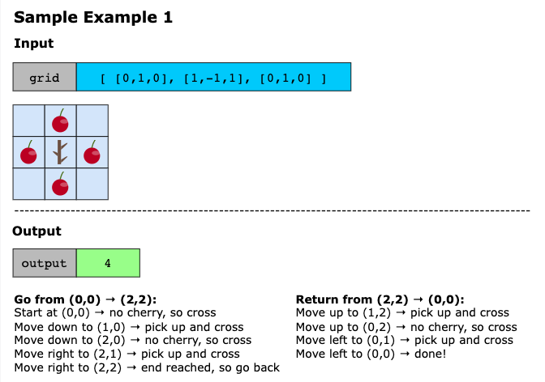
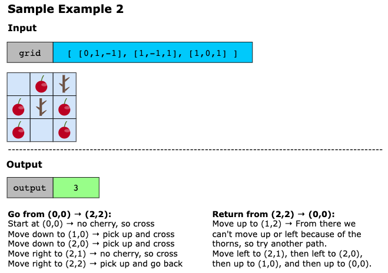
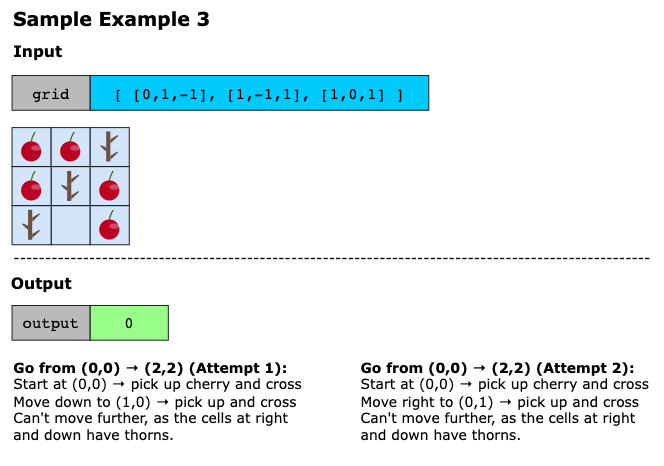
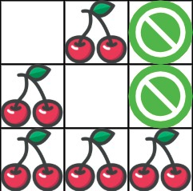

# Cherry Pickup

You are given an n x n grid representing a field of cherries, each cell is one of three possible integers.

- 0 means the cell is empty, so you can pass through,
- 1 means the cell contains a cherry that you can pick up and pass through, or
- -1 means the cell contains a thorn that blocks your way.

Return the maximum number of cherries you can collect by following the rules below:

- Starting at the position (0, 0) and reaching (n - 1, n - 1) by moving right or down through valid path cells (cells
  with value 0 or 1).
- After reaching (n - 1, n - 1), returning to (0, 0) by moving left or up through valid path cells.
- When passing through a path cell containing a cherry, you pick it up, and the cell becomes an empty cell 0.
- If there is no valid path between (0, 0) and (n - 1, n - 1), then no cherries can be collected.

> Note: A valid path requires traveling from the top-left corner to the bottom-right corner and successfully returning
> to the starting point.

## Constraints

- n == `grid.length`
- n == `grid[i].length`
- 1 <= `n` <= 50
- `grid[i][j]` is -1, 0, or 1.
- `grid[0][0]` != -1
- `grid[n - 1][n - 1]` != -1

## Examples





Example 4



```text
Input: grid = [[0,1,-1],[1,0,-1],[1,1,1]]
Output: 5
Explanation: The player started at (0, 0) and went down, down, right right to reach (2, 2).
4 cherries were picked up during this single trip, and the matrix becomes [[0,1,-1],[0,0,-1],[0,0,0]].
Then, the player went left, up, up, left to return home, picking up one more cherry.
The total number of cherries picked up is 5, and this is the maximum possible.
```

Example 5

```text
Input: grid = [[1,1,-1],[1,-1,1],[-1,1,1]]
Output: 0
```

## Topics

- Array
- Dynamic Programming
- Matrix

## Solution(s)

1. [Dynamic Programming (Top Down)](#dynamic-programming-top-down)
2. [Dynamic Programming (Top Down) 2](#dynamic-programming-top-down-2)
3. [Dynamic Programming (Bottom Up)](#dynamic-programming-bottom-up)

### Dynamic Programming (Top Down)

Instead of walking from end to beginning, let's reverse the second leg of the path, so we are only considering two paths
from the beginning to the end.

Notice after `t` steps, each position `(r, c)` we could be, is on the line `r + c = t`. So if we have two people at
positions `(r1, c1)` and `(r2, c2)`, then `r2 = r1 + c1 - c2`. That means the variables `r1`, `c1`, `c2` uniquely
determine 2 people who have walked the same `r1 + c1` number of steps. This sets us up for dynamic programming quite
nicely.

Let `dp[r1][c1][c2]` be the most number of cherries obtained by two people starting at `(r1, c1)` and `(r2, c2)` and
walking towards `(n - 1, n - 1)` picking up cherries, where `r2 = r1 + c1 - c2`.

If `grid[r1][c1]` and `grid[r2][c2]` are not thorns, then the value of `dp[r1][c1][c2]` is (`grid[r1][c1]` + `grid[r2][c2]`),
plus the maximum of `dp[r1 + 1][c1][c2]`, `dp[r1][c1 + 1][c2]`, `dp[r1 + 1][c1][c2 + 1]`, `dp[r1][c1 + 1][c2 + 1]` as
appropriate. We should also be careful to not double count in case `(r1, c1) == (r2, c2)`.

Why did we say it was the maximum of `dp[r + 1][c1][c2]` etc.? It corresponds to the 4 possibilities for persons 1 and
2 moving down and right:

- Person 1 down and person 2 down: `dp[r1 + 1][c1][c2]`;
- Person 1 right and person 2 down: `dp[r1][c1 + 1][c2]`;
- Person 1 down and person 2 right: `dp[r1 + 1][c1][c2 + 1]`;
- Person 1 right and person 2 right: `dp[r1][c1 + 1][c2 + 1]`;

#### Complexity

- **Time Complexity**: `O(n^3)`, where `n` is the length of grid. Our dynamic programming has `n^3` states, and each
  state is calculated once.
- **Space Complexity**: `O(n^3)`, the size of memo.


### Dynamic Programming (Top Down) 2

The naive approach might be to find the optimal path from (0, 0) to (n-1, n-1), collect cherries along the way, then
find the optimal return path on the modified grid. However, this greedy approach fails because the first path might block
better options for the return journey.

The key insight is recognizing that going from (0, 0) to (n-1, n-1) and back is equivalent to having two people start
simultaneously from (0, 0) and both reach (n-1, n-1). Why? Because any path from start to end and back can be split into
two paths from start to end - one person follows the original forward path, and another follows the return path in
reverse.

Since both people move simultaneously, after k steps, if person 1 is at (i1, j1) and person 2 is at (i2, j2), we know
that i1 + j1 = k and i2 + j2 = k. This means we only need to track the row positions i1 and i2, as the column positions
can be derived: j1 = k - i1 and j2 = k - i2.

This transforms our problem into a 3-dimensional DP: `f[k][i1][i2]` represents the maximum cherries collected when both
people have taken k steps, with person 1 at row i1 and person 2 at row i2.

At each step, both people can move either right or down (equivalent to coming from left or up in the previous step). This
gives us four possible combinations of previous positions to consider. When both people land on the same cell, we count
that cherry only once.

The total number of steps to reach (n-1, n-1) from (0, 0) is 2n-2 (we need to move n-1 steps right and n-1 steps down).
The final answer is the maximum cherries collected when both people reach (n-1, n-1) after 2n-2 steps.

#### Algorithm

The implementation uses dynamic programming with three dimensions. Let's walk through the key components:

1. **State Definition**:
    - `f[k][i1][i2]` represents the maximum cherries collected when both persons have taken k steps total
    - Person 1 is at position (i1, k-i1)
    - Person 2 is at position (i2, k-i2)
   
2. **Initialization**
   - Create a 3D array with dimensions (2n-1) × n × n
   - Initialize all values to negative infinity (-inf) to represent invalid states
   - Set `f[0][0][0]` = `grid[0][0]` as both persons start at (0, 0)
   
3. **State Transition**: For each step `k` from 1 to `2n-2`
   - Iterate through all possible positions (i1, j1) for person 1 where j1 = k - i1
   - Iterate through all possible positions (i2, j2) for person 2 where j2 = k - i2
   - Check validity
     - Both j1 and j2 must be within bounds [0, n)
     - Neither `grid[i1][j1]` nor `grid[i2][j2]` should be -1 (thorn)
   - Calculate cherries collected at current positions:
     - If both persons are at the same cell (i1 == i2), count cherry once: t = `grid[i1][j1]`
     - If at different cells, sum both: t = `grid[i1][j1]` + `grid[i2][j2]`
   - Consider all valid previous positions:
     - Person 1 could have come from (i1-1, j1) or (i1, j1-1), meaning x1 ∈ {i1-1, i1}
     - Person 2 could have come from (i2-1, j2) or (i2, j2-1), meaning x2 ∈ {i2-1, i2}
     - Update: `f[k][i1][i2] = max(f[k][i1][i2], f[k-1][x1][x2] + t)`
   
4. **Final Answer**
   - The maximum cherries when both reach (n-1, n-1) is `f[2n-2][n-1][n-1]`
   - Return `max(0, f[2n-2][n-1][n-1])` to handle cases where no valid path exists (result would be negative infinity)

#### Complexity

- **Time Complexity: O(n^3)**
  The algorithm uses dynamic programming with three nested loops:
  - The outermost loop iterates through `k` from `1` to `2n - 2`, which is `O(n)` iterations
  - The second loop iterates through `i1` from `0` to `n - 1`, which is `O(n)` iterations
  - The third loop iterates through `i2` from `0` to `n - 1`, which is `O(n)` iterations
  - Inside these three loops, there are two more nested loops for `x1` and `x2`, but these only iterate through at most
    2 values each (from i - 1 to i), making them `O(1)`

  Therefore, the overall time complexity is `O(n) × O(n) × O(n) × O(1) = O(n^3)`.

- **Space Complexity: O(n^3)**
  The algorithm creates a 3D DP array `f` with dimensions:
  - First dimension: `(2n - 1)` elements, which is `O(n)`
  - Second dimension: `n` elements, which is `O(n)`
  - Third dimension: `n` elements, which is `O(n)`
  
  The total space used by the DP array is `O(n) × O(n) × O(n) = O(n^3)`. Where `n` is the side length of the grid.


### Dynamic Programming (Bottom Up)

Like in [the first approach](#dynamic-programming-top-down), we have the idea of dynamic programming. 

Say `r1 + c1 = t` is the t-th layer. Since our recursion only references the next layer, we only need to keep two layers
in memory at a time.

At time `t`, let `dp[c1][c2]` be the most cherries that we can pick up for two people going from `(0, 0)` to `(r1, c1)`
and `(0, 0)` to `(r2, c2)`, where `r1 = t-c1`, `r2 = t-c2`. Our dynamic program proceeds similarly to [the first approach](#dynamic-programming-top-down).

#### Complexity Analysis

- **Time Complexity**: `O(n^3`), where n is the length of grid. We have three for-loops of size n.
- **Space Complexity**: `O(n^2)`, the sizes of `dp` and `dp2`.
