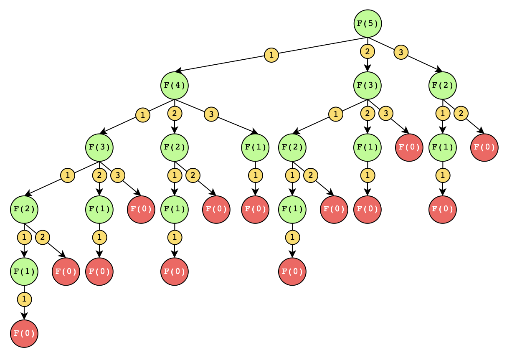
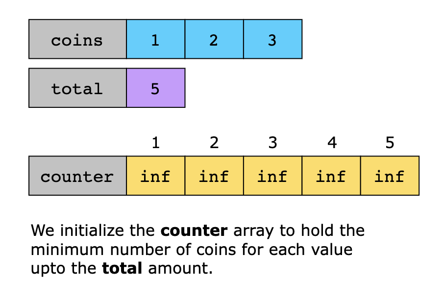
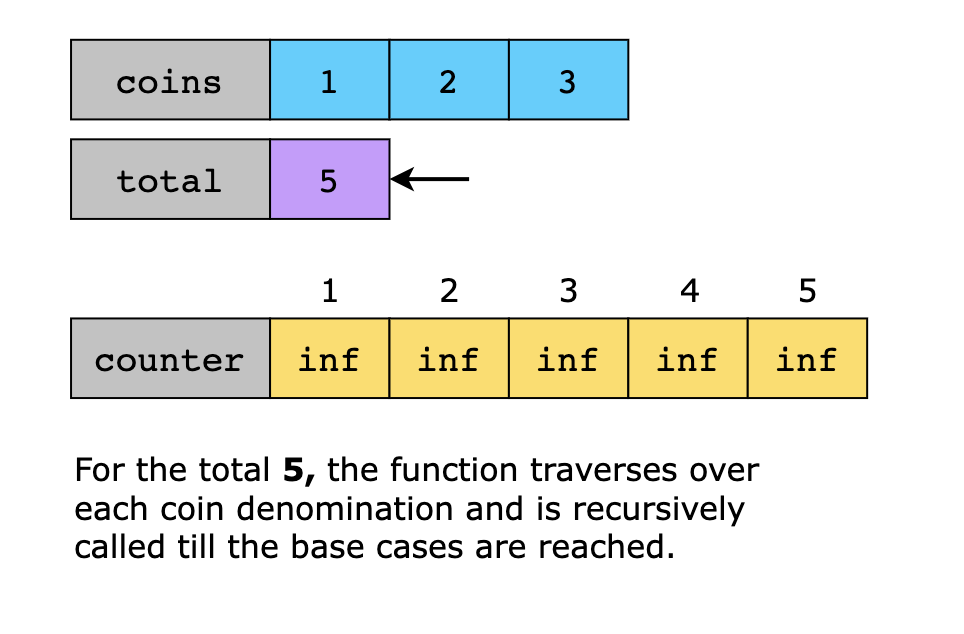
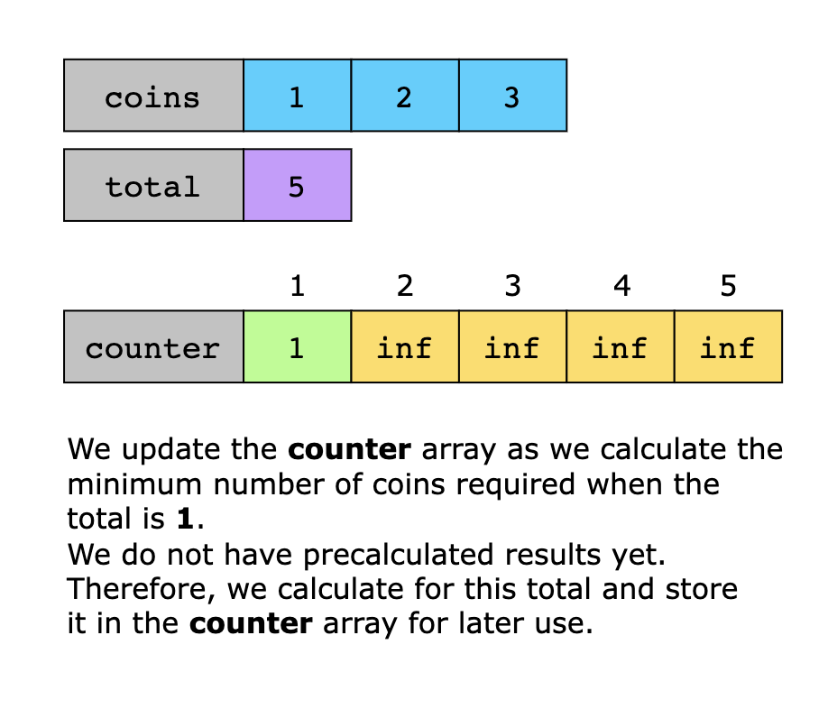
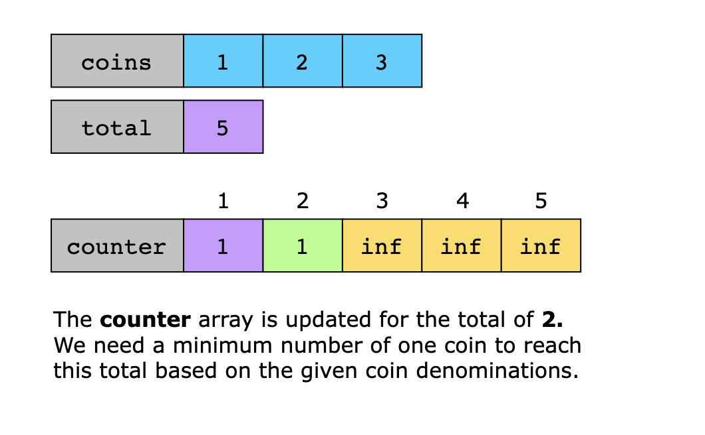
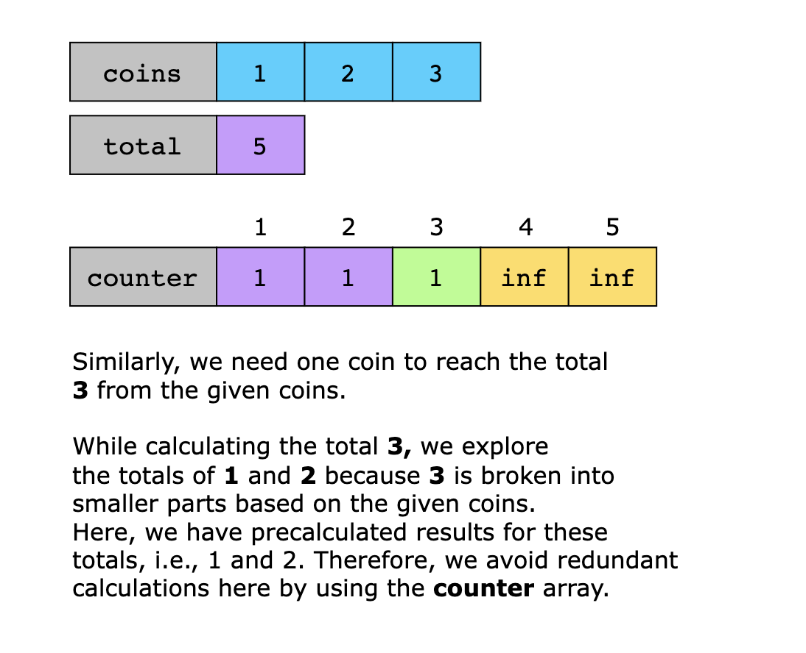
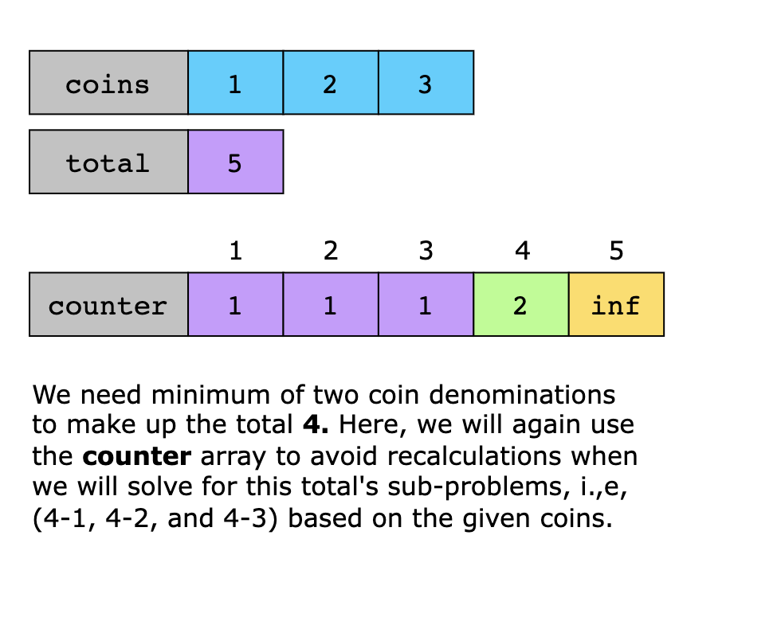
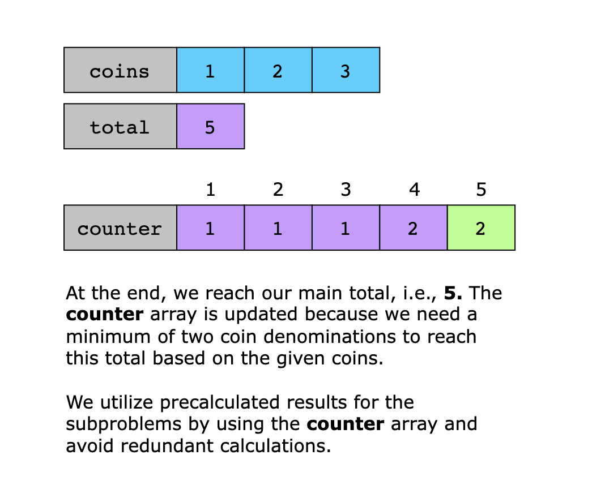
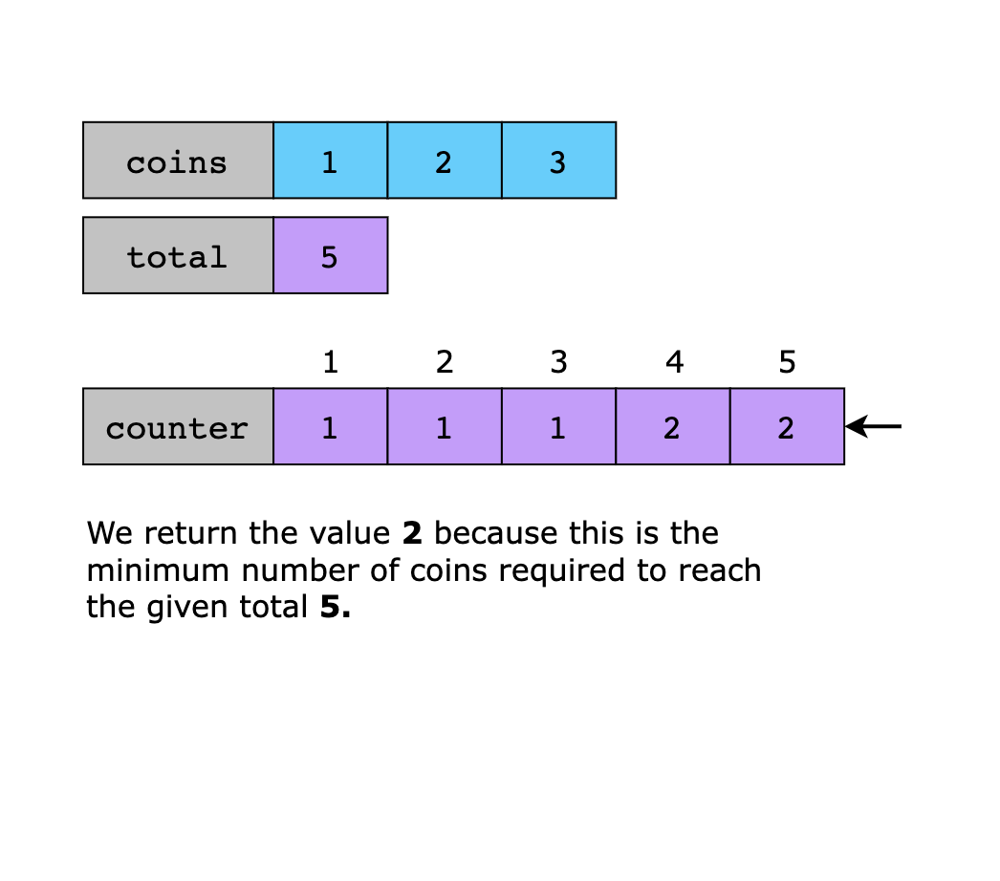

# Coin Change

Correctly determine the fewest number of coins to be given to a customer such that the sum of the coins' value would
equal the correct amount of change.

## For example

- An input of 15 with [1, 5, 10, 25, 100] should return one nickel (5)
  and one dime (10) or [0, 1, 1, 0, 0]
- An input of 40 with [1, 5, 10, 25, 100] should return one nickel (5)
  and one dime (10) and one quarter (25) or [0, 1, 1, 1, 0]

## Edge cases

- Does your algorithm work for any given set of coins?
- Can you ask for negative change?
- Can you ask for a change value smaller than the smallest coin value?

## Exception messages

Sometimes it is necessary to raise an exception. When you do this, you should include a meaningful error message to
indicate what the source of the error is. This makes your code more readable and helps significantly with debugging. Not
every exercise will require you to raise an exception, but for those that do, the tests will only pass if you include a
message.

To raise a message with an exception, just write it as an argument to the exception type. For example, instead of
`raise Exception`, you should write:

```python
raise Exception("Meaningful message indicating the source of the error")
```

## Source

Software Craftsmanship - Coin Change
Kata [https://web.archive.org/web/20130115115225/http://craftsmanship.sv.cmu.edu:80/exercises/coin-change-kata](https://web.archive.org/web/20130115115225/http://craftsmanship.sv.cmu.edu:80/exercises/coin-change-kata)

## Solution

If we look at the problem, we might immediately think that it could be solved through a greedy approach. However, if we
look at it closely, we’ll know that it’s not the correct approach here. Let’s take a look at an example to understand why
this problem can’t be solved with a greedy approach.

Let's suppose we have coins = [1, 3, 4, 5] and we want to find the total = 7 and we try to solve the problem with a greedy
approach. In a greedy approach, we always start from the very end of a sorted array and traverse backward to find our
solution because that allows us to solve the problem without traversing the whole array. However, in this situation, we
start off with a 5 and add that to our total. We then check if it’s possible to get a 7 with the help of either 4 or 3,
but as expected, that won't be the case, and we would need to add 1 twice to get our required total.

The problem seems to be solved, and we have concluded that we need maximum 3 coins to get to the total of 7. However, if
we take a look at our array, that isn’t the case. In fact, we could have reached the total of 7 with just 2 coins: 4 and 3.
So, the problem needs to be broken down into subproblems, and an optimal solution can be reached from the optimal 
solutions of its subproblems.

To split the problem into subproblems, let's assume we know the number of coins required for some total value and the
last coin denomination is C. Because of the optimal substructure property, the following equation will be true:

Min(total)=Min(total−C)+1

But, we don't know what is the value of C yet, so we compute it for each element of the coins array and select the
minimum from among them. This creates the following recurrence relation:

Min(total)=mini=0.....n-1(Min(total−Ci)+1), such that
Min(total)=0, for total=0
Min(total)= -1, for n=0

> Note: The problem can also be solved with the help of a simple recursive tree without any backtracking, but that would
> take extra memory and time complexity, as we can see in the illustration below.



> Recursive tree for finding minimum number of coins for the total 5 with the coins [1,2,3]

### Step-by-step solution construction

The idea is to solve the problem using the top-down technique of dynamic programming. If the required total is less than
the number that’s being evaluated, the algorithm doesn’t make any more recursive calls. Moreover, the recursive tree
calculates the results of many subproblems multiple times. Therefore, if we store the result of each subproblem in a
table, we can drastically improve the algorithm’s efficiency by accessing the required value at a constant time. This
massively reduces the number of recursive calls we need to make to reach our results.

We start our solution by creating a helper function that assists us in calculating the number of coins we need. It has
three base cases to cover about what to return if the remaining amount is:

- Less than zero
- Equal to zero
- Neither less than zero nor equal to zero

> The top-down solution, commonly known as the memoization technique, is an enhancement of the recursive solution. It
> solves the problem of calculating redundant solutions over and over by storing them in an array.

In the last case, when the remaining amount is neither of the base cases, we traverse the coins array, and at each
element, we recursively call the calculate_minimum_coins() function, passing the updated remaining amount remaining_amount
minus the value of the current coin. This step effectively evaluates the number of coins needed for each possible
denomination to make up the remaining amount. We store the return value of the base cases for each subproblem in a
variable named result. We then add 1 to the result variable indicating that we're using this coin denomination in the
process of making up the corresponding total. Now, we assign this value to minimum, which is initially set to infinity
at the start of each path.

To avoid recalculating the minimum values for subproblems, we utilize the counter array, which serves as a memoization
table. This array stores the minimum number of coins required to make up each specific amount of money up to the given
total. At the end of each path traversal, we update the corresponding index of the counter array with the calculated
minimum value. Finally, we return the minimum number of coins needed for the given total amount.










### Summary

To recap, the solution to this problem can be divided into the following parts:

1. We first check the base cases, if total is either 0 or less than 0:
   - 0 means no new coins need to be added because we have reached a viable solution.
   - Less than 0 means our path can’t lead to this solution, so we need to backtrack.
2. After this, we use the top-down approach and traverse the given coin denominations.
3. At each iteration, we either pick a coin or we don’t. 
   - If we pick a coin, we move on to solve a new subproblem based on the reduced total value. 
   - If we don’t pick a coin, then we look up the answer from the counter array if it is already computed to avoid
     recalculation.
4. Finally, we return the minimum number of coins required for the given total.

### Time Complexity

The time complexity for the above algorithm is O(n*m). Here, 
n represents the total and m represents the number of coins we have. In the worst case, the height of the recursive tree
is n as the subproblems solved by the algorithm will be n because we're storing precalculated solutions in a table. Each
subproblem takes m iterations, one per coin value. So, the time complexity is O(n*m).

### Space Complexity

The space complexity for this algorithm is O(n) because we’re using the counter array which is the size of total.
