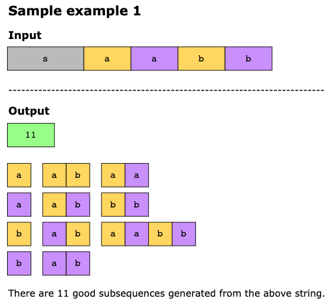
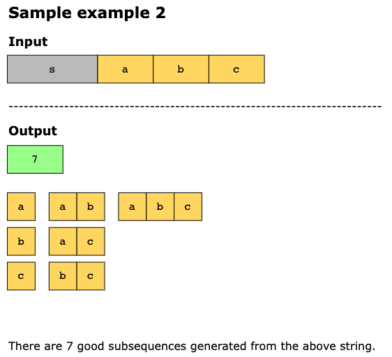
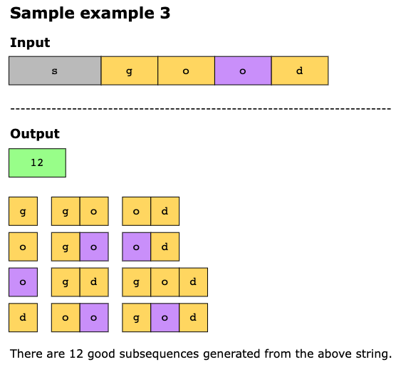
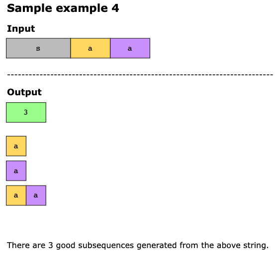
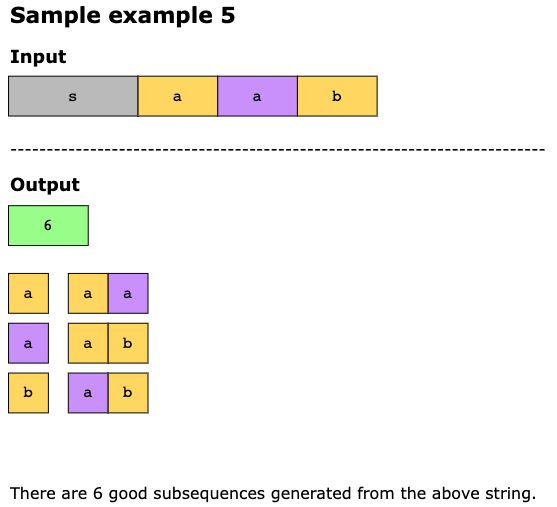

# Count the Number of Good Subsequences

Given a string s, you need to count the number of good subsequences that can be formed from it.

A subsequence is good if:

- It is not empty
- Every character in the subsequence appears the same number of times

For example, if we have a subsequence "aabb", it's good because 'a' appears 2 times and 'b' appears 2 times (both have
frequency 2).

A subsequence is formed by deleting some (possibly zero) characters from the original string without changing the relative order of the remaining characters.

Since the total count can be very large, return the answer modulo 10^9 + 7.

Key Points:

- You need to find all possible subsequences where each distinct character appears exactly the same number of times
- The subsequence must be non-empty
- Characters maintain their relative order from the original string
- The answer should be computed modulo 10^9 + 7

Example Understanding: If s = "aab", the good subsequences would include:

Single characters: "a", "a", "b" (each character appears once)
"aa" (character 'a' appears twice)
"ab" (both 'a' and 'b' appear once each)

## Constraints

- 1 <= `s.length` <= 10^4
- `s` will only contain lowercase English characters

## Examples

## Topics

- Math
- Combinatorics
- Counting
- Hash Table
- Dynamic Programming

## Solution

The solution to this problem involves calculating the combinations. We will start by calculating the frequency of each
character and then iterate over the frequencies, from 1 to the highest frequency of any character. We will count
subsequences where each character appears for some or all of its frequency, i.e., calculating combinations. The count is
summed up in each iteration, and after the loop terminates, 1 is deducted from the final count. The reason for deducting
1 is that the empty subsequence will also be counted. Because empty subsequence does not qualify as a good subsequence,
we will remove its count from the final calculation.

Computing the combinations is a typical _Binomial Coefficient problem_, known as `n choose k` problem, which is in
mathematics written as `C(n, k) = n! / (k!⋅(n−k)!)`. Counting the combinations would require us to calculate the
factorial and division by factorial, calculated by multiplying with the modular inverses.

Because calculating the factorial[i] requires calculating the [factorial[i-1]..factorial[2]] again and again, therefore
we will use dynamic programming to calculate the factorial[i] by multiplying i only with factorial[i — 1]. That is, we
will reuse the existing results instead of calculating them again.

### Time Complexity

There are 3 loops in the code:

- The loop that populates the factorial and inverses array runs for `n` times, where `n` is the length of the input
  string `s`. Therefore, its time complexity will be `O(n)`
- In the nested loop, the outer loop runs for `max_frequency` times. Because the max_frequency can have the maximum value
  as `n`, therefore the outer loop will also take `O(n)`. The inner loop will run through all unique characters bounded by
  26 lowercase letters, which is a constant. The total time complexity of the nested loop will be `O(n*26)`, i.e. `O(n)`
- The loop in the method `quick_modular_inverse` runs until the exponent becomes 0. In each iteration, the exponent is
  divided by 2. As the value of exponent is constant, it will not be dependent on the input, which means this loop will
  also run for a constant time, i.e., `O(1)`.

Therefore, the overall time complexity is `O(n + n + 1)` = `O(n)`

### Space Complexity

In this program, we use two arrays `factorials` and `inverse_factorial`, each taking O(N). Therefore, the space
complexity is O(N)
