# Counting Bits

Given an integer n, return an array ans of length n + 1 such that for each i (0 <= i <= n), ans[i] is the number of 1's
in the binary representation of i.

## Examples

```text
Example 1:

Input: n = 2
Output: [0,1,1]
Explanation:
0 --> 0
1 --> 1
2 --> 10
```

```
Example 2:

Input: n = 5
Output: [0,1,1,2,1,2]
Explanation:
0 --> 0
1 --> 1
2 --> 10
3 --> 11
4 --> 100
5 --> 101
```

## Constraints

- 0 <= `n` <= 10^5

## Solution

This solution uses a bottom-up dynamic programming approach to solve the problem.
The key to this problem lies in the fact that any binary number can be broken down into two parts: the least-significant
(rightmost bit), and the rest of the bits. The rest of the bits can be expressed as the binary number divided by 2
(rounded down), or `i >> 1`.

For example:
- 4 in binary = 100
- rightmost bit = 0
- rest of bits = 10, which is also (4 // 2) = 2 in binary.

When the number is odd,
- 5 in binary = 101
- rightmost bit = 1
- rest of bits = 10, which is also (5 // 2) = 2 in binary.

in the binary representation of i is that number plus 1 if the rightmost bit is 1. We can tell if the last significant
bit is 1 by checking if it is odd.

As an example, we know that the number of 1's in 2 is 1. This information can be used to calculate the number of 1's in 4.
The number of 1's in 4 is the number of 1's in 2 plus 0, because 4 is even.

This establishes a recurrence relationship between the number of 1's in the binary representation of i and the number of
1's in the binary representation of i // 2: if count[i] is the number of 1's in the binary representation of i, then
count[i] = count[i // 2] + (i % 2).

With the recurrence relationship established, we can now solve the problem using a bottom-up dynamic programming approach.
We start with the base case dp[0] = 0, and then build up the solution for dp[i] for i from 1 to n.

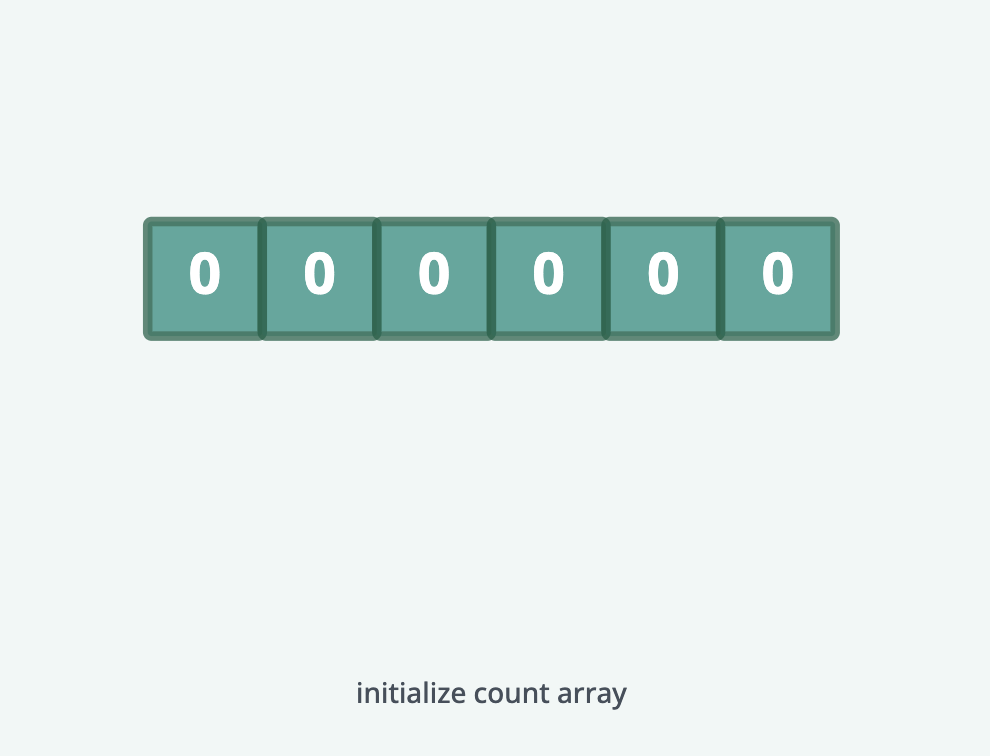
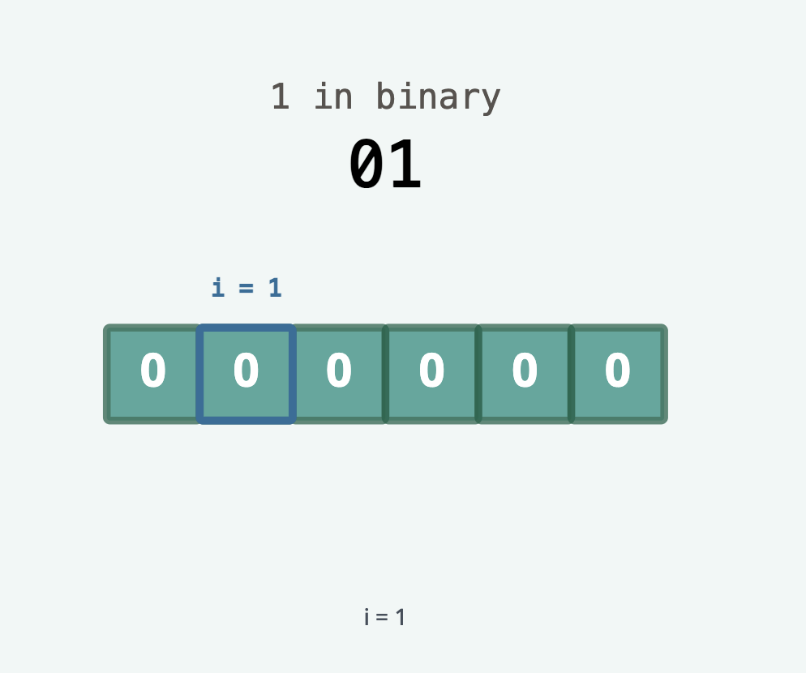
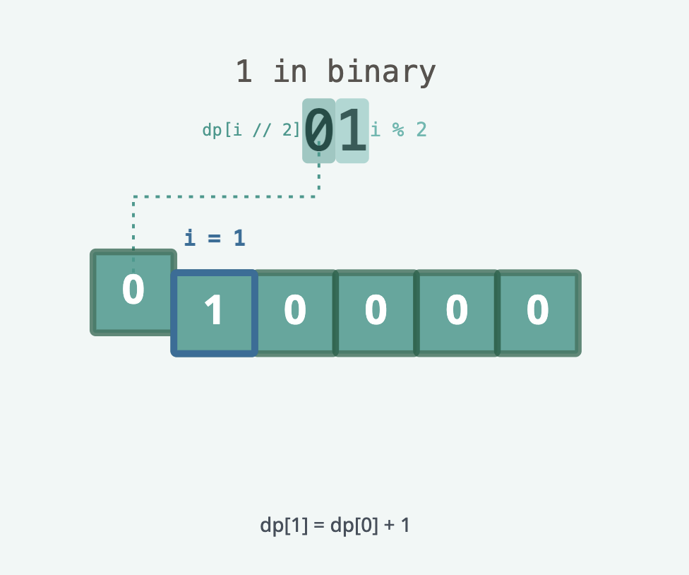
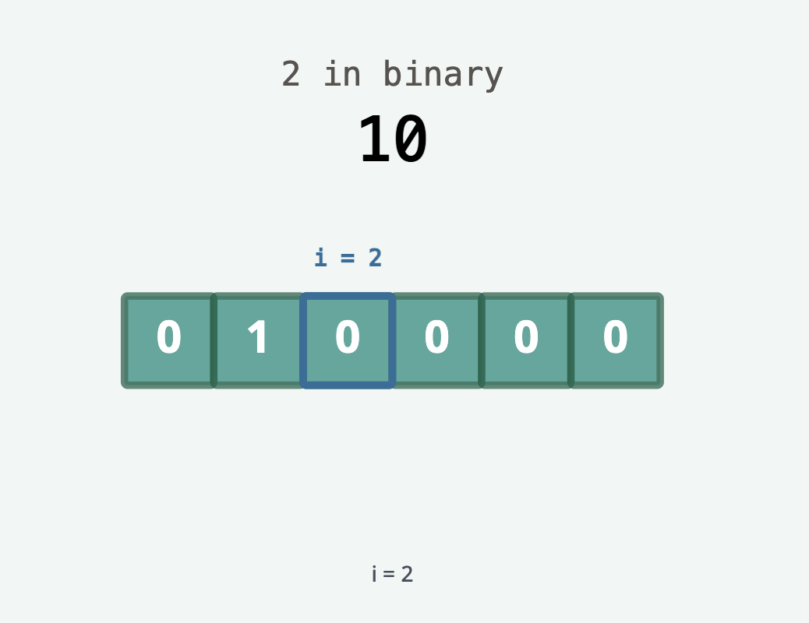
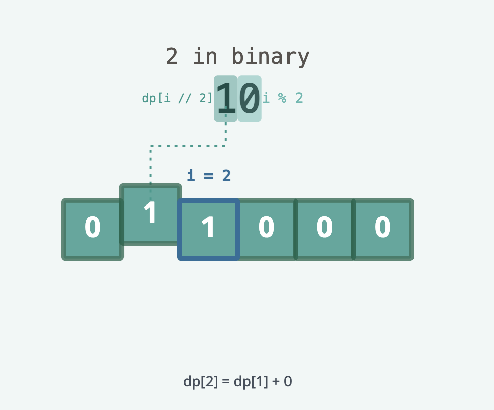
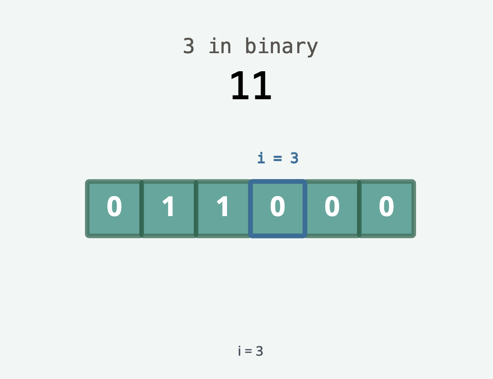
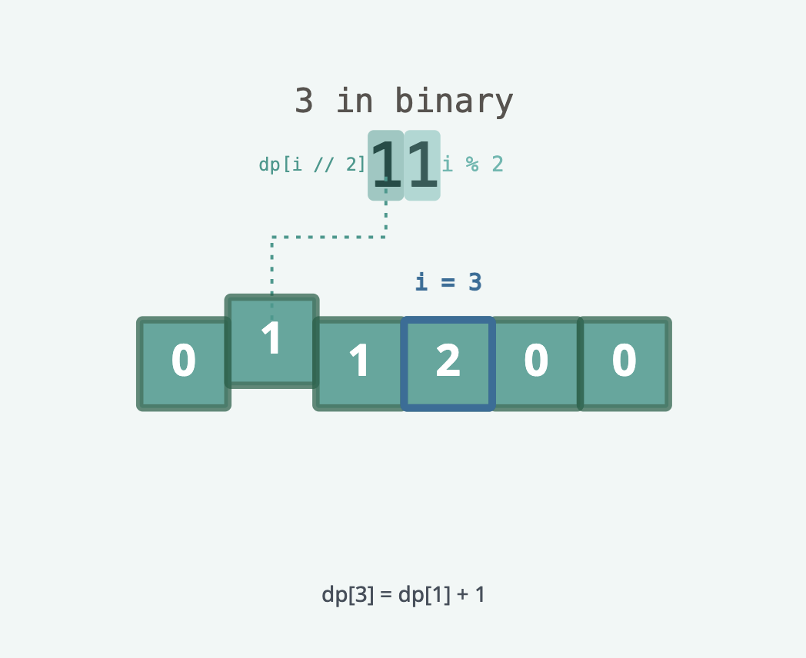
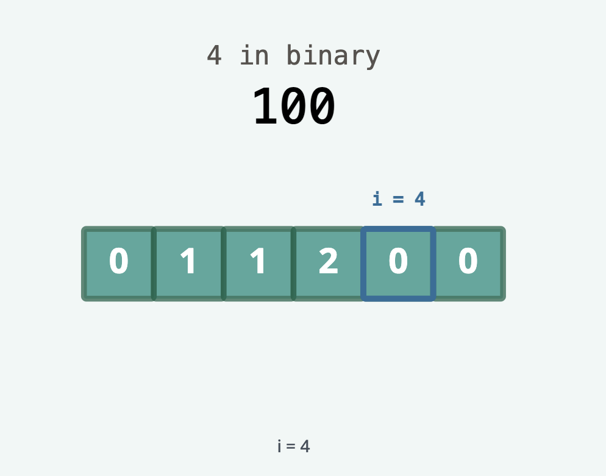
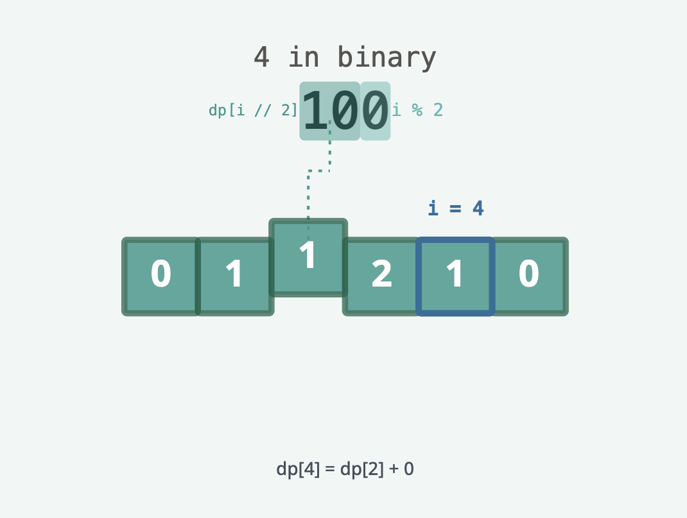
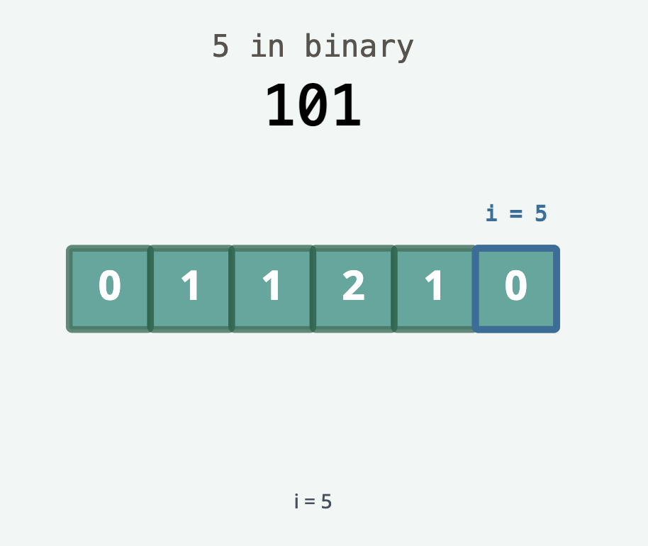
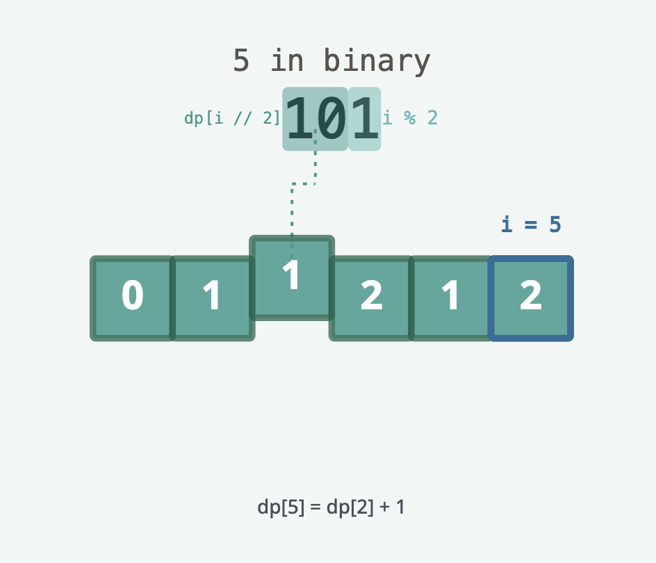
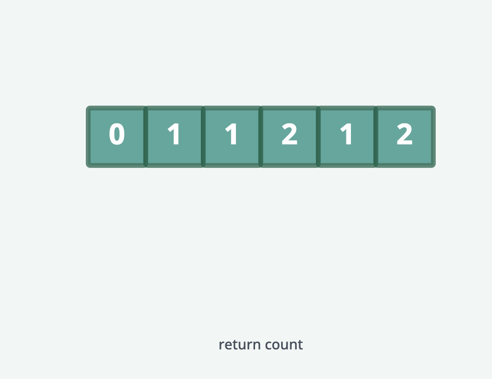
