# House Robber

You are a professional robber planning to rob houses along a street. Each house has a certain amount of money stashed,
the only constraint stopping you from robbing each of them is that adjacent houses have security systems connected and
it will automatically contact the police if two adjacent houses were broken into on the same night.

Given an integer array nums representing the amount of money of each house, return the maximum amount of money you can
rob tonight without alerting the police.

```plain
Example 1:

Input: nums = [1,2,3,1]
Output: 4
Explanation: Rob house 1 (money = 1) and then rob house 3 (money = 3).
Total amount you can rob = 1 + 3 = 4.
Example 2:

Input: nums = [2,7,9,3,1]
Output: 12
Explanation: Rob house 1 (money = 2), rob house 3 (money = 9) and rob house 5 (money = 1).
Total amount you can rob = 2 + 9 + 1 = 12.
```

## Related Topics

- Array
- Dynamic Programming

---
# House Robber III

The thief has found himself a new place for his thievery again. There is only one entrance to this area, called root.

Besides the root, each house has one and only one parent house. After a tour, the smart thief realized that all houses
in this place form a binary tree. It will automatically contact the police if two directly-linked houses were broken
into on the same night.

Given the root of the binary tree, return the maximum amount of money the thief can rob without alerting the police.

## Constraints

- The number of nodes in the tree is in the range [1, 10^4].
- 0 <= Node.val <= 10^4

## Examples

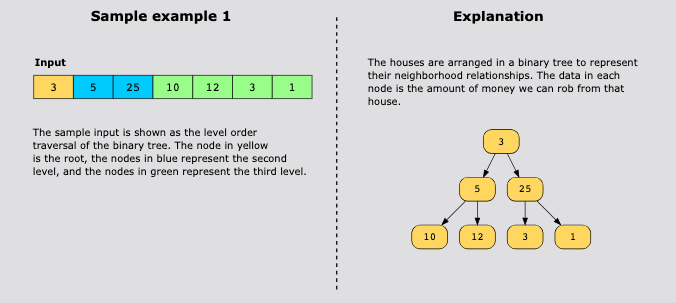
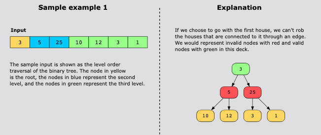
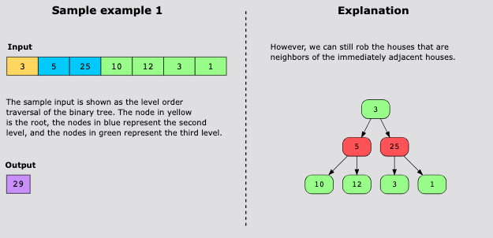
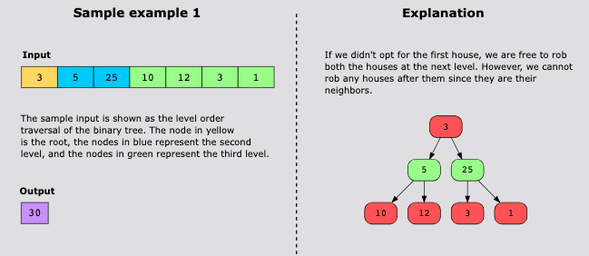
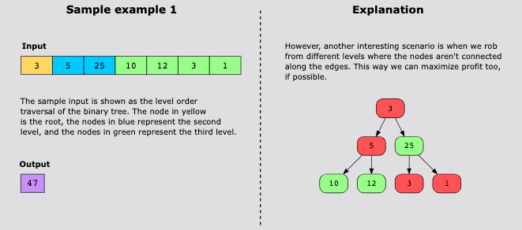
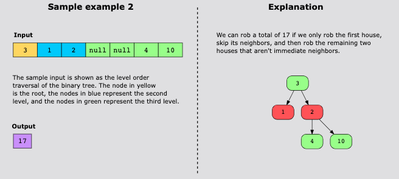

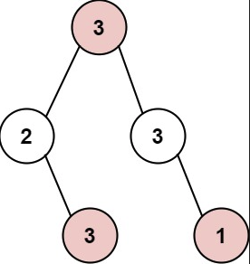
```text
Input: root = [3,2,3,null,3,null,1]
Output: 7
Explanation: Maximum amount of money the thief can rob = 3 + 3 + 1 = 7.
```

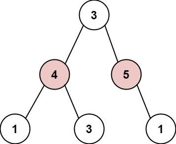
```text
Input: root = [3,4,5,1,3,null,1]
Output: 9
Explanation: Maximum amount of money the thief can rob = 4 + 5 = 9.
```

## Topics

- Dynamic Programming
- Tree
- Depth-First Search
- Binary Tree

## Solution(s)

1. [Recursion](#recursion)
2. [Dynamic Programming(Memoization) - Top Down Approach](#dynamic-programmingmemoization-top-down-approach)
3. [Dynamic Programming(Optimal)](#dynamic-programming-optimal--bottom-up-approach)

### Recursion

This is a tree version of the classic house robber problem. At each node, we have two choices: rob it or skip it. If we
rob the current node, we cannot rob its immediate children, so we must skip to the grandchildren. If we skip the current
node, we can consider robbing its children. We take the maximum of these two options.

#### Algorithm

- If the node is null, return 0.
- Calculate the value if we rob the current node: add the node's value plus the result from its grandchildren 
  (left.left, left.right, right.left, right.right).
- Calculate the value if we skip the current node: add the results from robbing the left and right children.
- Return the maximum of these two values.

#### Time Complexity

O(2^n)

#### Space complexity 

O(n) for recursion stack.

### Dynamic Programming(Memoization) Top-Down Approach

The recursive solution recomputes results for the same nodes multiple times. By storing computed results in a cache
(hash map), we avoid redundant work. Each node is processed at most once, significantly improving efficiency.

#### Algorithm

- Create a cache (hash map) to store computed results for each node.
- Define a recursive function that checks the cache before computing.
- If the node is in the cache, return the cached result.
- Otherwise, compute the result using the same logic as the basic recursion: max of robbing current node
  (plus grandchildren) vs skipping current node (plus children).
- Store the result in the cache and return it.

#### Complexity Analysis

- Time complexity: O(n)
- Space complexity: O(n)

### Dynamic Programming (Optimal)- Bottom-Up Approach

Instead of caching all nodes, we can return two values from each subtree: the maximum if we rob this node, and the
maximum if we skip it. This eliminates the need for a hash map. For each node, "with root" equals the node value plus
the "without" values of both children. "Without root" equals the sum of the maximum values (either with or without) from
both children.

#### Algorithm

- Define a recursive function that returns a pair: [maxWithNode, maxWithoutNode].
- For a null node, return [0, 0].
- Recursively get the pairs for left and right children.
- Calculate withRoot as the node's value plus leftPair[1] plus rightPair[1] (children must be skipped).
- Calculate withoutRoot as max(leftPair) plus max(rightPair) (children can be robbed or skipped).
- Return [include_root, exclude_root].
- The final answer is the maximum of the two values returned for the root.

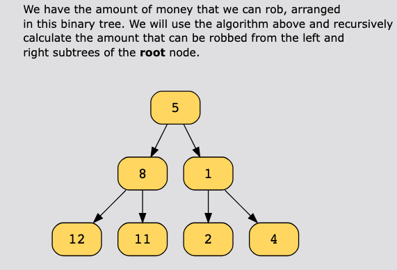
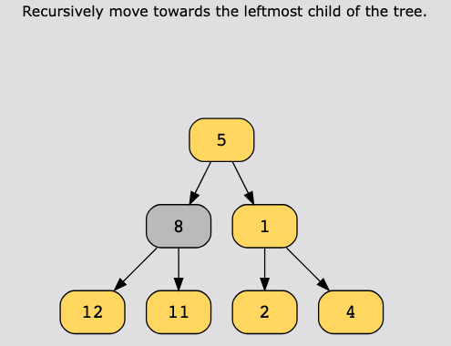
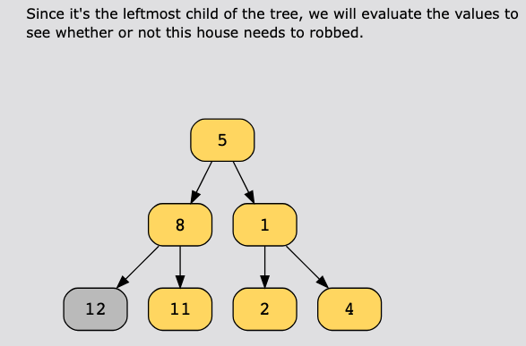
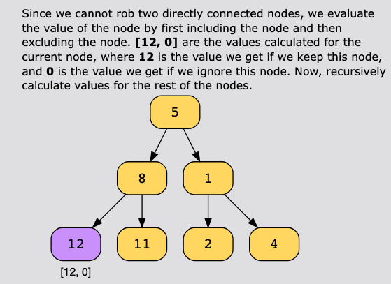
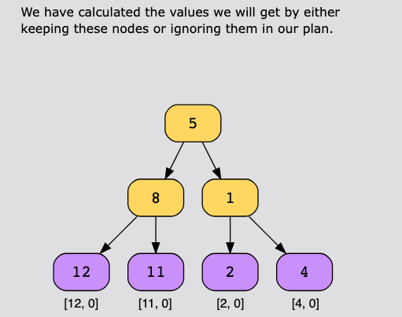
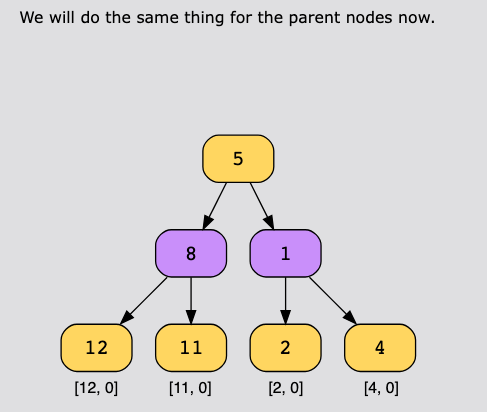
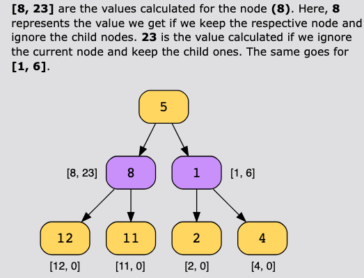
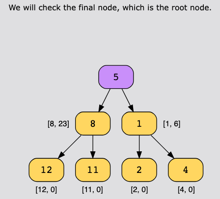
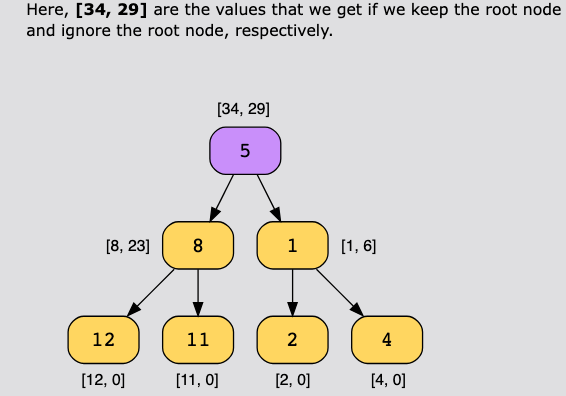
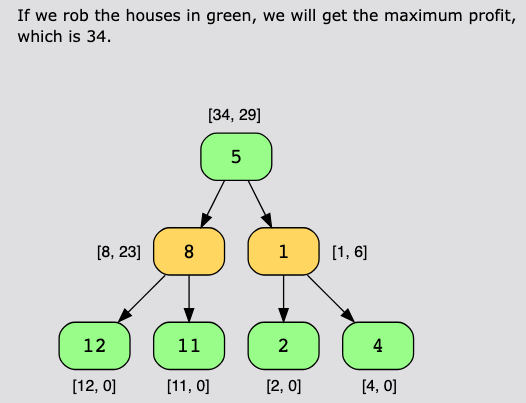
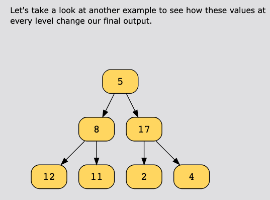
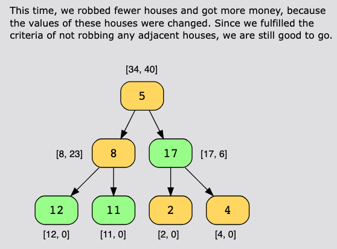

#### Complexity Analysis O(n)

The time complexity of this solution is O(n), where n is the number of nodes in the tree, since we visit all nodes once.

##### Space complexity: O(n) 

The space complexity of this solution is O(n), since the maximum depth of the recursive call tree is the height of the
tree. Which is n in the worst case, and each call stores its data on the stack.

### Common Pitfalls

#### Confusing "Skip to Grandchildren" with "Must Rob Grandchildren"

When robbing the current node, you cannot rob its immediate children, so you recursively consider the grandchildren.
However, a common mistake is thinking you must rob the grandchildren. In reality, for each grandchild, you still have
the choice to rob it or skip it. The recursive call on grandchildren will make this decision optimally. The constraint
only prevents robbing adjacent nodes (parent-child), not skipping multiple levels.

#### Not Handling Null Children Properly

When calculating the value of robbing the current node, you need to add values from grandchildren. If a child is null,
accessing child.left or child.right will cause a null pointer error. Always check if the left or right child exists
before attempting to access their children. A null child contributes 0 to the total, and its non-existent children also
contribute 0.

#### Forgetting to Take Maximum in the Final Answer

The optimal DFS solution returns a pair [withRoot, withoutRoot] representing the maximum money if we rob or skip the
current node. At the root level, the final answer is the maximum of these two values, not just one of them. Forgetting
to take this maximum and returning only withRoot or withoutRoot will give an incorrect result whenever the optimal
strategy at the root differs from what you returned.
