# Interleaving String

You’re given three strings: s1, s2, and s3. Your task is to determine whether s3 can be formed by interleaving s1 and s2.

Interleaving means you take both strings and break them into smaller pieces (substrings), then merge those pieces while
preserving the left-to-right order of characters within each original string.

- s = s1 + s2 + ... + sn
- t = t1 + t2 + ... + tm
- |n - m| <= 1

The final mixed string might look like any of the following:

1. s1 + t1 + s2 + t2 + s3 + t3 + ... or 
2. t1 + s1 + t2 + s2 + t3 + s3 + ...

The pieces from s1 and s2 must appear in alternating segments, although either one is allowed to start first. The number
of segments taken from each string should differ by at most one.

## Constraints

- 0 <= s1.length, s2.length <= 100
- 0 <= s3.length <= 200
- s1, s2, and s3 consist of lowercase English letters.

## Topics

- Strings
- Dynamic Programming

## Examples

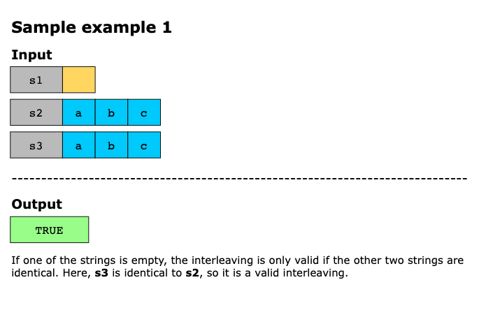
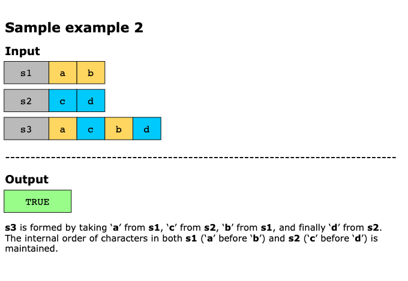
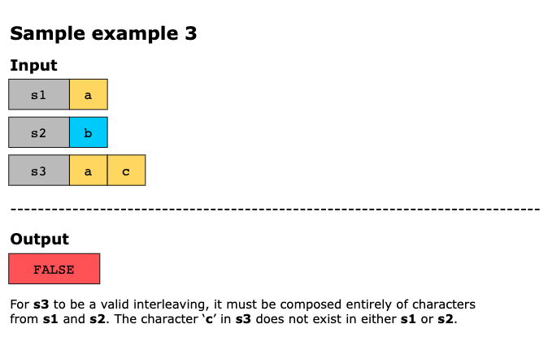
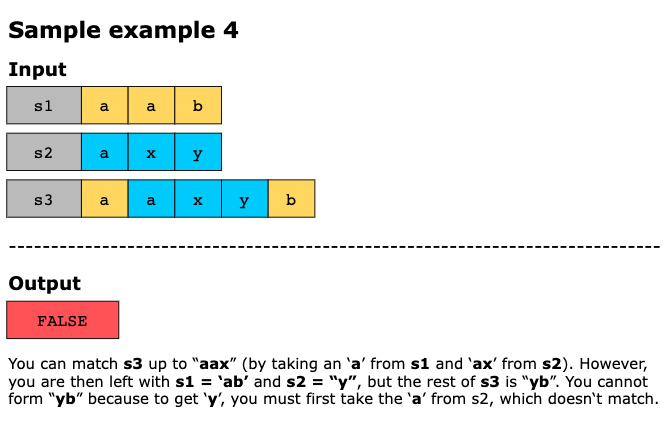
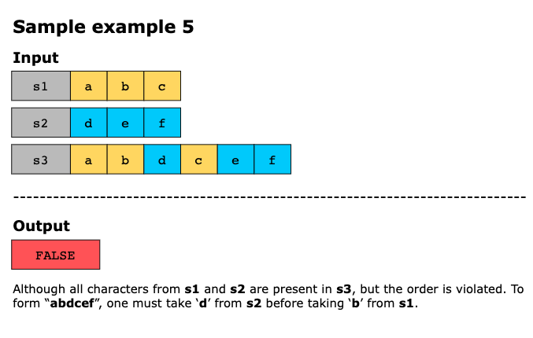
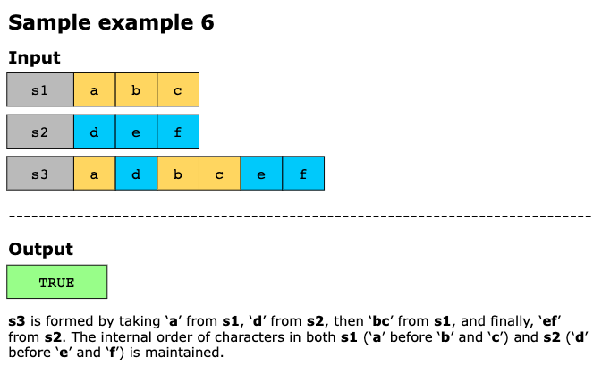
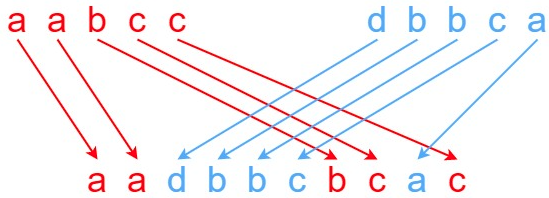

> Input: s1 = "aabcc", s2 = "dbbca", s3 = "aadbbcbcac"
> Output: true 
> Explanation: One way to obtain s3 is:
> Split s1 into s1 = "aa" + "bc" + "c", and s2 into s2 = "dbbc" + "a". 
> Interleaving the two splits, we get "aa" + "dbbc" + "bc" + "a" + "c" = "aadbbcbcac". 
> Since s3 can be obtained by interleaving s1 and s2, we return true.

## Solution

The goal is to determine whether the string s3 can be formed by interleaving the characters of s1 and s2 while
preserving the original character order of both strings. This problem naturally lends itself to a dynamic programming
approach because whether a prefix of s3 is valid depends on whether smaller prefixes were valid before it.

Instead of building a full 2D DP table, we use a 1D DP array to save space. In this array, dp[j] represents whether the
prefix s3[:i + j] can be formed by interleaving s1[:i] and s2[:j]. Although this 1D array conceptually corresponds to the
(i, j)-cell of a 2D grid, we will reuse the same array row by row, updating values in place as it progresses through the
characters of s1 and s2.

We start from the simplest case, two empty strings forming an empty string, and work our way up. For each character in
s3, we check if it could have come from the next available character in s1 or s2.

A state is considered possible only if:

- The previous state was valid. 
- The character we take (from s1 or s2) matches the next character in s3.

The computation continues until all combinations of prefixes have been evaluated. The final answer resides in dp[len(s2)],
which indicates whether all of s1 and s2 can interleave to form all of s3.

The algorithm can be broken down into the following steps:

1. We first check if the length of s3 is equal to the sum of the lengths of s1 and s2. If not, a valid interleaving is
   impossible, so we immediately return FALSE.
2. Next, we create a 1D array, dp, of size len(s2) + 1, initially filled with FALSE values. This array represents a
   compressed version of the conceptual DP table, where dp[j] indicates whether s3[:i + j] can be formed using s1[:i] and
   s2[:j]. As the array is reused for each row, dp[j] always holds the result for the current (i, j) state.
3. We iterate through all prefixes of s1 and s2 using two loops, i goes from 0 to len(s1), and j goes from 0 to len(s2):
   - For each pair (i, j), dp[j] is updated according to one of four cases:
     - If i == 0 and j == 0, we are matching empty prefixes. We set dp[0] to TRUE because two empty strings always form
       an empty string.
     - Else if i == 0 (we are in the first row), we can only use characters from s2. dp[j] becomes TRUE only if dp[j − 1]
       was TRUE and s2[j − 1] matches s3[j − 1].
     - Else if j == 0 (we are in the first column), we can only use characters from s1. Because dp is a 1D array, dp[0]
       still holds the result from the previous row (i − 1). We update dp[0] to TRUE only if its previous value was TRUE
       and s1[i − 1] matches s3[i − 1].
     - Otherwise, i > 0 and j > 0, we evaluate the general case, dp[j] becomes TRUE if either of the following is possible:
       - Taking the next character from s1: dp[j] must have been TRUE (its old value from the previous row), and s1[i − 1]
         must match s3[i + j − 1].
       - Taking the next character from s2: dp[j − 1] must be TRUE (already updated for the current row), and s2[j − 1]
         must match s3[i + j − 1].
       - If either option is valid, dp[j] is set to TRUE.
4. After all iterations are complete, return dp[len(s2)] containing the final answer, telling all of s1 and s2 can
   interleave to form all of s3.

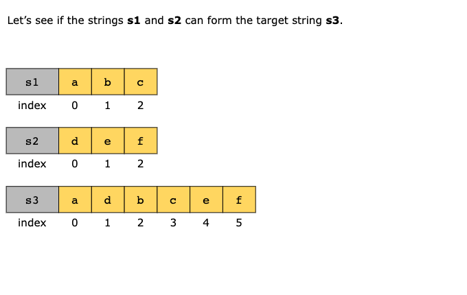
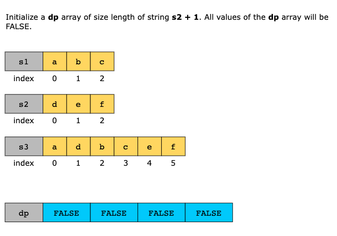
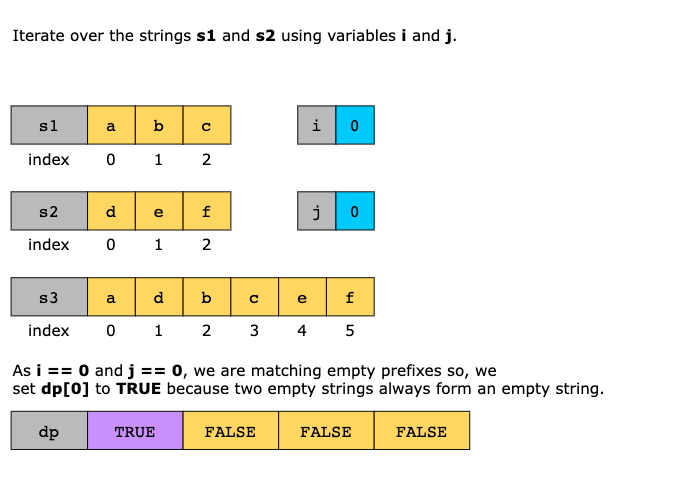
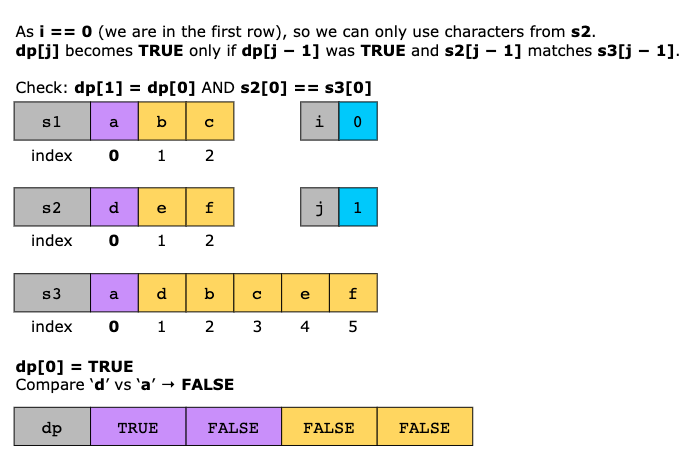

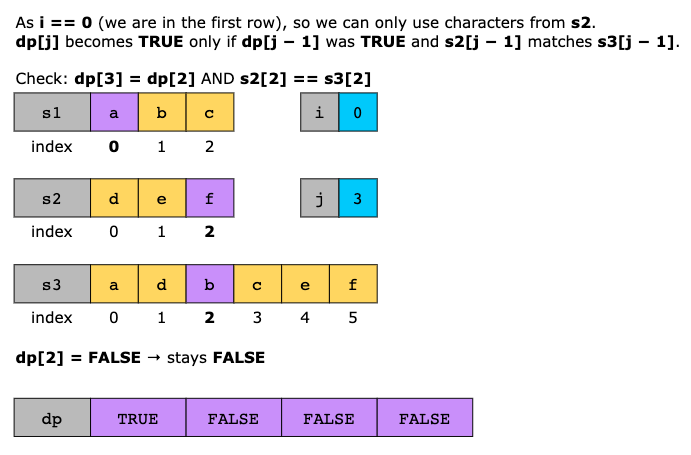
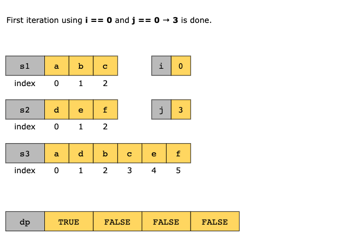
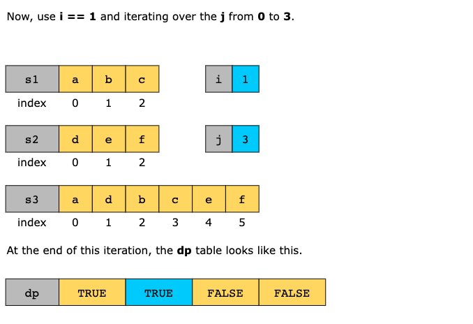
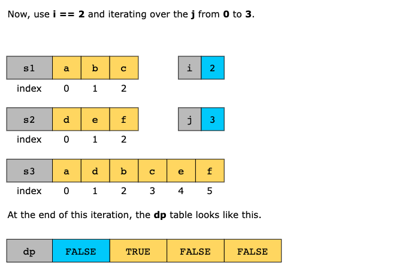
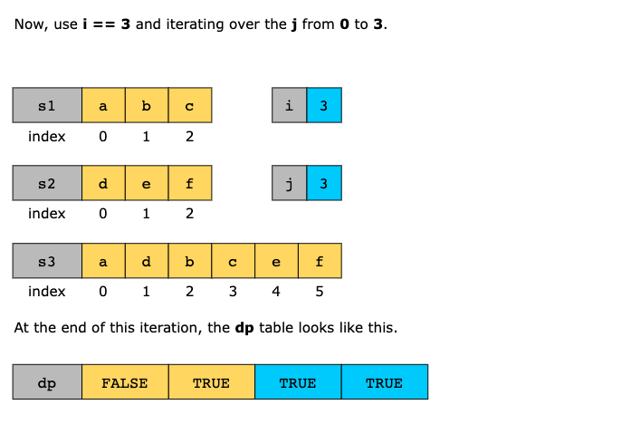
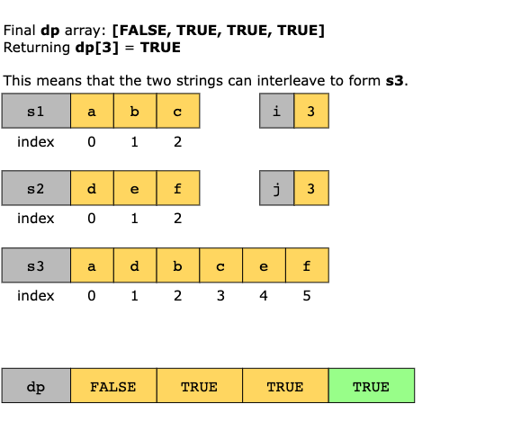

### Time Complexity

The solution’s time complexity is O(m×n), where m is the length of string s1 and n is the length of string s2. The
algorithm iterates through every combination of prefixes of s1 and s2. Specifically, the outer loop runs len(s1) + 1
times and the inner loop runs len(s2) + 1 times, resulting in a total of m+1×n+1 iterations. Each iteration performs
constant-time operations, so the total time is quadratic in the lengths of the input strings.

### Space Complexity

The solution’s space complexity is O(n) because instead of storing a full 2D DP table, it uses a 1D array of size
len(s2) + 1. This array is updated in place for each row, and no additional data structures are used that are
proportional to the input size.
