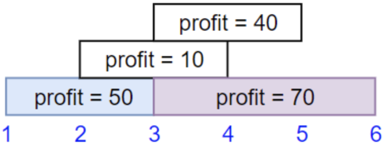
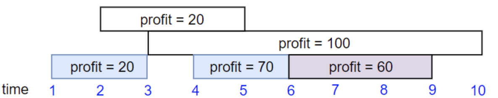
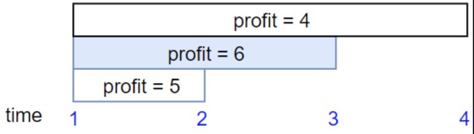
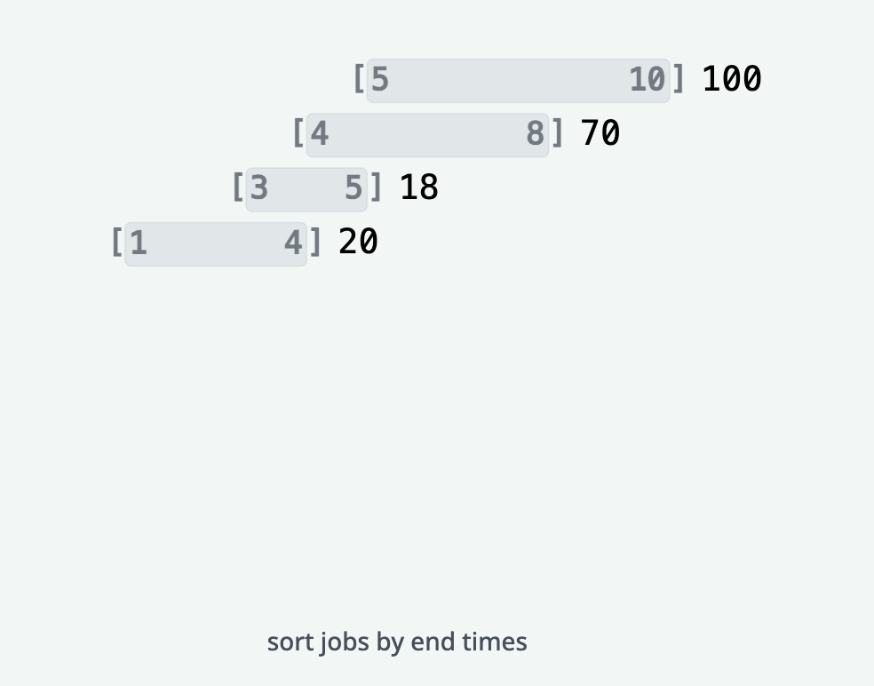
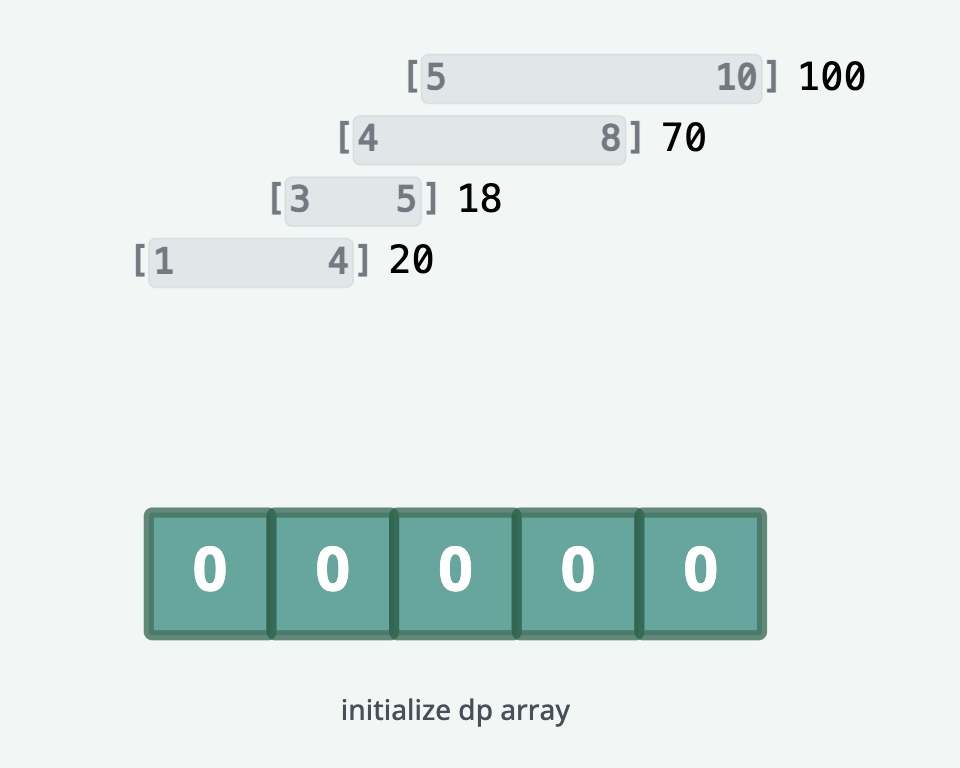
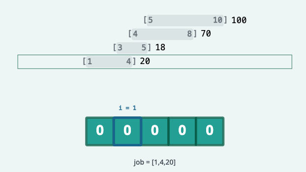
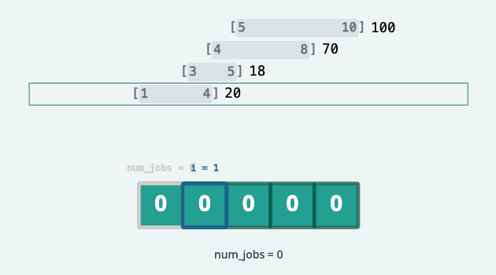
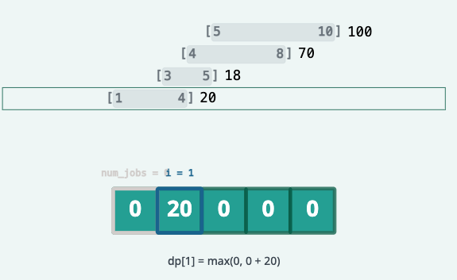
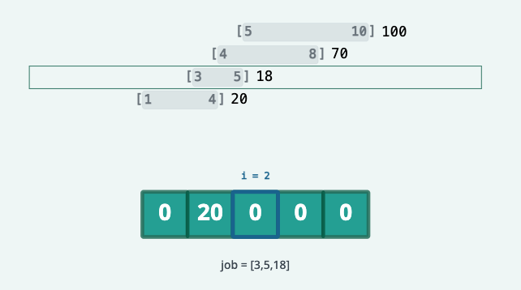
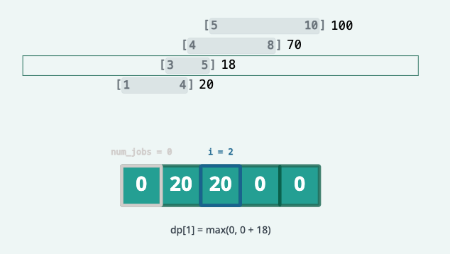

# Maximum Profit in Job Scheduling

We have n jobs, where every job is scheduled to be done from `startTime[i]` to `endTime[i]`, obtaining a profit of `profit[i]`.

You're given the `startTime`, `endTime` and `profit` arrays, return the maximum profit you can take such that there are no two
jobs in the subset with overlapping time range.

If you choose a job that ends at time X you will be able to start another job that starts at time X.

## Examples



```text
Input: startTime = [1,2,3,3], endTime = [3,4,5,6], profit = [50,10,40,70]
Output: 120
Explanation: The subset chosen is the first and fourth job. 
Time range [1-3]+[3-6] , we get profit of 120 = 50 + 70.
```



```text
Input: startTime = [1,2,3,4,6], endTime = [3,5,10,6,9], profit = [20,20,100,70,60]
Output: 150
Explanation: The subset chosen is the first, fourth and fifth job. 
Profit obtained 150 = 20 + 70 + 60.
```



```text
Input: startTime = [1,1,1], endTime = [2,3,4], profit = [5,6,4]
Output: 6
```

## Constraints

- 1 <= `startTime.length` == `endTime.length` == `profit.length` <= 5 * 10^4
- 1 <= `startTime[i]` < `endTime[i]` <= 10^9
- 1 <= `profit[i]` <= 10^4

## Topics

- Array
- Binary Search
- Dynamic Programming
- Sorting

## Solution

The idea behind this solution is to first sort the jobs by their end times. Afterwards, we initialize an array dp of 
length len(jobs) + 1 with 0s, where dp[i] represents the maximum profit that can be earned by scheduling the first i
jobs (sorted by end time). dp[0] is initialized to 0, as scheduling 0 jobs would yield 0 profit.

> Note: The solution below uses the key parameter in the bisect_right function to find the latest job ending before the
> start time of the current job, which is only available in Python 3.10 and above.




Next, we iterate over each index in dp starting from index 1. At each iteration, we calculate the maximum profit that
can be earned by scheduling the first i jobs (sorted by end time). So when i = 1, we are calculating the maximum profit
that can be earned by scheduling the first job.

1. We find the corresponding start time and profit of the current job (jobs[i - 1]).
2. Next, we use binary search (bisect_right) to find the number of jobs that have ended before the start time of the
    current job, and store this number in a variable num_jobs. dp[num_jobs] will also tell us the maximum profit that
    can be earned by scheduling all the jobs that have ended before the current job.

To breakdown our call to bisect_right: we are looking for the rightmost index in job in job with an end time
(key=lambda x: x[1]) that is less than or equal to the start time of the current job (start).

In this case, start = 1, which means this is the first job we can possibly schedule, and num_jobs = 0.




Once we have this index, we have two options:

- We can schedule the current job, in which case the profit would be `dp[num_jobs] + profit`.
- We can skip the current job, in which case the profit would be `dp[i - 1]`.

By taking the maximum of these two options, we can calculate the maximum profit that can be earned by scheduling the 
first `i` jobs.
In this case, since this is the first job we can possibly schedule, we schedule it and update dp[i] to `dp[num_jobs] + profit`.



The next iteration is an example of when we would choose to skip the current job. For this job, start = 3. This job
overlaps with the first job, so num_jobs = 0. If we consider the two cases:

- We can schedule the current job, in which case the profit would be `dp[num_jobs] + profit` = 0 + 18 = 18.
- We can skip the current job, in which case the profit would be `dp[i - 1]` = 20.

We can see that skipping the current job (in favor of choosing the previous one) would yield a higher profit, so we
update `dp[i]` to `dp[i - 1]`.




If we examine the state of the dp array at this point, it tells us at that the maximum profit we can obtain from
scheduling any combination of the first two jobs is 20.

We can continue this process for the remaining jobs, and the final value of dp[-1] will tell us the maximum profit that
can be earned by scheduling all the jobs.

### Complexity Analysis

#### Time Complexity

`O(n * log n)` where n is the number of jobs. This is due to the sorting of the jobs, and the binary search for each job.

#### Space Complexity

`O(n)` where n is the number of jobs. This is due to the dp array.
