# Maximal Rectangle

Given a binary matrix filled with 0’s and 1’s, find the largest rectangle containing only 1’s and return its area.

## Constraints

- `rows` == `matrix.length`
- `cols` == `matrix[i].length`
- 1 <= `rows`, `cols` <= 200
- `matrix[i][j]` is `0` or `1`

## Examples

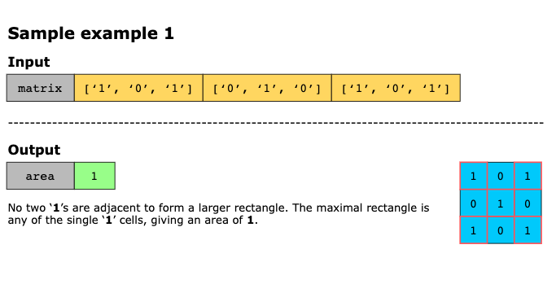
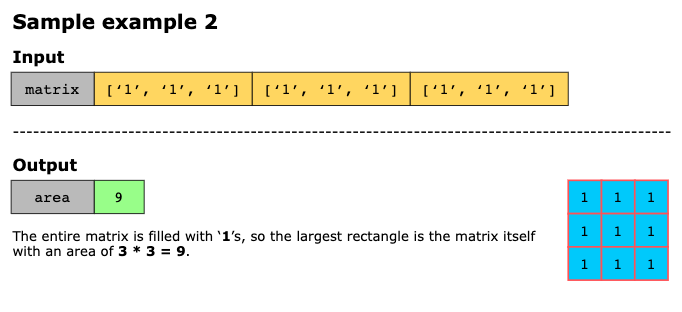
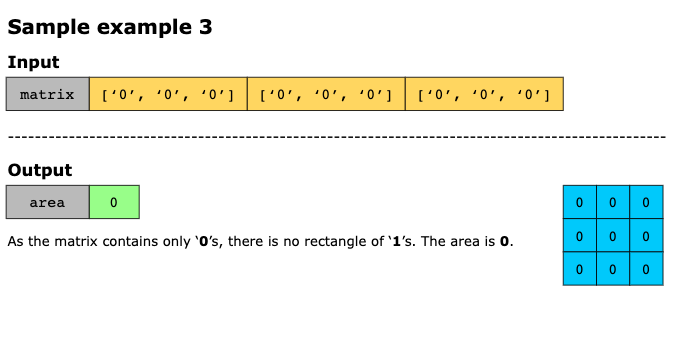
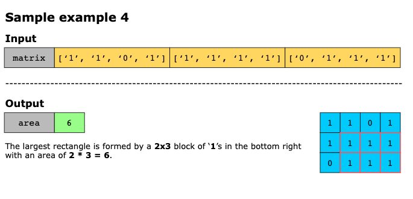
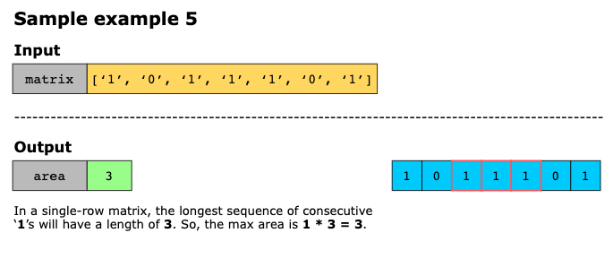

## Topics

- Array
- Dynamic Programming
- Stack
- Matrix
- Monotonic Stack

## Solution

The problem asks us to find the largest rectangle made entirely of ‘1’s in a 2D binary matrix. Instead of checking 
every possible rectangle, which would be extremely slow, we use a dynamic programming trick that turns each row into the
base of a histogram.

As we scan each row, we keep track of how many consecutive ‘1’s appear vertically in each column. That gives us a
histogram for the current row. If a cell contains a ‘1’, its height grows; otherwise, if it’s a ‘0’, the height resets.

Along with heights, we track how far each column can extend left and right without bumping into a ‘0’. These boundaries
effectively indicate the widest possible rectangle that can be placed on top of each histogram bar.

Once we know the height of a bar and how far it stretches left and right, we can compute the rectangle it forms. We
repeat this for every row, taking the maximum rectangle area we encounter. The result is the largest rectangle of ‘1’s
in the entire matrix.

The above algorithm can be broken down into the following steps. The implementation uses dynamic programming with three
arrays (height, left, right) to efficiently compute the maximal rectangle’s area:

1. We begin by storing the dimensions of the matrix, m for rows and n for columns.
2. Next, we initialize three arrays:
   - `left`: Stores the left boundary index for the rectangle at each position.
   - `right`: Stores the right boundary index for the rectangle at each position. Initialized to n as an initial open
     boundary.
   - `height`: Stores the height of consecutive ‘1’s ending at the current row.
3. We also initialize a variable maxArea to 0 to store the compute and return the final area.
4. Then, we iterate through each row of the matrix from top to bottom:
   - For each row, we initialize `current_left` and `current_right`. The counter `current_left` tracks the start of a
     valid ‘1’s sequence, and `current_right` tracks the end.
   - **First pass (left to right)**: We iterate through each column to update height and left boundaries.
     - If `matrix[i][j]` is ‘1’
       - We increment `height[j]`, extending the column of ‘1’s.
       - The new `left[j]` is the maximum of its existing value (from the row above) and `current_left`, ensuring the
         boundary is valid for the current row’s ‘1’s sequence.
     - Otherwise, the `matrix[i][j]` is ‘0’:
       - The `height` resets to 0 as the column of ‘1’s is broken.
       - `left[j]` is reset to 0, and `current_left` is updated to `j + 1`, marking the start of a new potential
         sequence.
   - **Second pass (right to left)**: We iterate backward to update the right boundaries and calculate the area.
     - If `matrix[i][j]` is ‘1’:
       - The new `right[j]` is the minimum of its existing value and `current_right`.
     - Otherwise, the `matrix[i][j]` is ‘0’:
       - `right[j]` is reset to ~, and `current_right` is updated to `j`.
     - With `height`, `left`, and `right` updated for position `j`, we can calculate the area of the rectangle with 
       height `height[j]` and width `right[j] - left[j]`. We update maxArea with the maximum area found so far.
- After iterating through all rows, `max_area` holds the result, which we return.

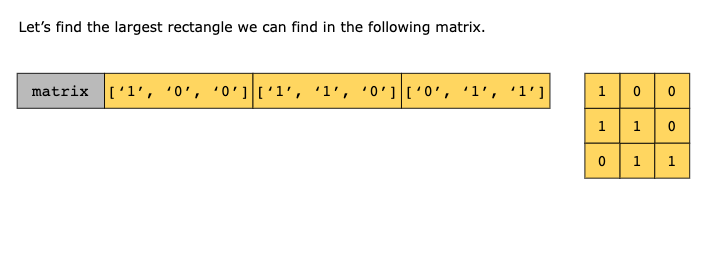
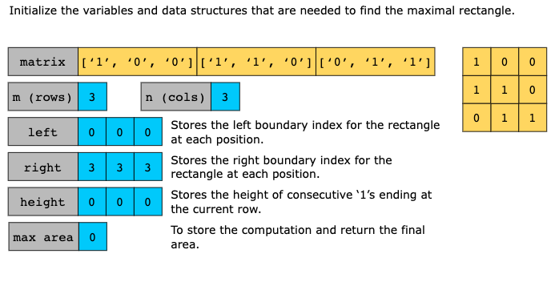
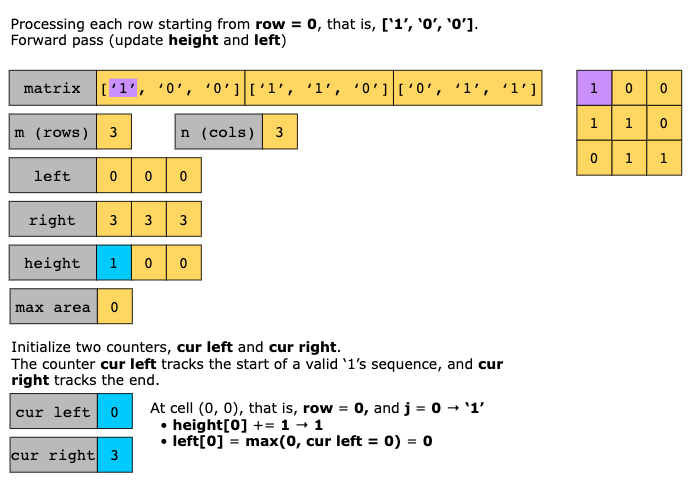
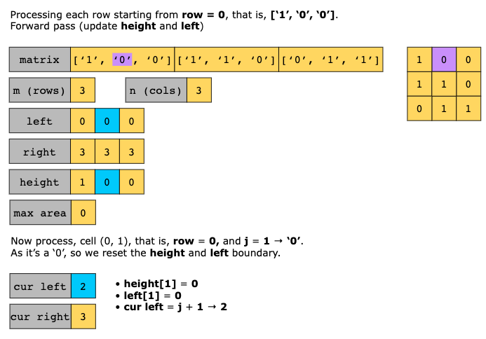
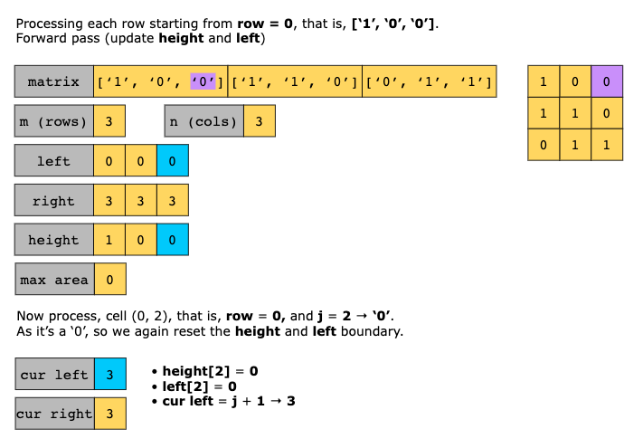

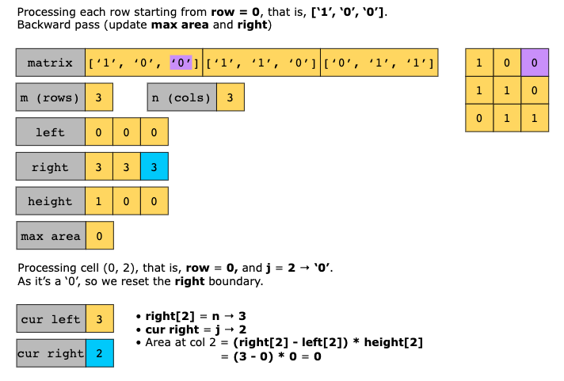
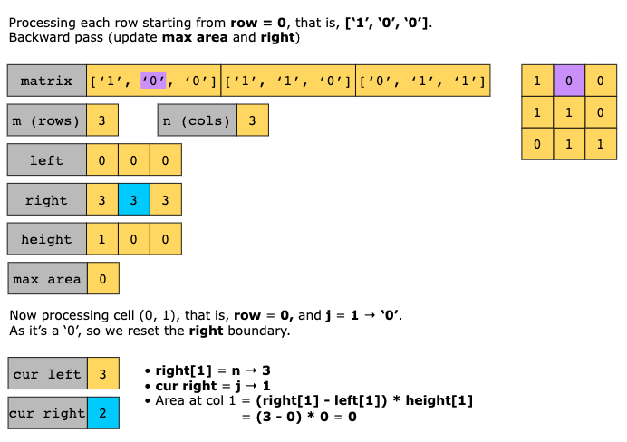

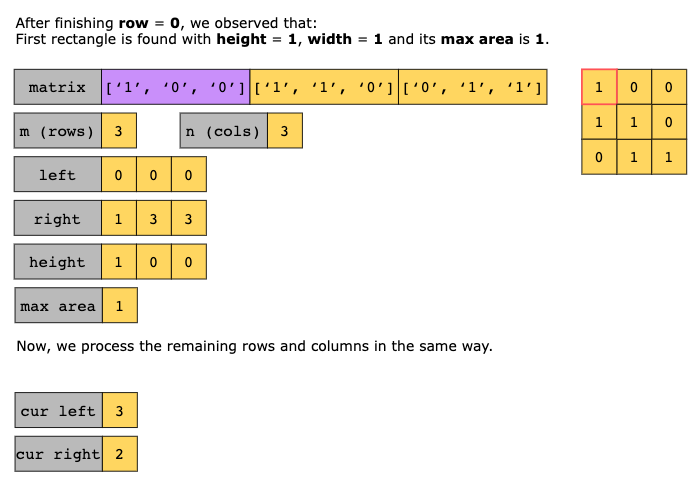
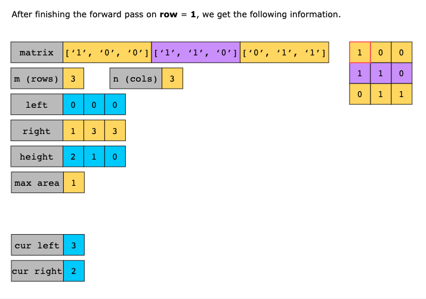
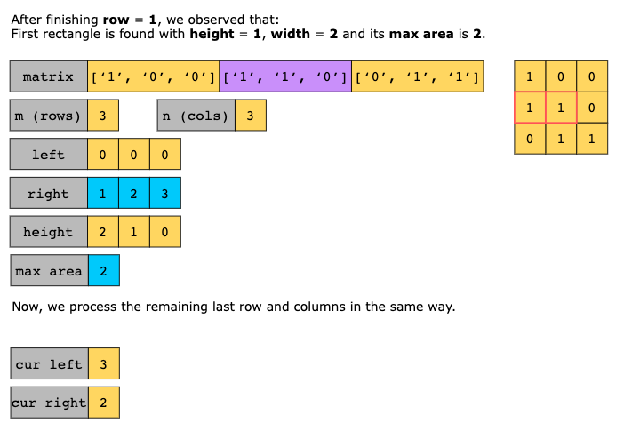
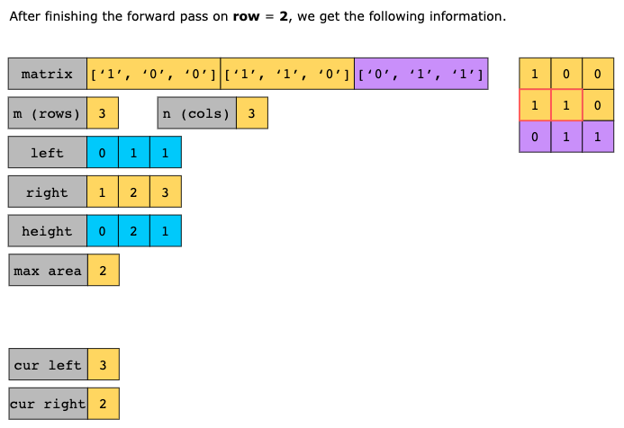
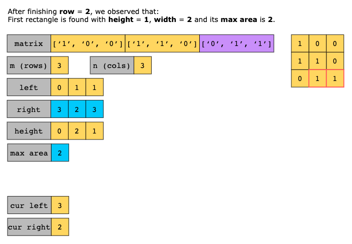
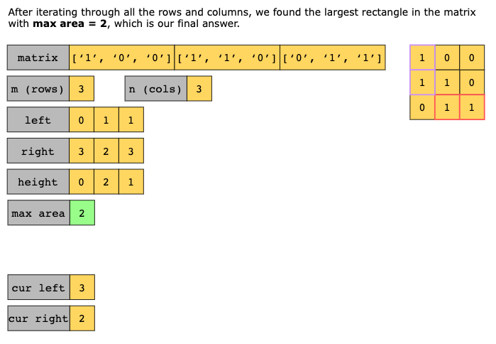

### Complexity analysis

#### Time Complexity 

O(m * n) where `m` is the number of rows and `n` is the number of columns in the input array. We iterate over each cell
once, and for each cell, we perform a constant amount of work.

#### Space Complexity

O(n) where `n` is the number of columns. This is because we use three auxiliary arrays (`height`, `left`, and `right`),
each of size `n`, to store the state for the current row being processed. The space required does not depend on the
number of rows `m`, only on the number of columns.
