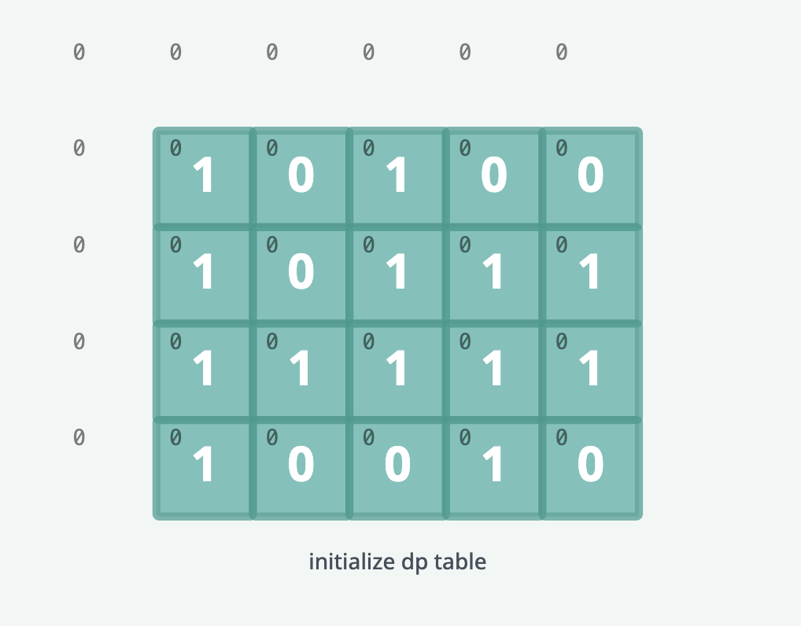
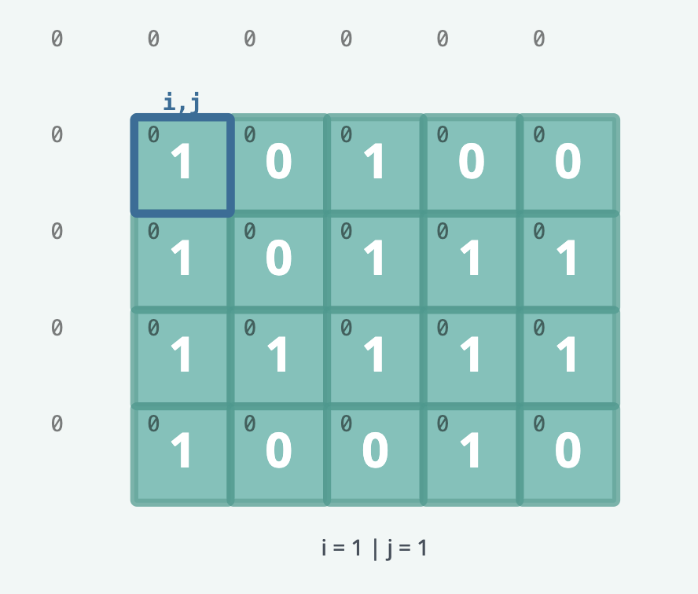
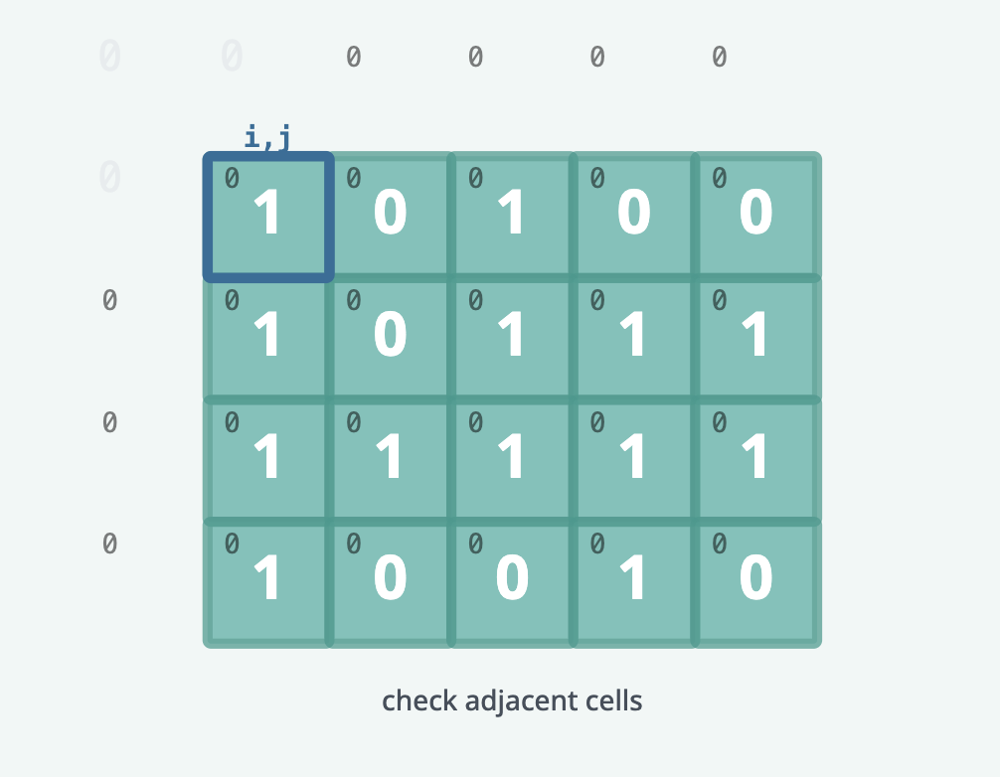
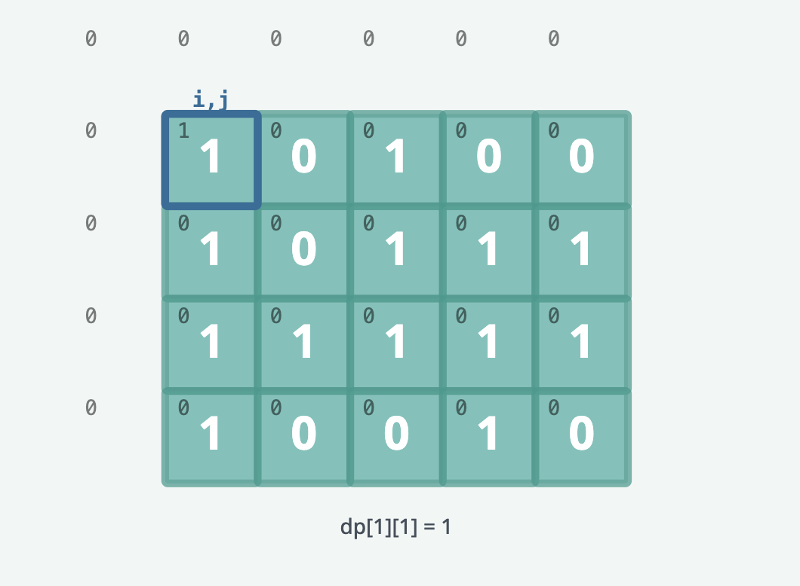
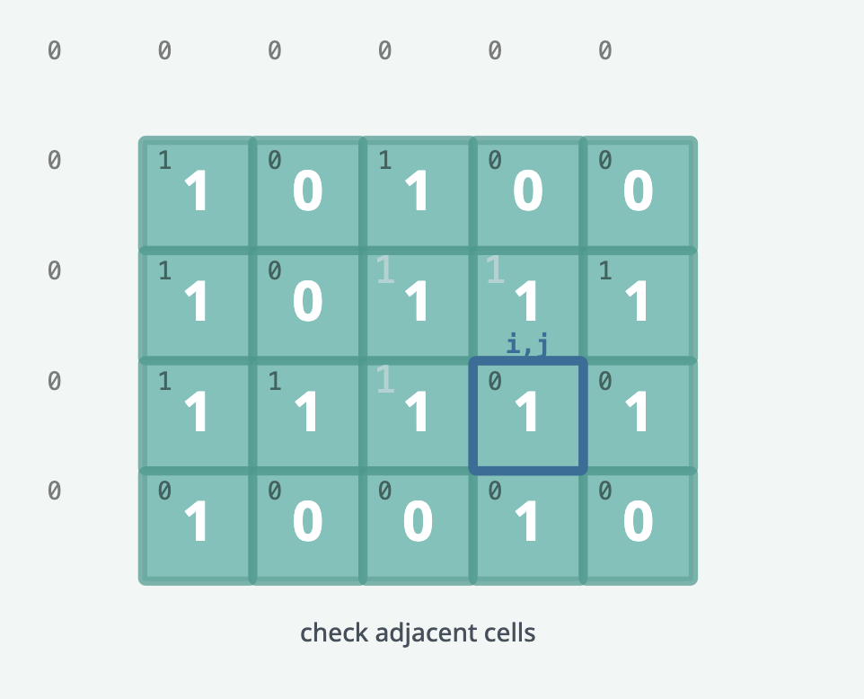
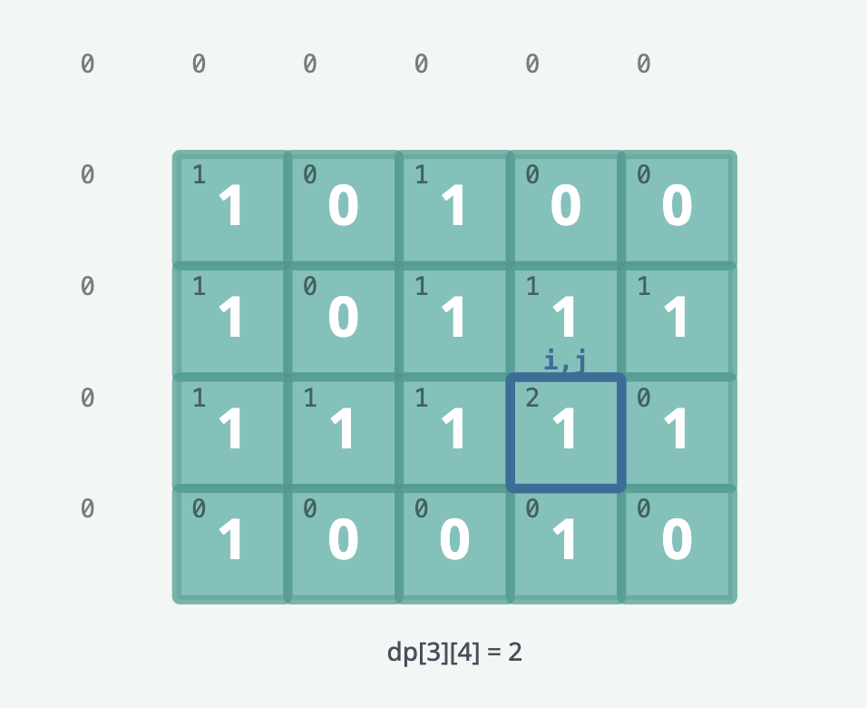

# Maximal Square

Given an m x n binary matrix filled with 0's and 1's, find the largest square containing only 1's and return its area.

## Examples

```text
matrix = [
    [0, 0, 1, 0, 0],
    [1, 1, 1, 0, 1],
    [0, 1, 1, 0, 0]
]

Output: 4
```

## Solution

The solution uses bottom-up dynamic programming to solve the problem. The solution is based on the observation that the
size of the largest square ending (bottom-right corner) at a particular cell is equal to the minimum of the sizes of the
largest squares ending at the three adjacent cells plus 1.

We create a 2D integer array dp of size (r + 1) x (c + 1) where r is the number of rows in the input array and c is the
size of each row. dp[i][j] stores the side length of the largest square ending at the cell matrix[i - 1][j - 1]. All
elements of dp are initialized to 0.



We then use a nested loop to iterate over the input array. For each cell matrix[i - 1][j - 1], we check if the cell
contains a 1. If it does, we update dp[i][j] to the minimum of the sizes of the largest squares ending at the three
adjacent cells plus 1. We also update a variable max_side to store the maximum side length of the largest square we
have found so far.








At the end of the loop, max_side contains the side length of the largest square containing only 1's in the input array.
The area of the square is max_side * max_side.

### Complexity analysis

#### Time Complexity 

O(m * n) where m is the number of rows and n is the number of columns in the input array. We iterate over each cell once,
and for each cell, we perform a constant amount of work.

#### Space Complexity

O(m * n) where m is the number of rows and n is the number of columns. We use a 2D array dp of size (m + 1) x (n + 1) to
store the side length of the largest square ending at each cell.
