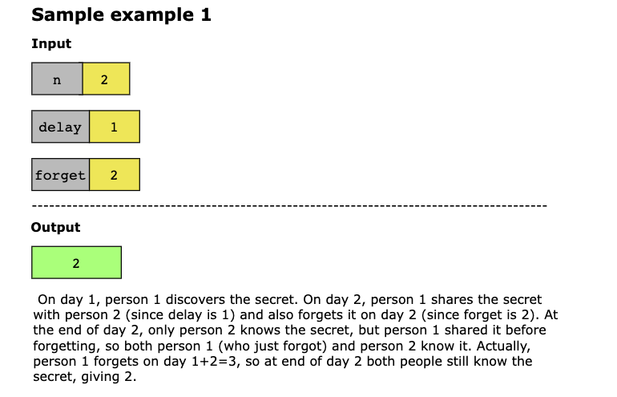
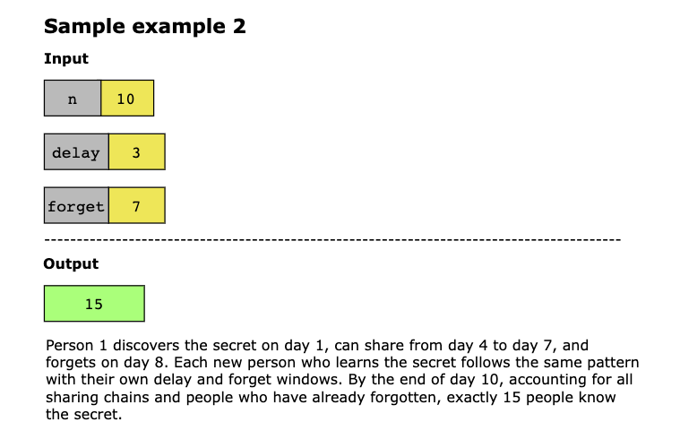
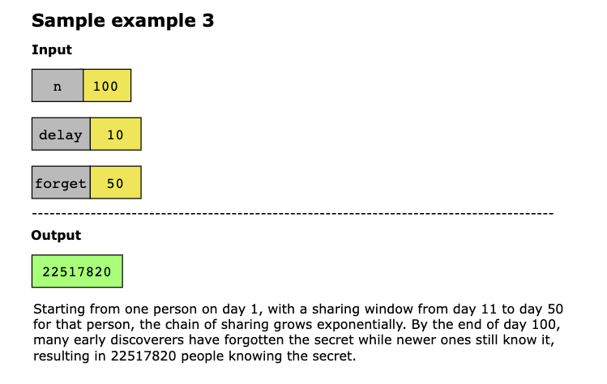
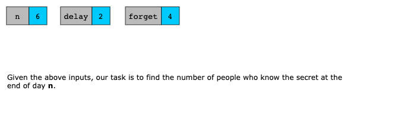
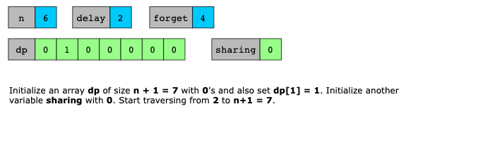
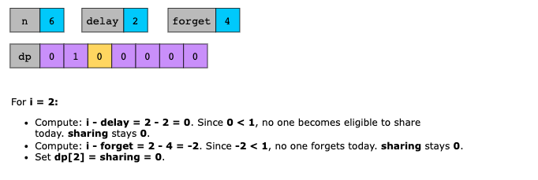
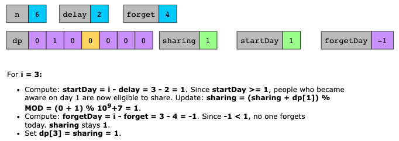
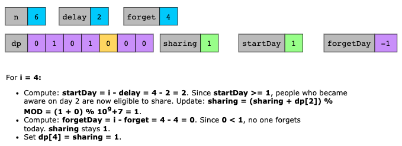
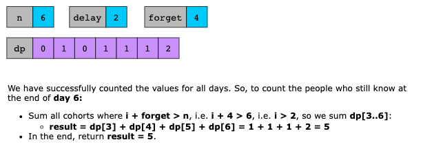

# Number of People Aware of a Secret

You are given an integer delay, which means that each person will share the secret with a new person every day, starting
from delay days after discovering the secret. You are also given an integer forget, which means that each person will
forget the secret forget days after discovering it. A person cannot share the secret on the same day they forgot it, or
on any day afterwards.

Given an integer n, return the number of people who know the secret at the end of day n. Since the answer may be very
large, return it modulo 10^9 + 7.

## Examples





Example 4:

```text
Input: n = 6, delay = 2, forget = 4
Output: 5
Explanation:
Day 1: Suppose the first person is named A. (1 person)
Day 2: A is the only person who knows the secret. (1 person)
Day 3: A shares the secret with a new person, B. (2 people)
Day 4: A shares the secret with a new person, C. (3 people)
Day 5: A forgets the secret, and B shares the secret with a new person, D. (3 people)
Day 6: B shares the secret with E, and C shares the secret with F. (5 people)
```

Example 5:

```text
Input: n = 4, delay = 1, forget = 3
Output: 6
Explanation:
Day 1: The first person is named A. (1 person)
Day 2: A shares the secret with B. (2 people)
Day 3: A and B share the secret with 2 new people, C and D. (4 people)
Day 4: A forgets the secret. B, C, and D share the secret with 3 new people. (6 people)
```

## Constraints

- 2 <= n <= 1000
- 1 <= delay < forget <= n

## Topics

- Dynamic Programming
- Queue
- Simulation

## Hints

- Let `dp[i][j]` be the number of people who have known the secret for exactly j + 1 days, at day i.
- If `j > 0`, `dp[i][j] = dp[i – 1][j – 1]`.
- `dp[i][0] = sum(dp[i – 1][j])` `for j in [delay – 1, forget – 2]`.

## Solution

1. [Simulation + Deque](#simulation--deque)
2. [Dynamic Programming](#dynamic-programming)

### Simulation + Deque

We can directly simulate the process based on the description of the problem.

We use two deques, `know` and `share`, which represent people who know the secret (but will not share it) and people who
will share the secret, respectively. Each element in these two deques is a tuple `(day,cnt)`, where day indicates the 
day the secret becomes known, and `cnt` represents the number of people who know the secret on that day.

Initially, on the first day, only one person knows the secret and will not share it, so `know=[(1,1)]` and `share=[]`.

On the i-th day `(2 ≤ i ≤ n)`:

1. On the (`i−delay`)-th day, people who knew the secret start to share it. Therefore, if the first element of `know` is
   `(i−delay,cnt)`, remove it and add it to the end of `share`.
2. On the `(i−forget)`-th day, people who learned the secret forget it. Therefore, if the first element of share is
   `(i−forget,cnt)`, remove it.
3. Everyone in `share` teaches the secret to new people. Therefore, we add `(i,cnt)` to the end of `know`, where `cnt`
   is the sum of all counts in `share`.

The time complexity of steps 1 and 2 is `O(1)`, while step 3 is `O(n)` because it requires traversing share. Although
this is sufficient to solve the problem within the limits, we can optimize it to `O(1)`. We can maintain two variables,
`knowcnt` and `sharecnt`, to store the sum of counts in `know` and `share`, respectively. In this way, the time
complexity of steps 1 and 2 remains `O(1)`, and step 3 is reduced to `O(1)` as well.

The space complexity evaluates to `O(n)`. The deques require up to `O(n)` space to store the elements.

The final answer is `knowcnt` + `sharecnt`.

---

### Dynamic Programming

The key insight is to use dynamic programming where `dp[i]` represents the number of people who discover the secret on
day `i`. On day 1, exactly one person discovers the secret. For each subsequent day `i`, the number of new people who
learn the secret equals the total number of “active sharers” on that day. A person who discovered the secret on day `d`
is an active sharer on day `i` if they have passed their delay period (`d + delay <= i`) and have not yet forgotten
(`d + forget > i`). Instead of recalculating the sum of all active sharers from scratch each day, we maintain a running
`sharing` variable that we update incrementally: when day `i` arrives, people who discovered the secret on `day i - delay`
begin sharing (add `dp[i - delay]`), and people who discovered it on `day i - forget` stop sharing because they forget
(subtract `dp[i - forget]`). After filling the entire dp array, the final answer is the sum of d`p[i]` for all days `i`
where the person has not yet forgotten the secret by day `n`, meaning `i + forget > n`.

Now, let’s look at the solution steps below:

1. Initialize a constant `MOD` equal to 10^9 + 7 for modular arithmetic.
2. Create an array `dp` of size `n + 1`, initialized to 0, where `dp[i]` represents the number of people who discover
   the secret on day `i`.
3. Set `dp[1] = 1` since exactly one person discovers the secret on day 1.
4. Initialize a variable `sharing` to 0 to track the running count of people currently able to share the secret.
5. Iterate over each day `i` from 2 to `n`:
   - If `i - delay >= 1`, add `dp[i - delay]` to sharing (modulo `MOD`), because people who discovered the secret on
     day `i - delay` have now waited long enough and begin sharing today.
   - If `i - forget >= 1`, subtract `dp[i - forget]` from sharing (modulo `MOD`), because people who discovered the
     secret on day `i - forget` forget it today and stop sharing.
   - Set `dp[i]` to the current value of sharing modulo `MOD`, representing all new people who learn the secret on day `i`.
6. After filling the `dp` array, compute the final result by summing `dp[i]` for all days `i` from 1 to n where`i + forget > n`.
   - This condition ensures we only count people who have not yet forgotten the secret by the end of day `n`.
7. Return result modulo `MOD`.








#### Time Complexity

The time complexity of the solution is `O(n)` because we iterate through all days from 2 to n once to fill the dp array,
and then iterate from 1 to n once more to compute the final result. Each iteration performs constant time operations.

#### Space Complexity

The space complexity of the solution is `O(n)` because we use a dp array of size n + 1 to store the number of people who
discover the secret on each day.
