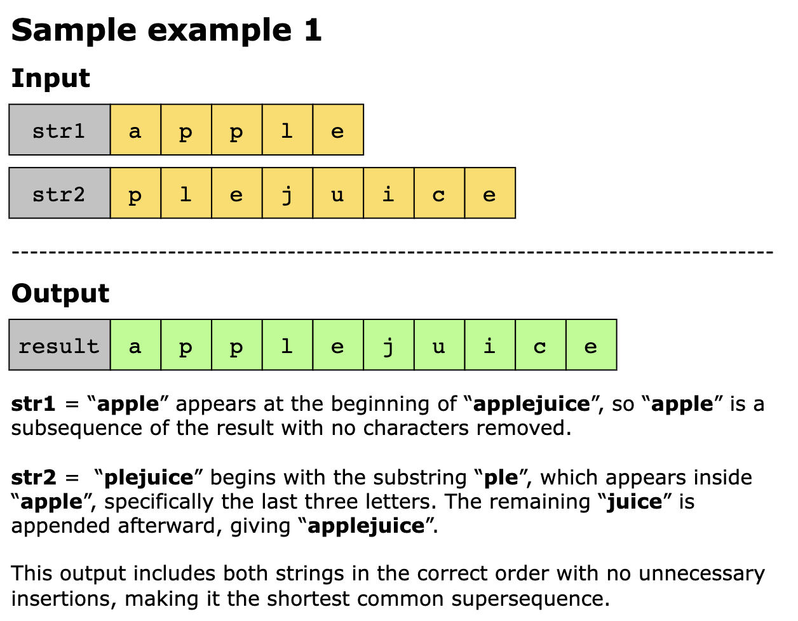
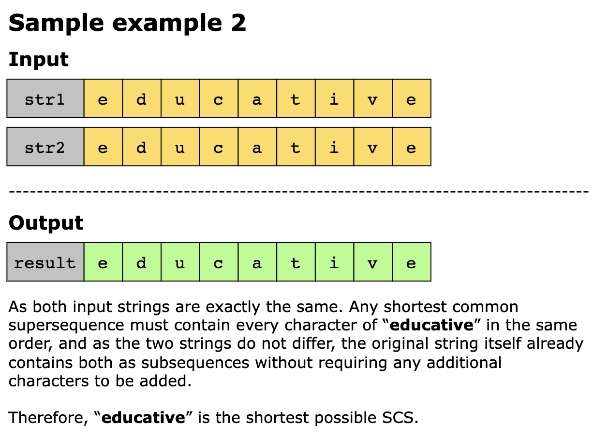
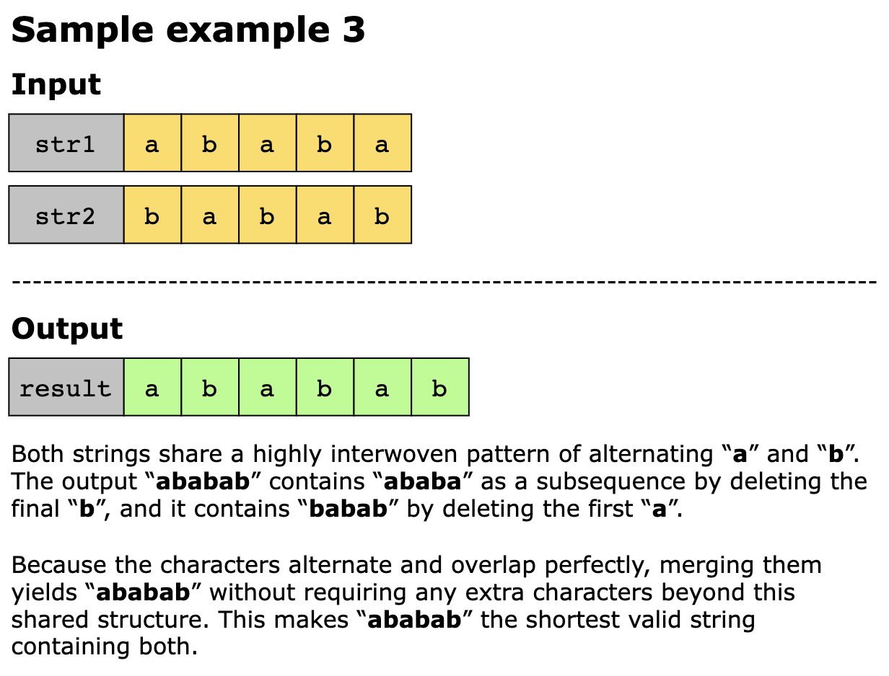

# Shortest Common Supersequence

You are given two strings, str1 and str2. Your task is to find the shortest common supersequence (SCS). The shortest 
possible string that contains both str1 and str2 as subsequences.

If multiple strings satisfy this condition, you may return any one of them.

> Note: A string s is considered a subsequence of another string t if s can be obtained by deleting zero or more 
> characters from t without changing the order of the remaining characters.

## Constraints

- 1 <= `str1.length`, `str2.length` <= 10^3
- str1 and str2 consist of lowercase English letters.

## Examples

## Related Topics

- String
- Dynamic Programming
