# Word Break

You are given a string, s, and an array of strings, word_dict, representing a dictionary. Your task is to add spaces to 
s to break it up into a sequence of valid words from word_dict. We are required to return an array of all possible 
sequences of words (sentences). The order in which the sentences are listed is not significant.

> Note: The same dictionary word may be reused multiple times in the segmentation.

## Constraints

- 1 <= s.length <= 20
- 1 <= word_dict.length <= 1000
- 1 <= word_dict[i].length <= 10
- s and word_dict[i] consist of only lowercase English letters.
- All the strings in word_dict are unique.

## Topics

- Array
- Hash Table
- String
- Dynamic Programming
- Backtracking
- Trie
- Memoization

## Solutions

1. [Naive Approach](#naive-approach)
2. [Backtracking](#backtracking)
3. [Dynamic Programming - tabulation](#optimized-approach-using-dynamic-programming---tabulation)
4. [Dynamic Programming - memoization](#dynamic-programming---memoization)
5. [Trie Optimization](#trie-optimization)

### Naive Approach

The naive approach to solve this problem is to use a traditional recursive strategy in which we take each prefix of the 
input string, s, and compare it to each word in the dictionary. If it matches, we take the string’s suffix and repeat 
the process.

Here is how the algorithm works:

1. **Base case**: If the string is empty, there are no characters in the string that are left to process, so there’ll 
   be no sentences that can be formed. Hence, we return an empty array.
2. Otherwise, the string will not be empty, so we’ll iterate every word of the dictionary and check whether or not the 
   string starts with the current dictionary word. This ensures that only valid word combinations are considered:
   - If it doesn’t start with the current dictionary word, no valid combinations can be formed from this word, so we 
     move on to the next dictionary word. 
   - If it does start with the current dictionary word, we have two options:
     - If the length of the current dictionary word is equal to the length of the string, it means the entire string 
       can be formed from the current dictionary word. In this case, the string s is directly added to the result without
       any further processing. 
     - **Recursive case**: Otherwise, the length of the current dictionary word will be less than the length of the 
       string. This means that the string can be broken down further. Therefore, we make a recursive call to evaluate 
       the remaining portion (suffix) of the string.

   - We’ll then concatenate the prefix and the result of the suffix computed by the recursive call above and store it in
     the result.

3. After all possible combinations have been explored, we return the result.

The time complexity of this solution is O(k^n * m), where k is the number of words in the dictionary, `n` is the length
of the string, and `m` is the length of the longest word in the dictionary.

The space complexity is O(k^n * n), where k is the number of words in the dictionary and `n` is the length of the string.

### Backtracking

Initially, we might think of a brute-force approach where we systematically explore all possible ways to break the 
string into words from the dictionary. This leads us to the backtracking strategy, where we recursively try to form 
words from the string and add them to a current sentence if they are in the dictionary. If the current prefix doesn't 
lead to a valid solution, we backtrack by removing the last added word and trying the next possible word. This ensures 
we explore all possible segmentations of the string.

At each step, we consider all possible end indices for substrings starting from the current index. For each substring, 
we check if it exists in the dictionary. If the substring is a valid word, we append it to the current sentence and 
recursively call the function with the updated index, which is the end index of the substring plus one.

If we reach the end of the string, it means we have found a valid segmentation, and we can add the current sentence to 
the results. However, if we encounter a substring that is not a valid word, we backtrack by returning from that 
recursive call and trying the next possible end index.

The backtracking approach will be inefficient due to the large number of recursive calls, especially for longer strings. 
To increase efficiency, we will convert the word dictionary into a set for constant-time lookups. However, the overall 
time complexity remains high because we explore all possible partitions.

The process is visualized below:

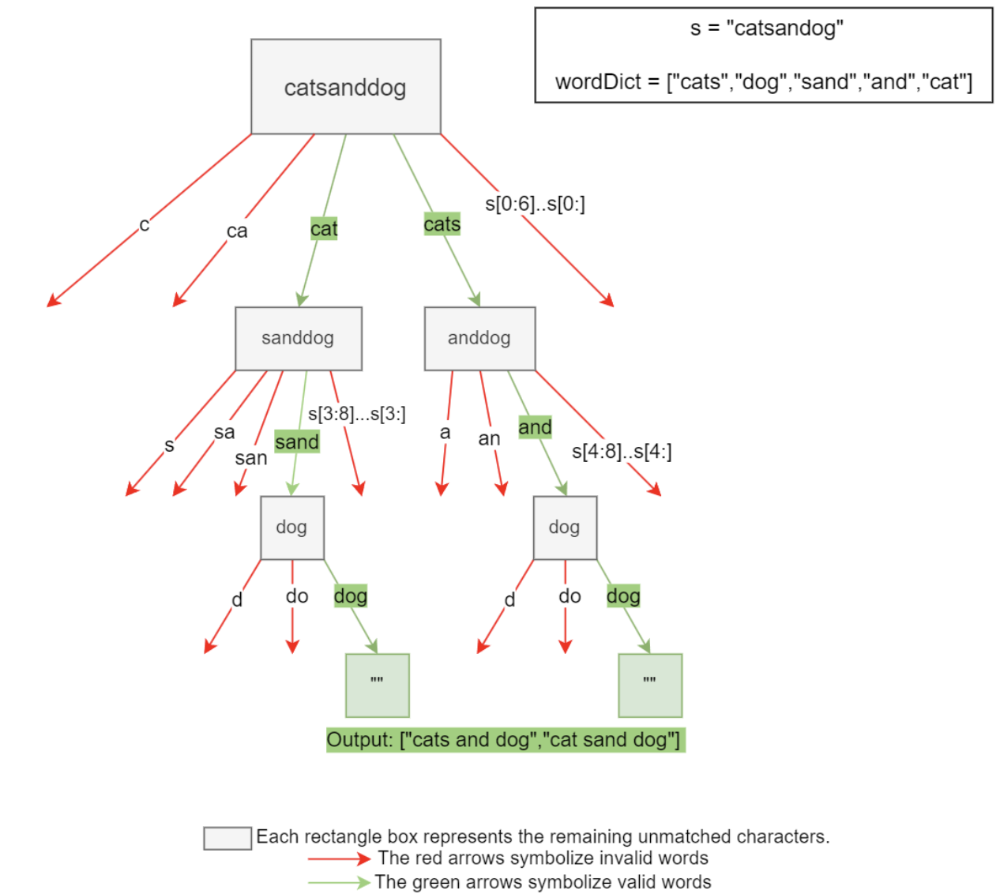

#### Algorithm

- Convert the `word_dict` array into an unordered set `word_set` for efficient lookups.
- Initialize an empty array `results` to store valid sentences.
- Initialize an empty string currentSentence to keep track of the sentence being constructed.
- Call the `backtrack` function with the input string `s`, `word_set`, `current_sentence`, `results`, and a starting 
  index set to 0, the beginning of the input string.
  - Base case: If the `start_index` is equal to the length of the string, add the `current_sentence` to `results` and 
    return as it means that `current_sentence` represents a valid sentence.
  - Iterate over possible `end_index` values from `start_index` + 1 to the end of the string.
    - Extract the substring word from startIndex to `end_index - 1`. 
    - If word is found in `word_set`:
      - Store the current currentSentence in `original_sentence`. 
      - Append word to `current_sentence` (with a space if needed). 
      - Recursively call `backtrack` with the updated `current_sentence` and `end_index`. 
      - Reset `current_sentence` to its original value (`original_sentence`) to backtrack and try the next `end_index`. 
    - Return from the backtrack function.
- Return results.

#### Complexity Analysis

Let n be the length of the input string.

##### Time complexity: O(n⋅2^n)

The algorithm explores all possible ways to break the string into words. In the worst case, where each character can be 
treated as a word, the recursion tree has 2^n leaf nodes, resulting in an exponential time complexity. For each leaf 
node, O(n) work is performed, so the overall complexity is O(n⋅2^n).

##### Space complexity: O(2^n)

The recursion stack can grow up to a depth of n, where each recursive call consumes additional space for storing the 
current state.

Since each position in the string can be a split point or not, and for n positions, there are 2^n possible combinations 
of splits. Thus, in the worst case, each combination generates a different sentence that needs to be stored, leading to 
exponential space complexity.

### Optimized approach using dynamic programming - tabulation

Since the recursive solution to this problem is very costly, let’s see if we can reduce this cost in any way. Dynamic 
programming helps us avoid recomputing the same subproblems. Therefore, let’s analyze our recursive solution to see if 
it has the properties needed for conversion to dynamic programming.

- **Optimal substructure**: Given an input string ,s, that we want to break up into dictionary words, we find the first 
    word that matches a word from the dictionary, and then repeat the process for the remaining, shorter input string. 
    This means that, to solve the problem for input `q`, we need to solve the same problem for `p`, where `p` is at 
  least one character shorter than`q`. Therefore, this problem obeys the optimal substructure property.

- **Overlapping subproblems**: The algorithm solves the same subproblems repeatedly. Consider input string “ancookbook” 
  and the dictionary [“an”, “book”, “cook”, “cookbook”]. The following is the partial call tree for the naive recursive 
  solution:
  ```text
          "ancookbook"
         /              \
     "ancookbook"       "cookbook"
     /            \      /         \
  "cookbook"      ... "book"       ...
  ```

From the tree above, it can be seen that the subproblem “cookbook” is evaluated twice. To take advantage of these 
opportunities for optimization, we will use bottom-up dynamic programming, also known as the tabulation approach. This 
is an iterative method of solving dynamic programming problems. The idea is that if a prefix of the input string matches
any word `w` in the dictionary, we can split the string into two parts: the matching word and the suffix of the input 
string. We start from an empty prefix which is the base case. The prefix would eventually develop into the complete 
input string.

> The tabulation approach is often more efficient than backtracking and memoization in terms of time and space complexity 
because it avoids the overhead of recursive calls and stack usage. It also eliminates the need for a separate 
memoization map, as the table itself serves as the storage for the subproblem solutions.

Here’s how the algorithm works:

- We initialize an empty lookup table, dp, of length, n+1, where dp[i] will correspond to the prefix of length i. This 
  table will be used to store the solutions to previously solved subproblems. It will have the following properties:
  - The first entry of the table will represent a prefix of length 0 , i.e., an empty string “”. 
  - The rest of the entries will represent the other prefixes of the string s. For example, the input string “vegan” 
    will have the prefixes “v”, “ve”, “veg”, “vega”, and “vegan”. 
  - Each entry of the table will contain an array containing the sentences that can be formed from the respective prefix. 
    At this point, all the arrays are empty.
- For the base case, we add an empty string to the array corresponding to the first entry of the dp table. This is 
  because the only sentence that can be formed from an empty string is an empty string itself.
- Next, we traverse the input string by breaking it into its prefixes by including a single character, one at a time, 
  in each iteration.
  - For the current prefix, we initialize an array, temp, that will store the valid sentences formed from that prefix. 
    Let’s suppose that the input string is “vegan”, and that the current prefix is “vega”.
  - For all possible suffixes of the current prefix, we check if the suffix exists in the given dictionary. In our 
    example, this would mean checking the dictionary for the suffixes “vega”, “ega”, “ga”, and “a”. For each suffix, it 
    will either match a dictionary word, or not:
    - If it does, we know that the suffix is a valid word from the dictionary and can be used as part of the solution. 
      Therefore, in the dp table, we retrieve all the possible sentences for the prefix to the left of this suffix. 
      Supposing that the current suffix of “vega” is “a”, and that “a” is present in the dictionary, we would retrieve 
      all the sentences already found for “veg”. This means that we reuse the solutions of the subproblem smaller than 
      the current subproblem. Now, we form new sentences for the current prefix by appending a space character and the 
      current suffix (which is a valid dictionary word) to each of the retrieved sentences. Supposing that the valid 
      sentences for the subproblem “veg” are “v eg”, and “ve g”, we will add these new sentences for the current 
      subproblem, “vega”: “veg a”, “v eg a”, and “ve g a”. We add the new sentences to the temp array of this prefix.
    - If the suffix is not present in the dictionary, no sentences can be made from the current prefix, so the temp 
      array of that prefix remains empty.
  - We repeat the above steps for all suffixes of the current prefix.
  - We set the entry corresponding to the current prefix in the dp table equal to the temp array.
- We repeat the steps above for all prefixes of the input string.
- After all the prefixes have been evaluated, the last entry of the dp table will be an array containing all the 
  sentences formed from the largest prefix, i.e., the complete string. Therefore, we return this array.

#### Solution summary

To recap, the solution to this problem can be divided into the following six main steps:

1. We create a 2D table where each entry corresponds to a prefix of the input string. At this point, each entry contains 
   an empty array. 
2. We iterate over all prefixes of the input string. For each prefix, we iterate over all of its suffixes. 
3. For each suffix, we check whether it’s a valid word, i.e., whether it’s present in the provided dictionary. 
4. If the suffix is a valid word, we combine it with all valid sentences from the corresponding entry (in the table) of 
   the prefix to the left of it. 
5. We store the array of all possible sentences that can be formed using the current prefix in the corresponding entry 
   of the table. 
6. After processing all prefixes of the input string, we return the array in the last entry of our table.

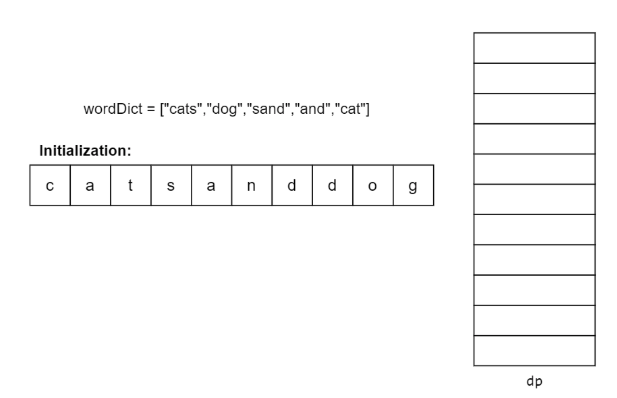
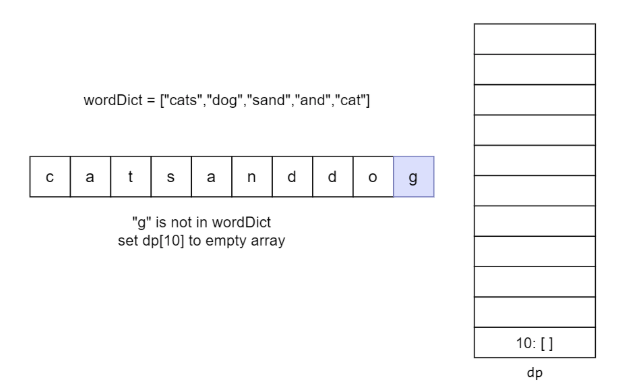
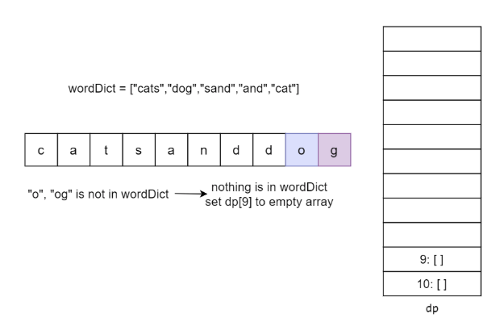
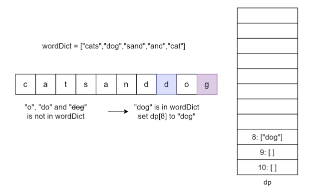
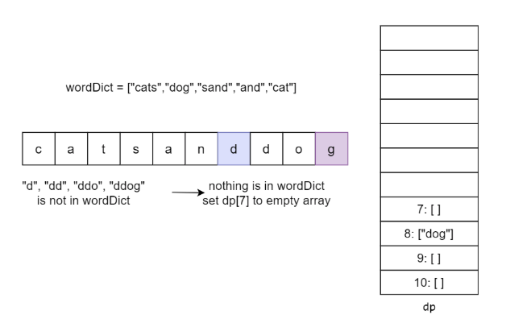
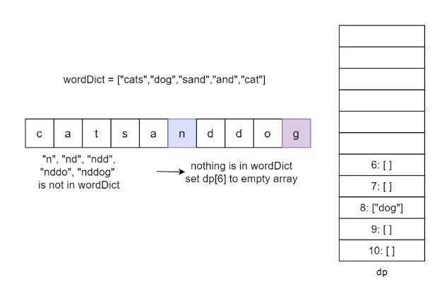
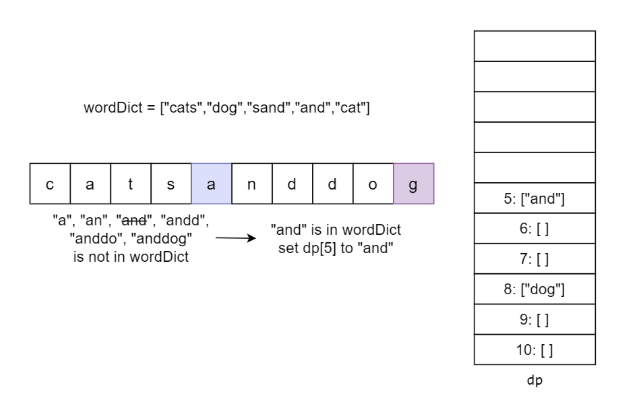
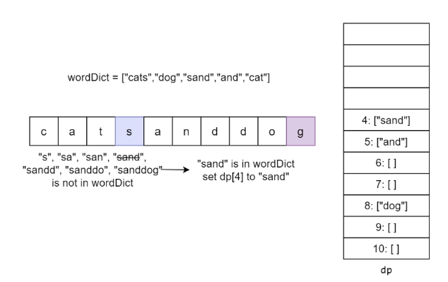
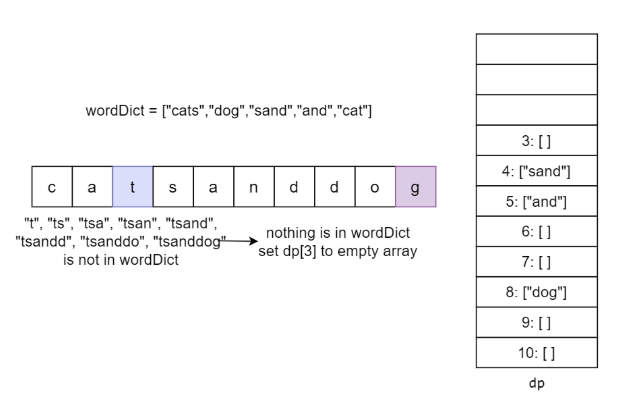
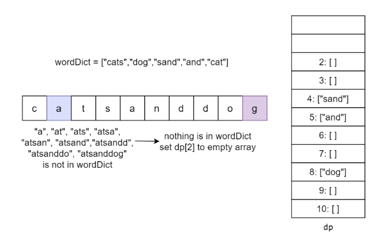
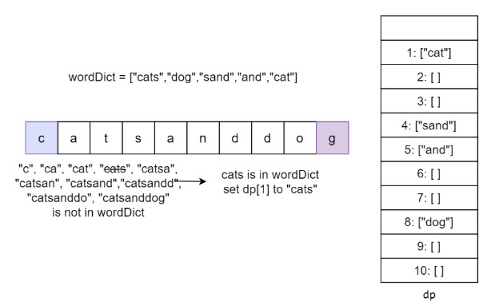
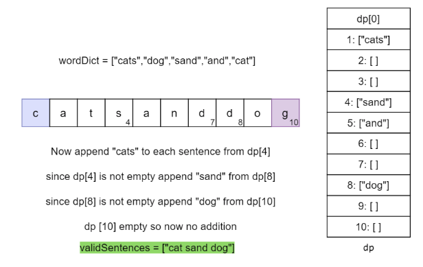
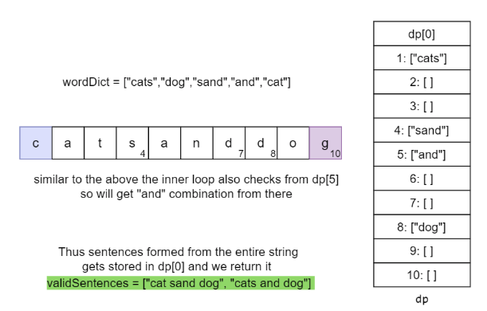

#### Time Complexity

The time complexity of this solution is O(n^2 * v), where n is the length of the string `s` and v is the number of valid
combinations

#### Space Complexity

The space complexity is O(n * v), where n is the length of the string and v is the number of valid combinations stored in
the `dp` array.

### Dynamic Programming - Memoization

We can improve the efficiency of the backtracking method by using Memoization, which stores the results of subproblems 
to avoid recalculating them.

We use a depth-first search (DFS) function that recursively breaks the string into words. However, before performing a 
recursive call, we check if the results for the current substring have already been computed and stored in a memoization
map (typically a dictionary or hash table).

If the results of the current substring are found in the memoization map, we can directly return them without further 
computation. If not, we proceed with the recursive call, computing the results and storing them in the memoization map 
before returning them.

By memoizing the results, we can reduce the number of computations by ensuring that each substring is processed only 
once in average cases.

#### Algorithm

1. Convert the `wordDict` array into an unordered set `wordSet` for efficient lookups.
2. Initialize an empty unordered map `memoization` to store the results of subproblems.
3. Call the `dfs` function with the input string s, wordSet, and memoization. 
   - Check if the answer for the current `remainingSt`r(the remaining part of the string to be processed) are already 
     in `memoization`. If so, return them.
   - Base Case: If `remainingStr` is empty, it means that all characters have been processed. An empty string represents
     a valid sentence so return an array containing the empty string.
   - Initialize an empty array `results`. 
   - Iterate from 1 to the length of `remainingStr`:
     - Extract the substring `currentWord` from 0 to i to check if it is a valid word. 
     - If currentWord is found in `wordSet`:
     - Recursively call `dfs` with `remainingStr.substr(i)`, wordSet, and memoization. 
     - Append currentWord and the recursive results to `results`(with a space if needed) to form valid sentences. 
   - Store the `results` for `remainingStr` in memoization. 
   - Return `results`.

#### Complexity

Let n be the length of the input string.

##### Time complexity: O(n⋅2^n)

While memoization avoids redundant computations, it does not change the overall number of subproblems that need to be 
solved. In the worst case, there are still unique 2^n possible substrings that need to be explored, leading to an 
exponential time complexity. For each subproblem, O(n) work is performed, so the overall complexity is O(n⋅2^n).

##### Space complexity: O(n⋅2^n)

The recursion stack can grow up to a depth of n, where each recursive call consumes additional space for storing the 
current state.

The memoization map needs to store the results for all possible substrings, which can be up to 2^n substrings of size n
in the worst case, resulting in an exponential space complexity.

### Trie Optimization

While the previous approaches focus on optimizing the search and computation process, we can also consider leveraging 
efficient data structures to enhance the word lookup process. This leads us to the trie-based approach, which uses a 
trie data structure to store the word dictionary, allowing efficient word lookup and prefix matching.

The trie, also known as a prefix tree, is a tree-based data structure where each node represents a character in a word, 
and the path from the root to a leaf node represents a complete word. This structure is particularly useful for problems
involving word segmentation because it allows for efficient prefix matching.

Here, we first build a trie from the dictionary words. Each word is represented as a path in the trie, where each node 
corresponds to a character in the word.

By using the trie, we can quickly determine whether a substring can form a valid word without having to perform linear 
searches or set lookups. This reduces the search space and improves the efficiency of the algorithm.

In this approach, instead of recursively exploring the remaining substring and using memoization, we iterate from the 
end of the input string to the beginning (in reverse order). For each starting index (startIdx), we attempt to find 
valid sentences that can be formed from that index by iterating through the string and checking if the current substring
forms a valid word using the trie data structure.
When a valid word is encountered in the trie, we append it to the list of valid sentences for the current starting index.
If the current valid word is not the last word in the sentence, we combine it with the valid sentences formed from the 
next index (endIdx + 1), which are retrieved from the dp dictionary.

The valid sentences for each starting index are stored in the dp dictionary, ensuring that previously computed results 
are reused. By using tabulation and storing the valid sentences for each starting index, we avoid redundant computations 
and achieve significant time and space efficiency improvements compared to the standard backtracking method with 
memoization.

The trie-based approach offers advantages in terms of efficient word lookup and prefix matching, making it particularly 
suitable for problems involving word segmentation or string manipulation. However, it comes with the additional overhead
of constructing and maintaining the trie data structure, which can be more memory-intensive for large dictionaries.

#### Algorithm

##### Initialize TrieNode Structure

- Each TrieNode has two properties:
  - isEnd: A boolean value indicating if the node marks the end of a word.
  - children: An array of size 26 (for lowercase English letters) to store pointers to child nodes.
- The constructor initializes isEnd to false and all elements in children to null.

##### Trie Class

- The Trie class has a root pointer of type TrieNode.
- The constructor initializes the root with a new TrieNode object.
- The insert function:
- Takes a string word as input.
- Starts from the root node.
- For each character c in the word:
  - Calculate the index corresponding to the character. 
  - If the child node at the calculated index doesn't exist, create a new TrieNode and assign it to that index. 
  - Move to the child node.
- After processing all characters, mark the current node's isEnd as true

##### `wordBreak` Function

- Create a Trie object.
- Insert all words from wordDict into the trie using the insert function.
- Initialize a map dp to store the results of subproblems.
- Iterate from the end of the string s to the beginning (in reverse order).
- For each starting index startIdx:
  - Initialize a vector validSentences to store valid sentences starting from startIdx. 
  - Initialize a current_node pointer to the root of the trie. 
  - Iterate from startIdx to the end of the string. 
    - For each character c in the string:
      - Calculate the index corresponding to c. 
      - Check if the child node at the calculated index exists in the trie. 
      - If the child node doesn't exist, break out of the inner loop. This means that the current substring cannot form
        a valid word, so there is no need to continue checking the remaining characters.
      - Move to the child node.
    - Check if the current node's isEnd is true, indicating a valid word.
    - If a valid word is found:
      - Extract the current word from the string using substr.
      - If it's the last word in the sentence (endIdx is the last index):
        - Add the current word to validSentences.
      - If it's not the last word:
        - Retrieve the valid sentences formed by the remaining substring from dp[endIdx + 1].
        - Combine the current word with each sentence and add it to validSentences.
  - Store the validSentences for the current startIdx in dp.
- Return the valid sentences stored in dp[0], which represents the valid sentences formed from the entire string.

#### Complexity Analysis

Let n be the length of the input string.

##### Time complexity: O(n⋅2^n)

Even though the trie-based approach uses an efficient data structure for word lookup, it still needs to explore all 
possible ways to break the string into words. In the worst case, there are 2^n unique possible partitions, leading to 
an exponential time complexity. O(n) work is performed for each partition, so the overall complexity is O(n⋅2^n).

##### Space complexity: O(n⋅2^n)

The trie data structure itself can have a maximum of 2^n nodes in the worst case, where each character in the string 
represents a separate word. Additionally, the tabulation map used in this approach can also store up to 2^n strings of 
size n, resulting in an overall exponential space complexity.

----

### Further Thoughts on Complexity Analysis

The complexity of this problem cannot be reduced from n⋅2^n; the worst-case scenario will still be (n⋅2^n). However, 
using dynamic programming (DP) will make it a bit more efficient than backtracking overall because of the below test case.

Consider the input "aaaaaa", with wordDict = ["a", "aa", "aaa", "aaaa", "aaaaa", "aaaaa"].

Every possible partition is a valid sentence, and there are 2^(n−1) such partitions. The algorithms cannot perform 
better than this since they must generate all valid sentences. The cost of iterating over cached results will be 
exponential, as every possible partition will be cached, resulting in the same runtime as regular backtracking. 
Likewise, the space complexity will also be O(n⋅2^n) for the same reason—every partition is stored in memory.

Another way to explain why the worst-case complexity is O(n⋅2^n) for all the algorithms is that, given an array of 
length n, there are n+1 ways/intervals to partition it into two parts. Each interval has two choices: to split or not 
to split. In the worst case, we will have to check all possibilities, which results in a time complexity of O(n⋅2^(n+1)),
which simplifies to O(n⋅2^n). This analysis is extremely similar to palindrome partitioning.

Overall, this question is interesting because of the nature of this complexity. In an interview setting, if an 
interviewer asks this question, the most expected solutions would be Backtracking and Trie, as they become natural 
choices for the conditions and outputs we need.
