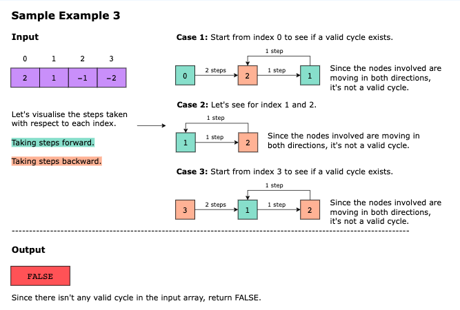

# Circular Array Loop

We are given a circular array of non-zero integers, nums, where each integer represents the number of steps to be taken 
either forward or backward from its current index. Positive values indicate forward movement, while negative values 
imply backward movement. When reaching either end of the array, the traversal wraps around to the opposite end.

> A circular array is a type of array where the last element is followed by the first element, forming a loop or circle.

The input array may contain a cycle, which is a sequence of indexes characterized by the following:

The sequence starts and ends at the same index.
The length of the sequence is at least two.
The loop must be in a single direction, forward or backward.
Note: A cycle in the array does not have to originate at the beginning. It may begin from any point in the array.

Your task is to determine if nums has a cycle. Return TRUE if there is a cycle. Otherwise return FALSE.

## Examples

