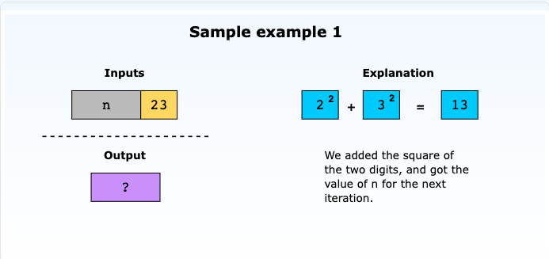
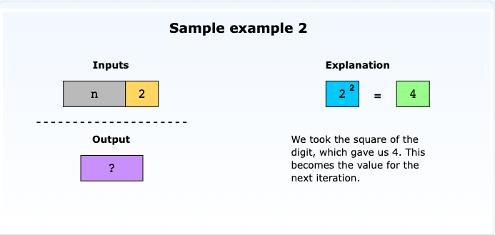
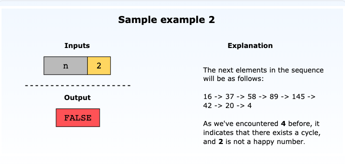
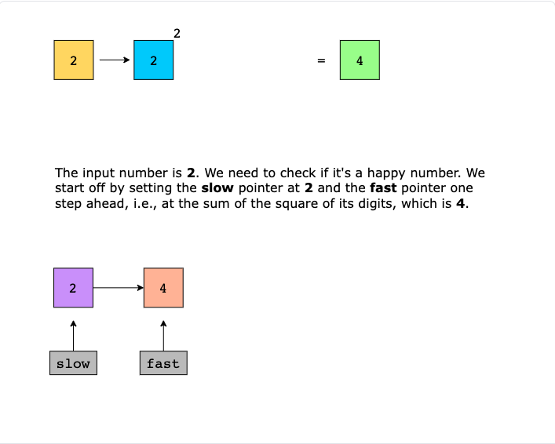
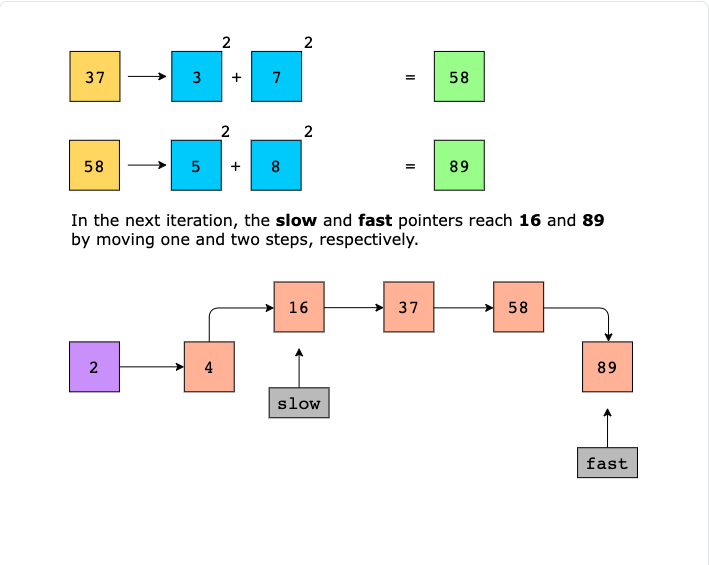
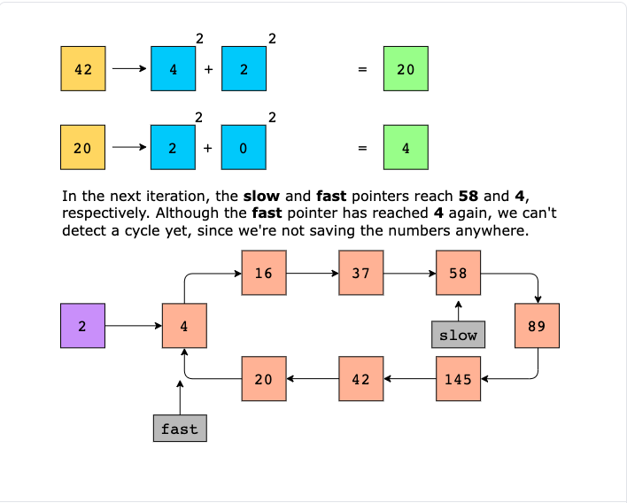
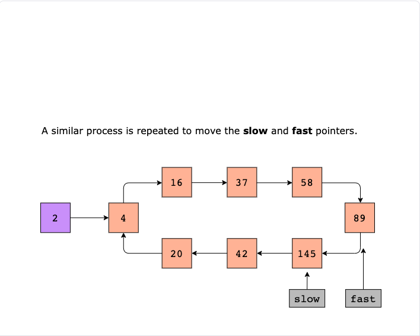

# Happy Number

Write an algorithm to determine if a number n is a happy number.

We use the following process to check if a given number is a happy number:

- Starting with the given number n, replace the number with the sum of the squares of its digits. 
- Repeat the process until:
  - The number equals 1, which will depict that the given number n is a happy number.
  - The number enters a cycle, which will depict that the given number n is not a happy number.
 
Return TRUE if n is a happy number, and FALSE if not.

## Examples

### Sample Example 1

### Sample Example 2

## Solution Example

Below shows an example using Floyd's Cycle Detection Algorithm or Tortoise and Hare algorithm to detect a cycle
for the number 2.

