# Alien Dictionary

You are given a list of words written in an alien language, where the words are sorted lexicographically by the rules of
this language. Surprisingly, the aliens also use English lowercase letters, but possibly in a different order.

Given a list of words written in the alien language, return a string of unique letters sorted in the lexicographical
order of the alien language as derived from the list of words.

If there’s no solution, that is, no valid lexicographical ordering, you can return an empty string "".

If multiple valid orderings exist, you may return any of them.

> Note: A string, a, is considered lexicographically smaller than string b if:
> 1. At the first position where they differ, the character in a comes before the character in b in the alien alphabet.
> 2. If one string is a prefix of the other, the shorter string is considered smaller.

## Constraints

- 1 <= `words.length` <= 10^3
- 1 <= `words[i].length` <= 20
- All characters in `words[i]` are English lowercase letters

## Examples

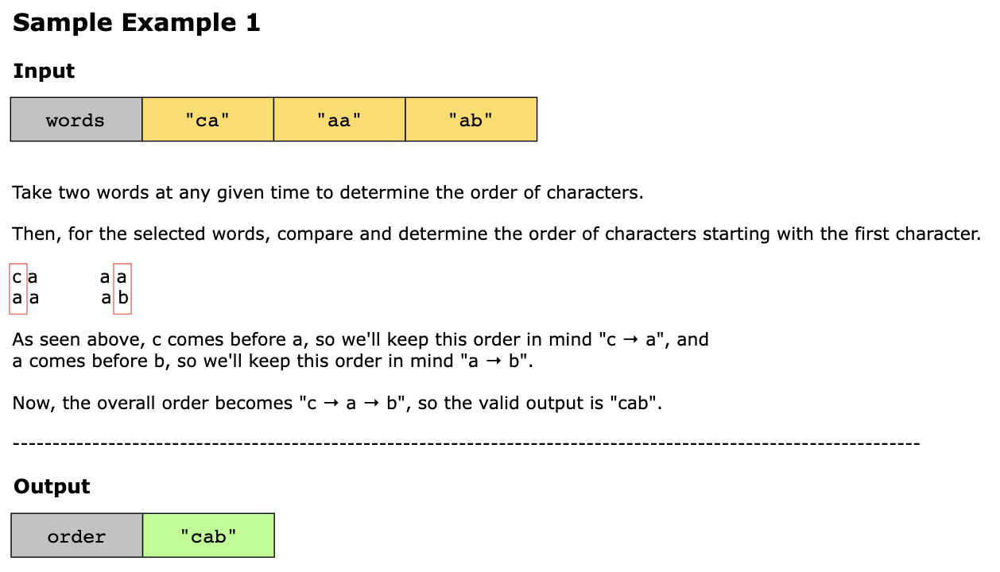
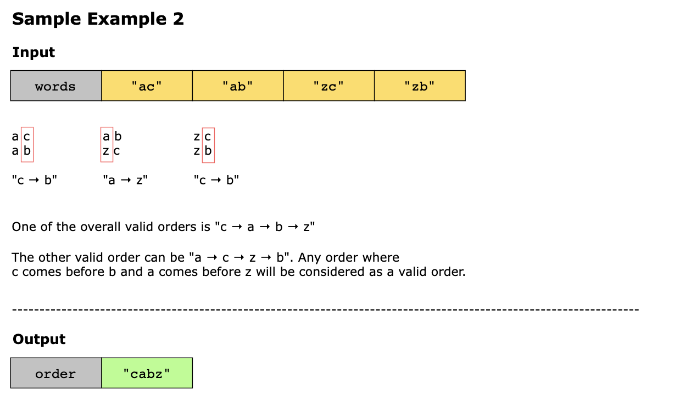
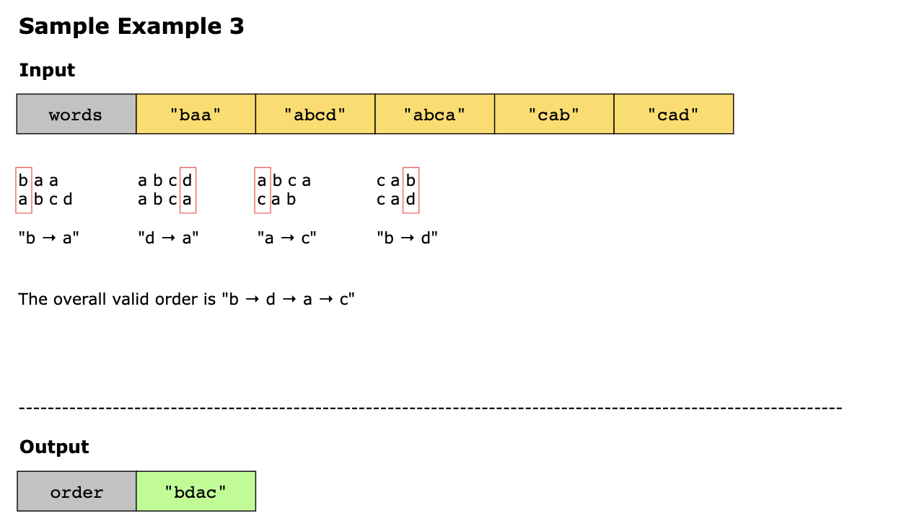
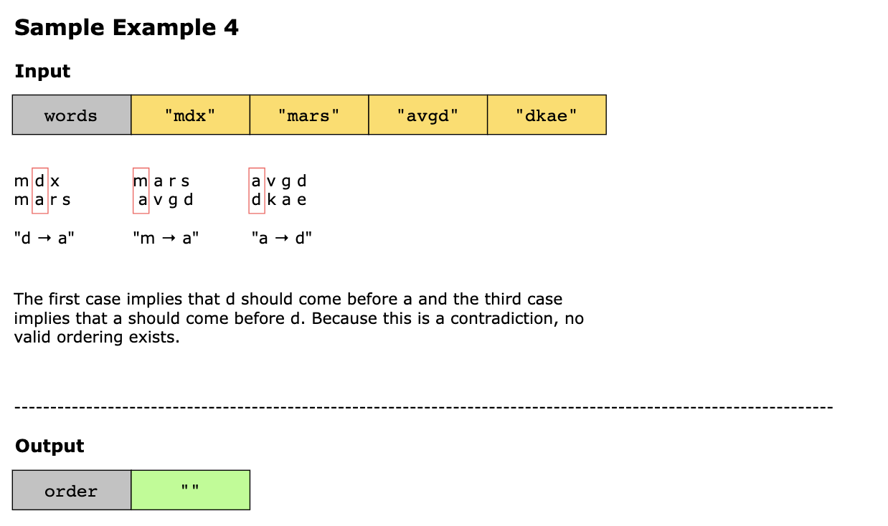
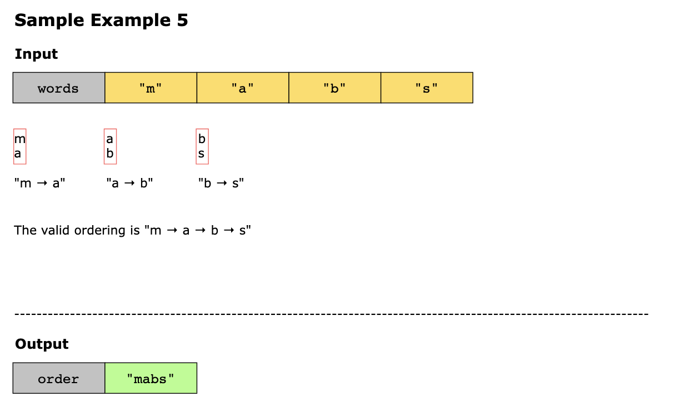

## Solution

We can solve this problem using the topological sort pattern. Topological sort is used to find a linear ordering of
elements that have dependencies on or priority over each other. For example, if A is dependent on B or B has priority
over A, then B is listed before A in topological order.

Using the list of words, we identify the relative precedence order of the letters in the words and generate a graph to
represent this ordering. To traverse a graph, we can use breadth-first search to find the letters’ order.

We can essentially map this problem to a graph problem, but before exploring the exact details of the solution, there
are a few things that we need to keep in mind:

1. The letters within a word don’t tell us anything about the relative order. For example, the word “educative” in the list 
   doesn’t tell us that the letter “e” is before the letter “d.”

2. The input can contain words followed by their prefix, such as “educated” and then “educate.” These cases will never result 
   in a valid alphabet because in a valid alphabet, prefixes are always first. We need to make sure our solution detects
   these cases correctly.
3. There can be more than one valid alphabet ordering. It’s fine for our algorithm to return any one of them. 
4. The output dictionary must contain all unique letters within the words list, including those that could be in any position 
   within the ordering. It shouldn’t contain any additional letters that weren’t in the input.

### Step-by-step solution construction

For the graph problem, we can break this particular problem into three parts:

1. Extract the necessary information to identify the dependency rules from the words. For example, in the words 
   [“patterns”, “interview”], the letter “p” comes before “i.”
2. With the gathered information, we can put these dependency rules into a directed graph with the letters as nodes and
   the dependencies (order) as the edges.
3. Lastly, we can sort the graph nodes topologically to generate the letter ordering (dictionary).

Let’s look at each part in more depth.

#### Part 1: Identifying the dependencies

Let’s start with example words and observe the initial ordering through simple reasoning:

`["mzosr", "mqov", "xxsvq", "xazv", "xazau", "xaqu", "suvzu", "suvxq", "suam", "suax", "rom", "rwx", "rwv"]`

As in the English language dictionary, where all the words starting with “a” come at the start followed by the words
starting with “b,” “c,” “d,” and so on, we can expect the first letters of each word to be in alphabetical order.

`["m", "m", "x", "x", "x", "x", "s", "s", "s", "s", "r", "r", "r"]`

Removing the duplicates, we get the following:

`["m", "x", "s", "r"]`

Following the intuition explained above, we can assume that the first letters in the messages are in alphabetical order:

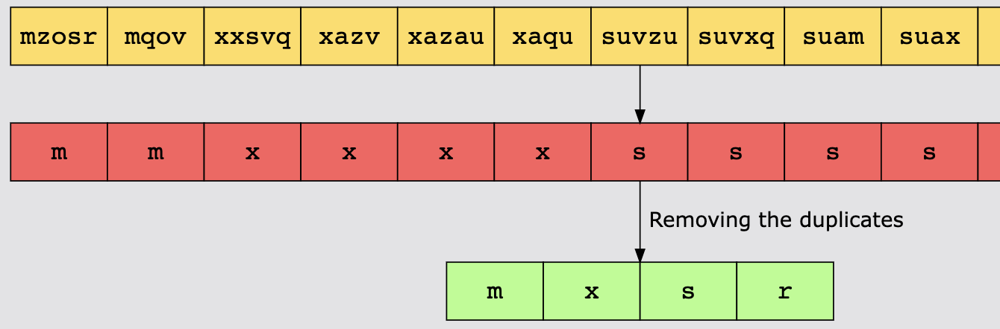

Looking at the letters above, we know the relative order of these letters, but we don’t know how these letters fit in
with the rest of the letters. To get more information, we need to look further into our English dictionary analogy. The
word “dirt” comes before “dorm.” This is because we look at the second letter when the first letter is the same. In this
case, “i” comes before “o” in the alphabet.

We can apply the same logic to our alien words and look at the first two words, “mzsor” and “mqov.” As the first letter
is the same in both words, we look at the second letter. The first word has “z,” and the second one has “q.” Therefore,
we can safely say that “z” comes before “q” in this alien language. We now have two fragments of the letter order:

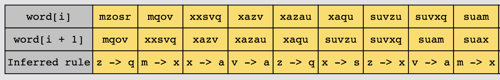

> Note: Notice that we didn’t mention rules such as “m -> a”. This is fine because we can derive this relation from 
> “m -> x”, “x -> a”.

This is it for the first part. Let’s put the pieces that we have in place.

#### Part 2: Representing the dependencies

We now have a set of relations mentioning the relative order of the pairs of letters:

`["z -> q", "m -> x", "x -> a", "x -> v", "x -> s", "z -> x", "v -> a", "s -> r", "o -> w"]`

Now the question arises, how can we put these relations together? It might be tempting to start chaining all these
together. Let’s look at a few possible chains:

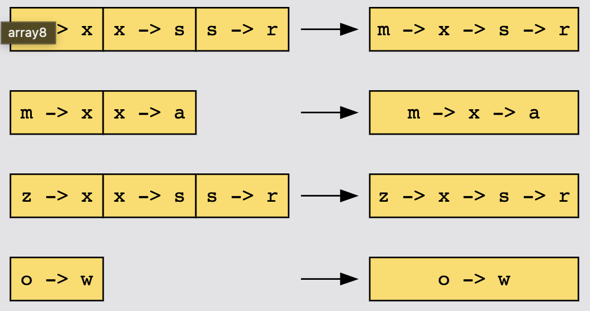

We can observe from our chains above that some letters might appear in more than one chain, and putting the chains into
the output list one after the other won’t work. Some of the letters might be duplicated and would result in an invalid
ordering. Let’s try to visualize the relations better with the help of a graph. The nodes are the letters, and an edge
between two letters, “x” and “y” represents that “x” is before “y” in the alien words.

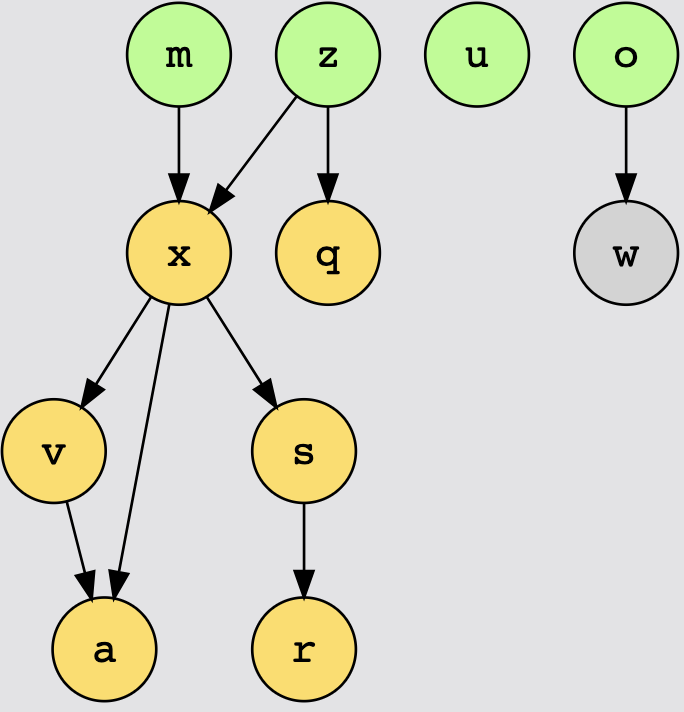

#### Part 3: Generating the dictionary

As we can see from the graph, four of the letters have no incoming arrows. This means that there are no letters that
have to come before any of these four.

> Remember: There could be multiple valid dictionaries, and if there are, then it’s fine for us to return any of them.

Therefore, a valid start to the ordering we return would be as follows:
`["o", "m", "u", "z"]`

We can now remove these letters and edges from the graph because any other letters that required them first will now have
this requirement satisfied.

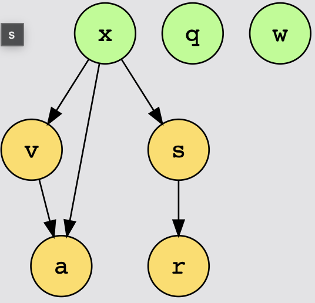

There are now three new letters on this new graph that have no in arrows. We can add these to our output list.

`["o", "m", "u", "z", "x", "q", "w"]`

Again, we can remove these from the graph.

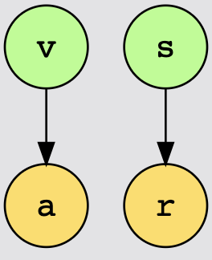

Then, we add the two new letters with no in arrows.

`["o", "m", "u", "z", "x", "q", "w", "v", "s"]`
This leaves the following graph:

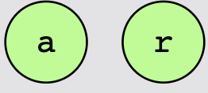

We can place the final two letters in our output list and return the ordering:

`["o", "m", "u", "z", "x", "q", "w", "v", "s", "a", "r"]`
Let’s now review how we can implement this approach.

Identifying the dependencies and representing them in the form of a graph is pretty straightforward. We extract the
relations and insert them into an adjacency list:

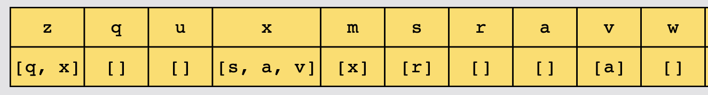

Next, we need to generate the dictionary from the extracted relations: identify the letters (nodes) with no incoming links.
Identifying whether a particular letter (node) has any incoming links or not from our adjacency list format can be a
little complicated. A naive approach is to repeatedly iterate over the adjacency lists of all the other nodes and check
whether or not they contain a link to that particular node.

This naive method would be fine for our case, but perhaps we can do it more optimally.

An alternative is to keep two adjacency lists:

One with the same contents as the one above.
One reversed that shows the incoming links.
This way, every time we traverse an edge, we can remove the corresponding edge from the reversed adjacency list:

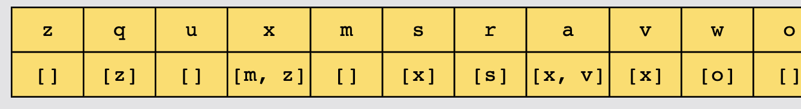

What if we can do better than this? Instead of tracking the incoming links for all the letters from a particular letter,
we can track the count of how many incoming edges there are. We can keep the in-degree count of all the letters along with
the forward adjacency list.

> In-degree corresponds to the number of incoming edges of a node.

It will look like this:

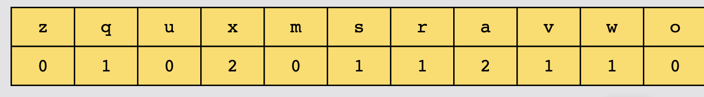

Now, we can decrement the in-degree count of a node instead of removing it from the reverse adjacency list. When the in-degree of the node reaches 0, this particular node has no incoming links left.

We perform BFS on all the letters that are reachable, that is, the in-degree count of the letters is zero. A letter is
only reachable once the letters that need to be before it have been added to the output, result.

We use a queue to keep track of reachable nodes and perform BFS on them. Initially, we put the letters that have zero
in-degree count. We keep adding the letters to the queue as their in-degree counts become zero.

We continue this until the queue is empty. Next, we check whether all the letters in the words have been added to the
output or not. This would only happen when some letters still have some incoming edges left, which means there is a cycle.
In this case, we return an empty string.

> Remember: There can be letters that don’t have any incoming edges. This can result in different orderings for the same
> set of words, and that’s all right.

### Solution summary

To recap, the solution to this problem can be divided into the following parts:

1. Build a graph from the given words and keep track of the in-degrees of alphabets in a dictionary.
2. Add the sources to a result list. 
3. Remove the sources and update the in-degrees of their children. If the in-degree of a child becomes 0, it’s the next
   source.
4. Repeat until all alphabets are covered.

### Time Complexity

There are three parts to the algorithm:

- Identifying all the relations.
- Putting them into an adjacency list.
- Converting it into a valid alphabet ordering.

In the worst case, the identification and initialization parts require checking every letter of every word, which is 
O(c), where c is the total length of all the words in the input list added together.

For the generation part, we can recall that a breadth-first search has a cost of O(v+e), where v is the number of vertices
and e is the number of edges. Our algorithm has the same cost as BFS because it visits each edge and node once.

> Note: A node is visited once all of its edges are visited, unlike the traditional BFS where it’s visited once any edge
> is visited.

Therefore, determining the cost of our algorithm requires determining how many nodes and edges there are in the graph.

**Nodes**: We know that there’s one vertex for each unique letter, that is, O(u) vertices, where u is the total number of
unique letters in words. While this is limited to 26 in our case, we still look at how it would impact the complexity if
this weren’t the case.

**Edges**: We generate each edge in the graph by comparing two adjacent words in the input list. There are n−1 pairs of
adjacent words, and only one edge can be generated from each pair, where n is the total number of words in the input list.
We can again look back at the English dictionary analogy to make sense of this:

"dirt"
"dorm"

The only conclusion we can draw is that “i” is before “o.” This is the reason "dirt" appears before "dorm" in an English
dictionary. The solution explains that the remaining letters “rt” and “rm” are irrelevant for determining the alphabetical
ordering.

> Remember: We only generate rules for adjacent words and don’t add the “implied” rules to the adjacency list.

So with this, we know that there are at most n−1 edges.

We can place one additional upper limit on the number of edges since it’s impossible to have more than one edge between
each pair of nodes. With u nodes, this means there can’t be more than u^2 edges.

Because the number of edges has to be lower than both n−1 and u^2, we know it’s at most the smallest of these two values:
min(u^2 ,n−1).

We can now substitute the number of nodes and the number of edges in our breadth-first search cost:
- v=u 
- e=min(u^2 ,n−1)

This gives us the following:
> O(v+e) = O(u + min(u^2, n−1)) = O(u + min(u^2 ,n))

Finally, we combine the three parts: O(c) for the first two parts and O(u + min(u^2 ,n)) for the third part. Since we
have two independent parts, we can add them and look at the final formula to see whether or not we can identify any
relation between them. Combining them, we get the following:

> O(c) + O(u + min(u^2, n)) = O(c + u + min(u^2,n))

So, what do we know about the relative values of n, c and u? We can deduce that both n, the total number of words, and 
u, the total number of unique letters, are smaller than the total number of letters, c, because each word contains at
least one character and there can’t be more unique characters than there are characters.

We know that c is the biggest of the three, but we don’t know the relation between n and u.

Let’s simplify our formulation a little since we know that the u bit is insignificant compared to c

> O(c+u+min(u^2,n))−>O(c+min(u^2 ,n))

Let’s now consider two cases to simplify it a little further:

- If u^2 is smaller than n, then min(u^2,n)=u^2. We have already established that u^2 is smaller than n, which is, in
  turn, smaller than c, and so u^2 is definitely less than c. This leaves us with O(c).
- If u^2 is larger than n, then min(u^2,n)=n. Because c>n, we’re left with O(c).

So in all cases, we know that c>min(u^2 ,n). This gives us a final time complexity of O(c).

### Space Complexity

The space complexity is O(1) or O(u+min(u^2, n)). The adjacency list uses O(v+e) memory, which in the worst case is 
min(u^2 ,n), as explained in the time complexity analysis. So in total, the adjacency list takes 
O(u+min(u^2,n)) space. So, the space complexity for a large number of letters is O(u+min(u^2 ,n)). However, for our use
case, where u is fixed at a maximum of 26, the space complexity is O(1). This is because u is fixed at 26, and the number
of relations is fixed at 26^2, so O(min(26^2,n))=O(26^2)=O(1).
