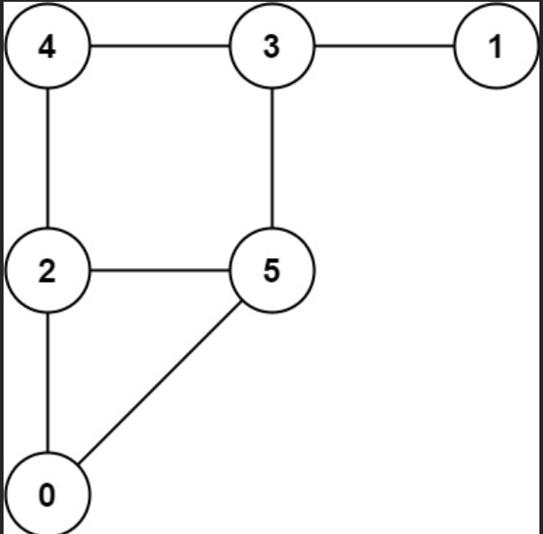
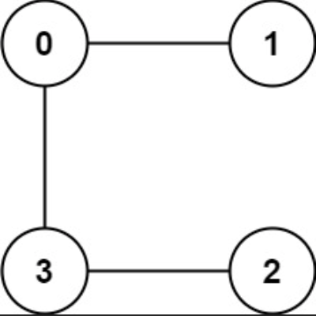

# Cat and Mouse

A game on an undirected graph is played by two players, Mouse and Cat, who alternate turns.

The graph is given as follows: graph[a] is a list of all nodes b such that ab is an edge of the graph.

The mouse starts at node 1 and goes first, the cat starts at node 2 and goes second, and there is a hole at node 0.

During each player's turn, they must travel along one edge of the graph that meets where they are.  For example, if the 
Mouse is at node 1, it must travel to any node in graph[1].

Additionally, it is not allowed for the Cat to travel to the Hole (node 0).

Then, the game can end in three ways:

- If ever the Cat occupies the same node as the Mouse, the Cat wins.
- If ever the Mouse reaches the Hole, the Mouse wins.
- If ever a position is repeated (i.e., the players are in the same position as a previous turn, and it is the same 
- player's turn to move), the game is a draw.
Given a graph, and assuming both players play optimally, return

- 1 if the mouse wins the game,
- 2 if the cat wins the game, or
- 0 if the game is a draw.

## Examples



```text
Input: graph = [[2,5],[3],[0,4,5],[1,4,5],[2,3],[0,2,3]]
Output: 0
```


```text
Input: graph = [[1,3],[0],[3],[0,2]]
Output: 1
```

## Constraints

- 3 <= graph.length <= 50
- 1 <= graph[i].length < graph.length
- 0 <= graph[i][j] < graph.length
- graph[i][j] != i
- graph[i] is unique.
- The mouse and the cat can always move. 

## Related Topics

- Math
- Dynamic Programming
- Graph
- Topological Sort
- Memoization
- Game Theory

## Solution

### Minimax/Percolate from Resolved States

The state of the game can be represented as (m, c, t) where m is the location of the mouse, c is the location of the 
cat, and t is 1 if it is the mouse's move, else 2. Let's call these states nodes. These states form a directed graph: 
the player whose turn it is has various moves which can be considered as outgoing edges from this node to other nodes.

Some of these nodes are already resolved: if the mouse is at the hole (m = 0), then the mouse wins; if the cat is where
the mouse is (c = m), then the cat wins. Let's say that nodes will either be colored MOUSE, CAT, or DRAW depending on
which player is assured victory.

As in a standard minimax algorithm, the Mouse player will prefer MOUSE nodes first, DRAW nodes second, and CAT nodes
last, and the Cat player prefers these nodes in the opposite order.

#### Algorithm

We will color each node marked DRAW according to the following rule. (We'll suppose the node has node.turn = Mouse: the
other case is similar.)

- ("Immediate coloring"): If there is a child that is colored MOUSE, then this node will also be colored MOUSE.
- ("Eventual coloring"): If all children are colored CAT, then this node will also be colored CAT.

We will repeatedly do this kind of coloring until no node satisfies the above conditions. To perform this coloring 
efficiently, we will use a queue and perform a bottom-up percolation:

- Enqueue any node initially colored (because the Mouse is at the Hole, or the Cat is at the Mouse.)
- For every node in the queue, for each parent of that node:
  - Do an immediate coloring of parent if you can.
  - If you can't, then decrement the side-count of the number of children marked DRAW. If it becomes zero, then do an 
    "eventual coloring" of this parent. 
  - All parents that were colored in this manner get enqueued to the queue.

#### Proof of Correctness

Our proof is similar to a proof that minimax works.

Say we cannot color any nodes any more, and say from any node colored CAT or MOUSE we need at most K moves to win. If
say, some node marked DRAW is actually a win for Mouse, it must have been with >K moves. Then, a path along optimal play
(that tries to prolong the loss as long as possible) must arrive at a node colored MOUSE
(as eventually the Mouse reaches the Hole.) Thus, there must have been some transition DRAW→MOUSE along this path.

If this transition occurred at a node with node.turn = Mouse, then it breaks our immediate coloring rule. If it occured
with node.turn = Cat, and all children of node have color MOUSE, then it breaks our eventual coloring rule. If some child
has color CAT, then it breaks our immediate coloring rule. Thus, in this case node will have some child with DRAW, which
breaks our optimal play assumption, as moving to this child ends the game in >K moves, whereas moving to the colored
neighbor ends the game in ≤K moves.

#### Complexity Analysis

##### Time Complexity

O(N^3), where N is the number of nodes in the graph. There are O(N^2) states, and each state has an
outdegree of N, as there are at most N different moves.

##### Space Complexity

O(N^2).
