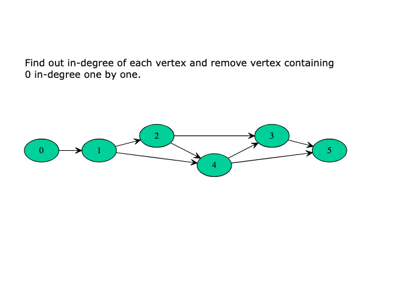
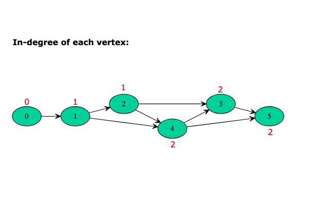
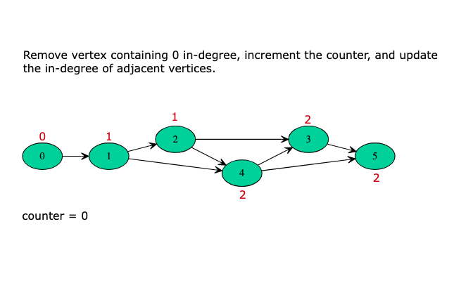
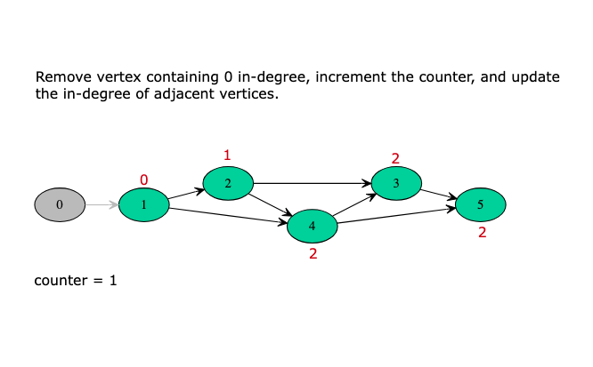
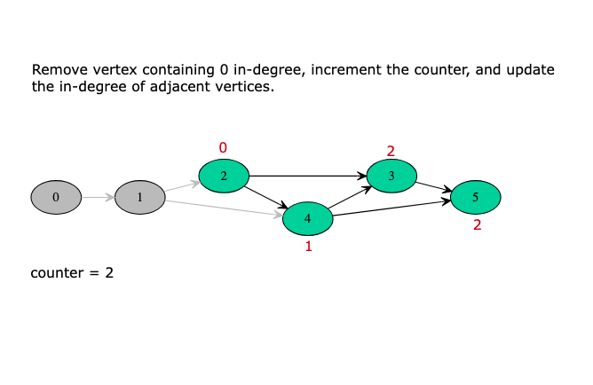
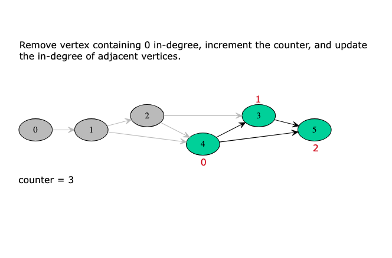
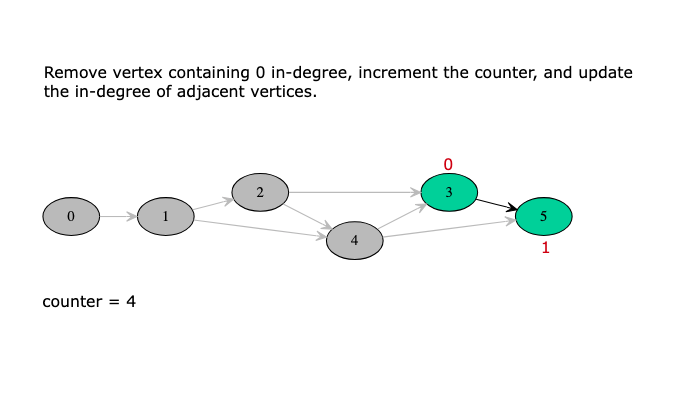
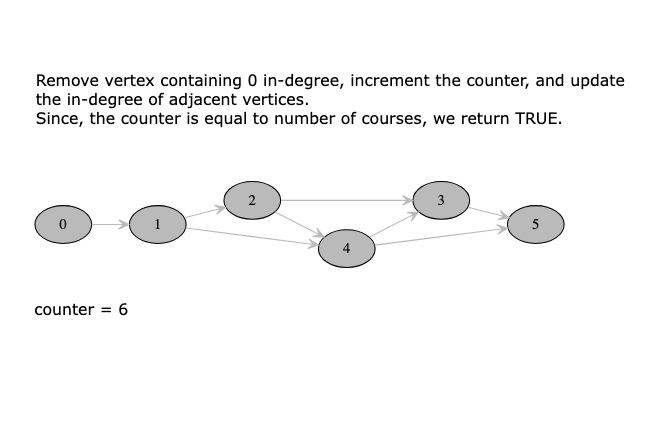

# Course Schedule

There are a total of n courses you have to take labelled from 0 to n - 1.

Some courses may have prerequisites, for example, if prerequisites[i] = [ai, bi] this means you must take the course bi
before the course ai.

Given the total number of courses numCourses and a list of the prerequisite pairs, return the ordering of courses you
should take to finish all courses.

If there are many valid answers, return any of them. If it is impossible to finish all courses, return an empty array.

Example 1:
```text
Input: numCourses = 2, prerequisites = [[1,0]]
Output: [0,1]
Explanation: There are a total of 2 courses to take. To take course 1 you should have finished course 0. So the correct
course order is [0,1]. 
```

Example 2:
```text
Input: numCourses = 4, prerequisites = [[1,0],[2,0],[3,1],[3,2]]
Output: [0,2,1,3]
Explanation: There are a total of 4 courses to take. To take course 3 you should have finished both courses 1 and 2.
Both courses 1 and 2 should be taken after you finished course 0. So one correct course order is [0,1,2,3]. Another
correct ordering is [0,2,1,3]. 
```

Example 3:
```text
Input: numCourses = 1, prerequisites = []
Output: [0]
```

Example 4:
```text
Input: numCourses = 3, prerequisites = [[1,0],[2,1]]
Output: [0,1,2]
```

Example 5:
```text
Input: numCourses = 3, prerequisites = [[1,0],[2,1],[1,2]]
Output: []
```

Example 6:
```text
Input: numCourses = 5, prerequisites = [[1,0],[2,1],[4,3]]
Output: [0,1,2,3,4]
```

Constraints:

- 1 <= numCourses <= 2000 
- 0 <= prerequisites.length <= numCourses * (numCourses - 1)
- prerequisites[i].length == 2 0 <= ai, bi < numCourses ai != bi All the pairs [ai, bi] are distinct.

---

## Solution 1 Breakdown (Using Depth First Search)

Suppose we are at a node in our graph during the depth first traversal. Let's call this node A.

The way DFS would work is that we would consider all possible paths stemming from A before finishing up the recursion
for A and moving onto other nodes. All the nodes in the paths stemming from the node A would have A as an ancestor. The
way this fits in our problem is, all the courses in the paths stemming from the course A would have A as a prerequisite.

Now we know how to get all the courses that have a particular course as a prerequisite. If a valid ordering of courses
is possible, the course A would come before all the other set of courses that have it as a prerequisite. This idea for
solving the problem can be explored using depth first search. Let's look at the pseudo-code before looking at the formal
algorithm.

➔ let S be a stack of courses ➔ function dfs(node)
➔ for each neighbor in adjacency list of node ➔ dfs(neighbor)
➔ add node to S Let's now look at the formal algorithm based on this idea.

Algorithm

Initialize a stack S that will contain the topologically sorted order of the courses in our graph. Construct the
adjacency list using the edge pairs given in the input. An important thing to note about the input for the problem is
that a pair such as [a, b] represents that the course b needs to be taken in order to do the course a. This implies an
edge of the form b ➔ a. Please take note of this when implementing the algorithm. For each of the nodes in our graph, we
will run a depth-first search in case that node was not already visited in some other node's DFS traversal. Suppose we
are executing the depth first search for a node N. We will recursively traverse all of the neighbors of node N which
have not been processed before. Once the processing of all the neighbors is done, we will add the node N to the stack.
We are making use of a stack to simulate the ordering we need. When we add the node N to the stack, all the nodes that
require the node N as a prerequisites (among others) will already be in the stack. Once all the nodes have been
processed, we will simply return the nodes as they are present in the stack from top to bottom.

## Complexity Analysis

### Time Complexity 

O(V+E) where V represents the number of vertices and E represents the number of edges. Essentially we iterate through 
each node and each vertex in the graph once and only once.

### Space Complexity: 

O(V+E).

We use the adjacency list to represent our graph initially. The space occupied is defined by the number of edges because
for each node as the key, we have all its adjacent nodes in the form of a list as the value. Hence, O(E)

Additionally, we apply recursion in our algorithm, which in worst case will incur O(E) extra space in the function
call stack.

To sum up, the overall space complexity is O(V+E).

---

## Solution 2 Breakdown

Initialize the hash map with the vertices and their children. We’ll use another hash map to keep track of the number of 
in-degrees of each vertex. Then we’ll find the source vertex (with 0 in-degree) and increment the counter. Retrieve the 
source node’s children and add them to the queue. Decrement the in-degrees of the retrieved children. We’ll check 
whether the in-degree of the child vertex becomes equal to zero, and we increment the counter. Repeat the process until 
the queue is empty.

> Note: The in-degree is the number of edges coming into a vertex in a directed graph.

The primary purpose of finding a vertex with 0 in-degree is to find a course with a pre-requisite count of 0. When we 
take a course, say a (that is the pre-requisite of another course, say b), we’ll decrement the in-degree of b by 1, and 
if the in-degree count becomes 0, we can say that the b’s pre-requisites have been completed.

The images below illustrate the algorithm above, where num_courses = 6:











### Time Complexity

In the algorithm above, each course will become a source only once, and each edge will be accessed and removed once. 
Therefore, the above algorithm’s time complexity will be O(V+E), where V is the total number of vertices and E is the 
total number of edges in the graph.

### Space Complexity

The space complexity will be O(V+E) because we’re storing all of the edges for each vertex in an adjacency list.
