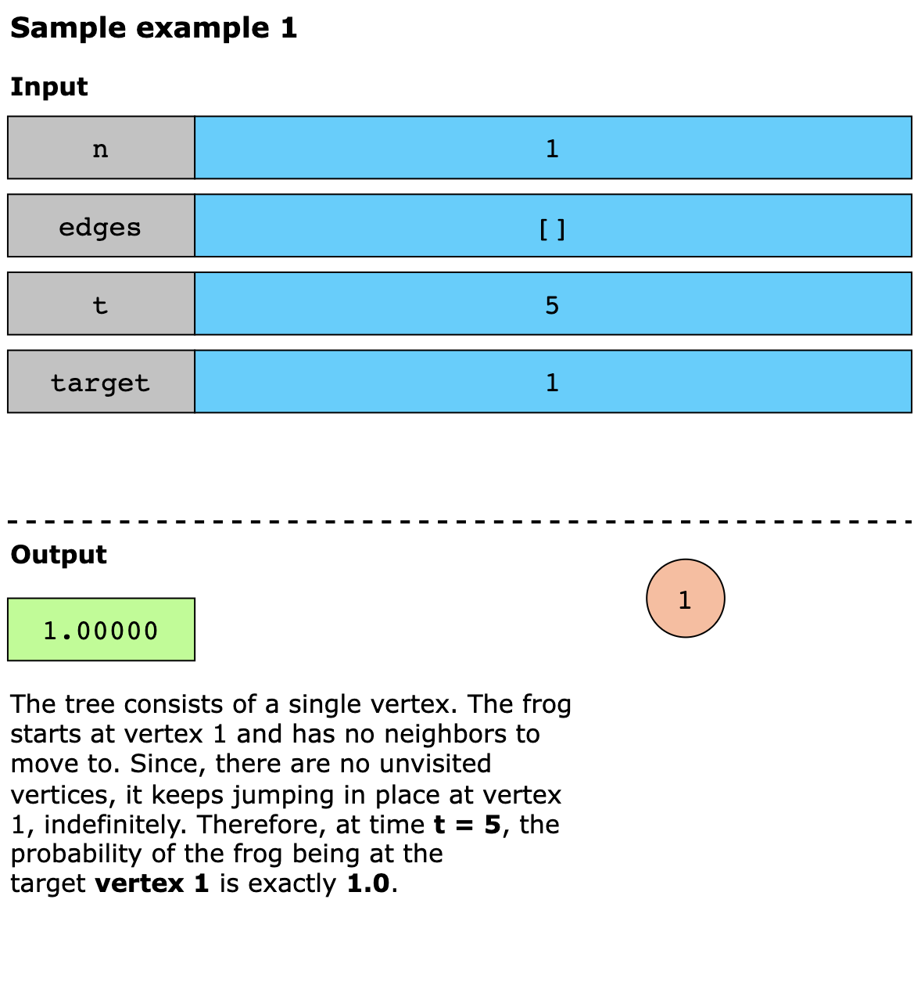
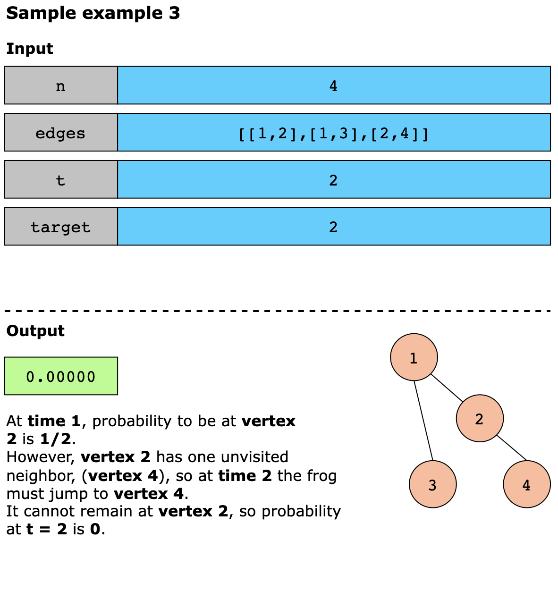
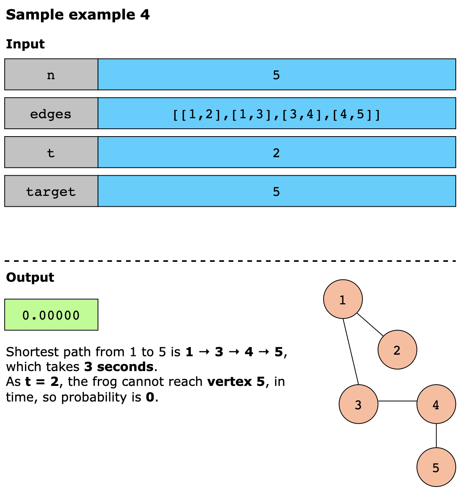
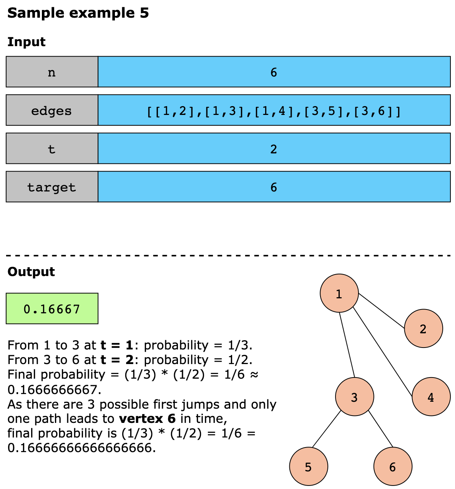
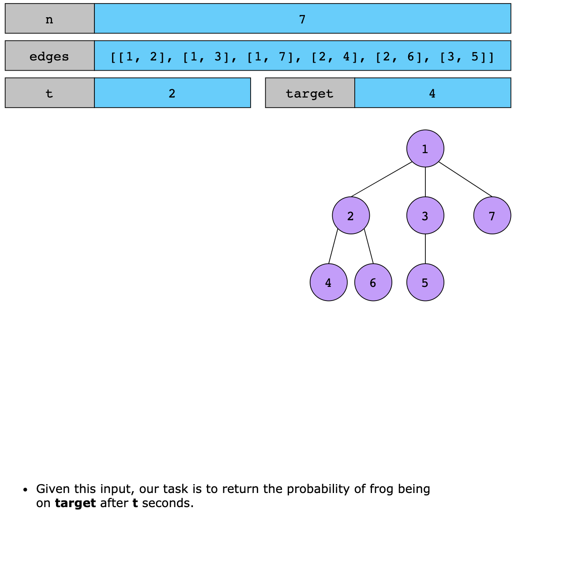
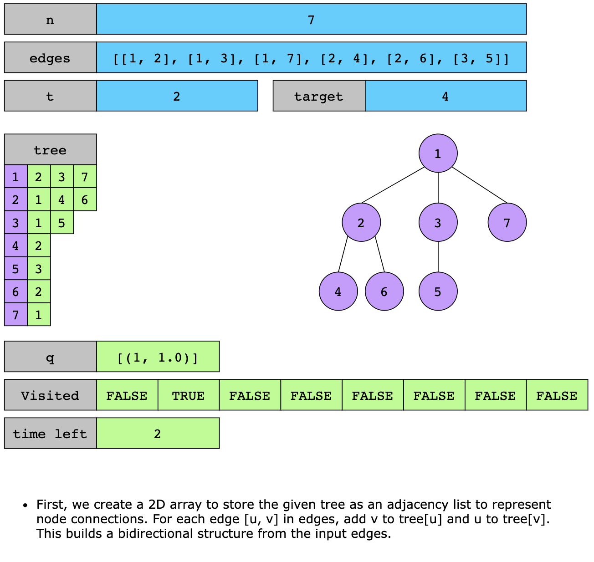
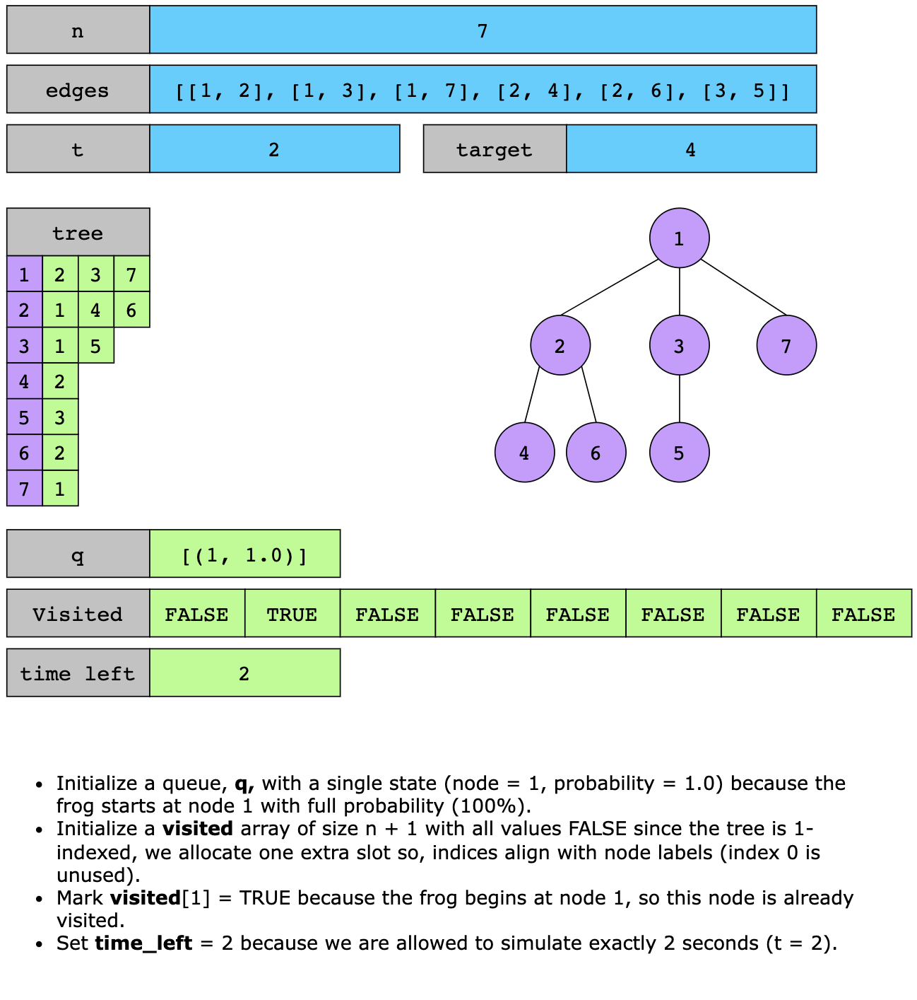
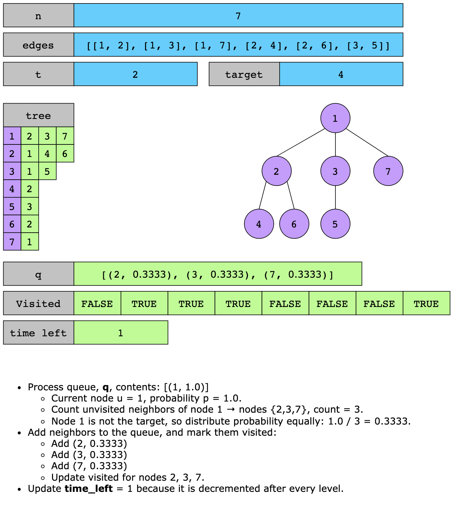
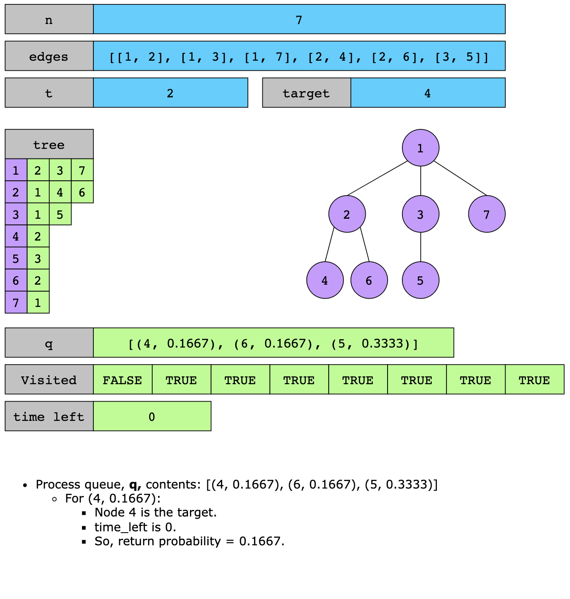

# Frog Position After T Seconds

You are given an undirected tree with n vertices labeled from 1 to `n`. A frog starts at vertex 1, at time 0, and makes 
one move per second.

At each step, the frog follows these rules:

1. Move to an unvisited neighbor:
   If the frog has unvisited neighbors, it jumps to one of them, chosen uniformly at random (equal probability for each
   choice).

2. No revisiting: The frog can not jump back to a vertex it has already visited.
3. Stay when stuck: The frog will keep jumping at its current vertex if there are no unvisited neighbors.

The tree is represented as an array of edges, where `edges[i] = [ai, bi]` means an edge connecting the vertices 
`ai` and `bi`. Your task is to return the probability that, after t seconds, the frog is on the vertex target.

Constraints

- 1 ≤ n ≤ 100
- `edges.length` == `n − 1`
- edges[i].length == 2
- 1 ≤ ai, bi ≤ n
- 1 ≤ t ≤ 50
- 1 ≤ target ≤ n

## Examples

## Solution

The essence of the solution lies in simulating the frog’s movement with a level-order BFS, where each level is one 
second. At any second, if the frog is on a node with unvisited neighbors, it must jump to one of them at random, all 
with the same chance, because it cannot revisit nodes, only unvisited neighbors are considered. If a node has no 
unvisited neighbors, the frog stays there for the remaining time.

There are three cases for the `target`:

- The frog arrives exactly at second `t` → that chance is the answer.
- The frog arrives earlier, and the `target` has no unvisited neighbors → it stays, so that chance still counts at time `t`.
- The frog arrives earlier, but the `target` does have unvisited neighbors and time remains → it must leave, so that 
  chance at time t is 0.

Using the intuition above, we implement the algorithm as follows:

1. Build an adjacency list `tree` from `edges` to quickly look up all neighbors of any node.
2. Initialize a queue with a single state (node = 1, probability = 1.0), a visited array of size n + 1 with visited[1] = 
true, and set time_left = t.
3. While the queue is not empty and time_left >= 0:
   - Record the current level_size as this represents all the frog’s positions at this second.
   - Repeat level_size times:
     - Pop (u, p) from the queue.
     - Count `cnt = number` of unvisited neighbors of u (check visited[v] == false for each neighbor v).
     - If u == target:
       - If time_left == 0, return p because the frog arrived exactly on time.
       - If cnt == 0, return p because the frog arrived earlier and can not move, so it remains on the target.
       - Otherwise if time_left > 0 and cnt > 0, then return 0.0 because the frog must leave before the time runs out.
     - If cnt > 0:
       - For each unvisited neighbor v of u:
         - Mark visited[v] = true.
         - Enqueue (v, p / cnt), since the probability is split equally among all unvisited neighbors.
   - Decrement time_left by 1.
4. If the loop ends without returning (the frog never satisfied the target conditions in time), return 0.0.

Let’s look at the following illustration to get a better understanding of the solution:

### Time complexity

The time complexity of this solution is `O(n)`. Building the adjacency list takes linear time in a tree (E = n − 1). 
The BFS then visits each node at most once and inspects each edge at most twice. Even if t is larger than the tree’s 
depth, the traversal stops once the queue is empty, so the work does not grow with t.

### Space complexity

The space complexity is `O(n)`. The adjacency list requires O(n) space, the visited array is O(n), and the BFS queue 
can hold up to O(n) nodes in the worst case.
