# Last Day Where You Can Still Cross

There is a 1-based binary matrix where 0 represents land and 1 represents water. You are given integers row and col
representing the number of rows and columns in the matrix, respectively.

> A 1-based matrix has an indexing that starts from 1 instead of 0, and a binary matrix contains only binary values,
> i.e., 0 and 1. Therefore, a 1-based binary matrix is a matrix containing only 0s and 1s, whose indexes (for both rows
> and columns) start from 1.

Initially on day 0, the entire matrix is land. However, each day a new cell becomes flooded with water. You are given a
1-based 2D array cells, where `water_cells[i] = [ri, ci]` represents that on the `ith` day, the cell on the rith row and 
`cith` column (1-based coordinates) will be covered with water (i.e., changed to 1).

You want to find the last day that it is possible to walk from the top to the bottom by only walking on land cells. You
can start from any cell in the top row and end at any cell in the bottom row. You can only travel in the four cardinal
directions (left, right, up, and down).

Return the last day where it is possible to walk from the top to the bottom by only walking on land cells.

> Note: You can start from any cell in the top row, and you need to be able to reach just one cell in the bottom row
> for it to count as a crossing.

## Constraints

- 2 <= row, col <= 2 * 10^4
- 4 <= row * col <= 2 * 10^4
- `water_cells.length` == row * col
- 1 <= `ri` <= row
- 1 <= `ci` <= col
- All the values of `water_cells` are unique.

## Examples

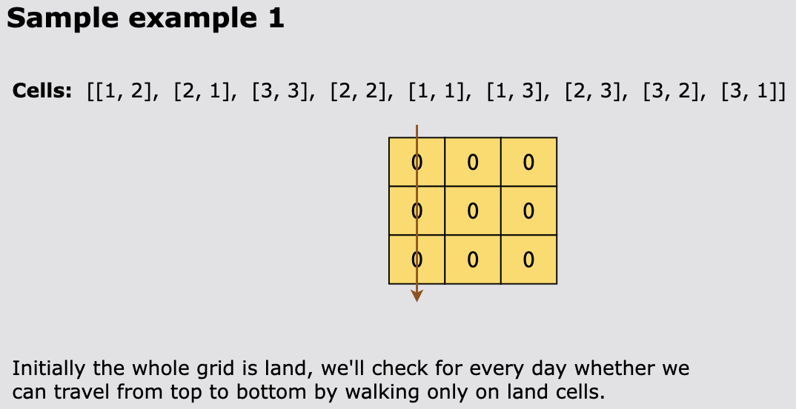
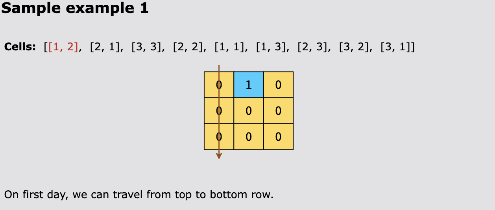
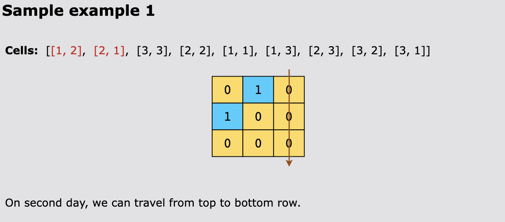
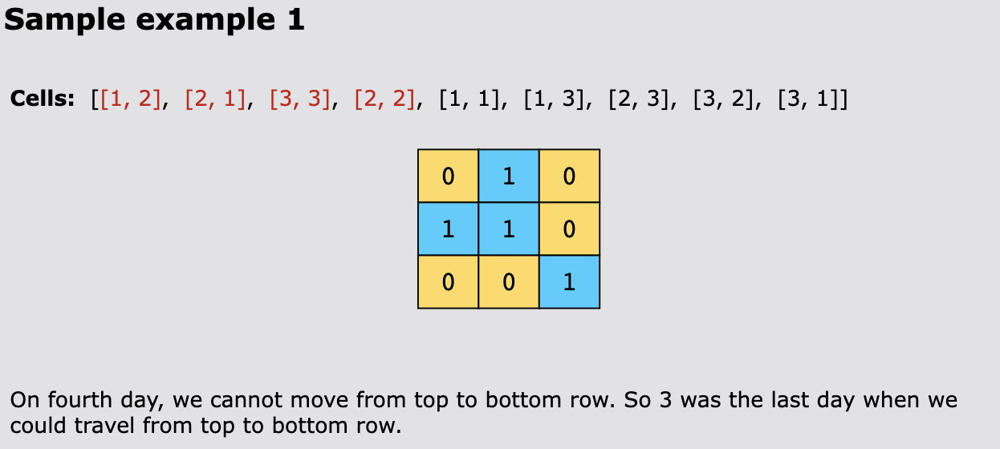
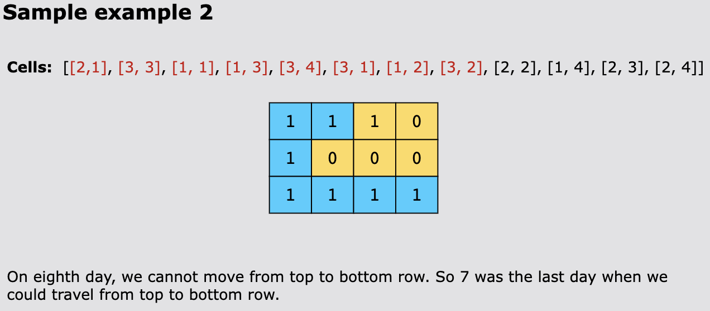

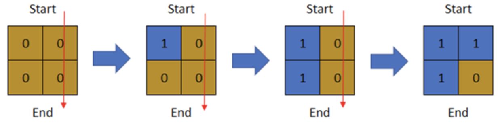

```text
Input: row = 2, col = 2, cells = [[1,1],[2,1],[1,2],[2,2]]
Output: 2
Explanation: The above image depicts how the matrix changes each day starting from day 0.
The last day where it is possible to cross from top to bottom is on day 2.
```

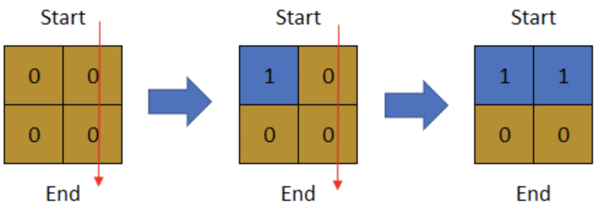

```text
Input: row = 2, col = 2, cells = [[1,1],[1,2],[2,1],[2,2]]
Output: 1
Explanation: The above image depicts how the matrix changes each day starting from day 0.
The last day where it is possible to cross from top to bottom is on day 1.
```

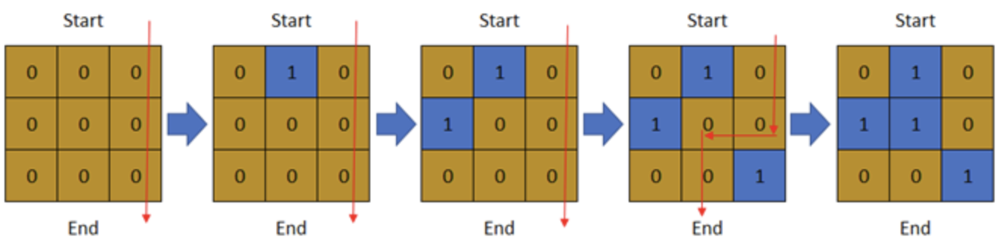

```text
Input: row = 3, col = 3, cells = [[1,2],[2,1],[3,3],[2,2],[1,1],[1,3],[2,3],[3,2],[3,1]]
Output: 3
Explanation: The above image depicts how the matrix changes each day starting from day 0.
The last day where it is possible to cross from top to bottom is on day 3.
```

## Topics

- Array
- Binary Search
- Depth-First Search
- Breadth-First Search
- Union-Find
- Matrix

## Hints

- What graph algorithm allows us to find whether a path exists?
- Can we use binary search to help us solve the problem?

## Solution(s)

1. [Union Find](#union-find)
2. [Union Find on Land Cells](#union-find-on-land-cells)
3. [Breadth-First Search with Binary Search](#binary-search--bfs)
4. [Depth-First Search with Binary Search](#dfs-with-binary-search)

### Union Find

Our aim is to find the maximum number of days where we can cross a 1-based binary matrix, let’s say, matrix, while it is
being flooded one cell at a time. We need to cross matrix from top to bottom using a continuous path consisting only of
land cells. If, at any time, we encounter a series of connected water cells from the leftmost side of the matrix to its
rightmost side that blocks our continuous path of land cells, we won’t be able to cross the matrix.

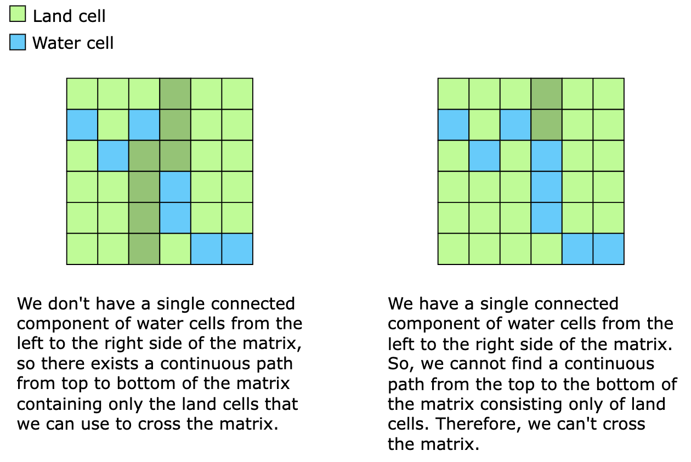

In our solution, we’ll look for a single component of connected water cells from the left to the right of matrix, on
each day. Once encountered, we’ll return this day as the last day where we can still cross matrix.

> Note: We are not subtracting 1 from our final answer, because, in the context of this problem, we are starting from
> day 0, so we don’t need to adjust the value of days.

Since we are required to find a series of connected water cells, we can consider the cells in the matrix to be vertexes
in a graph—each vertex connected to its neighbors—and then try to identify connected components consisting only of water
cells using union find. The union find pattern is designed to group elements into sets based on a specified property.
The pattern uses a disjoint set data structure, such as an array, to keep track of which set each element belongs to. In
our case, there are two properties that define whether any two cells should be grouped together:

1. They both need to be water cells.
2. There must be a path between them consisting only of water cells, such that the movement from one water cell to its
   neighboring water cell is along one of eight directions: up, down, left, right, up-left, up-right, down-left, and
   down-right.

> Note: As per the problem statement, there is a restriction on the connectivity of land cells. A valid path of land
> cells will only contain land cells connected to one of its four neighboring land cells, not eight. However, when
> checking whether two water cells are connected, we need to take into account eight directions, as explained below.

The most obvious way to block all paths from top to bottom is for all the cells in any row to be flooded. For example,
in the matrix below, flooding the second row does the job.

However, this isn’t the only way to stop all the paths from the top row to the bottom.

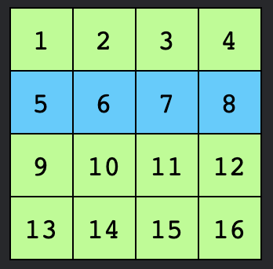

Focusing on each column individually, we might think that flooding at least one cell in each column would be enough,
yet as we can see in the matrix below, this doesn’t quite work. There are two paths to the bottom row from cell 
10: via cell 12 or via cell 9.

We have blocked the path to cell 16 by flooding cell 12, and we can similarly flood cell 9 to block the path to cell 13.
Here, the water cells 12 and 15 are neighbors, not along a cardinal direction, but along an ordinal or intercardinal
direction. The same applies to cells 9 and 14.

> Ordinal or inter-cardinal directions mean Up-left, Up-right, Down-left, and Down-right

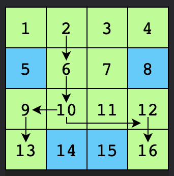

This illustrates why, when checking whether two water cells are connected, we need to check in eight directions: up,
down, left, right, up-left, up-right, down-left, and down-right.

Now that we have understood why the connectivity of water cells needs to be checked along eight directions, we can use
the disjoint set data structure to track which water cells are connected, i.e., which water cells belong to the same
connected component.

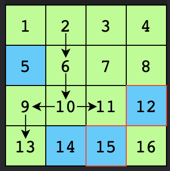

To use the union find pattern, we create and use the UnionFind class that has two primary methods:

- `union(node1, node2)`: This merges the sets of node1 and node2 into one by changing the representative of node1 to the
  representative of node2.

- `find(node)`: This finds and returns the representative of the set that contains the given node. It uses path
  compression, which speeds up the subsequent find operations by changing the parent of the visited node to the
  representative of the subset. This reduces the length of the path of that node to the representative, ensuring we
  don’t have to traverse all the intermediate nodes on future find operations.

> Note: In terms of the tree representation of disjoint set union (DSU) data structure, a representative is an element
> in each set that resides at the root of the tree and represents that specific set.

Our solution will first initialize a variable, <code>day</code>, to 0, since we are starting from day 0. Next, we’ll 
create a rows×cols grid, called <code>matrix</code>, with all cells initialized to 0s (since none of the cells have been
flooded on day 0). Then, proceeding from day 1, we’ll start filling the <code>matrix</code> with water cells as per the
given <code>water_cells</code> array. The value in each cell in <code>matrix</code>, identified by the current entry in
<code>water_cells</code>, is changed from 0 to 1. For example, if we are on day 2 and the value of <code>water_cells[2]</code>
is 1, we will set the value of <code>matrix[1][2]</code> to 1, indicating that it is now flooded with water.</p>
<p>Since we are solving this problem using the union find pattern, we initialize a <code>UnionFind</code> object, which 
results in the creation of a custom disjoint set data structure: an array, <code>reps</code>, of size <code>(rows * cols)
+ 2</code>. The array <code>reps</code> is essentially a 1D array representation of <code>matrix</code>. The two
additional elements in <code>reps</code> represent two extra virtual nodes—one at the leftmost side of the matrix and
the other at the rightmost side of the matrix. To operate this mapping, we use a helper function, <code>find_index()</code>,
which converts the coordinates of a cell (i,j)(i, j)(i,j) in <code>matrix</code> to its corresponding unique index in
<code>reps</code>. Initially, every element is its own representative, so the value at every index in <code>reps</code> 
is the index itself. During the execution of the <code>union</code> operation, when two elements are united, their
representatives are set to the same value.</p>
<p>We use the virtual nodes to efficiently check whether the first and the last columns of <code>matrix</code> are
connected. In simpler words, these nodes help identify whether we have a series of connected water cells from the left
to the right side of <code>matrix</code>. If a water cell is present in the first column of <code>matrix</code>, we use
the <code>union</code> operation to set the left virtual node as its representative.  Similarly, if a water cell is in
the last column, we use the <code>union</code> operation to set the right virtual node as its representative.</p>

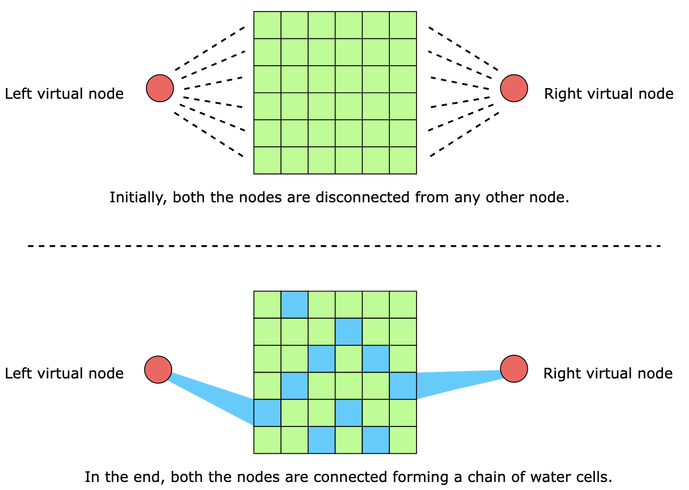

Every day, we flood another cell in the matrix, changing its value to 1. At this point, we check whether any of its 
eight neighboring cells is also a water cell. If it is, we use the union operation to connect it with the recently
flooded cell. The union operation will connect both the cells by making their representatives the same in the array,
reps. As mentioned above, if the recently flooded cell is at the left or right boundary of matrix, it will connect with
the corresponding virtual node.

Next, we check to see if the flooding of this cell has created a continuous component connecting the leftmost side of
matrix with its rightmost side. For this purpose, we use the find operation to check whether the left and right virtual
nodes are connected, that is, whether or not they have the same representative.

If the two sides are connected, we can no longer cross the matrix from top to bottom, and the current value of day is
our answer. Otherwise, we increment the value of day and repeat the procedure with the next cell in water_cells.

#### Time Complexity

The time complexity of this solution is O((m⋅n)⋅α(m⋅n)), where m represents the number of rows in the matrix, n represents
the number of columns in the matrix, and α is the inverse Ackermann function that grows very slowly and whose maximum
value for all practical purposes is 4.

The initialization of the UnionFind object takes O(m⋅n) time, since it involves creating an array of size (m⋅n)+2 and
initializing every element to a unique index.

There may be, in the worst case, O(m⋅n) entries in water_cells. For each entry, there can be a maximum of eight union
operations to merge the flooded cell with adjacent water cells, and each union operation takes O(α(m⋅n)) time on average.

Therefore, the overall time complexity of this solution is O((m⋅n)⋅α(m⋅n)).

#### Space Complexity

The space complexity of the solution above is O(m⋅n).

### Union Find on Land Cells

This is similar to the solution presented above. Here, we start at the ending state of matrix with all the cells flooded.
Then, moving from the end of the water_cells array towards its start, we start rolling back the flooding (one cell at a
time), that is, changing that cell’s value from 1 to 0. After changing a cell from water to land, we check the land cells
adjacent to it in all four cardinal directions, and if any are found, we connect them to the recently reverted cell. To
check whether we got a single connected component of land cells from top to bottom of matrix, we keep two virtual
nodes—one at the top and the other at the bottom. The moment we find these virtual nodes connected to each other, we’ll
return this day as the output.

The time and space complexity of this solution is the same as the solution above.

### Binary Search & BFS

The solution implements binary search combined with BFS to find the last day we can cross from top to bottom.
We need to find the last day where crossing is possible. To use the standard "find first true" template, we reframe the 
problem: find the first day where crossing becomes impossible, then return first_true_index - 1.

The feasible function is defined as: feasible(day) = !canCross(day) (returns true when crossing is NOT possible).

Algorithm Steps:

- Initialize search bounds:
  - `left = 1, right = row * col`
  - `first_true_index = -1` (tracks the first day where crossing becomes impossible)
- Binary search loop (`while left <= right`):
  - Calculate `mid = (left + right) // 2`
  - If `!canCross(mid)` is true (crossing impossible on day mid):
    - Save `first_true_index = mid`
    - Search for an earlier impossible day: `right = mid - 1`
  - If `!canCross(mid)` is false (crossing still possible):
    - Need a later day: `left = mid + 1`
- Return the last crossable day: `first_true_index - 1`

The `canCross` Helper Function (BFS):

For each candidate day k, check if crossing is possible:

- Build the grid state: Create a 2D grid, mark the first k cells as water (1). 
- BFS from top row: Initialize queue with all land cells from row 0. 
- BFS exploration: For each cell, check if we've reached the bottom row. Explore all 4 directions, adding unvisited land
  cells to the queue. 
- Return result: True if we reach bottom row, False otherwise.

#### Time Complexity

`O(m × n × log(m × n))`

The algorithm uses binary search on the range [1, m × n], which requires O(log(m × n)) iterations. For each binary search
iteration, the check function is called, which performs a BFS traversal on an m × n grid. The BFS visits each cell at
most once, taking O(m × n) time. Therefore, the overall time complexity is O(m × n × log(m × n)).

#### Space Complexity: O(m × n)

The space complexity is dominated by:

- The grid g created in the check function: O(m × n)
- The queue q used for BFS, which in the worst case can contain all cells: O(m × n)
- The cells array is given as input and not counted in auxiliary space

Therefore, the total space complexity is O(m × n).

### DFS with Binary Search

This solution is similar to the one we just discussed, except it uses DFS instead of BFS. On each day, for each cell in
the top row of matrix, we explore its unvisited neighboring land cells recursively. We continue doing this until we
reach the bottom row, or until all reachable land cells in matrix have been visited. To avoid revisiting the same cell,
we just mark the cell as visited.

The time and space complexity of this solution is the same as that of the BFS with binary search.
