# Minimum Cost to Make at Least One Valid Path in a Grid

> Understand how to determine the minimum total cost to ensure a valid path from the top-left to bottom-right of a grid
> with directional signs. Learn to analyze and modify cell directions efficiently to navigate grid boundaries using
> graph theory principles.

Given an m x n grid. Each cell of the grid has a sign pointing to the next cell you should visit if you are currently
in this cell. The sign of grid[i][j] can be:

- 1 which means go to the cell to the right. (i.e go from grid[i][j] to grid[i][j + 1])
- 2 which means go to the cell to the left. (i.e go from grid[i][j] to grid[i][j - 1])
- 3 which means go to the lower cell. (i.e go from grid[i][j] to grid[i + 1][j])
- 4 which means go to the upper cell. (i.e go from grid[i][j] to grid[i - 1][j])

> Notice that there could be some signs on the cells of the grid that point outside the grid.

You will initially start at the upper left cell (0, 0). A valid path in the grid is a path that starts from the upper
left cell (0, 0) and ends at the bottom-right cell (m - 1, n - 1) following the signs on the grid. The valid path does
not have to be the shortest.

You can modify the sign on a cell with cost = 1. You can modify the sign on a cell one time only.

Return the minimum cost to make the grid have at least one valid path.

## Constraints

- m == grid.length
- n == grid[i].length
- 1 <= m, n <= 100
- 1 <= grid[i][j] <= 4

## Examples

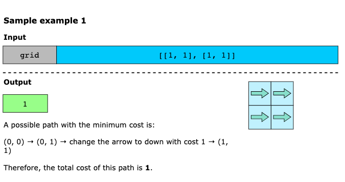
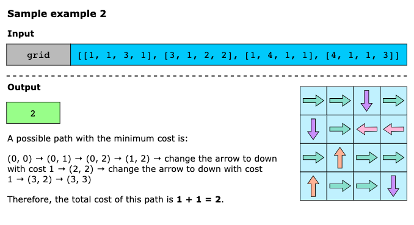
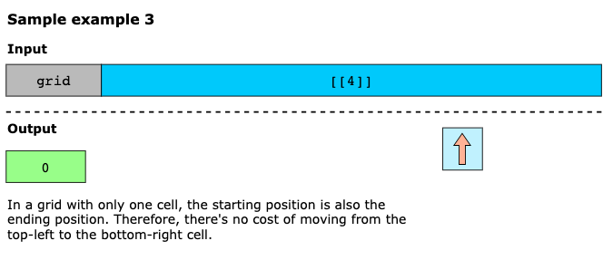


```text
Input: grid = [[1,1,1,1],[2,2,2,2],[1,1,1,1],[2,2,2,2]]
Output: 3
Explanation: You will start at point (0, 0).
The path to (3, 3) is as follows. (0, 0) --> (0, 1) --> (0, 2) --> (0, 3) change the arrow to down with cost = 1 --> 
(1, 3) --> (1, 2) --> (1, 1) --> (1, 0) change the arrow to down with cost = 1 --> (2, 0) --> (2, 1) --> (2, 2) --> 
(2, 3) change the arrow to down with cost = 1 --> (3, 3)
The total cost = 3.
```

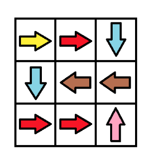

```text
Input: grid = [[1,1,3],[3,2,2],[1,1,4]]
Output: 0
Explanation: You can follow the path from (0, 0) to (2, 2).
```

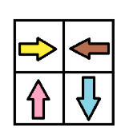

```text
Input: grid = [[1,2],[4,3]]
Output: 1
```

## Topics

- Array
- Breadth-First Search
- Graph Theory
- Heap (Priority Queue)
- Matrix
- Shortest Path

## Hints

- Build a graph where grid[i][j] is connected to all the four side-adjacent cells with weighted edge. the weight is 0 if 
  the sign is pointing to the adjacent cell or 1 otherwise.
- Do BFS from (0, 0) visit all edges with weight = 0 first. the answer is the distance to (m -1, n - 1).

## Solutions

1. [Dynamic Programming](#dynamic-programming)
2. [Dijkstra's Algorithm](#dijkstras-algorithm)
3. [0-1 Breadth-First Search](#0-1-breadth-first-search)
4. [Depth-First Search and Breadth First Search](#depth-first-search--breadth-first-search)


### Dynamic Programming

Let’s consider a single cell (row, col) in the middle of the grid. To reach this cell, we can come from one of its four
neighbors: above (row - 1, col), left (row, col - 1), below (row + 1, col), or right (row, col + 1). The cost to reach
this cell depends on two factors: the cost of reaching one of its neighbors and the cost of moving from that neighbor to
(row, col). This leads us to the conclusion that if we can compute the minimum cost to reach its neighbors, we can
determine the minimum cost to reach the current cell as well.

This dependency on neighboring cells suggests a dynamic programming approach. Initially, it might seem logical to move
right and down from the top-left corner towards the bottom-right corner, filling the grid as we go. However, this
problem is more complex because paths aren’t restricted to just right or down movements. In fact, a more cost-effective
path might involve going left or up, depending on the direction changes needed.

To solve this, we create a grid minChanges to store the minimum cost to reach each cell. Initially, we set all cells to
infinity except for the starting cell (0, 0), which starts at 0 because there’s no cost to begin there.

To find the minimum cost path, we use a two-pass system that repeats until we can't find any better paths:

1. **Forward Pass**: Starting from the top-left corner, we move towards the bottom-right corner. For each cell, we
   check the cost of reaching it from its neighbors above or to the left. If the neighbor’s direction naturally points
   to the current cell, there’s no additional cost; otherwise, it costs 1 to change direction. Using this information,
   we update the minimum cost for the current cell.

2. **Backward Pass**: Starting from the bottom-right corner, we move back towards the top-left corner. This pass
   considers neighbors below or to the right. It’s particularly useful for uncovering paths where a roundabout route
   (moving up or left) results in a lower cost than a direct one.

After each pass, we check if any cell’s minimum cost has changed. If not, it means we’ve found the optimal solution.
Since the cost of a cell can only decrease with each iteration and cannot drop below 0, this process is guaranteed to
converge.

Finally, the value in the bottom-right cell of the minChanges grid represents the minimum cost to create a valid path
from the top-left to the bottom-right corner.

Algorithm:

- Initialize variables numRows and numCols to store the number of rows and columns in the input grid.
- Create a 2-D array minChanges with dimensions numRows * numCols to track the minimum changes needed to reach each cell.
- Initialize all cells in the minChanges array to the maximum possible integer value.
- Set the value of minChanges[0][0] to 0 since it's the starting position.
- Enter an infinite loop that will continue until convergence is reached.
  - Create a 2-D array prevState to store the previous state of minChanges for comparison.
  - Copy the current state of minChanges into prevState.
  - Begin the forward pass through the grid:
    - For each cell, examine its neighbors from above and left 
    - Update the minChanges value based on:
      - Whether the neighbor naturally points to the current cell (cost is 0). 
      - Or needs to be changed to point to the current cell (cost is 1).
  - Begin the backward pass through the grid:
    - For each cell, examine its neighbors from below and right 
    - Apply the same cost calculation logic as in the forward pass.
  - Compare prevState with the current minChanges array:
    - If they are identical, break the loop as convergence is reached.
- Return the value in minChanges[numRows-1][numCols-1], which represents the minimum cost to reach the target cell.

#### Complexity Analysis

Let n be the number of rows and m be the number of columns in the grid.

##### Time Complexity O((n⋅m)^2)

The algorithm has an outer loop that continues until convergence, where k is the number of iterations needed. In each
iteration, we perform a forward pass and a backward pass through the entire grid, each taking O(n⋅m) time. Therefore,
the total time complexity is O(n⋅m⋅k).

The value of k depends on the grid configuration and in the worst case could be proportional to n⋅m, making the
worst-case time complexity O((n⋅m)^2).

##### Space Complexity O(n⋅m)

The algorithm uses two 2D arrays - minChanges and prevState, each of size n×m. No additional space scaling with input
size is needed. Therefore, the total space complexity is O(n⋅m).

### Dijkstra's Algorithm

We start by thinking of the grid as a network of connected points (a graph). Each cell represents a point (node), and
the cells are connected to their neighbors. These connections (edges) have specific costs:

- Cost is 0 if the sign in one cell points directly to its neighbor.
- Cost is 1 in all other cases where we need to change the sign.

This gives us a problem where we need to find the cheapest path through a directed graph, which is exactly what
Dijkstra's algorithm is designed to handle.

With Dijkstra’s algorithm, we use a priority queue to explore cells based on their current cost, ensuring that we always
process the lowest-cost paths first. We also maintain a grid, costGrid, where each cell tracks the cheapest way to reach
that cell from the start. The queue holds cells we are currently exploring, each entry containing three pieces of
information: the total cost so far, and the row and column indices of the cell. The queue is organized such that cells
with the lower cost are processed first, which helps us prioritize more promising paths over more expensive ones.

For each cell we explore, we evaluate all its four neighboring cells. To do this, we calculate the cost to reach the
neighbor by adding the current cost to the cost of moving to the neighbor (either 0 or 1, depending on the sign). If
this new cost is lower than the current recorded cost in costGrid, we’ve found a better path to the neighbor, so we
update the cost in costGrid and add the neighbor to the queue for further exploration.

This process continues until all cells have been explored, and the queue is empty. At this point, the costGrid grid holds
the minimum cost required to reach each cell from the starting cell (top-left corner). Finally, the solution to the
problem is simply the value stored in costGrid at the bottom-right corner of the grid.

Algorithm

- Initialize a 2-D array dirs with four direction vectors representing right, left, down, and up movements.
- Initialize variables numRows and numCols to store the number of rows and columns in the input grid.
- Create a minimum priority queue pq ordered by cost, where each element is a triplet [cost, row, col].
- Add the starting position [0, 0, 0] to the priority queue with initial cost 0.
- Create a 2D array costGrid with dimensions numRows * numCols to track the minimum cost to reach each cell.
- Initialize all cells in the costGrid array to the maximum possible integer value.
- Set the value of costGrid[0][0] to 0 since it's the starting position.
- Enter a loop that continues while the priority queue is not empty:
  - Extract the current cell with minimum cost from the priority queue. 
  - If a better path to this cell has been found, skip processing this cell.
  - For each of the four possible directions:
    - Calculate the new position by adding direction vectors. 
    - Check if the new position is within the grid boundaries. 
    - Calculate the new cost:
      - Add 0 if the current cell naturally points in this direction. 
      - Add 1 if we need to change the direction.
    - If the new cost is less than the previously known cost for the new position:
      - Update the costGrid for the new position. 
      - Add the new position to the priority queue with its cost.
- Return the value in costGrid[numRows-1][numCols-1], which represents the minimum cost to reach the target cell.

#### Complexity Analysis

Let n be the number of rows and m be the number of columns in the grid.

##### Time Complexity O(n⋅m⋅log(n⋅m))

The algorithm uses Dijkstra's algorithm with a priority queue. In the worst case, we might need to visit each cell
multiple times until we find the optimal path, but no more than 4 times per cell (once for each direction). For each
cell, we perform a priority queue operation which takes O(log(n⋅m)) time, where n⋅m is the maximum size of the queue.
Therefore, the total time complexity is O(n⋅m⋅log(n⋅m)).

##### Space Complexity O(n⋅m)

The algorithm uses a priority queue that in the worst case might contain all cells of the grid, taking O(n⋅m) space.
We also maintain the costGrid array of size n×m. Therefore, the total space complexity is O(n⋅m).

### 0-1 Breadth-First Search

Dijkstra's algorithm works well for finding the shortest path, but our problem has a unique feature: the path costs are
either 0 or 1. This is key because any path with only 0-cost edges, no matter how long, will always be better than one
that uses even a single 1-cost edge. Therefore, it makes sense to prioritize exploring 0-cost edges first. Only after all
0-cost edges have been explored, should we move on to the 1-cost edges. This insight leads us to a modification of the
Breadth-First Search (BFS) algorithm, known as 0-1 BFS.

In 0-1 BFS, we adjust the traditional BFS by using a deque (double-ended queue) instead of a regular queue. The deque
allows us to prioritize 0-cost edges more efficiently. Each element of the deque will store the row and column indices
of a cell, and we will maintain a `costGrid` grid to track the minimum cost to reach each cell.

As we visit each cell, we evaluate its four neighboring cells. If moving to a neighbor doesn’t require a sign change
(i.e., the move is a 0-cost move), we add that neighbor to the front of the deque because we want to explore it
immediately. On the other hand, if a sign change is required (making it a 1-cost move), we add the neighbor to the back
of the deque, ensuring it gets explored later, after all the 0-cost moves.

For each neighbor we explore, we calculate the cost to reach it and compare it to the current value in the `costGrid` grid.
If the calculated cost is lower, we update `costGrid` with the new, cheaper value.

Once the BFS traversal completes and all cells have been processed, the minimum cost to reach the bottom-right corner
will be stored in `costGrid`. We return this value as the solution to the problem.

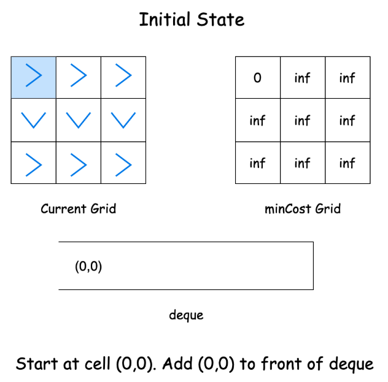
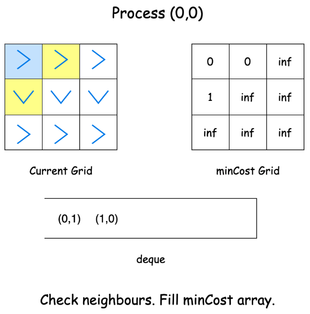
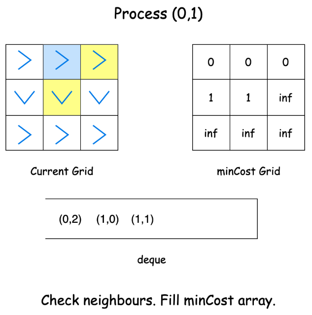
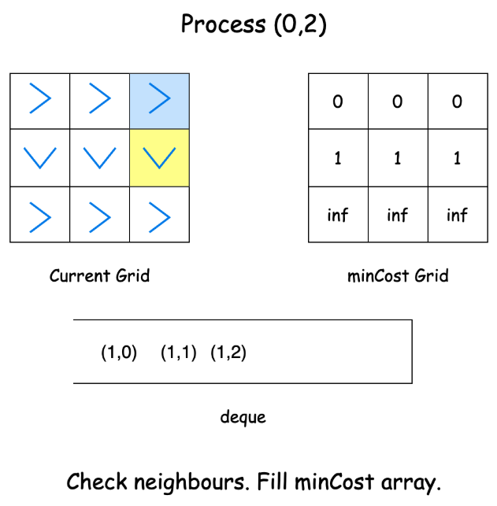
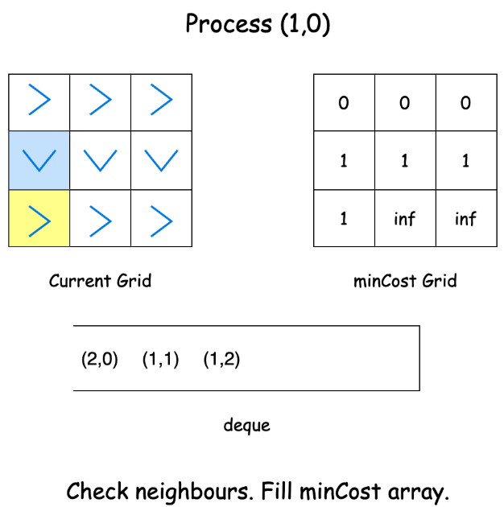
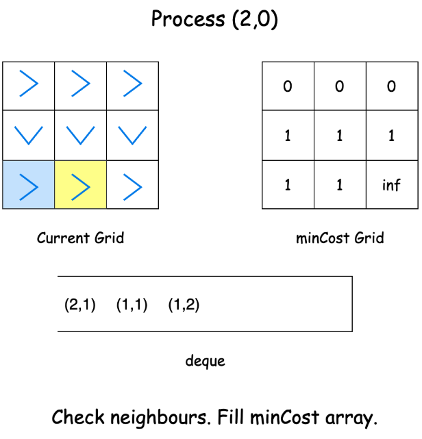
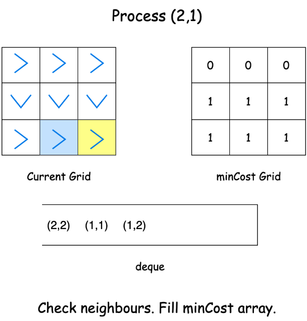


Algorithm

- Initialize a 2D array dirs with four direction vectors representing right, left, down, and up movements.
- Initialize variables numRows and numCols to store the number of rows and columns in the input grid.
- Create a 2D array costGrid with dimensions numRows * numCols to track the minimum cost to reach each cell.
- Initialize all cells in the costGrid array to the maximum possible integer value.
- Create a double-ended queue deque for 0-1 BFS implementation.
- Add the starting position [0, 0] to the front of the deque.
- Set the value of costGrid[0][0] to 0 since it's the starting position.
- Enter a loop that continues while the deque is not empty:
  - Extract the current cell from the front of the deque. 
  - For each of the four possible directions:
    - Calculate the new position by adding direction vectors. 
    - Calculate the cost:
      - Set cost to 0 if the current cell naturally points in this direction. 
      - Set cost to 1 if we need to change the direction.
    - If the new position is valid and the new path is cheaper:
      - Update the costGrid for the new position. 
      - If the cost is 1:
        - Add the new position to the back of the deque. 
      - If the cost is 0:
        - Add the new position to the front of the deque.
- Return the value in costGrid[numRows-1][numCols-1], which represents the minimum cost to reach the target cell.
- Helper method isValid(row, col, numRows, numCols):
  - Check if the given position is:
    - Within the grid's row boundaries. 
    - Within the grid's column boundaries.
  - Return true if all conditions are met, false otherwise.

#### Complexity Analysis

Let n be the number of rows and m be the number of columns in the grid.

##### Time Complexity O(n⋅m)

The algorithm uses 0-1 BFS approach where each cell is visited at most once for each edge weight (0 or 1). Since we
process zero-weight edges before one-weight edges (by adding to the front of the deque), each cell gets its final shortest
distance when it's first processed. No cell is processed more than once with the same cost. Therefore, the time
complexity is linear with respect to the number of cells, giving us O(n⋅m).

##### Space Complexity O(n⋅m)

The algorithm uses a deque that in the worst case might contain all cells of the grid, taking O(n⋅m) space. We also
maintain the costGrid array of size n×m. Therefore, the total space complexity is O(n⋅m).

### Depth-First Search + Breadth-First Search

Let us extend the idea of exploring all 0-weight edges. Since some paths cost 0 to traverse, we could technically
explore a sizable portion of the grid without incurring any cost at all. Now, if we are allowed a cost of 1, we could
expand from the parts of the grid already explored and cover an even larger area. Like this, if we gradually increase the
cost that we allow for exploration, there will be a cost value where the entire grid (along with the target cell), will
be explored.

The primary difference between this approach and all the other ones is that previously we started with exploring the
grid and populated the cost along the way. But here, we fix the cost and figure out how much we can explore adhering to
it.

We'll use a combination of Breadth-First Search (BFS) and Depth-First Search (DFS) to implement our idea. Imagine our
exploration as having levels; cells reachable with cost 0 being one level, cells with cost 1 as another, and so on.
We'll use DFS to explore all cells at a given level (cost) and we'll use BFS to guide the exploration level by level
until all the cells have been explored.

Let's break down how this works:

Starting at (0,0), we use DFS to follow the arrows without any modifications. If a cell points right and we follow it
right, that's free! We keep following these zero-cost paths until we can't go further. Think of this as drawing a
continuous line through cells, following arrows until we have to lift our pencil.

Every time we reach a cell through DFS, we also add it to a queue. These cells will serve as the starting points for the
next level of exploration.

After we've explored all zero-cost paths, we switch to BFS. We take a cell from the queue, and make a modification to
the direction, thereby increasing the cost by 1. With the new direction of the current cell, new cells in the grid are
now reachable, and we explore all cells using DFS like before. As we explore the grid using DFS, we maintain a grid
costGrid which stores the cost at which we first visited that cell.

We continue this process of modification for all direction values for each cell at the current level. After the current
level is explored, we increase the cost by 1 again and start modifying the direction of cells in the queue to explore
further.

As usual, when all the cells in the grid have been explored, we'll return the bottom-right corner of the costGrid array
as our answer.

Algorithm:

- Initialize a directions array dirs with four vectors representing right, left, down, and up movements.
- Initialize the variables for numRows, numCols, and the initial cost (set to 0).
- Create a 2D array costGrid to track the minimum cost to reach each cell.
- Fill the costGrid array with maximum integer values to mark cells as unvisited.
- Create a queue to store cells that need cost increments for the BFS part.
- Call dfs from the origin (0,0) with the initial cost of 0.
- In the BFS part, while the queue is not empty:
  - Increment the cost by 1. 
  - Store the current level size. 
  - Process all cells at the current level:
    - Poll a cell from the queue. 
    - For each of the four directions:
      - Call dfs from the new position with the current cost.
- Finally, return the minimum cost to reach the bottom-right cell of the grid (costGrid[numRows - 1][numCols - 1]).
- Helper Method `dfs(grid, row, col, costGrid, cost, queue)`:
  - Check if the current cell is valid and unvisited using the isUnvisited function. 
  - If not valid or already visited, return. 
  - Set the current cell's cost in the costGrid array. 
  - Add the current cell to the queue. 
  - Calculate the next direction based on the grid value (subtracting 1 for 0-based indexing). 
  - Recursively call dfs in the direction pointed by the arrow without increasing the cost.
- Helper method `isUnvisited(costGrid, row, col)`:
  - Check if the row and column are within the grid bounds.
  - Check if the cell has not been visited (still has maximum value).
  - Return true only if both conditions are met, false otherwise.

#### Complexity Analysis

Let n be the number of rows and m be the number of columns in the grid.

##### Time Complexity O(n⋅m)

The algorithm uses a hybrid DFS-BFS approach. In the DFS part, each cell is visited at most once when following zero-cost
paths (following arrows). In the BFS part, each cell might be added to the queue once for exploration in different
directions, but again, each cell is processed at most once since we only visit unvisited cells. Since each cell can only
be visited once in both phases, and for each cell, we perform constant time operations, the total time complexity is
O(n⋅m).

##### Space Complexity O(n⋅m)

The algorithm uses multiple data structures that each can grow up to O(n⋅m): the costGrid array to track visited cells,
the queue for BFS that in the worst case might contain all cells, and the recursive call stack for DFS that in worst
case might go through all cells in a snake-like pattern. Thus, the total space complexity is O(n⋅m).
