# Network Delay Time

A network of n nodes labeled 1 to n is provided along with a list of travel times for directed edges represented as 
times[i]=(xi, yi, ti), where xi is the source node, yi is the target node, and ti is the delay time from the source node
to the target node.

Considering we have a starting node, k, we have to determine the minimum time required for all the remaining n−1 nodes
to receive the signal. Return −1 if it’s not possible for all n−1 nodes to receive the signal.

## Constraints

- 1 <= `k` <= `n` <= 100
- 1 <= `times.length` <= 6000
- `times[i].length` == 3
- 1 <= x, y <= `n`
- x != y
- 0 <= t <= 100
- Unique pairs of (x, y), which means that there should be no multiple edges

## Examples

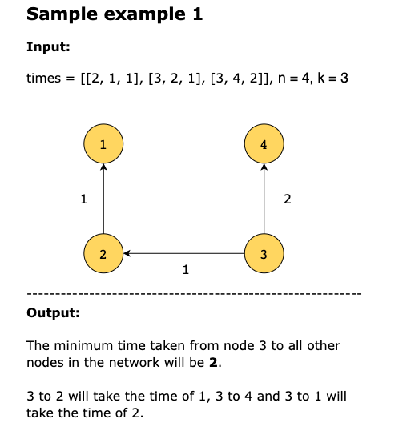
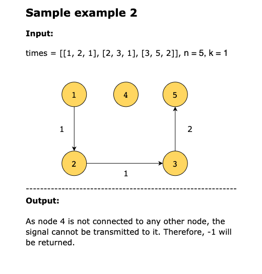
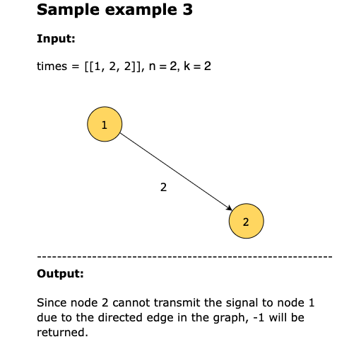

## Topics

- Depth-First Search
- Breadth-First Search
- Graph Theory
- Heap (Priority Queue)
- Shortest Path

## Solutions

1. [Naive Approach](#naive-approach)
2. [Dijkstra's Algorithm](#optimized-approach-using-dijkstras-algorithm)

### Naive Approach

The naive approach is to use a simple brute force method. The algorithm would start by initializing all distances (time
to travel from source to target node) to infinity, representing disconnection between the two nodes. Then, each node
would use a nested loop to go through all other nodes and update their distances using the given travel times. If there
is no connection between a source and a target node, its distance will not be updated. After updating all distances, the
algorithm would find the maximum distance among all nodes, representing the minimum time it takes for all nodes to
receive the signal. If a node that cannot be reached from node k exists, it means the distance is infinity, and it will
return -1.

This approach has a time complexity of `O(n^2)`, where n is the number of nodes in the graph.

### Optimized Approach using Dijkstra's Algorithm

Dijkstra’s algorithm is widely used for finding the shortest path between nodes in a graph. This makes it ideal for
finding the minimum delay time in a network.

We will use an adjacency dictionary. The source node will be used as key, and the value is a list of tuples that have the
destination node and the time for the signal to travel from source to destination node. A _priority queue_ is initialized
with time initialized to 0 and starting node k as a tuple. The priority queue ensures that the node with the minimum
time is retrieved in each iteration. We will iterate over the priority queue to traverse the nodes in the network. If
the node is not visited, the time of the retrieved node is compared to the current delay time and updated accordingly.
The neighbors of the retrieved node are found using the adjacency dictionary and are added to the queue with their times
updated by adding the delay time from the retrieved node.

Finally, if all the network nodes have been visited, we will return the computed time. Otherwise, −1 will be returned.

> A priority queue is a queue where elements are assigned a priority and served according to their priority value. In
> our context, lower-priority elements are served before higher-priority ones. Elements with the same priority are served
> in the order they were added to the queue.

The slides below illustrate how we would like the algorithm to run:

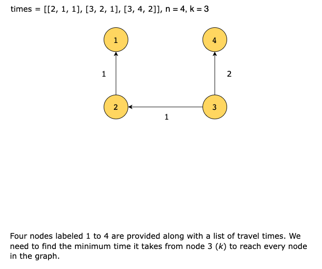
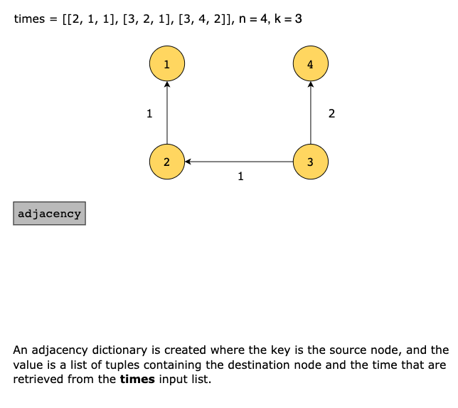
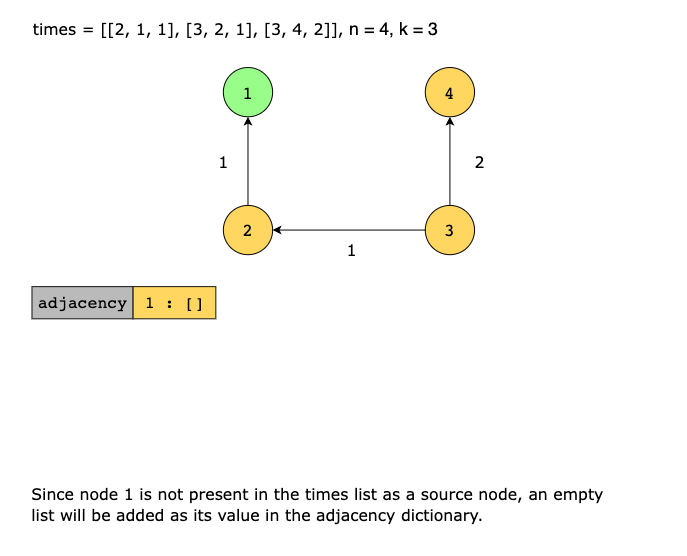
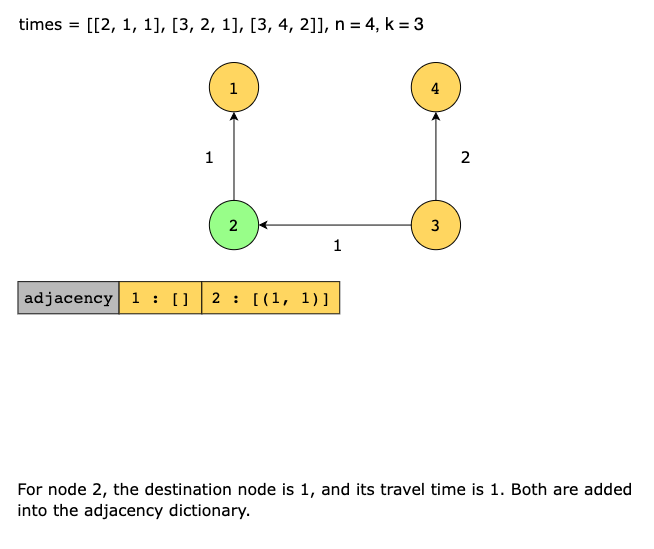
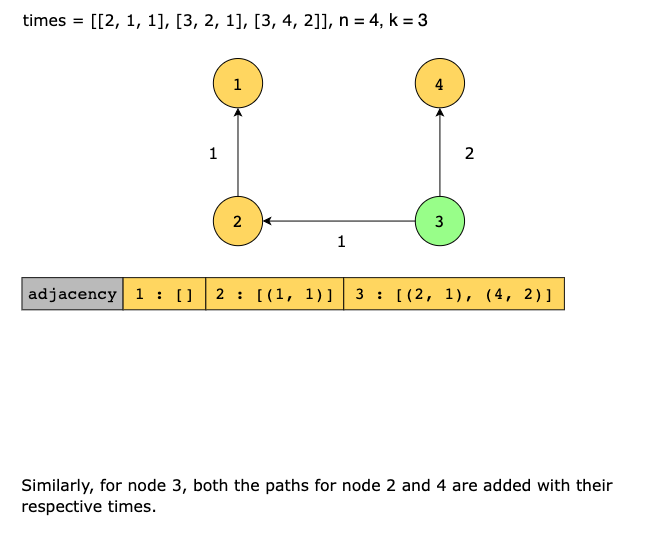
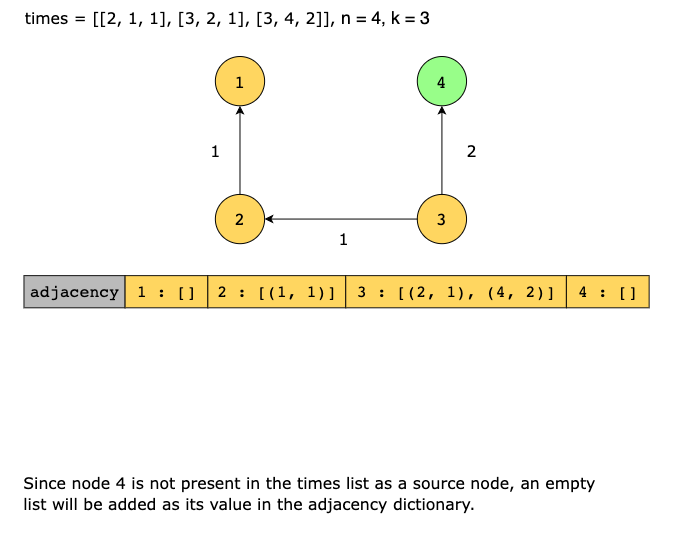
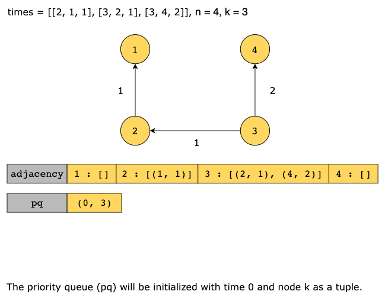

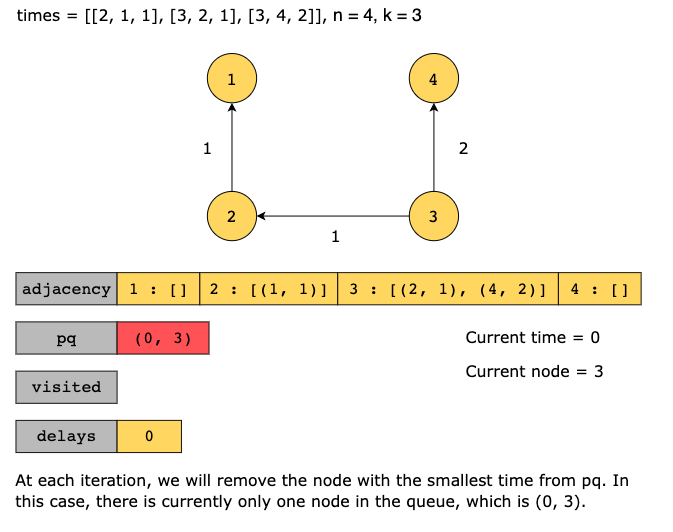
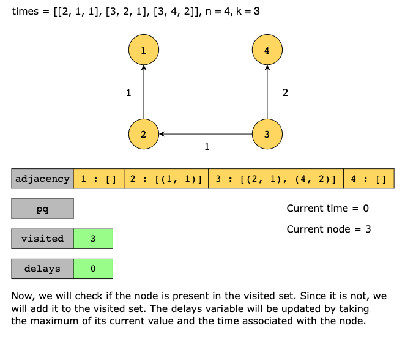
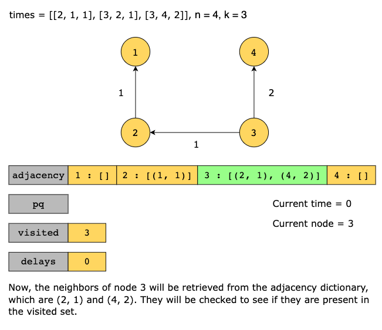
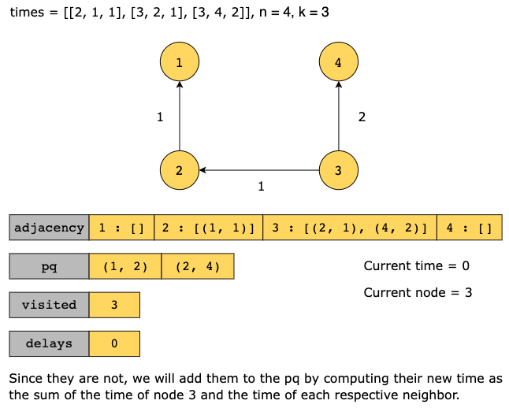
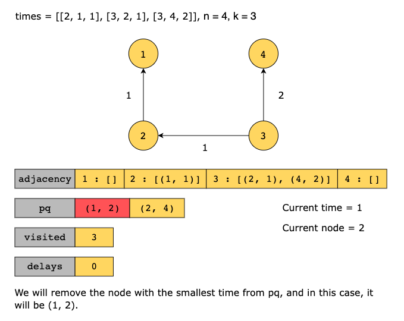
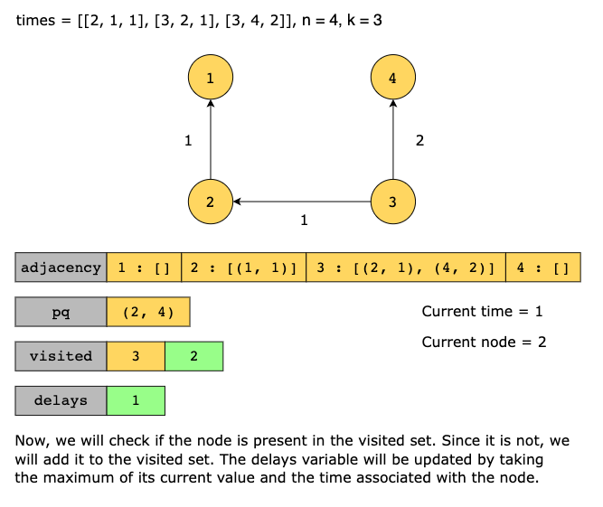
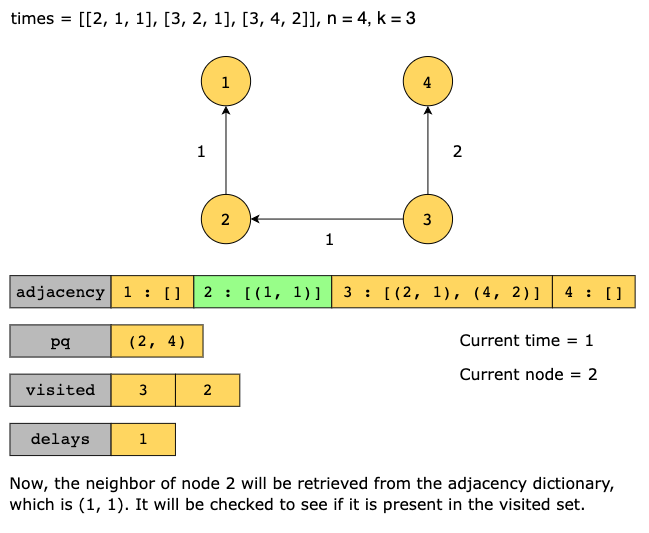
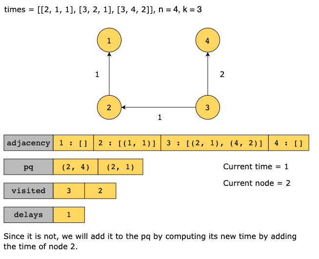
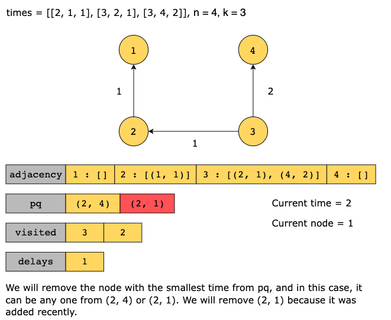
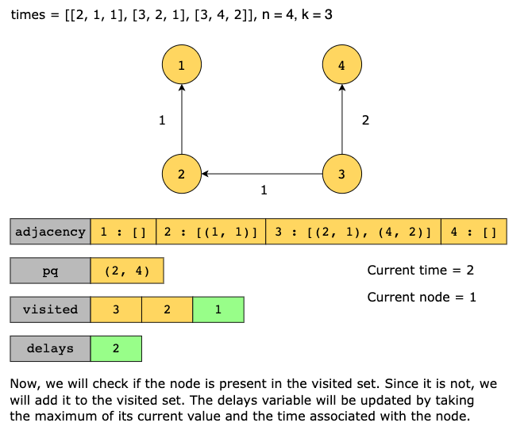
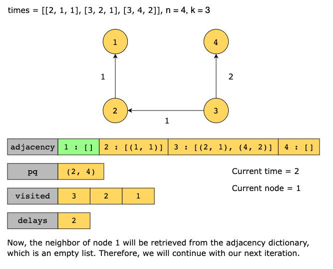
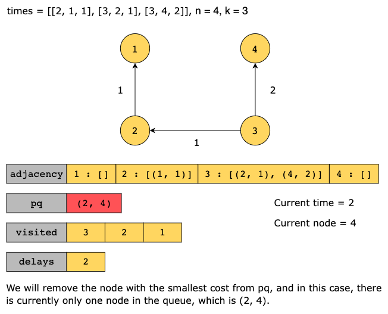
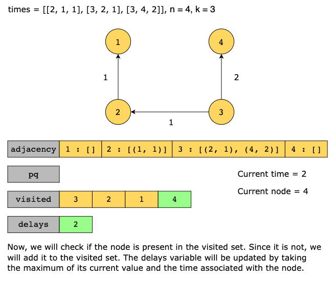
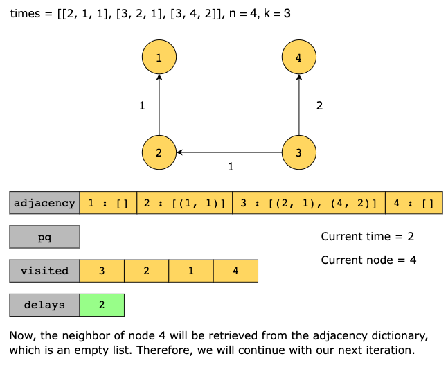

#### Solution Summary

The algorithm can be summarized in the following steps:

1. Create an adjacency dictionary to store the information of the nodes and their edges. 
2. Use a priority queue to store the nodes and their delay times. Initialize the queue with the source node and a delay
   time of 0. 
3. Use a visited set to track the nodes that have already been processed. 
4. Process the nodes from the priority queue by first visiting the node with the smallest delay time and updating the
   delay time if necessary. 
5. Add the unvisited neighbors of the processed node to the priority queue with their new delay times. 
6. Return the delay time if all nodes have been processed. Otherwise, return −1.

#### Time Complexity

This algorithm takes `O(E log(N))`, where E is the total number of edges, and N is the number of nodes in the network since
push and pop operations on the priority queue take `O(log(N))` time.

#### Space Complexity

The space complexity is `O(N+E)`, where N is the number of nodes in the graph, and E is the number of edges required by
the adjacency dictionary and priority queue.
