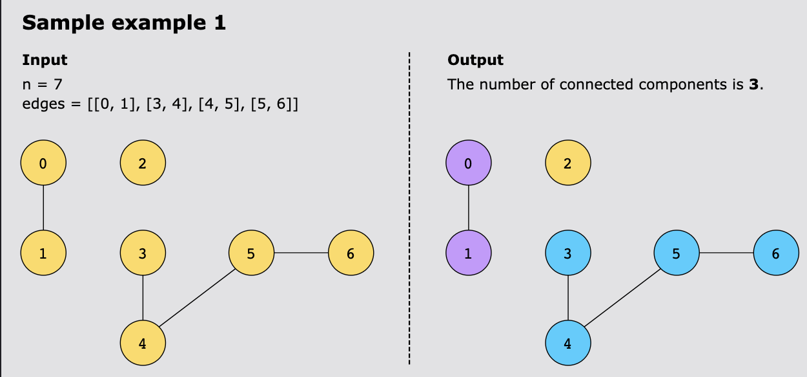
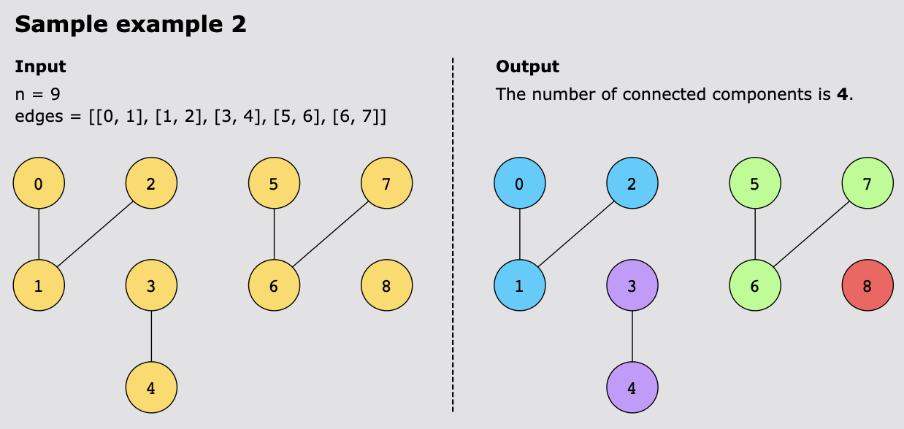

# Number of Connected Components in an Undirected Graph

For a given integer, n, and an array, edges, return the number of connected components in a graph containing n nodes.

> Note: The array edges[i] = [x, y] indicates that there’s an edge between x and y in the graph.

## Constraints

- 1 ≤ n ≤ 2000
- 0 ≤ edges.length ≤ 1000
- edges[i].length == 2
- 0 ≤ x, y < n
- x ≠ y
- There are no repeated edges.

## Examples

## Topics

- DFS
- BFS
- Union Find
- Graph

## Solutions

1. [Depth First Search](#depth-first-search)
2. [Union Find](#union-find)

### Depth First Search

When we think about connected components, we can visualize the graph as several "islands" of nodes, where nodes within
each island can reach each other through edges, but there's no way to travel between different islands.

The key insight is that if we start from any node and explore as far as possible through the edges, we'll discover all
nodes in that particular component. Once we've visited all nodes in one component, we can move to any unvisited node -
which must belong to a different component - and repeat the process.

This naturally leads us to a traversal approach. Starting from node 0, we can use DFS to "paint" all reachable nodes as
visited. This gives us our first component. Then we look for the next unpainted node and repeat. Each time we start a
new DFS from an unvisited node, we've found a new component.

Why DFS specifically? When we encounter a node, we want to immediately explore all its connections before moving on. DFS
does exactly this - it goes as deep as possible along each path before backtracking. This ensures we fully explore one
component before accidentally counting parts of it as separate components.

The algorithm becomes straightforward:

- Build an adjacency list from the edges to make traversal efficient
- Keep track of visited nodes to avoid counting the same component multiple times
- For each unvisited node, launch a DFS that marks all reachable nodes as visited
- Each successful DFS launch (returning 1 when starting from an unvisited node) represents discovering a new component

The beauty of this approach is that each node is visited exactly once, and we naturally partition the graph into its
connected components through the traversal process.

#### Complexity Analysis

##### Time Complexity

`O(n + m)` where `n` is the number of vertices and `m` is the number of edges. We visit each node once and traverse each
edge twice (once from each direction).

Breaking down the time complexity:

- Building the adjacency list: `O(m)` - iterates through all edges once
- DFS traversal: `O(n + m)` - each node is visited at most once (`O(n)`), and for each node, we explore all its edges (
  `O(m)` total across all nodes)
- The main loop calls `dfs(i)` for each node from 0 to n-1, but due to the visited set check, each node is actually
  processed only once

Therefore, the overall time complexity is `O(n + m)`.

##### Space Complexity

`O(n + m)` for the adjacency list, visited set, and recursion stack in the worst case.

The breakdown:

- Adjacency list: `O(n + m)` - `n` lists to store nodes, and `2m` total edge entries (each undirected edge is stored twice)
- Visited set: `O(n)` - can contain at most n nodes
- Recursion call stack: `O(n)` in the worst case when the graph is a long path

The dominant factor is the adjacency list storage, giving us a total space complexity of `O(n + m)`.

> Note on Stack Overflow with large components.
> 
> For graphs with very deep components (like a long chain), recursive DFS can cause stack overflow. Python's default
> recursion limit is around 1000. The solution for this is to use an iterative DFS with a stack data structure.

---

### Union Find

Since we are given an array of edges, and we are supposed to make connections and count the total number of components
in the graph. For this purpose, we can take a union of the edges to make a component and then incrementally connect and
count the overall number of connected components in the undirected graph. To do so, we will use the Union Find data
structure, also known as Disjoint Set Union (DSU), that will find all of the graphs' connected components.

The union find data structure will have two primary methods:

- `find()`: For any given element v, it recursively finds and returns the representative (root) of the set that v belongs
  to. To find this representative, we'll use path compression during our traversal. Here's how we will implement path
  compression:
  - On each find operation on a tree node, we update the parent of that node to point directly to the root. This reduces
    the length of the path of that node to the root, ensuring we don’t have to travel all the intermediate nodes on future
    find operations. Doing so, we are optimizing future find operations by making each element point directly to its root.
- `union()`: For any two given elements x and y, it checks their root representatives using the find() method.
  - If the roots are the same, it means x and y are already in the same set, so no action is taken, and the method
    returns FALSE.
  - Otherwise, it merges the sets containing x and y based on the ranks of their respective roots. The root with the
    higher rank becomes the parent of the other root. This distinction of choosing the greater rank is a strategy known
    as "union find by rank".
    - Union by rank: By using the "union by rank" strategy, the union method ensures that the resulting tree, after the
      union operation, remains balanced, preventing the creation of tall, skewed trees. This optimization helps keep the
      overall performance of the Union Find data structure efficient by reducing the time complexity of subsequent find
      and union operations.
  - If the ranks are equal, one root is chosen arbitrarily as the parent and its rank is incremented.
- After a union of two vertices, the method returns TRUE to indicate a successful union.

After implementing the union find data structure, we'll create an instance of the Union Find class with n elements. Here,
we'll set up the initial disjoint sets. Using a result variable, res, with the value of n, we can keep track of the
remaining components.

- For each edge (x, y) in edges, it calls the union() method of the dsu instance (from the Union Find class) with x and
  y as arguments.
- If the union operation returns TRUE, it means that the x and y nodes were not in the same component before the union,
  and they have now been united. In this case, the value of res is decremented by 1.
  - The purpose of decrementing res is to keep track of the remaining number of connected components.
- After processing all the edges, the function returns the final value of res, which represents the count of connected
  components in the graph.

#### Complexity Analysis

##### Time Complexity

The time complexity of this solution is `O(V+E)`, where V represents the number of vertices and E is the total number of
edges. For each operation, union and find methods are performed, each taking `O(α(n))`, since both path compression and
union find by rank are employed. The overall time complexity is `O(V+E.α(n))`

##### Space Complexity

The solution's space complexity is `O(V)` due to space occupied by the parent and rank arrays, both of which contribute 
`O(V)` space. Therefore, the combined space complexity is `O(2V)`, equivalent to `O(V)`.
