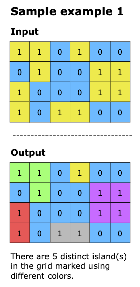
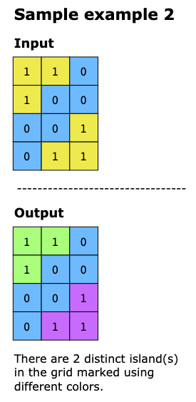
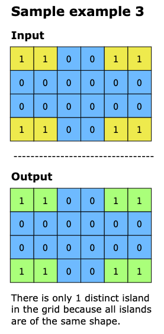
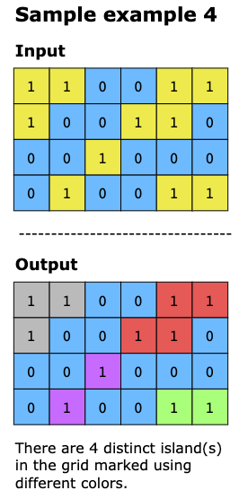

# Number of Islands

Given an m x n 2D binary grid which represents a map of '1's (land) and '0's (water), return the number of islands.

An island is surrounded by water and is formed by connecting adjacent lands horizontally or vertically. 
If any '1' cells are connected to each other horizontally or vertically (not diagonally), they form an island
You may assume all four edges of the grid are all surrounded by water.

Constraints

- 1 <= `grid.length` <= 50
- 1 <= `grid[i].length` <= 50
- `grid[i][j]` is either '0' or '1'

## Examples

Example 1:

Input: grid = [
["1","1","1","1","0"],
["1","1","0","1","0"],
["1","1","0","0","0"],
["0","0","0","0","0"]
]
Output: 1

Example 2:

Input: grid = [
["1","1","0","0","0"],
["1","1","0","0","0"],
["0","0","1","0","0"],
["0","0","0","1","1"]
]
Output: 3

---
# Number of Distinct Islands

Given an m x n binary matrix where 1 represents land and 0 represents water. An island is a group of connected 1s that
are adjacent horizontally or vertically. Two islands are considered the same if one matches the other without rotating
or flipping. The task is to return the number of distinct islands.

## Constraints

- m == grid.length
- n == grid[i].length
- 1≤ m, n ≤ 100
- grid[i][j] is either 0 or 1.

## Examples

### Solution

This algorithm is designed to find the number of distinct islands in a grid, where each island is a group of connected 
1s. The idea is to treat the grid as a map and perform a depth-first search(DFS) to explore every piece of land. During
DFS, the shape of the island is stored by the relative positions of land cells to the initial starting point of the
island. This means the coordinates are normalized so that two islands can be compared even in different locations on the
grid. These shapes are stored in the dictionary as keys, and the count of islands having the same shape is stored as a
value. The result is the number of keys in the dictionary, which represents the distinct islands.
Here’s the step-by-step implementation of the solution:
- Initialize a set to track visited land cells and a dictionary to store the shapes of islands.
- Loop through every cell in the grid. For each unvisited cell containing 1:
  - Call DFS on the cell. 
  - Explore all connected land cells recursively in all four directions (up, down, left, right) until the entire island
    is mapped. 
  - Normalize every land cell included in an island by subtracting the coordinates of that land cell from the coordinates
    of the first cell in the respective island.
  
- Once DFS completes exploring an island, the shape is stored in the dictionary. The key in this dictionary represents
  the shape, and the value is a count of the islands having the same shape.
- After processing the entire grid, return the dictionary as the number of distinct island shapes is the number of unique
  keys in the dictionary.

### Time Complexity

The time complexity of this solution is O(m*n), where n is the number of rows and m is the number of columns in the grid.
This is because the DFS visits every cell exactly once, and each cell is processed in constant time as it checks the
surrounding cells for potential land connections. The total time to explore all islands is proportional to the grid size.

### Space Complexity

The space complexity of this solution is O(m*n), where n is the number of rows and m is the number of columns. This is
because the set and dictionary store up to m*n entries in the worst case, where every cell is a land cell. Additionally,
the recursion depth of the DFS can reach m*n if the grid is entirely land.
