# Find All Possible Recipes from Given Supplies

You are given information about n different recipes. Each recipe is listed in the array recipes, and its corresponding
ingredients are provided in the 2D array ingredients. The ith recipe, recipes[i], can be prepared if all the necessary
ingredients listed in ingredients[i] are available. Some ingredients might need to be created from other recipes, meaning
ingredients[i] may contain strings that are also in recipes.

Additionally, you have a string array supplies that contains all the ingredients you initially have, and you have an
infinite supply of each.

Return a list of all the recipes you can create. The answer can be returned in any order.

> Note: It is possible for two recipes to list each other as ingredients. However, if these are the only two recipes
> provided, the expected output is an empty list.

## Constraints

- `n` == `recipes.length` == `ingredients.length`
- 1 <= `n` <= 100
- 1 ≤ `ingredients[i].length`, `supplies.length` ≤ 100
- 1 ≤ `recipes[i].length`, `ingredients[i][j].length`, `supplies[k].length` ≤ 10
- `recipes[i]`, `ingredients[i][j]`, and `supplies[k]` consist only of lowercase English letters.
- All the combined values of `recipes` and `supplies` are unique.
- Each `ingredients[i]` doesn’t contain any duplicate values.

## Examples

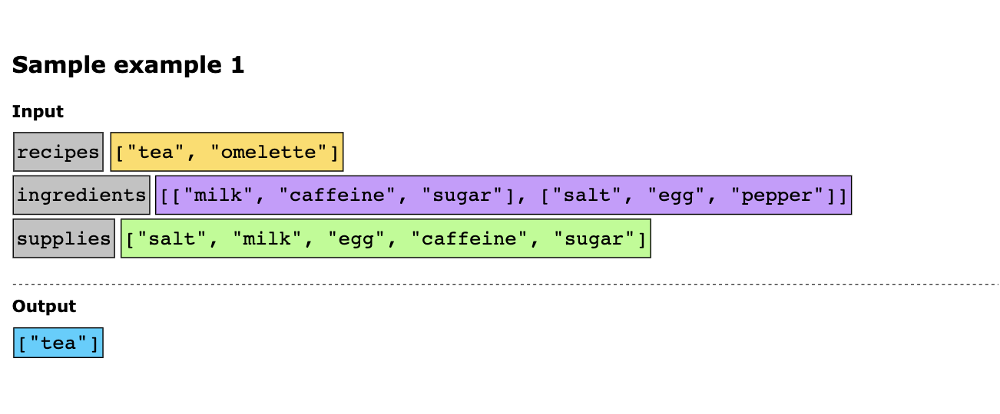
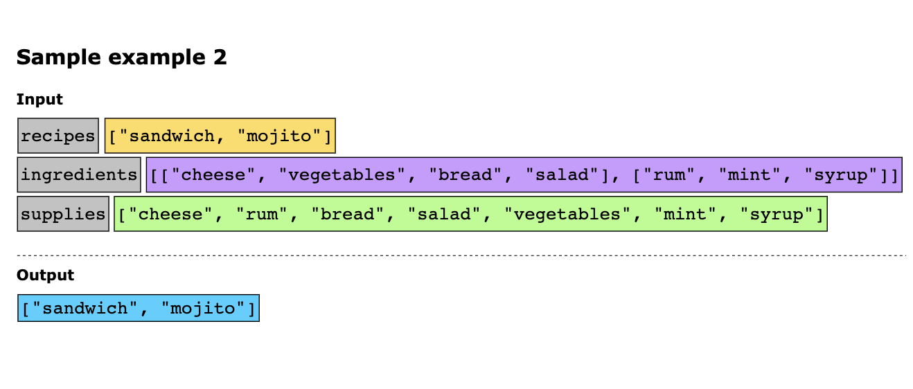

## Solution

An optimized approach to solve this problem would be to use the topological sort pattern. We need to understand that the
preparation of recipes depends on the availability of ingredients. Some ingredients are available initially, while others
may need to be prepared using other recipes. This dependency between recipes and their ingredients can be represented as
a directed graph where:

- Each recipe is a node.
- There is a directed edge from node A to node B if the preparation of recipe B requires recipe A.

Topological sort is an algorithm commonly used to order nodes (tasks) in a directed acyclic graph (DAG) such that for
every directed edge u → v, node u comes before node v in the ordering. In our case, this means that if a recipe A depends
on recipe B, then B should come before A in the order of recipes we can prepare.

If there are circular dependencies (like two recipes requiring each other), these will be cycles in the graph, and we
cannot prepare either recipe. The goal of using topological sort is to determine the order in which recipes can be prepared,
starting from those that can be made with the initial supplies and progressing through those that depend on previously
prepared recipes.

Let’s go through the algorithm to see how we will reach the solution:

1. Initialize data structures:
   - `recipe_graph`: This is a dictionary where each key is a recipe and its value is a list of recipes that depend on it.
   - `recipe_indegrees`: This is a dictionary that stores the number of prerequisites for each recipe.
   - `recipes_queue`: This is a queue that processes recipes, which can be immediately made with the initial supplies.
   - `possible_recipes`: This is an array that stores all the recipes that can be created.
2. Build the graph and in-degree count by iterating over each ingredient of each recipe:
   - If the ingredient is another recipe, add an edge from that ingredient to the current recipe in `recipe_graph` and
     increase `recipe_indegrees` for the current recipe.
   - If the ingredient is available in `supplies`, skip it since it’s immediately available.
3. Add all recipes with an in-degree of 0 (no prerequisites) to `recipes_queue`.
4. Process the `recipes_queue` using topological sorting:
   - While `recipes_queue` is not empty:
     - Pop a recipe from the queue.
     - Add it to `possible_recipes` since it can now be made.
     - For each recipe that depends on this recipe, reduce its in-degree by 1.
     - If any recipe’s in-degree becomes 0, add it to `recipes_queue`.
5. Return the `possible_recipes` list, which contains all the recipes that can be created with the given supplies.

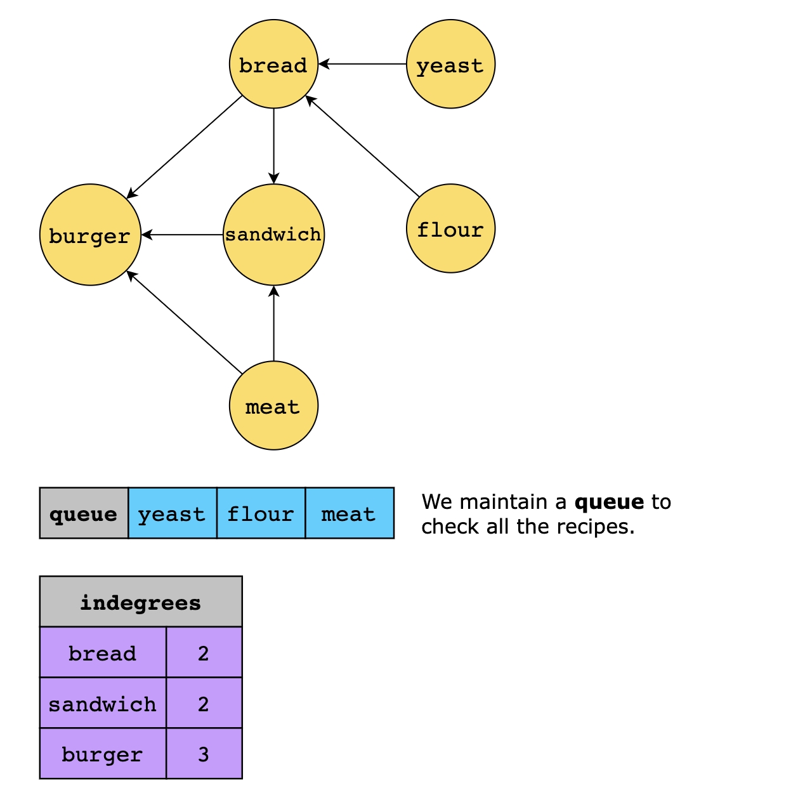
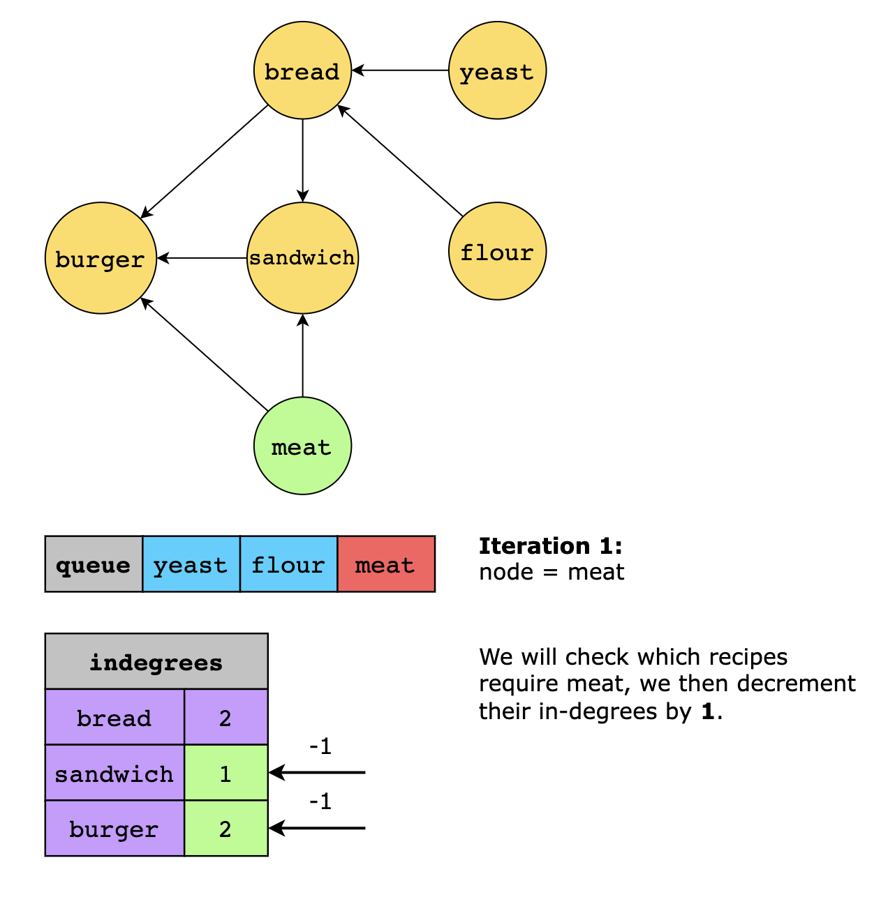
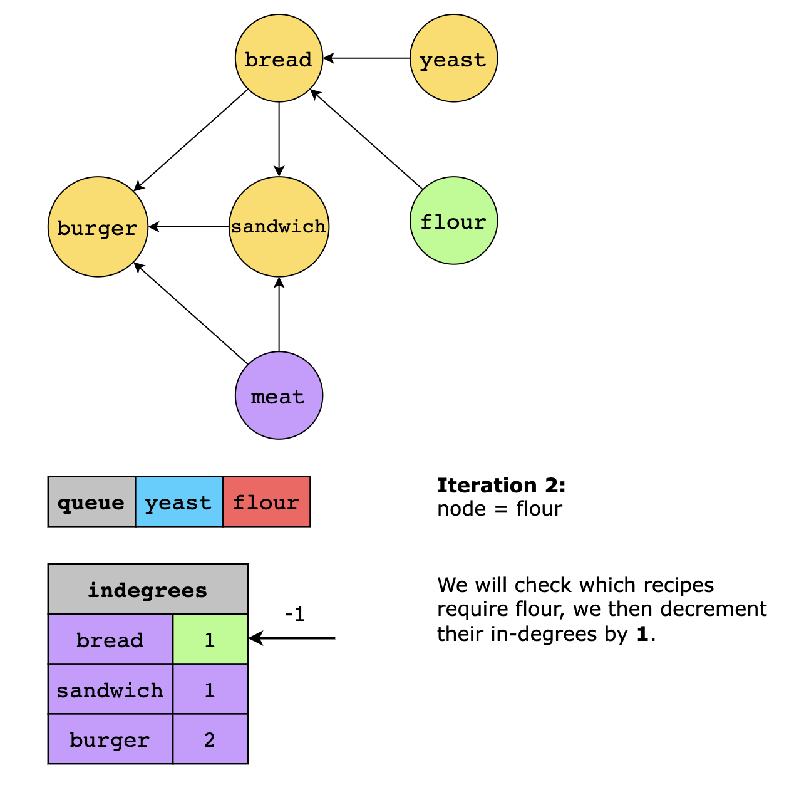
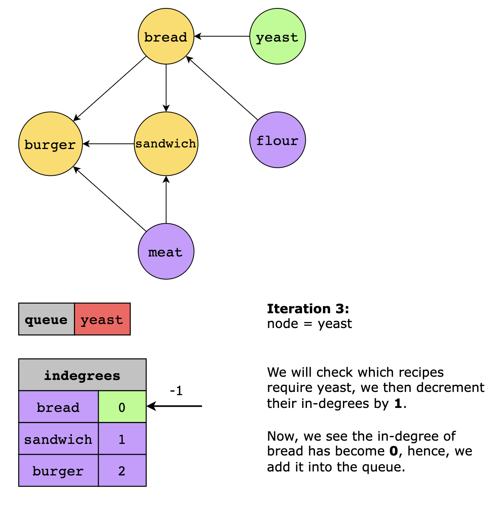
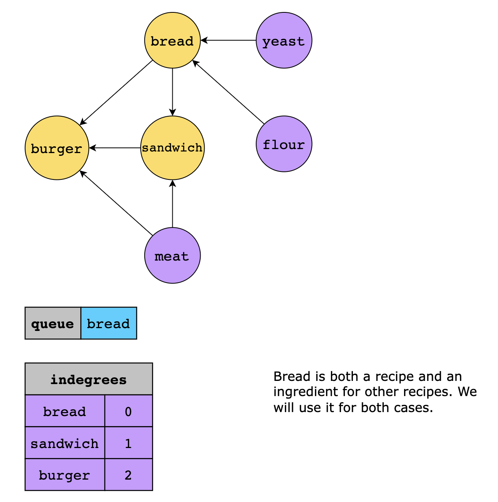
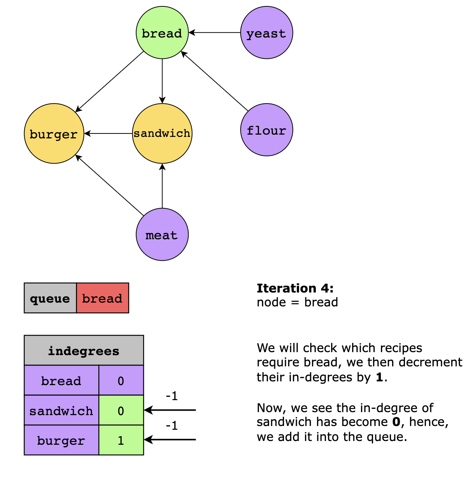
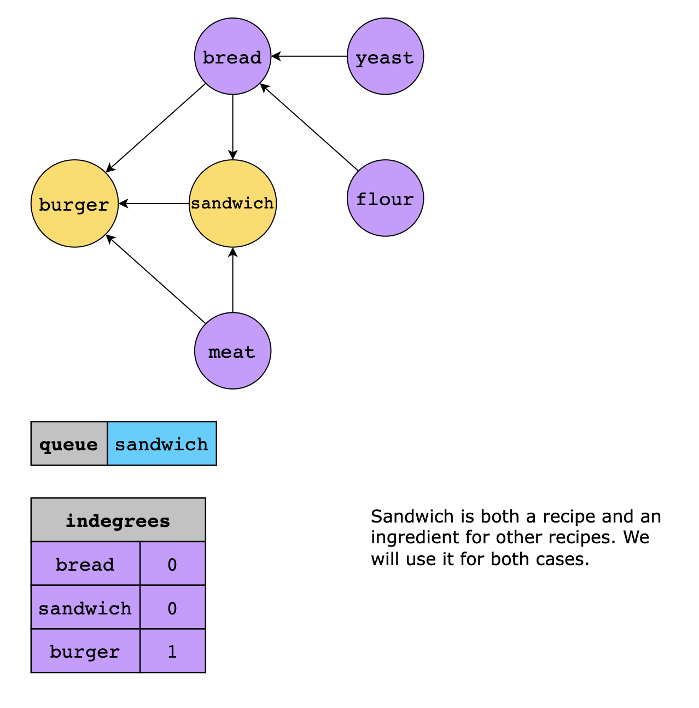
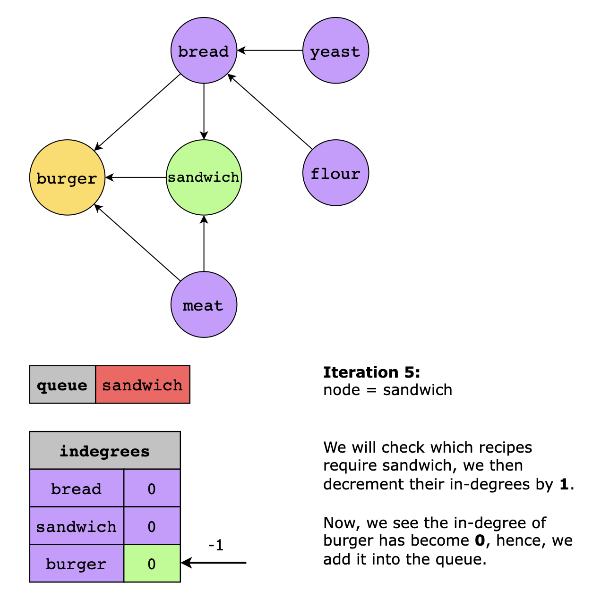
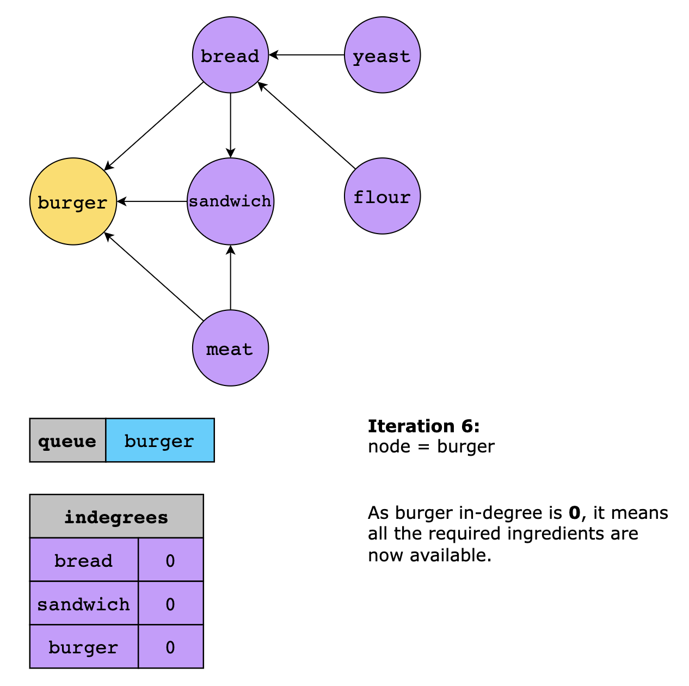
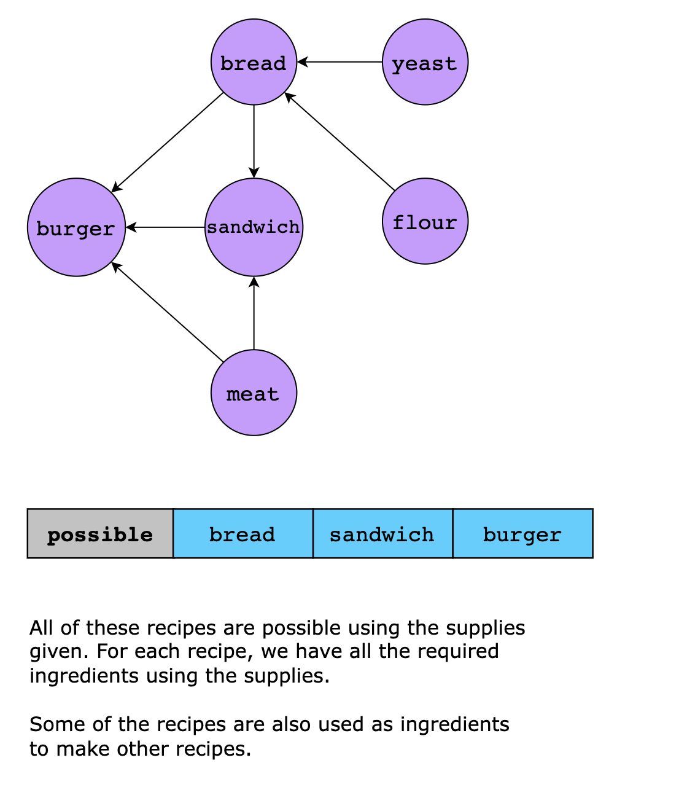

### Time Complexity

The time complexity of this solution is O(v+e), where v is the vertices of the recipe_graph and e is the edges of the
graph. This is because we traverse each vertex and edge in the graph exactly once during the topological sort, and the
dictionary data structure allows us to access vertices and edges in constant time.

### Space Complexity

The space complexity is also O(v+e) as we have to store all the recipes and their respective ingredients.
