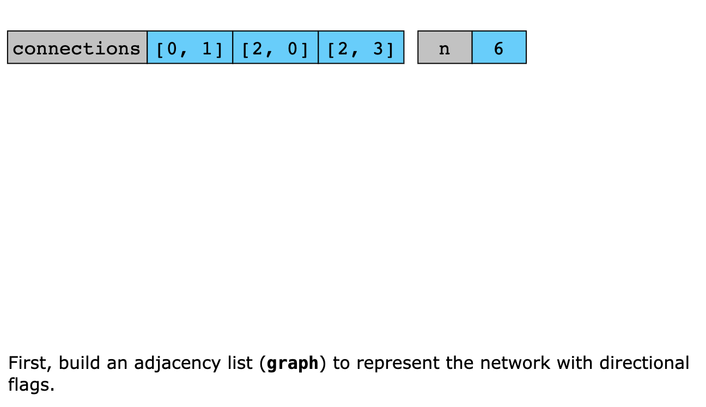
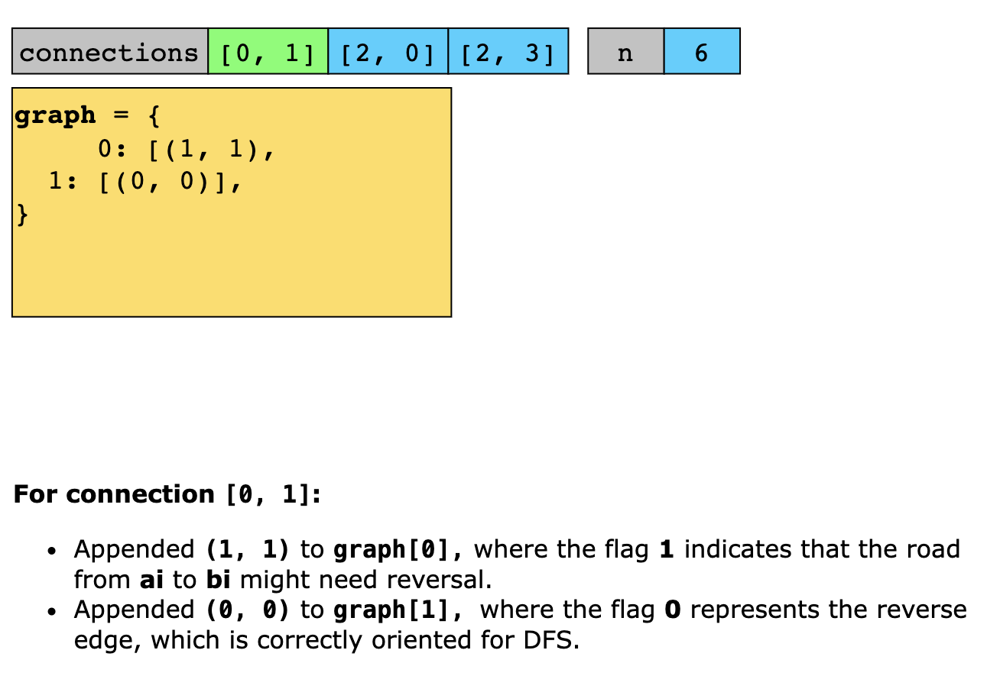
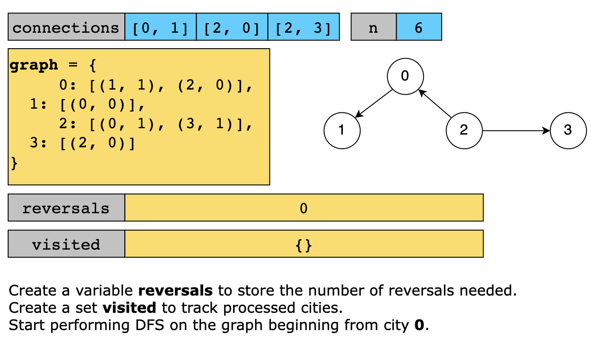
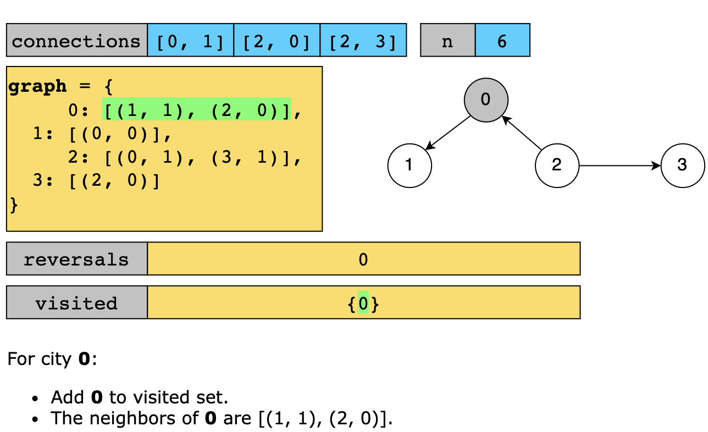
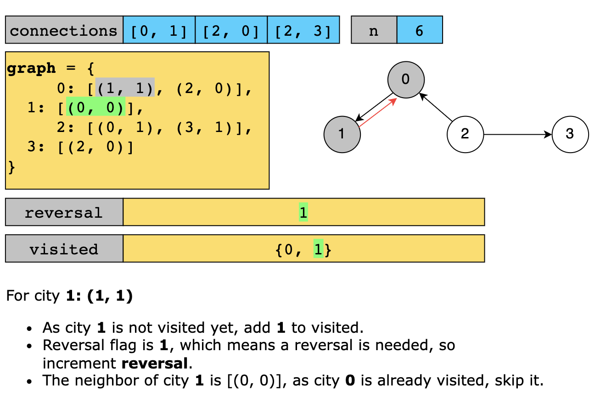
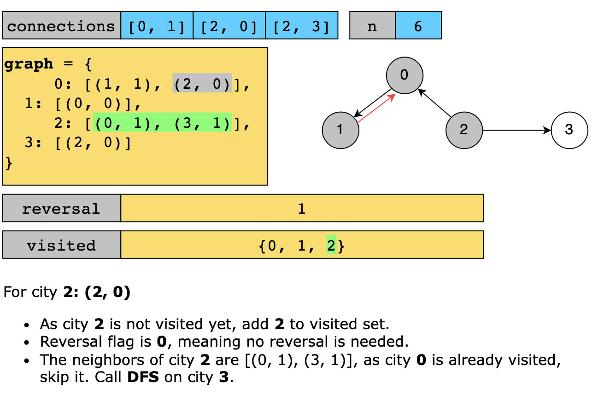
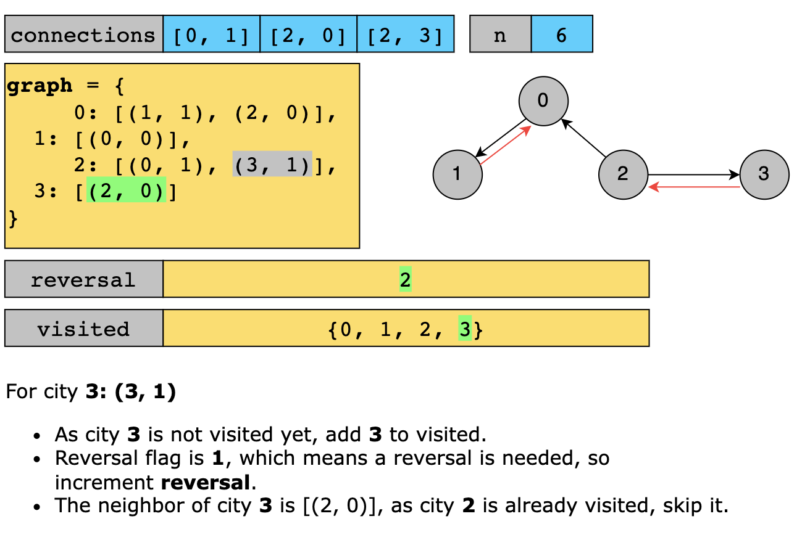
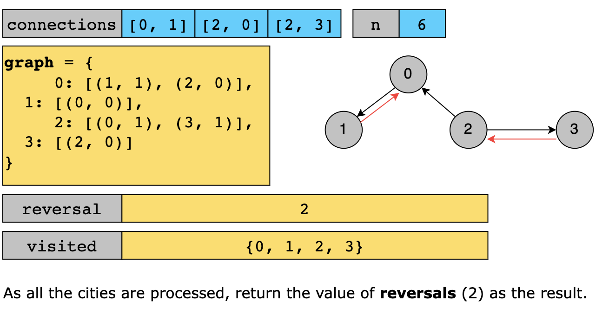

# Reorder Routes to Make All Paths Lead to the City Zero

There are n cities numbered from 0 to n - 1 and n - 1 roads such that there is only one way to travel between two
different cities (this network form a tree). Last year, The ministry of transport decided to orient the roads in one
direction because they are too narrow.

Roads are represented by connections where connections[i] = [ai, bi] represents a road from city ai to city bi.

This year, there will be a big event in the capital (city 0), and many people want to travel to this city.

Your task consists of reorienting some roads such that each city can visit the city 0. Return the minimum number of
edges changed.

It's guaranteed that each city can reach city 0 after reorder.

Example 1

Input: n = 6, connections = [[0,1],[1,3],[2,3],[4,0],[4,5]]
Output: 3
Explanation: Change the direction of edges show in red such that each node can reach the node 0 (capital).

Example 2

Input: n = 5, connections = [[1,0],[1,2],[3,2],[3,4]]
Output: 2
Explanation: Change the direction of edges show in red such that each node can reach the node 0 (capital).

Example 3
Input: n = 3, connections = [[1,0],[2,0]]
Output: 0

## Solution

This algorithm works because representing the network as a graph with directional information allows us to easily 
identify which roads are misoriented. By performing a DFS from the capital (city 0), we traverse the entire network 
exactly once. Every time we encounter a road directed away from city 0, we know it needs to be reversed. This approach 
takes advantage of the network’s tree structure to ensure we only count the minimum number of necessary reversals.

Now, let’s look at the solution steps below:

1. Build an adjacency list using a variable graph to store the roads and their directional flags.
   - For each connection [ai, bi] in connections:
     - Append (bi, 1) to graph[ai], where the flag 1 indicates that the road goes from ai to bi and might need to be 
       reversed.
     - Append (ai, 0) to graph[bi], where the flag 0 represents the reverse edge, which is correctly oriented for the 
       DFS.
2. Create a set, visited, to track which cities have been processed, preventing repeated visits.
3. Call dfs(0, graph, visited) to start the DFS from the capital (city 0) and store the result in a variable result.
4. Return result as the final answer is the minimum number of road reorientations needed.

**Define the DFS function**

1. Start the DFS from city 0
   - Add the current city to the visited set.
   - Initializes a variable, reversals, to count the number of road reversals needed for the subtree rooted at that city.
   - For each neighbor and its associated flag (represented by need_reverse) in graph[city]:
     - If the neighbor hasn’t been visited, add need_reverse to result (As need_reverse equals 1 if the road needs reversal).
     - Recursively call dfs(neighbor, graph, visited) to continue the traversal.
   - Returns reversals.

Let’s look at the following illustration to get a better understanding of the solution:

### Time Complexity

The time complexity of the solution is O(n), where n is the number of cities because every node and its corresponding 
edges are visited exactly once during the DFS.

### Space Complexity

The solution’s space complexity is O(n) due to the storage needed for the graph (adjacency list), the visited set, and 
the recursion call stack.

## Related Topics

- Depth First Search
- Breadth First Search
- Graph
