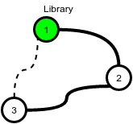
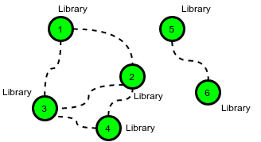

Determine the minimum cost to provide library access to all citizens of HackerLand. There are cities numbered from 1 to
n. Currently there are no libraries and the cities are not connected. Bidirectional roads may be built between any city
pair listed in cities. A citizen has access to a library if:

- Their city contains a library.
- They can travel by road from their city to a city containing a library.

Example

The following figure is a sample map of HackerLand where the dotted lines denote possible roads:

- c_road = 2
- c_lib = 3
- cities = [[1,7], [1,3], [1,2], [2,3], [5,6], [6,8]]

The cost of building any road is c_road = 2 , and the cost to build a library in any city is c_lib = 3. Build 5 roads at
a cost of 5*2=10 and 2 libraries for a cost of 6. One of the available roads in the cycle 1->2->3->1 is not necessary.

There are q queries, where each query consists of a map of HackerLand and value of c_lib and c_road. For each query,
find the minimum cost to make libraries accessible to all the citizens.

Function Description

Complete the function roadsAndLibraries in the editor below. roadsAndLibraries has the following parameters:

- int n: integer, the number of cities
- int c_lib: integer, the cost to build a library
- int c_road: integer, the cost to repair a road
- int cities[m][2]: each cities[i] contains two integers that represent cities that can be connected by a new road

Returns

- int: the minimal cost

Examples:

1. HackerLand contains n=3 cities and can be connected by m=3 bidirectional roads. The price of building a library is
   c_lib=2 and the price for repairing a road is c_road=1.

The cheapest way to make libraries accessible to all is to:

- Build a library in city 1 at a cost of x = 2.
- Build the road between cities 1 and 2 at a cost of y = 1.
- Build the road between cities 2 and 3 at a cost of y = 1.

This gives a total cost of 2+1+1=4. Note that the road between cities 3 & 1 does not need to be built because each is
connected to city 2.

2. In this scenario it is optimal to build a library in each city because the cost to build a library is less than the
   cost to build a road.

