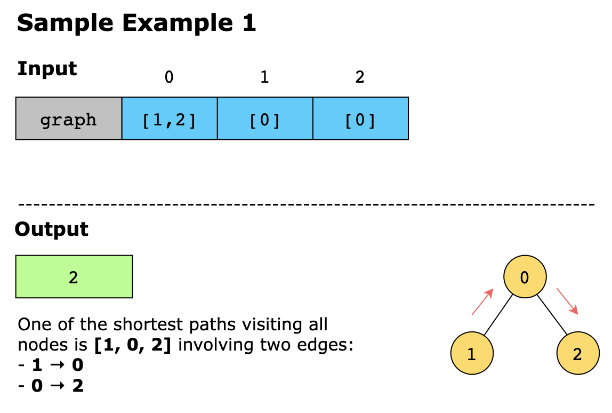
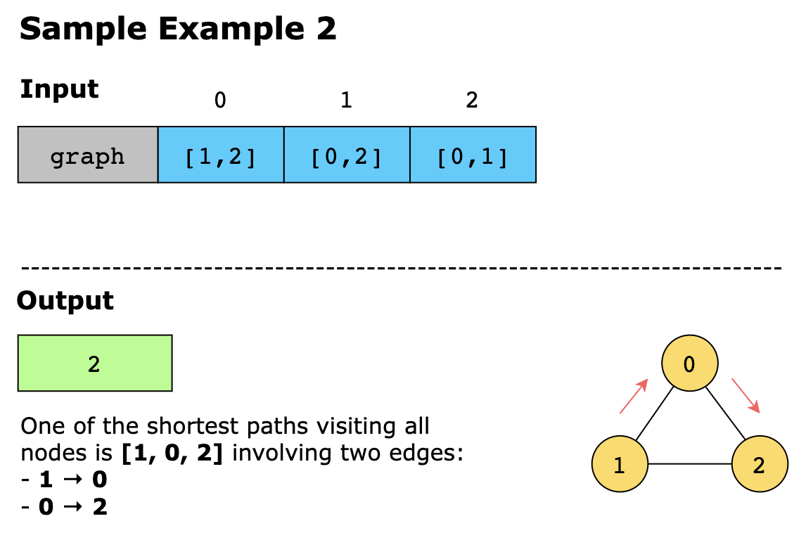
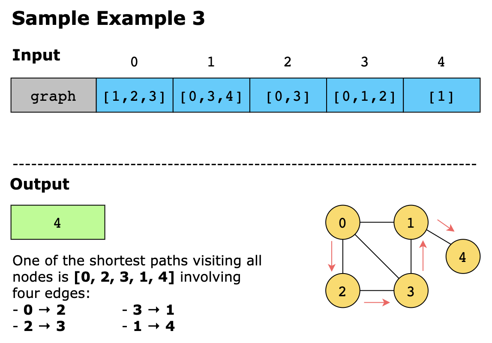
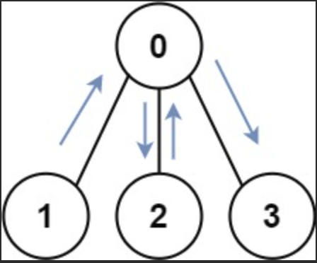
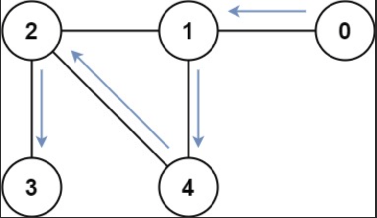

# Shortest Path Visiting All Nodes

You are given an undirected connected graph with n nodes numbered from 0 to n -1. The graph is provided as an adjacency
list, graph, where graph[i] contains all nodes that share an edge with node i.

Your task is to find the length of the shortest path that visits every node. You may:

- Start from any node. 
- End at any node. 
- Revisit nodes and reuse edges as many times as needed.

## Constraints

- n == `graph.length`
- 1 <= n <= 12
- 0 <= `graph[i].length` < n
- `graph[i]` does not contain i.
- If `graph[a]` contains b, then `graph[b]` contains a.
- The input graph is always connected.

## Examples





Example 4


```text
Input: graph = [[1,2,3],[0],[0],[0]]
Output: 4
Explanation: One possible path is [1,0,2,0,3]
```

Example 5



```text
Input: graph = [[1],[0,2,4],[1,3,4],[2],[1,2]]
Output: 4
Explanation: One possible path is [0,1,4,2,3]
```

## Topics

- Dynamic Programming
- Bit Manipulation
- Breadth-First Search
- Graph Theory
- Bitmask
