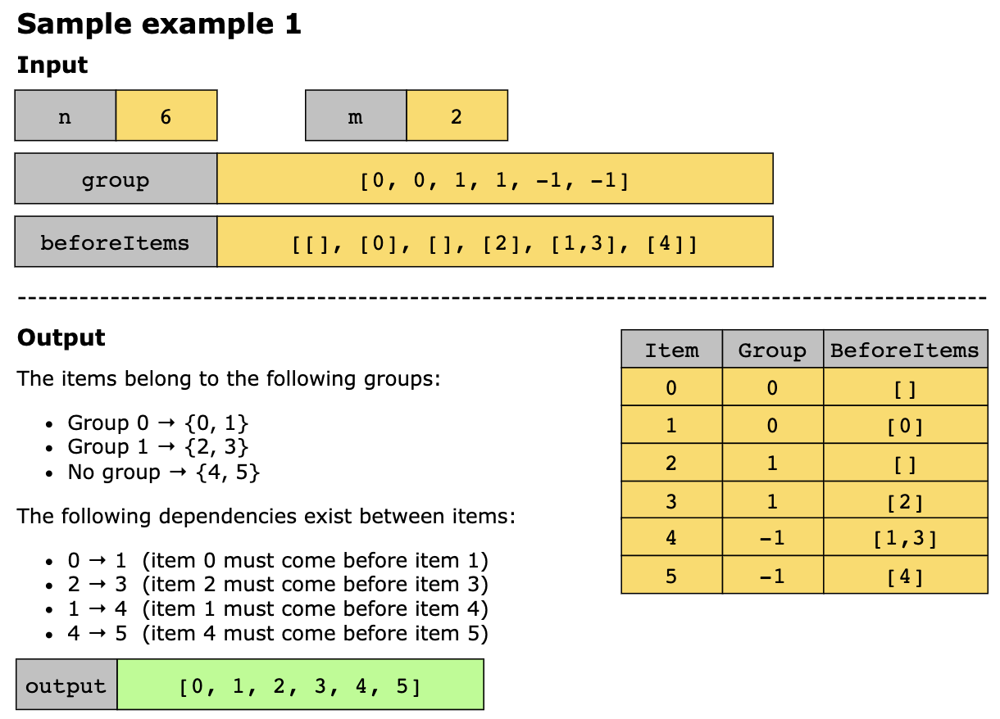
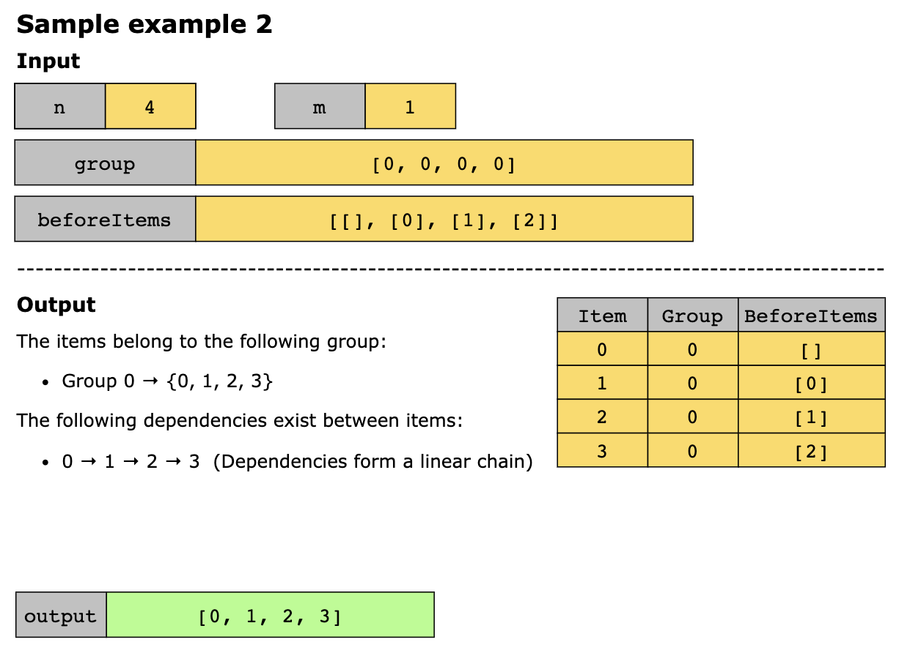
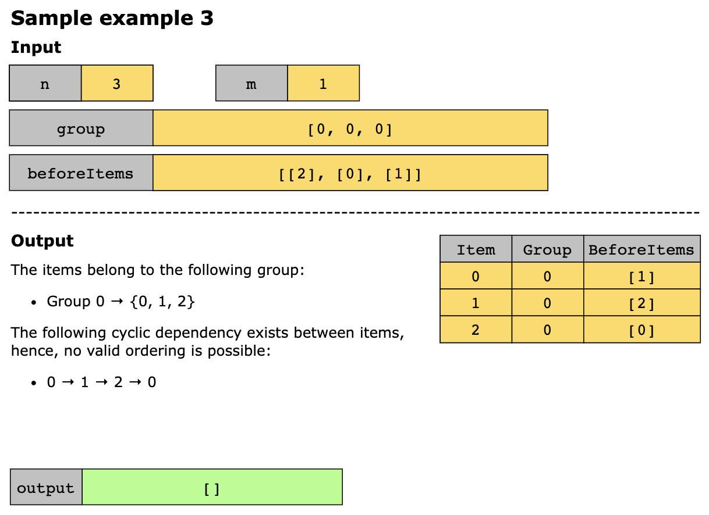

# Sort Items by Groups Respecting Dependencies

You are given n items indexed from 0 to n−1. Each item belongs to 0 or one of m groups, described by the array group,
where:
- `group[i]` represents the group of the ith item.
- If `group[i]==−1`, the item isn’t assigned to any existing group and should be treated as belonging to its own unique
  group.

You’re also given a list, `beforeItems`, where `beforeItems[i]` contains all items that must precede item `i` in the final
ordering.

Your goal is to arrange all n items in a list that satisfies both of the following rules:

- **Dependency order**: Every item must appear after all the items listed in `beforeItems[i]`.
- **Group continuity**: All items that belong to the same group must appear next to each other in the final order.

If there are multiple valid orderings, return any of them. If there’s no possible ordering, return an empty list.

## Constraints

- 1 <= `m` <= `n` <= 3 * 10^4
- `group.length` == `beforeItems.length` == n
- -1 <= `group[i]` <= m - 1
- 0 <= `beforeItems[i].length` <= n - 1
- 0 <= `beforeItems[i][j]` <= n - 1
- i != `beforeItems[i][j]`
- `beforeItems[i]` does not contain duplicates elements.

## Examples





Example 4

```text
Input: n = 8, m = 2, group = [-1,-1,1,0,0,1,0,-1], beforeItems = [[],[6],[5],[6],[3,6],[],[],[]]
Output: [6,3,4,1,5,2,0,7]
```

Example 5

```text
Input: n = 8, m = 2, group = [-1,-1,1,0,0,1,0,-1], beforeItems = [[],[6],[5],[6],[3],[],[4],[]]
Output: []
Explanation: This is the same as example 4 except that 4 needs to be before 6 in the sorted list.
```

## Topics

- Depth-First Search
- Breadth-First Search
- Graph Theory
- Topological Sort

## Hints

- Think of it as a graph problem.
- We need to find a topological order on the dependency graph.
- Build two graphs, one for the groups and another for the items.

## Solution

The essence of this problem lies in managing two-level dependencies: 

- Item-level dependencies: Each item must appear only after all items in its beforeItems list.
- Group-level contiguity: All items belonging to the same group must appear consecutively in the final order.

This dual requirement naturally maps to a hierarchical topological sorting approach on two directed acyclic graphs (DAGs).
One for groups and one for items. First, we normalize the input by assigning a unique group to every item that originally
has group[i] = -1, so each item belongs to exactly one group. Then, we build two directed graphs:

- An item-level dependency graph is built from beforeItems, where an edge u → v indicates that item u must come before
  item v.
- A group-level dependency graph is constructed by examining inter-group dependencies: if an item u depends on an item v
  and they belong to different groups, an edge is added from group[v] to group[u], meaning group[v] must come before
  group[u].

To solve the problem, we:

- Sort the groups topologically using the group-level graph to determine a valid global sequence of groups. If a cycle
  exists (i.e., no valid ordering), return an empty list.

- For each group in that global order, perform a topological sort on its internal items using only the relevant subgraph
  of item dependencies. If any group contains a cyclic dependency among its items, return an empty list.

- Concatenate the sorted items group by group, following the global order of groups from step 1.

This hierarchical approach cleanly addresses both concerns: the outer sort enforces inter-group dependency and contiguity,
while the inner sorts respect intra-group ordering. The result is a single linear sequence that satisfies all constraints,
or correctly reports impossibility if cycles prevent a valid schedule.

Using the intuition above, we implement the algorithm as follows:

1. We iterate through all items in the group:
   - If an item has no assigned group (indicated by -1):
     - We assign it a new unique group number equal to the current value of m.
     - We increment m by one.
2. We create two adjacency lists (graphs): item_graph to store item-level dependencies and group_graph to store
   group-level dependencies.
3. We create two in-degree arrays initialized with zero: item_indegree of size n to count the number of prerequisites
   each item has, and group_indegree of size m to count the number of prerequisite groups each group has.
4. We loop through each item, curr from 0 to n - 1:
   - For each prerequisite prev in beforeItems[curr], we:
     - Add a directed edge from prev to curr in item_graph.
     - Increment item_indegree[curr].
     - If group[prev] is not equal to group[curr], we:
       - Add an edge from group[prev] to group[curr] in group_graph.
       - Increment group_indegree[group[curr]].
5. We perform a topological sort using the helper function, topoSort, on the items and store the ordered items in
   item_order.
6. We perform another topological sort using the same helper function on groups and store the ordered groups in the
   group_order.
7. If either the item_order or group_order is empty, we return an empty array because it is impossible to create a
   valid ordering.
8. We initialize a map, group_to_items, to map each group number to a list of its items.
9. For each item in item_order:
   - We append each item to its corresponding group’s list in the group_to_items map. This preserves the topological
     order of items within each group.
10. We define an array, result, to store the final valid ordering.
11. For each group g in group_order:
    - We add all items in group_to_items[g] to the result array.
12. We return the result array containing all items in a valid order.

The topo_sort helper function receives a list of nodes, a graph (adjacency list), and an indegree array, and returns the
topological order using Kahn’s algorithm. It performs the following steps:

1. We initialize a queue q with all nodes in nodes that have an indegree[node] equal to 0.
2. We also initialize an empty array, order, to store the topological order.
3. We iterate through q and:
   - Repeatedly remove a node from q.
   - Append this node to the order array.
   - For each neighbor, nei, of node, we:
     - Decrement the indegree of nei.
     - If the indegree of nei is 0:
       - We add nei to q.
4. We return the order array if all nodes are processed; otherwise, we return an empty array (indicating a cycle exists).

### Time Complexity

Time: O(n + m + E) where E is the total number of edges (sum of all beforeItems[i] lengths), since we process each node
and edge once in both graphs.

### Space Complexity

O(n + m + E) for storing the adjacency lists, in-degree arrays, and the queue used in topological sort.
