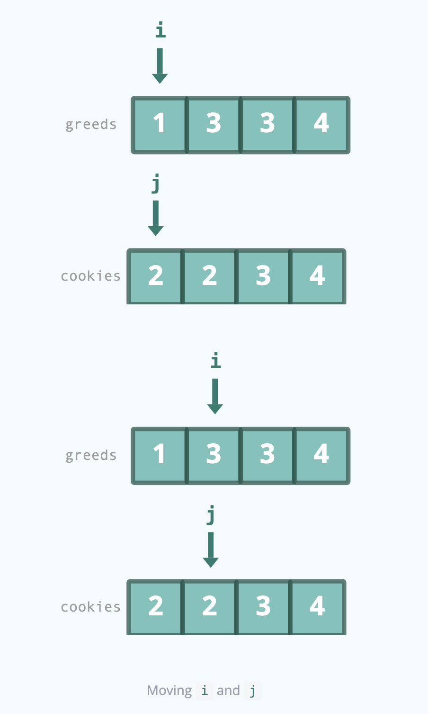
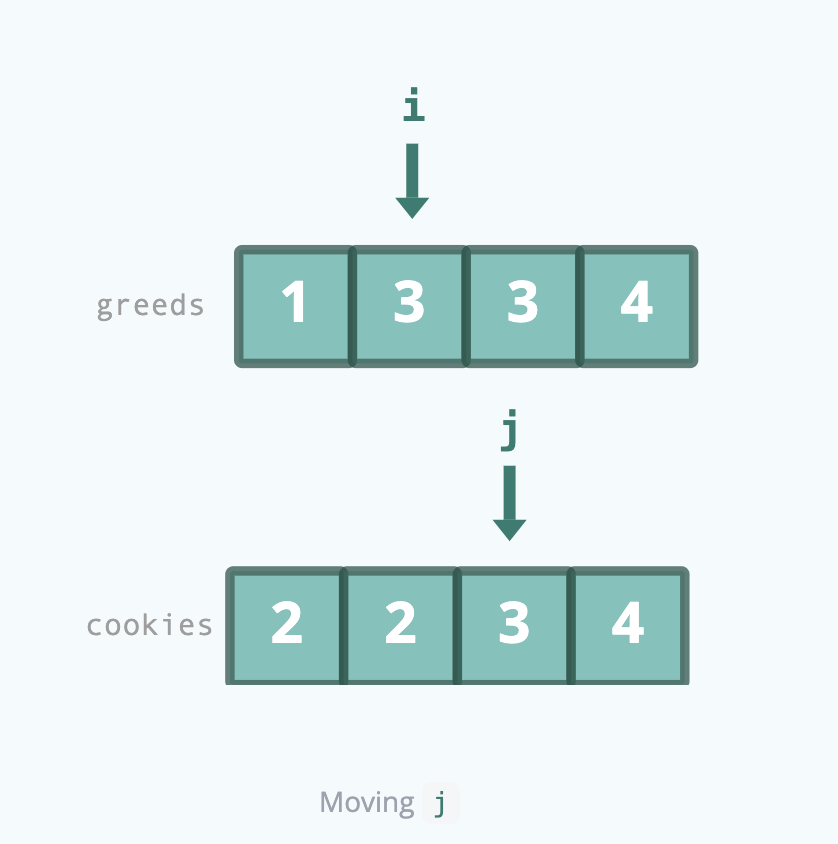

# Assign Cookies

Assume you are an awesome parent and want to give your children some cookies. But, you should give each child at most
one cookie.

Each child i has a greed factor g[i], which is the minimum size of a cookie that the child will be content with; and
each cookie j has a size s[j]. If s[j] >= g[i], we can assign the cookie j to the child i, and the child i will be content.
Your goal is to maximize the number of your content children and output the maximum number.

## Constraints

- 1 <= greed.length <= 3 * 104
- 0 <= cookies.length <= 3 * 104
- 1 <= greed[i], cookies[j] <= 231 - 1

## Examples

Example 1:
```text
Input: g = [1,2,3], s = [1,1]
Output: 1
Explanation: You have 3 children and 2 cookies. The greed factors of 3 children are 1, 2, 3. 
And even though you have 2 cookies, since their size is both 1, you could only make the child whose greed factor is 1
content.
You need to output 1.
```

Example 2:
```text
Input: g = [1,2], s = [1,2,3]
Output: 2
Explanation: You have 2 children and 3 cookies. The greed factors of 2 children are 1, 2. 
You have 3 cookies and their sizes are big enough to gratify all of the children, 
You need to output 2.
```

## Topics

- Array
- Two Pointers
- Greedy
- Sorting

## Solution

Intiutively, we want to give each child the smallest cookie that satisfies them. This allows us to save the larger
cookies for the greedier children and allows us to maximize the number of satisfied children.

The greedy algorithm sorts both the greeds and cookies arrays in ascending order. This places the child with the smallest
greed and the smallest cookie at the front of each array. 

For example:

```text
greeds = [1, 3, 3, 4]
cookies = [2, 2, 3, 4]
```

We then initialize two pointers `i` and `j` to the start of the `greeds` and `cookies` arrays, respectively. `i` 
represents the current child and `j` represents the current cookie.

If `cookies[j] >= greeds[i]`, that means the current cookie can satisfy the current child. We increment the number of
satisfied children and move to the next child and cookie.



If `cookies[j] < greeds[i]`, that means the current cookie cannot satisfy the current child, so we move to the next cookie
to see if it can.



We can continue this process until we reach the end of either the greeds or cookies arrays, and return the number of
satisfied children as the result.

### Complexity Analysis

#### Time Complexity 

O(n log n + m log m) where n is the number of children and m is the number of cookies. We sort the
greeds and cookies arrays in O(n log n + m log m) time, and then iterate through the arrays in O(n + m) time.

#### Space Complexity

O(1) We only use a constant amount of space for variables.
