# Boats to save people

A big ship with numerous passengers is sinking, and there is a need to evacuate these people with the minimum number of 
life-saving boats. Each boat can carry, at most, two persons however, the weight of the people cannot exceed the 
carrying weight limit of the boat.

We are given an array, people, where people[i] is the weight of the `ith` person, and an infinite number of boats, where
each boat can carry a maximum weight, limit. Each boat carries, at most, two people at the same time. This is provided 
that the sum of the weight of these people is under or equal to the weight limit.

You need to return the minimum number of boats to carry all persons in the array.

## Constraints

- 1 <= `people.length` <= 5 * 10^3
- 1 <= `people[i]` <= `limit` <= 3 * 10^3

## Examples

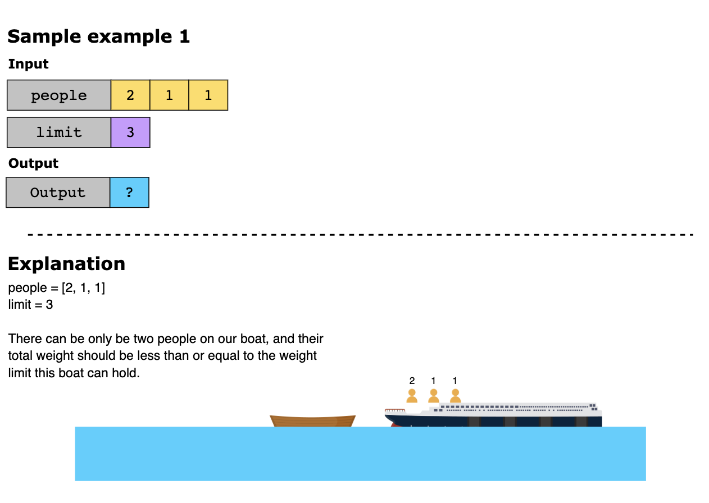
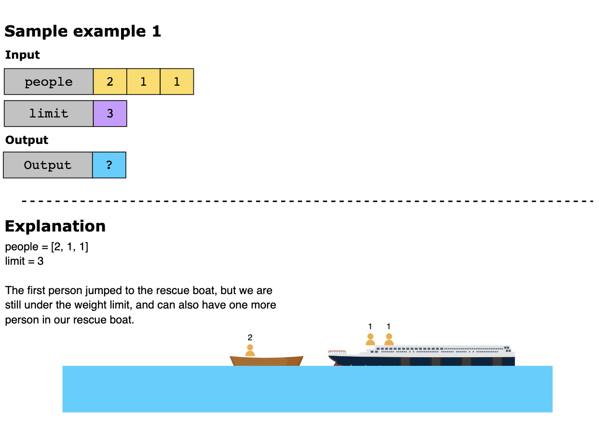
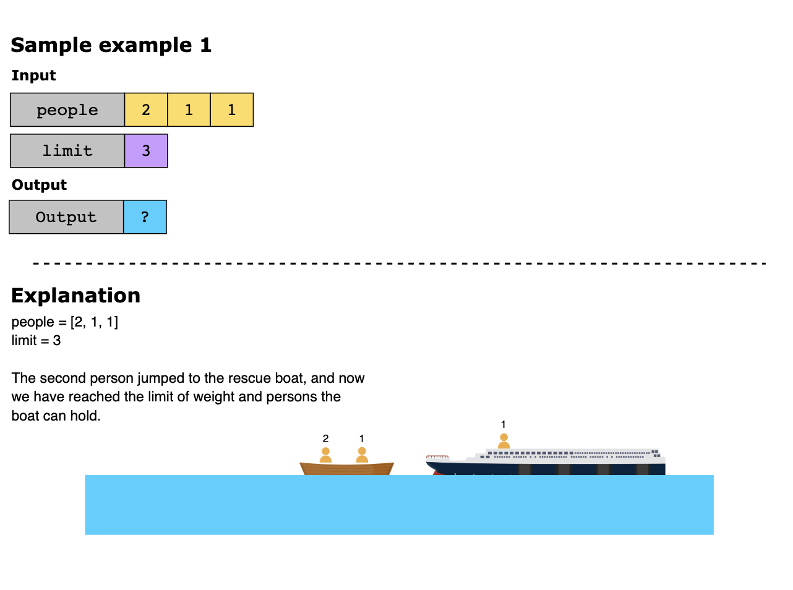
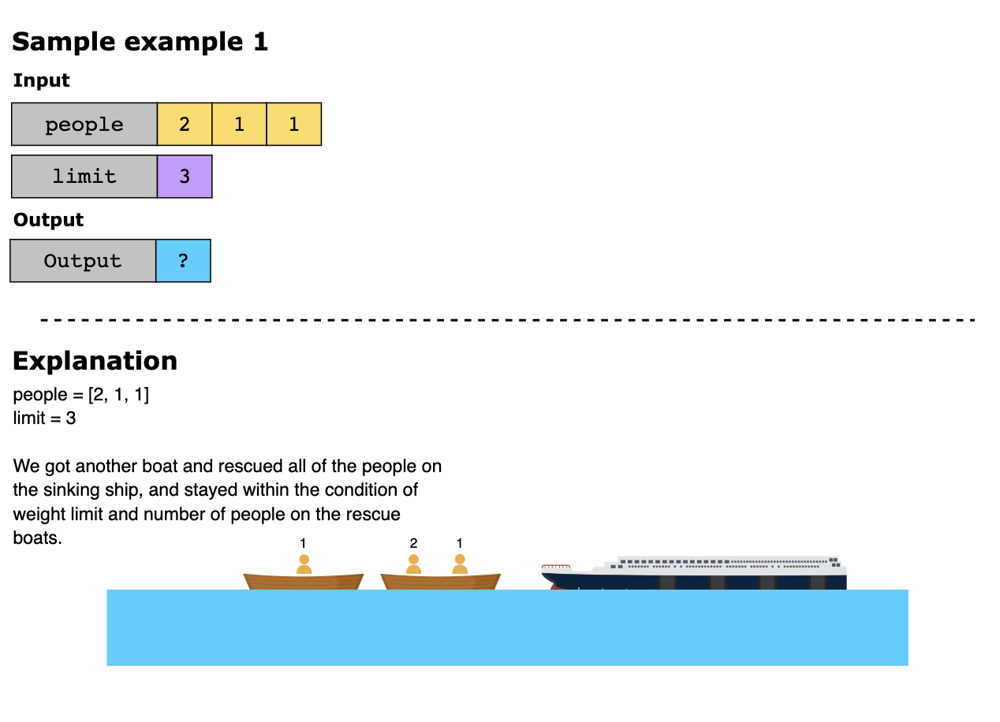
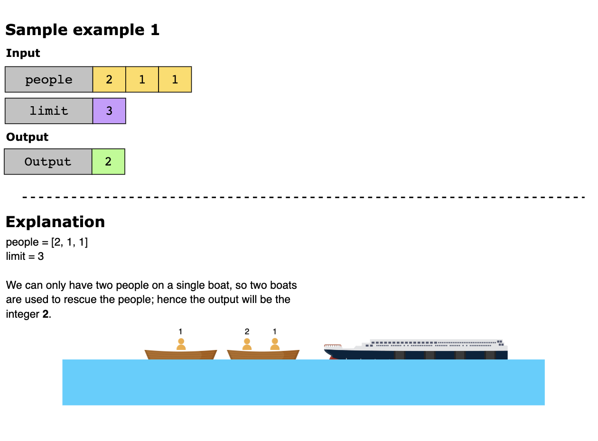

## Solution

1. [Naive Approach](#naive-approach)
2. [Optimized Approach Using Greedy Pattern](#greedy-pattern)

### Naive Approach

The naive approach is to use a nested loop. For each person, we can check all the remaining people to see if they can 
form a pair that fits into a boat. If we find a pair, we’ll remove them from the array, increment the number of boats 
used, and move to the next person. If we can’t find a pair for a person, we put them in a boat alone and increment the 
number of boats used. We repeat this process until all people are rescued.

The time complexity of this approach is O(n^2), since we’ll use the nested loop to make pairs.

### Greedy Pattern

To solve the problem, we can use the greedy pattern and pair people with the lightest and heaviest people available, as 
long as their combined weight does not exceed the weight limit. If the combined weight exceeds the limit, we can only 
send one person on that boat. This approach ensures that we use the minimum number of boats to rescue the people.

The steps to implement the approach above are given below:

1. Sort the people array in ascending order so that the lightest person is at the start of the array, and the heaviest 
   person is at the end.

2. Initialize two pointers, left and right. The left pointer points to the lightest person at the start of the array, 
   and the right pointer points to the heaviest person at the end of the array. Next, a variable, boats, is initialized 
   to 0, representing the number of boats used.

3. Iterate over the people array until the left pointer is greater than the right pointer. This means that all people 
   have been rescued. Perform the following steps in each iteration of the loop 
   - Check if both the lightest and heaviest persons can fit in one boat, i.e., people[left] + people[right] is less 
     than or equal to limit. If they can fit, the left pointer is incremented and the right pointer is decremented.
   - If they cannot fit in one boat, the heaviest person is rescued alone, and the right pointer is decremented. 
   - The boats variable is incremented by 1, representing the number of boats used.

4. Return the minimum number of boats required to rescue all the people.

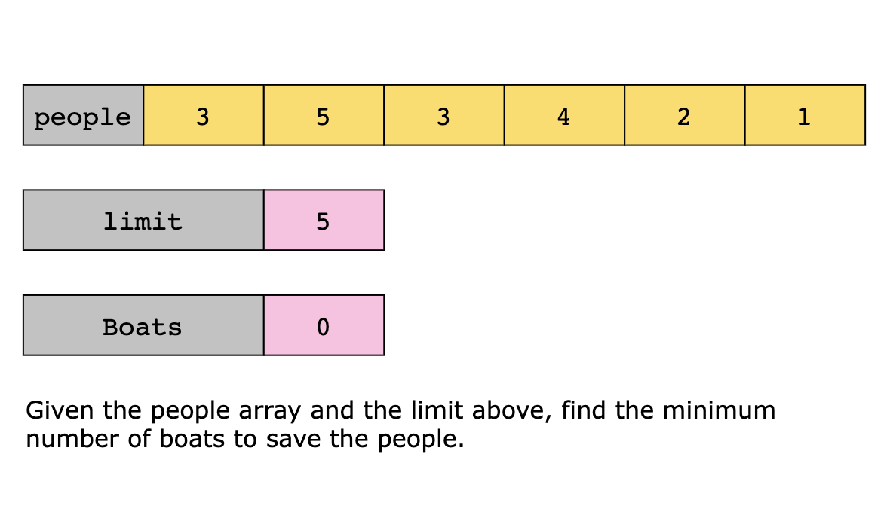
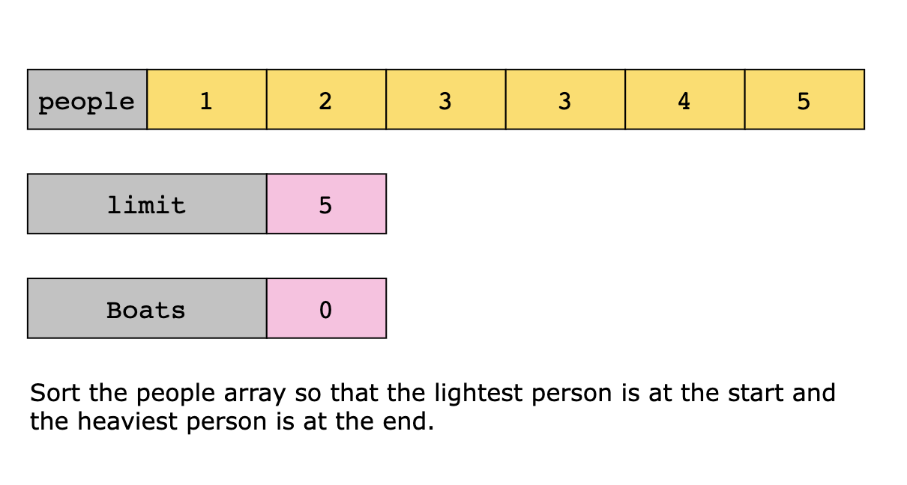
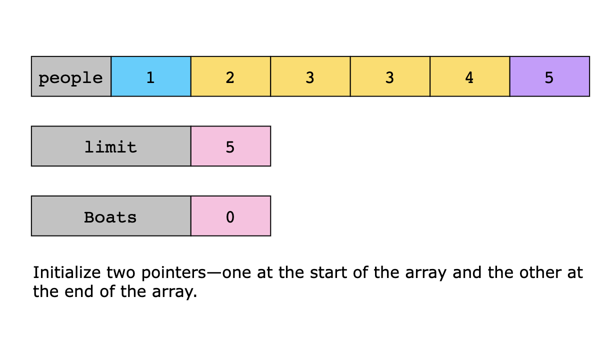
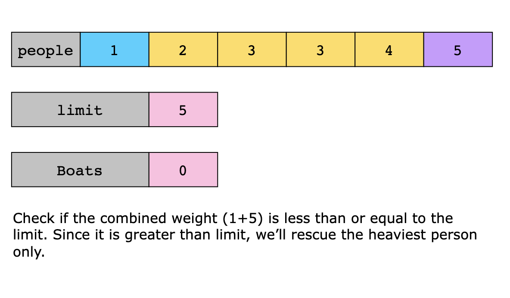
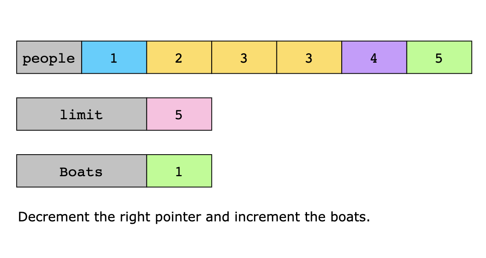
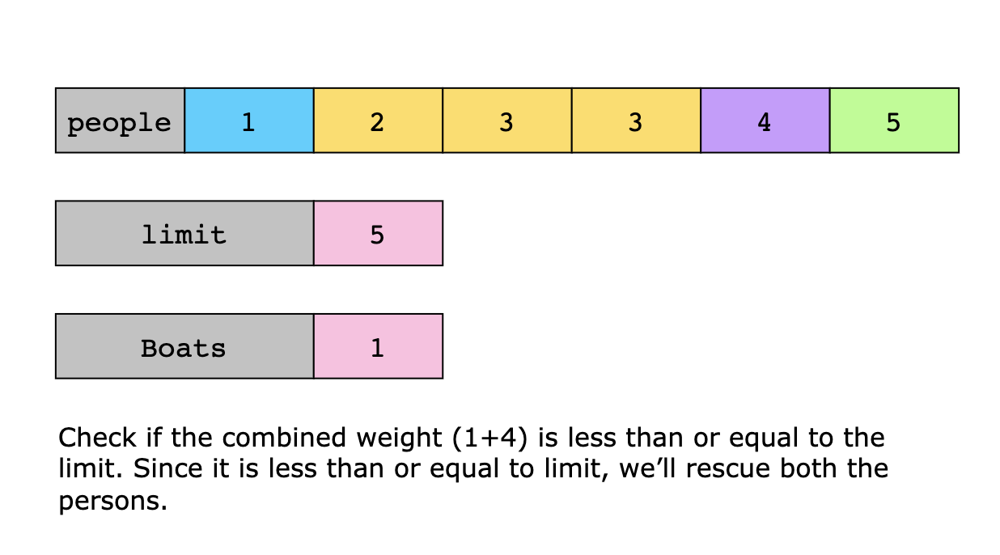
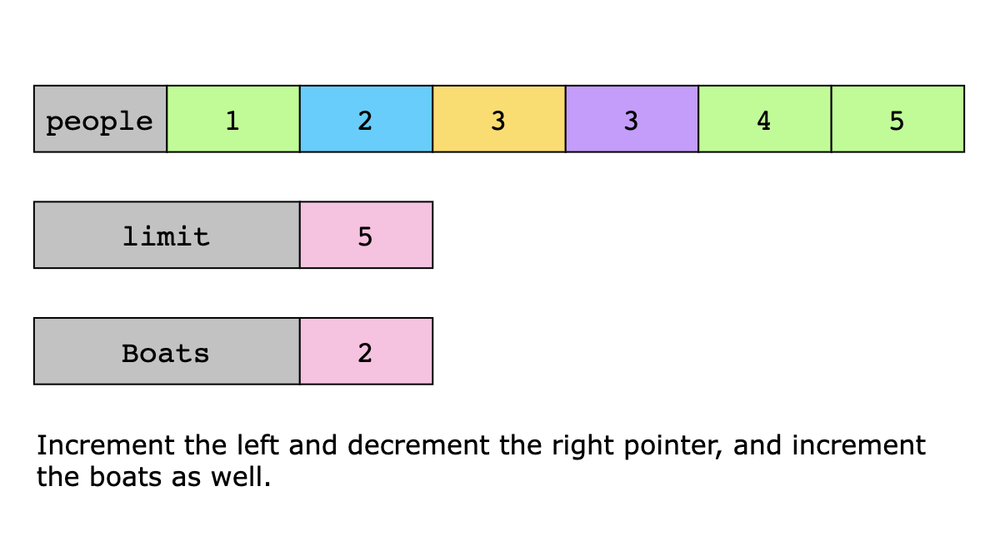
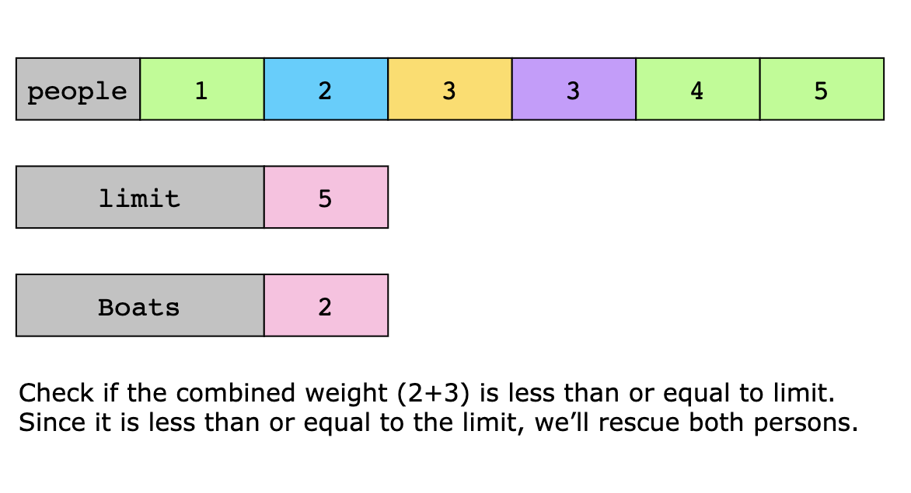
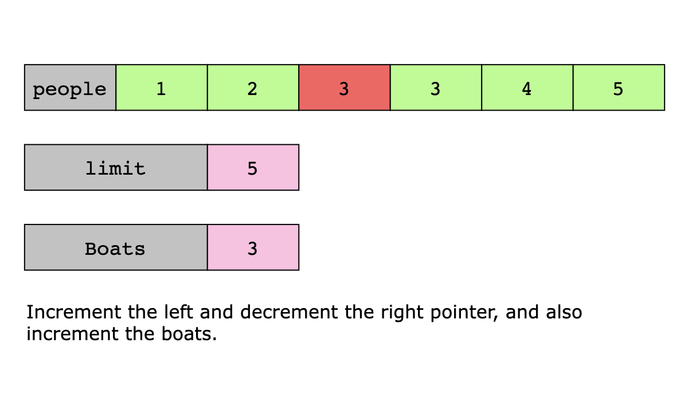
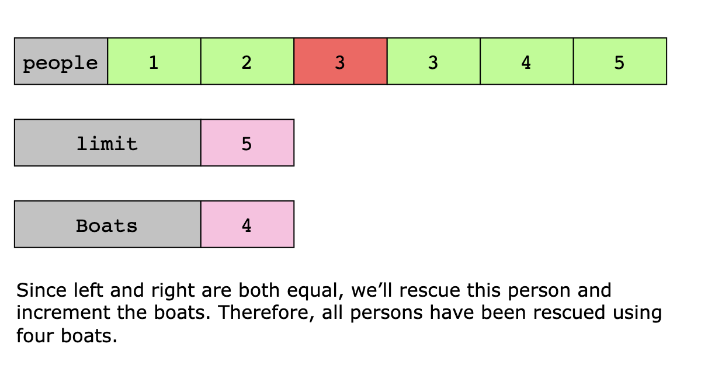

#### Solution Summary

- Sort the people array. 
- Initialize two pointers—left at the start and right at the end of the array. 
- Iterate over the people array while the left pointer is less than or equal to the right pointer.
  - Check if both the lightest and heaviest persons can fit in one boat. If so, increment the left pointer and decrement 
    the right pointer.
  - Otherwise, rescue the heaviest person alone and decrement the right pointer. 
  - Increment the boats after each rescue operation.

#### Time Complexity

The time complexity for the solution is O(n log n), since sorting the people array takes O(n log n) time.

#### Space Complexity

The sorting algorithm takes O(n) space to sort the people array. Therefore, the space complexity of the solution above 
is O(n).

## Topics

- Greedy
- Two Pointers
