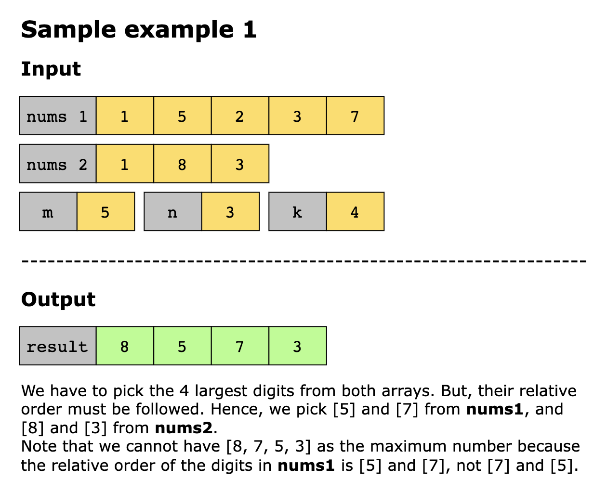
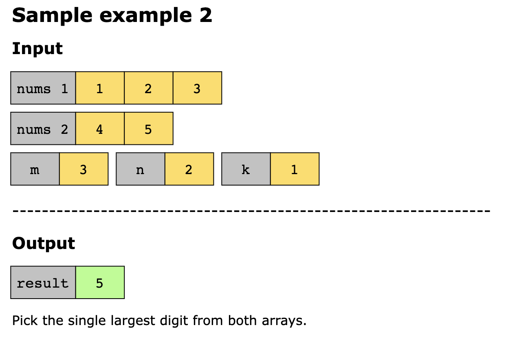
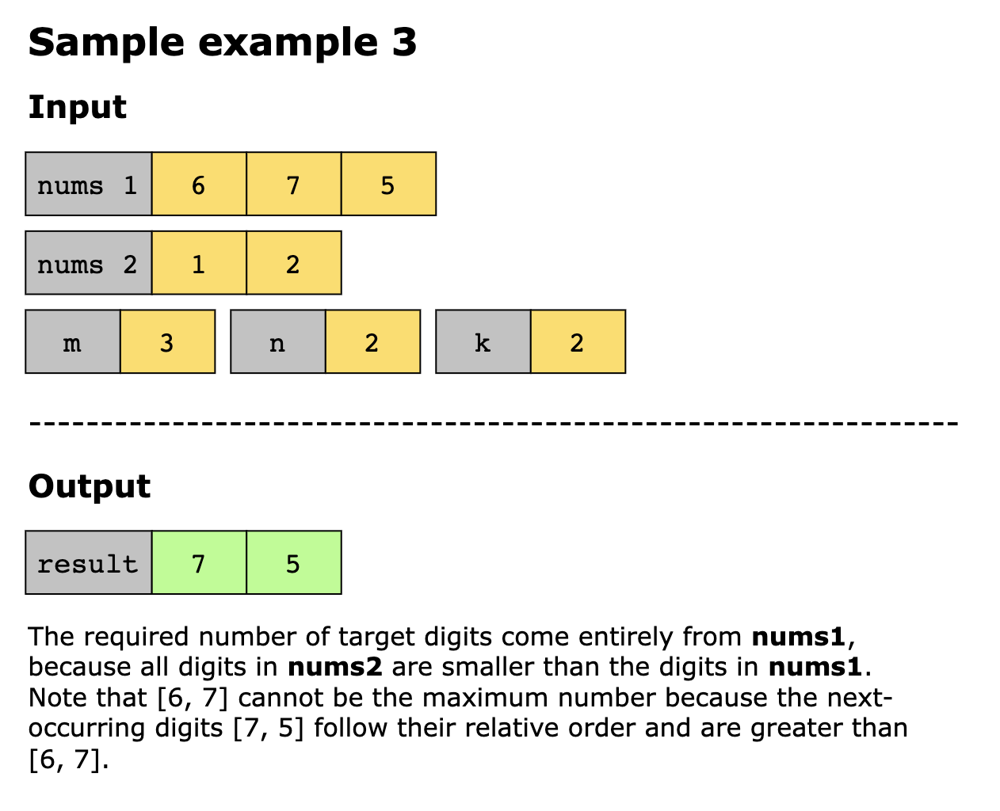
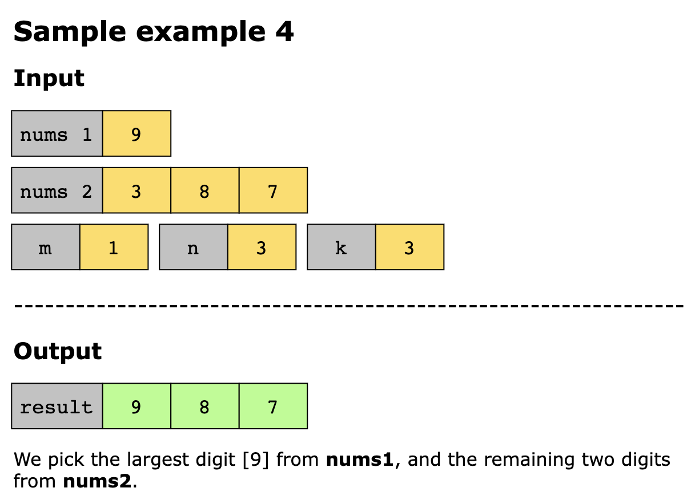
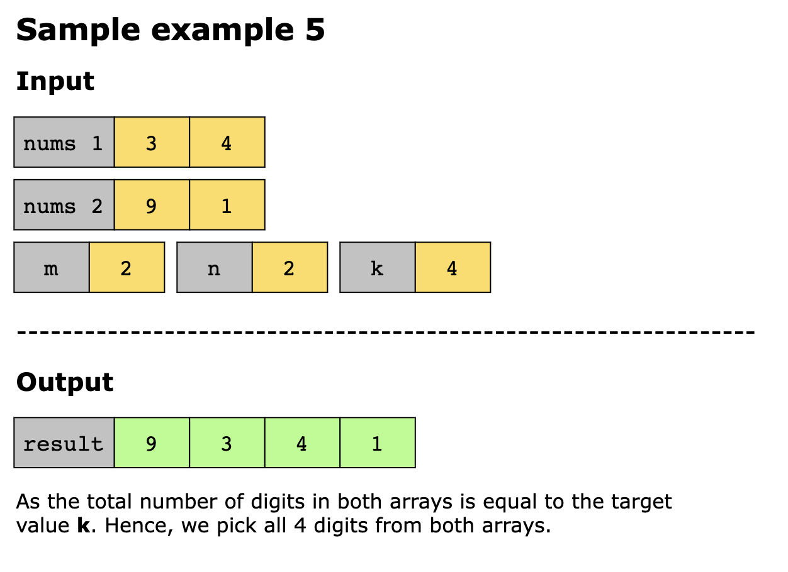

# Create Maximum Number

You are given two integer arrays, nums1 and nums2, of lengths m and n, respectively. Each array represents the digits of
a number.

You are also given an integer k. Create the largest possible number of length k (where k ≤ m + n) using digits from both
arrays. You may interleave digits from the two arrays, but the relative order of digits within the same array must be preserved.

Return an array of k digits representing the maximum number.

## Constraints

- `m` = `nums1.length`
- `n` = `nums2.length`
- 1 < `m`, `n` <= 500
- 0 <= `nums[i]`, `nums2[i]` <= 9
- 1 <= `k` <= `m` + `n`
- `nums1` and `nums2` do not have leading zeros

## Examples

## Topics

- Array
- Two Pointers
- Stack
- Greedy
- Monotonic Stack
