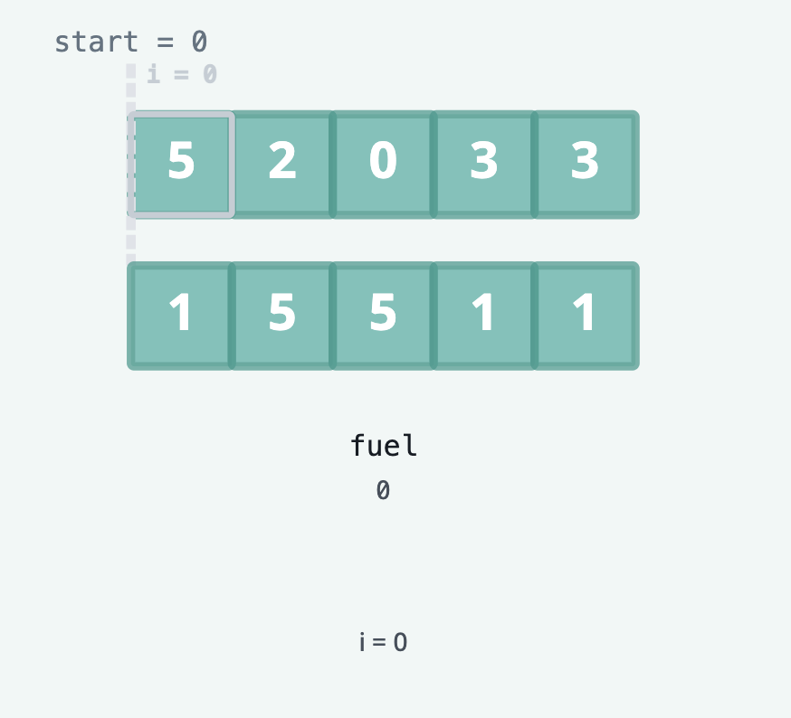
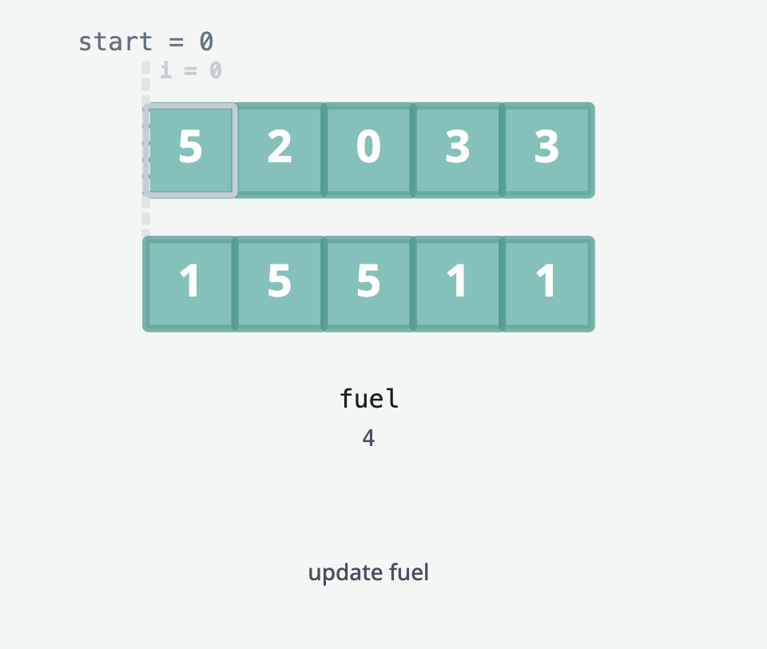
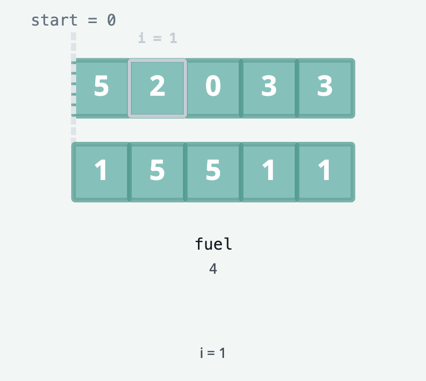
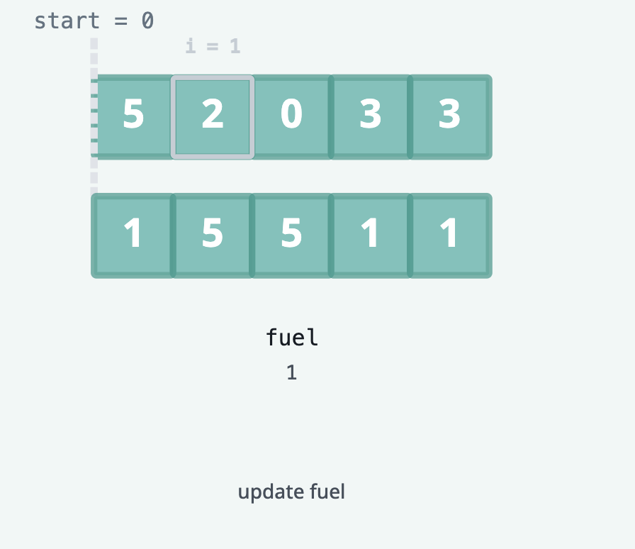
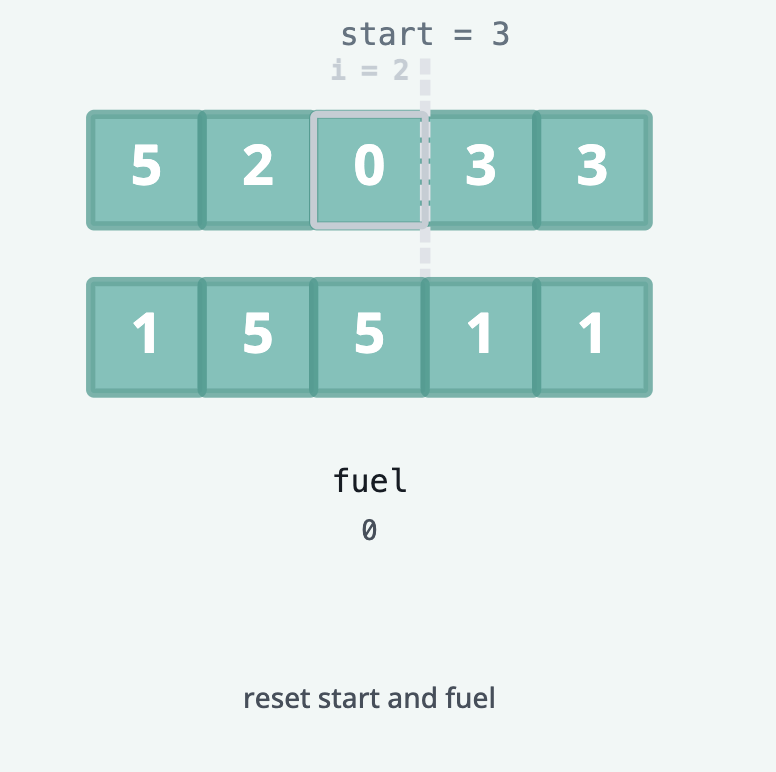
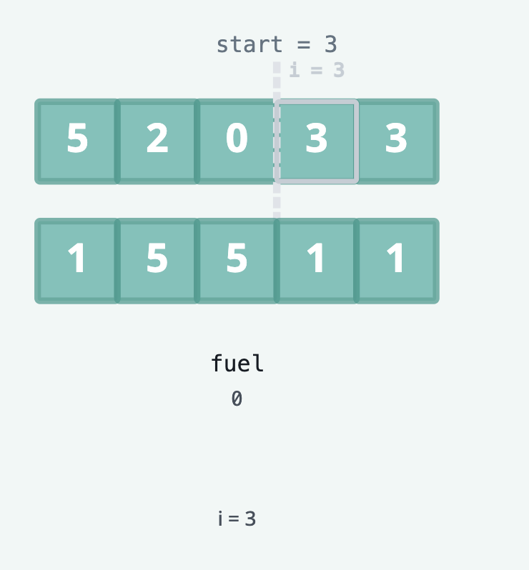
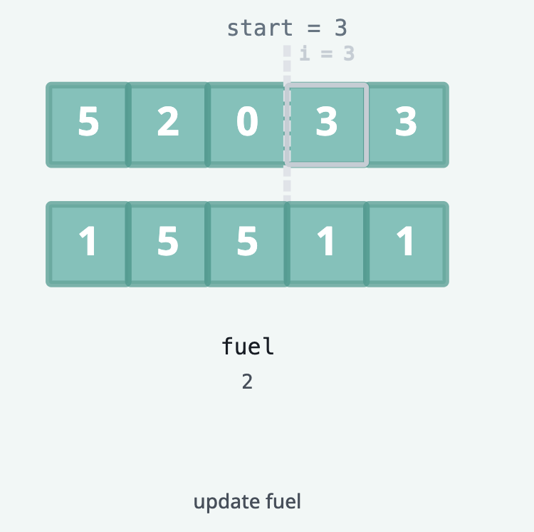
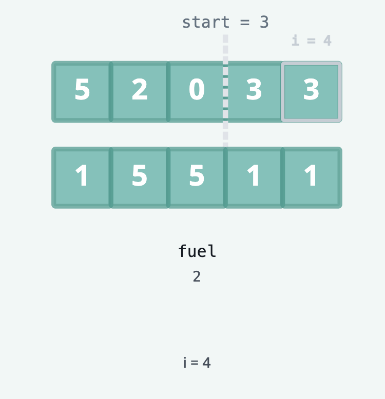
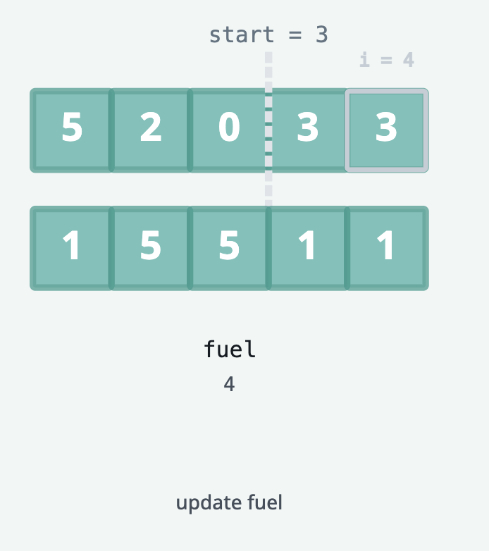
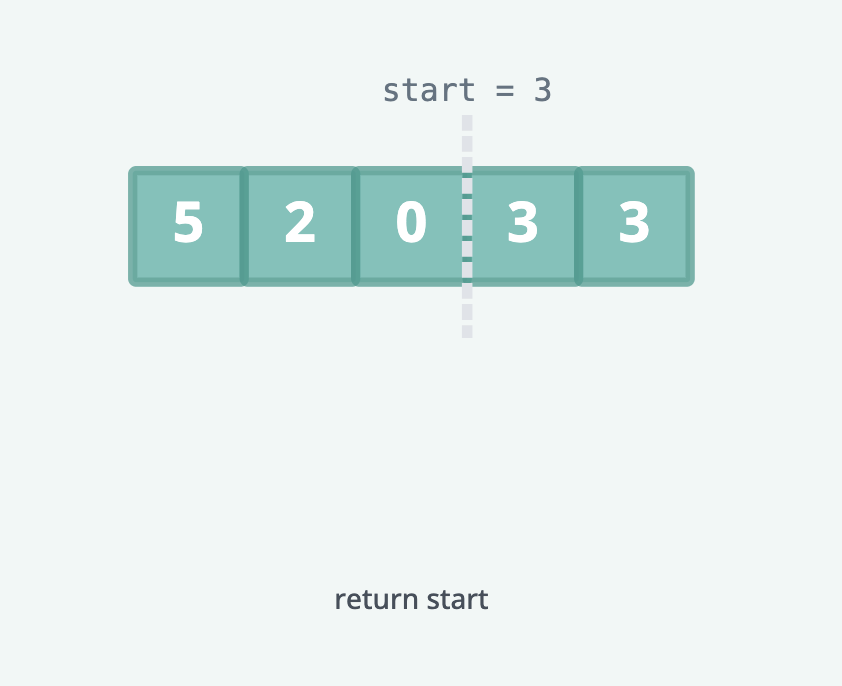

# Gas Station

There are n gas stations along a circular route, where the amount of gas at the ith station is gas[i].

You have a car with an unlimited gas tank and it costs cost[i] of gas to travel from the ith station to its next (i + 1)
th station. You begin the journey with an empty tank at one of the gas stations.

Given two integer arrays gas and cost, return the starting gas station's index if you can travel around the circuit once
in the clockwise direction, otherwise return -1. If there exists a solution, it is guaranteed to be unique

```text

Example 1:

Input: gas = [1,2,3,4,5], cost = [3,4,5,1,2]
Output: 3
Explanation:
Start at station 3 (index 3) and fill up with 4 unit of gas. Your tank = 0 + 4 = 4
Travel to station 4. Your tank = 4 - 1 + 5 = 8
Travel to station 0. Your tank = 8 - 2 + 1 = 7
Travel to station 1. Your tank = 7 - 3 + 2 = 6
Travel to station 2. Your tank = 6 - 4 + 3 = 5
Travel to station 3. The cost is 5. Your gas is just enough to travel back to station 3.
Therefore, return 3 as the starting index.
```

```text
Example 2:

Input: gas = [2,3,4], cost = [3,4,3]
Output: -1
Explanation:
You can't start at station 0 or 1, as there is not enough gas to travel to the next station.
Let's start at station 2 and fill up with 4 unit of gas. Your tank = 0 + 4 = 4
Travel to station 0. Your tank = 4 - 3 + 2 = 3
Travel to station 1. Your tank = 3 - 3 + 3 = 3
You cannot travel back to station 2, as it requires 4 unit of gas but you only have 3.
Therefore, you can't travel around the circuit once no matter where you start.
```

## Topics

- Array
- Greedy

## Solution

If there is more gas along the route than the cost of the route, then there is guaranteed to be a solution to the problem.
So the first step is to check if the sum of the gas is greater than or equal to the sum of the cost. If it is not, then
we return -1.

Next, we iterate through the gas station to find the starting index of our circuit using a greedy approach: whenever we
don't have enough gas to reach the next station, we move our starting gas station to the next station and reset our gas
tank.

We start at the first station, and fill our tank with gas[0] = 5 units of gas. From there, it takes cost[0] = 1 units of
gas to travel to the next station, so we arrive at station 2 (index 1) with 4 units of gas.





At station 2, we fill our tank with gas[1] = 2 units of gas, for a total of 6 units of gas. It takes cost[1] = 5 units
of gas to travel to the next station, so we arrive at station 3 with 1 unit of gas




Now at station 3, we fill our tank with gas[2] = 0 units of gas, for a total of 1 unit of gas. It takes cost[2] = 5 units
of gas to travel to the next station, which we don't have.

This is where our greedy approach comes in. We reset our starting station to the next station i + 1 and reset our gas
tank to 0. We can do this because all other start indexes between 0 and 2 will also run into the same problem of not
having enough gas to reach the next station, so we can rule them out.




If we follow this approach of resetting the start index and gas tank whenever we don't have enough gas to reach the next
station, then when we finish iterating, the last start index will be the solution to the problem.






### Complexity Analysis

#### Time Complexity

O(n) where n is the number of gas stations. We only iterate through the gas stations once.

#### Space Complexity

O(1) We only use constant extra space for variables.
