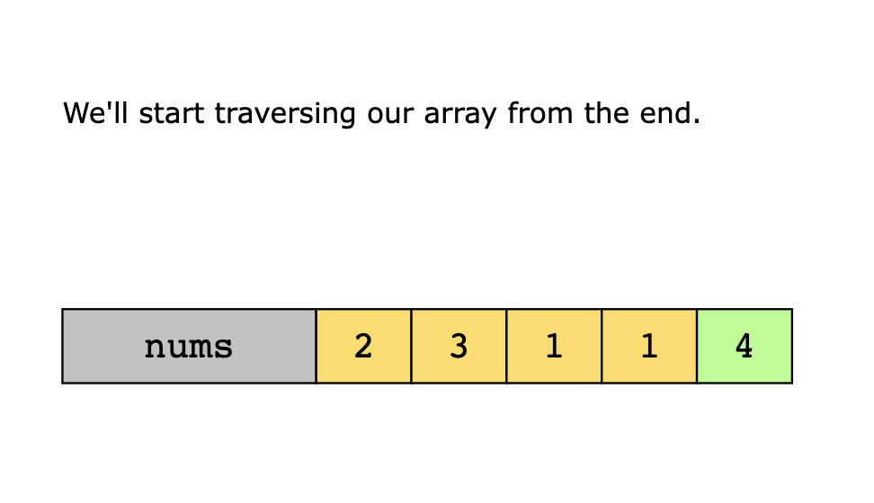
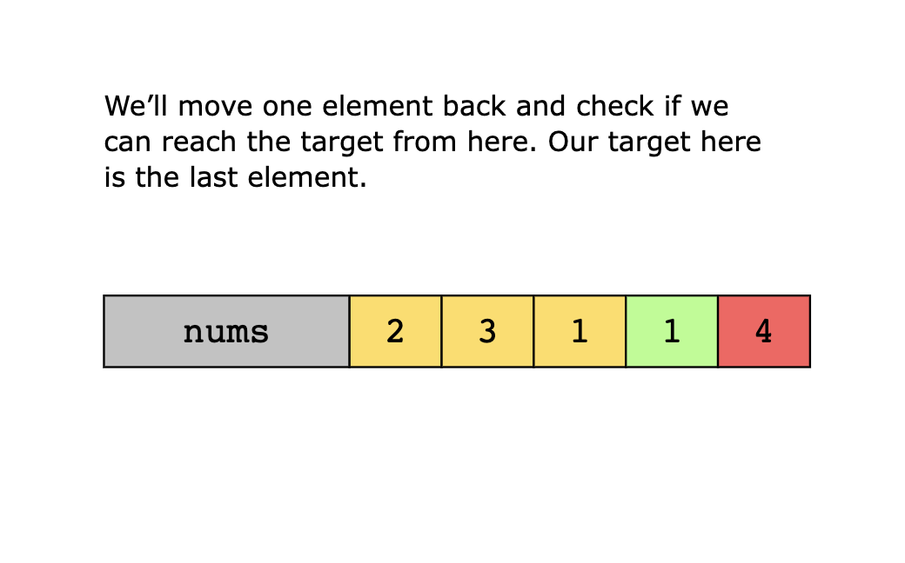
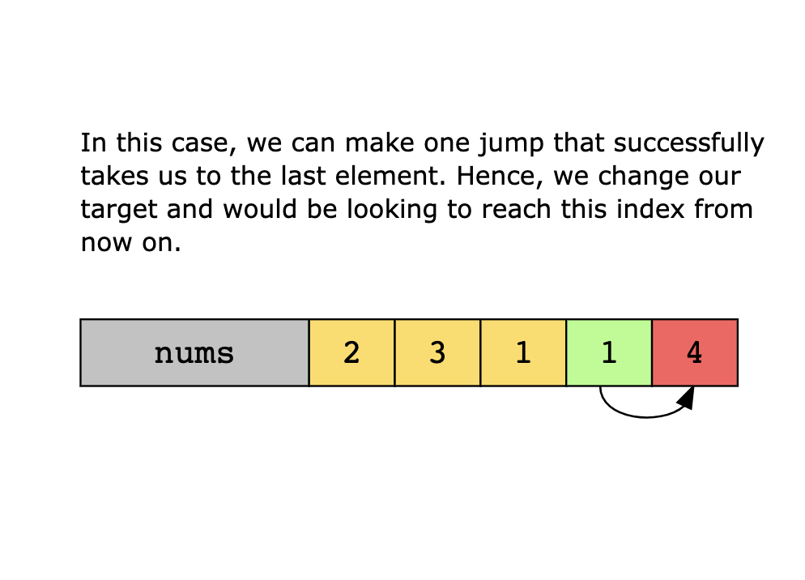
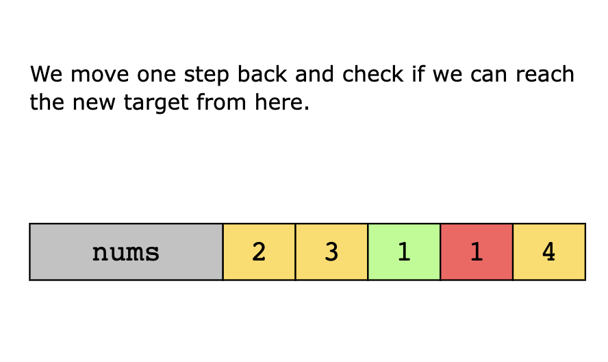
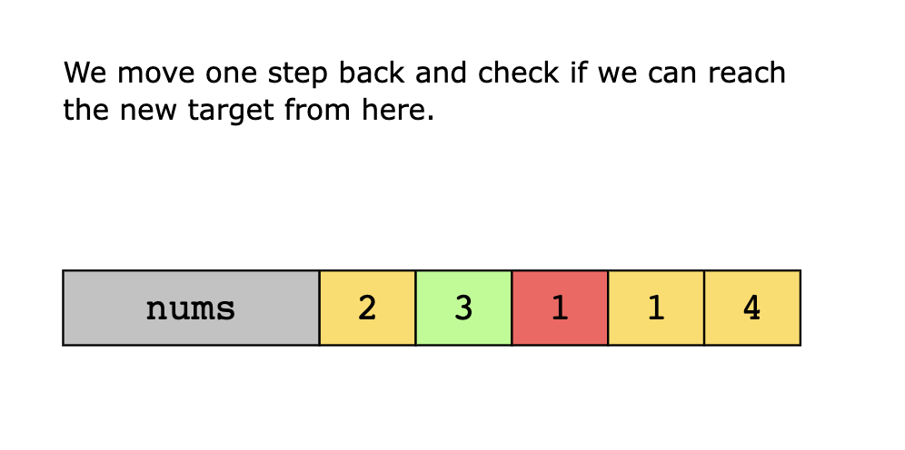
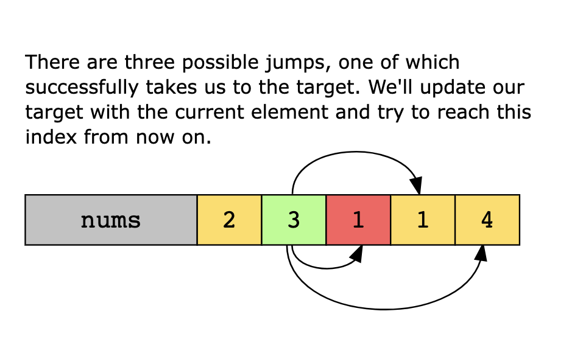
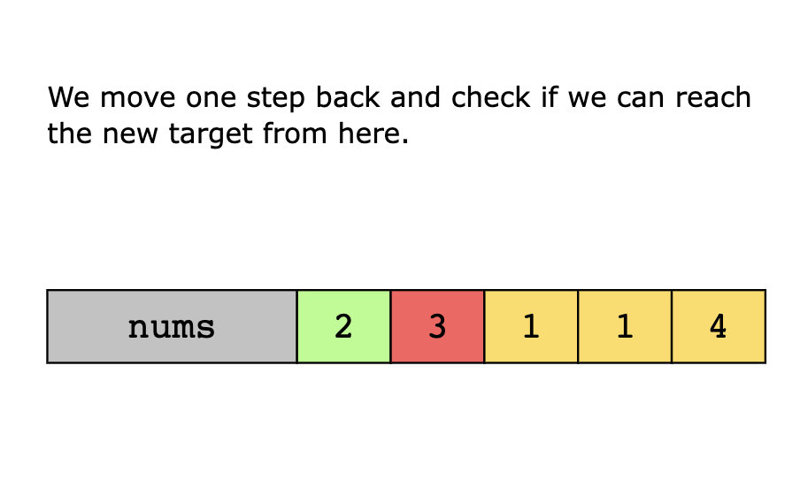
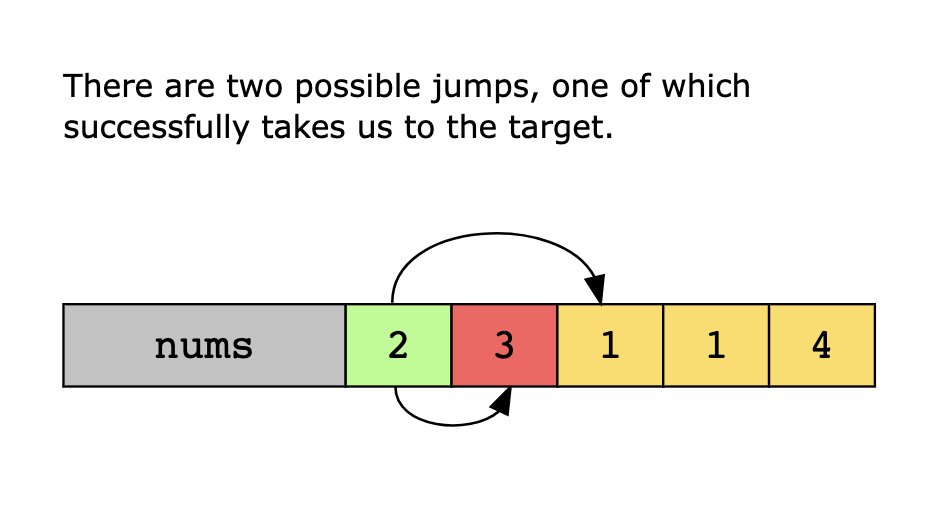
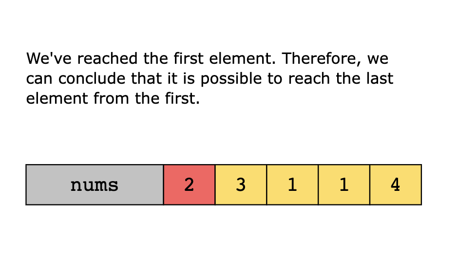

# Jump Game

You are given an integer array nums. You are initially positioned at the array's first index, and each element in the
array represents your maximum jump length at that position.

Return true if you can reach the last index, or false otherwise.

```text
Example 1:

Input: nums = [2,3,1,1,4]
Output: true
Explanation: Jump 1 step from index 0 to 1, then 3 steps to the last index.
```

```text
Example 2:

Input: nums = [3,2,1,0,4]
Output: false
Explanation: You will always arrive at index 3 no matter what. Its maximum jump length is 0, which makes it impossible
to reach the last index.
```

---

## Jump Game II

You are given a 0-indexed array of integers nums of length n. You are initially positioned at nums[0].

Each element nums[i] represents the maximum length of a forward jump from index i. In other words, if you are at
nums[i], you can jump to any nums[i + j] where:

0 <= j <= nums[i] and
i + j < n
Return the minimum number of jumps to reach nums[n - 1]. The test cases are generated such that you can reach
nums[n - 1].

```text
Example 1:

Input: nums = [2,3,1,1,4]
Output: 2
Explanation: The minimum number of jumps to reach the last index is 2. Jump 1 step from index 0 to 1, then 3 steps to
the last index.
```

```text
Example 2:

Input: nums = [2,3,0,1,4]
Output: 2
```

---

## Topics

- Array
- Dynamic Programming
- Greedy

## Solutions

1. [Naive Approach](#naive-approach)
1. [Optimized Approach using Greedy Pattern](#optimized-approach-using-greedy-pattern)

### Naive Approach

The naive approach explores all possible jump sequences from the starting position to the end of the array. It begins 
at the first index and attempts to jump to every reachable position from the current index, recursively repeating this 
process for each new position. If a path successfully reaches the last index, the algorithm returns success. If it 
reaches a position without further moves, it backtracks to try a different path.

While this method guarantees that all possible paths are considered, it is highly inefficient, as it explores many 
redundant or dead-end routes. The time complexity of this backtracking approach is exponential, making it impractical 
for large inputs.

### Optimized Approach using Greedy Pattern

An optimized way to solve this problem is using a greedy approach that works in reverse. Instead of trying every 
possible forward jump, we flip the logic: start from the end and ask, “Can we reach this position from any earlier index?”

We begin with the last index as our initial target—the position we want to reach. Then, we move backward through the 
array, checking whether the current index has a jump value large enough to reach or go beyond the current target. If it 
can, we update the target to that index. This means that reaching this earlier position would eventually allow us to 
reach the end. By continuously updating the target, we’re effectively identifying the leftmost position from which the 
end is reachable.

This process continues until we reach the first index or determine that no earlier index can reach the current target. 
If we finish with the target at index 0, it means the start of the array can lead to the end, so we return TRUE. If the 
target remains beyond index 0, then no path exists from the start to the end, and we return FALSE.













#### Algorithm

1. We begin by setting the last index of the array as our initial target using the variable target = len(nums) - 1. This 
    target represents the position we are trying to reach, starting from the end and working backward. By initializing the 
    target this way, we define our goal: to find out if there is any index i from which the target is reachable based on the
    value at that position, nums[i]. This also sets the stage for updating the target if such an index is found.

2. Next, we loop backward through the array using for i in range(len(nums) - 2, -1, -1). Here, i represents the current 
   index we are analyzing. At each index i, the value nums[i] tells us how far we can jump forward from that position. 
   By checking whether i + nums[i] >= target, we determine whether it can reach the current target from index i. This 
   step allows us to use the jump range at each position to decide if it can potentially lead us to the end.

3. If the condition i + nums[i] >= target is TRUE, the current index i can jump far enough to reach the current target. 
   In that case, we update target = i, effectively saying, “Now we just need to reach index i instead.” If the condition
   fails, we move back in the array one step further and try again with the previous index. 
   We repeat this process until we either:
   - Successfully moving the target back to index 0 means the start of the array can reach the end. In this case, we 
     return TRUE.
   - Or reach the start without ever being able to update the target to 0, which means there is no valid path. In this 
     case, we return FALSE.

#### Solution Summary

1. Set the last index of the array as the target index.
2. Traverse the array backward and verify if we can reach the target index from any of the previous indexes. 
   - If we can reach it, we update the target index with the index that allows us to jump to the target index. 
   - We repeat this process until we’ve traversed the entire array.
3. Return TRUE if, through this process, we can reach the first index of the array. Otherwise, return FALSE.

#### Time Complexity

The time complexity of the above solution is O(n), since we traverse the array only once, where n is the number of 
elements in the array.

#### Space Complexity

The space complexity of the above solution is O(1), because we do not use any extra space.
