# Largest Palindromic Number

You are given a string num consisting of digits from 0 to 9. Your task is to return the largest possible palindromic
number as a string by using some or all of the digits in num.

The resulting palindromic number must not have leading zeros.

> Note: You may reorder the digits freely, and you must use at least one digit from the num string.

## Constraints

- 1 <= `num.length` <= 1000
- `num` consists of digits

## Examples

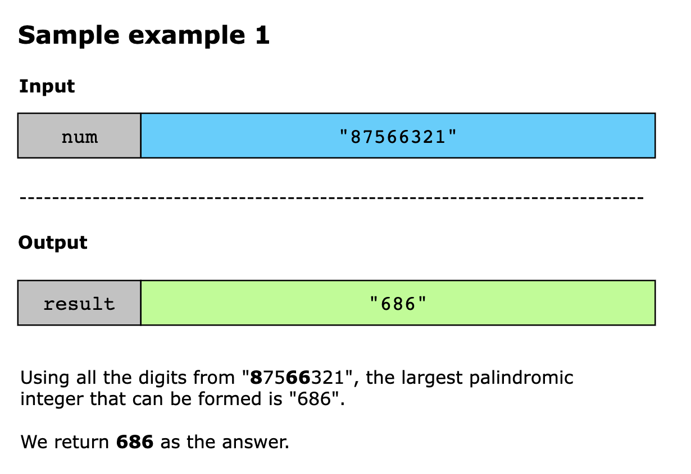

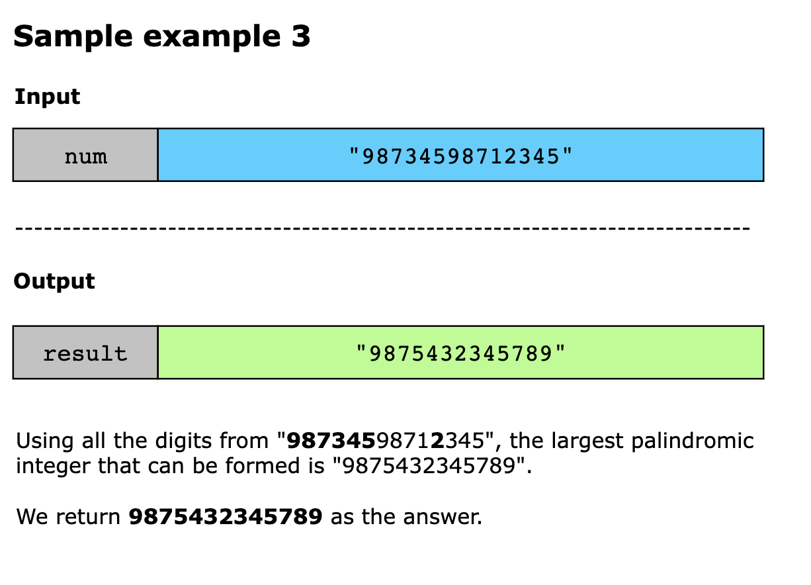

## Solution

We will use the greedy pattern to solve this problem. The goal is to maximize the size of the palindrome by making
locally optimal choices at each step. Specifically, we aim to form the largest possible palindrome by first prioritizing
using the highest digits.

The process begins by counting the frequency of each digit in the input string and storing it in a hash table. This
allows us to determine how many times each digit appears. Starting with the highest digit, i.e., 9, and working down to
the lowest, i.e., 0, we try to use the possible pairs of each digit to form the first half of the palindrome. This
ensures that the most significant positions in the palindrome are filled with the largest digits. Out of the leftover
single digits, the highest possible digit can be used as the middle digit to further enhance the size of the palindrome.

Finally, the palindrome is completed by appending the reverse of the first half to itself, with the middle digit in
between, if applicable. This greedy strategy works effectively because it ensures that each decision made is the best
possible choice at that moment, leading to an overall optimal solution. 

Let’s review the algorithm to reach the solution:

- Initialize the frequency counter occurrences to count the frequency of each digit in the input string num.
- We also initialize the first_half array to note down the first part of the palindrome and the middle string to track
  the middle element of the palindrome.
- Traverse digits from 9 to 0 and for each digit do the following:
  - Check if its pairs can be made by looking at its frequency. If yes, then add it to the first_half array. 
  - If applicable, check for the leading zeros and avoid them by explicitly setting their occurrence to 1. 
  - Otherwise, check if it can be the middle element of the palindrome. Following the greedy approach, ensures that a
    larger number is selected to be the middle element among the elements occurring once.

- Once we have processed all the elements of the num array, we join the first_half, middle, and reverse of the first_half. 
- Finally, we return this palindromic number, the largest that can be generated using the given number.

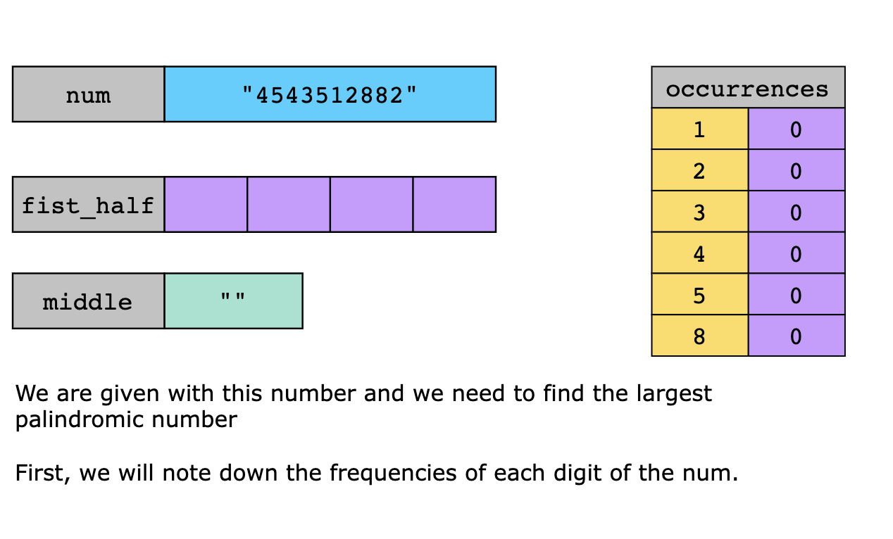
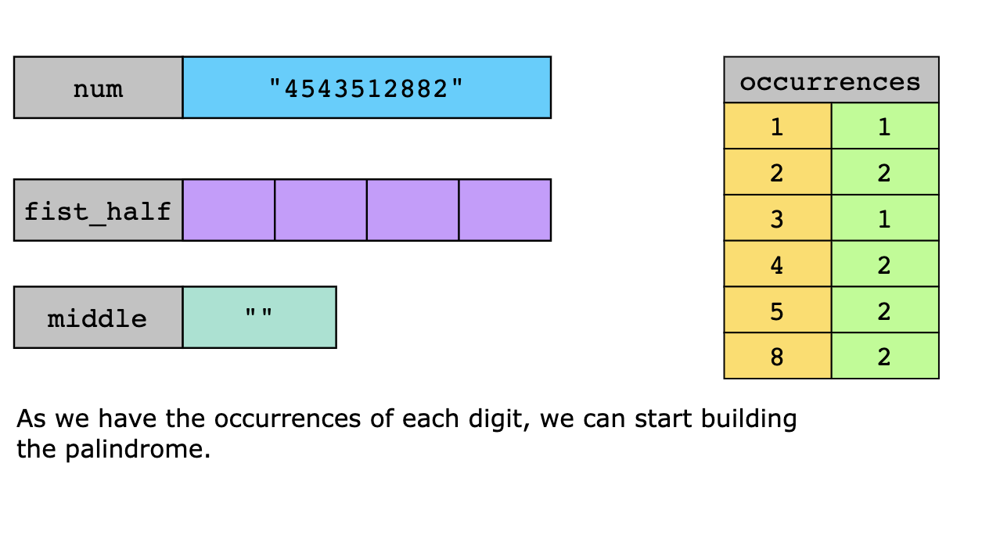
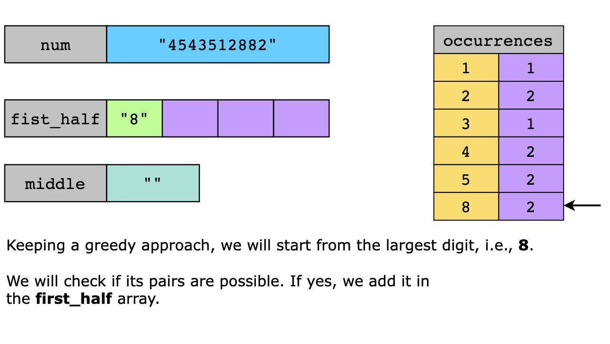
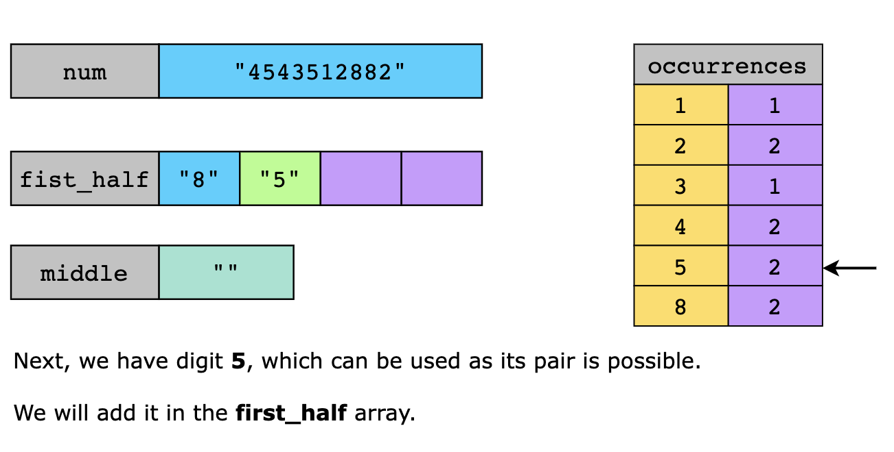
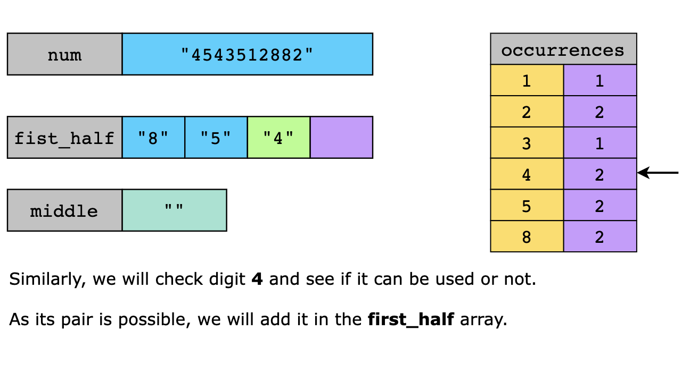
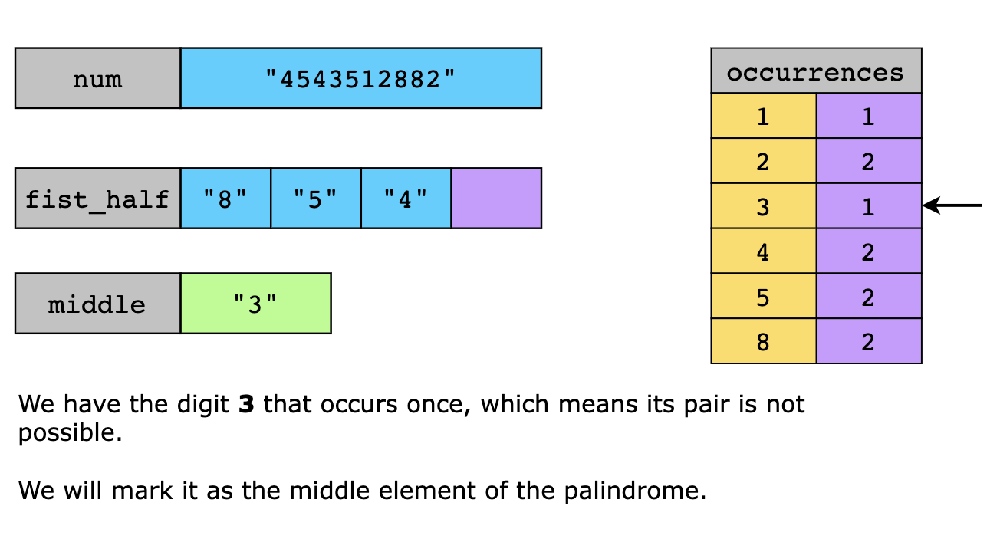
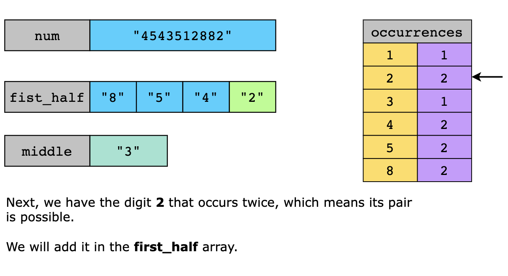
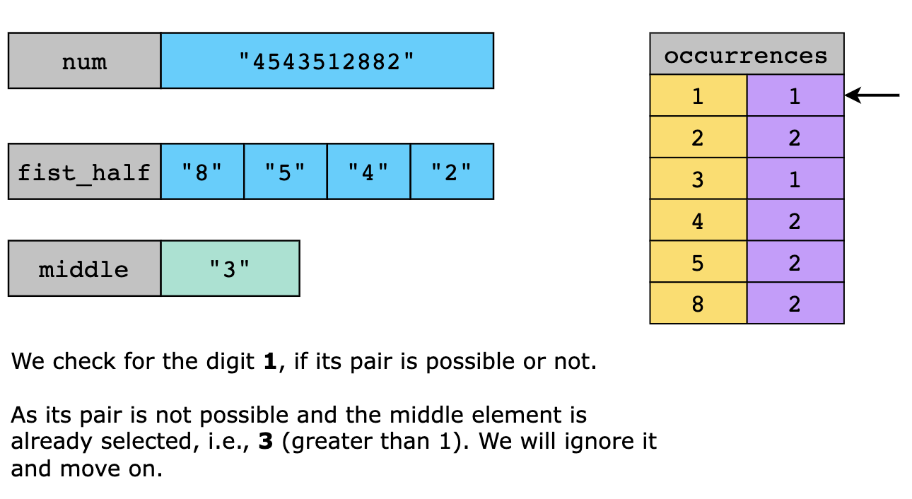
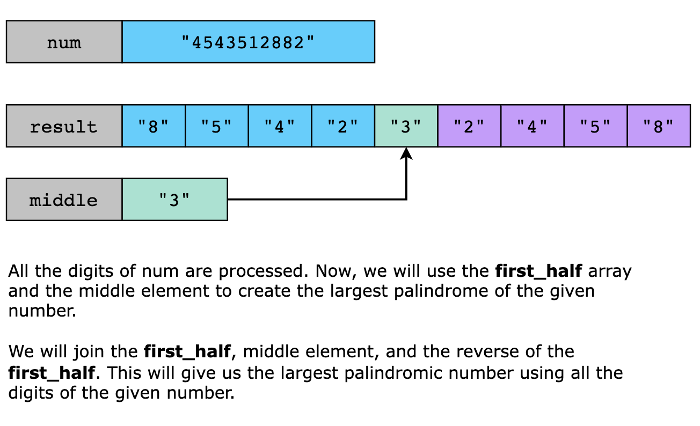

### Time Complexity

The time complexity of the solution is O(n), where n is the length of the num string.

### Space Complexity

The space complexity of the solution is O(n). In the worst case, first_half could store up to n/2 digits if all digits
are the same. Therefore, the space for first_half is O(n).
