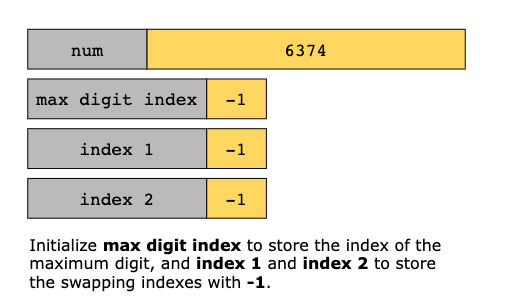
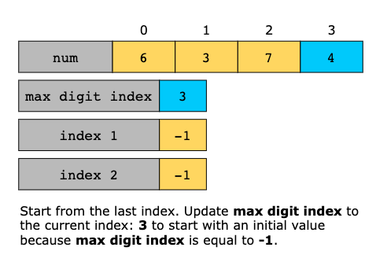
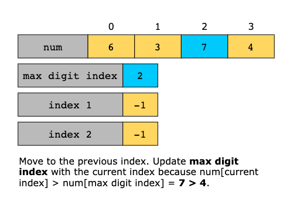
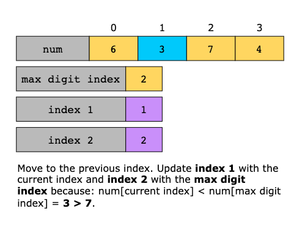
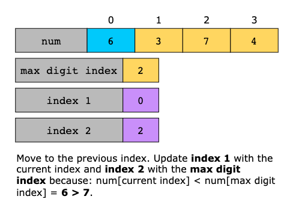
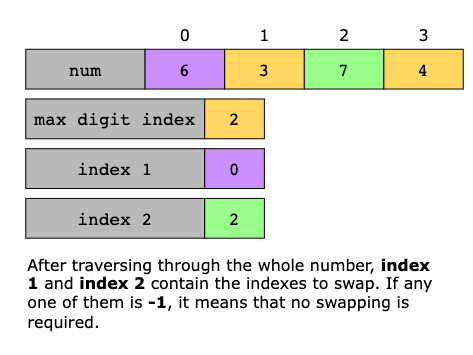
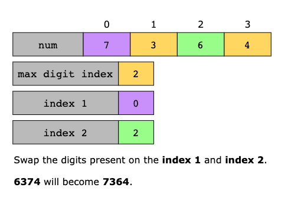
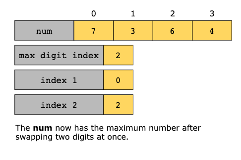

# Maximum Swap

Given an integer num, return the maximum number that can be formed by swapping at most two digits once.

## Constraints

- 0 <= `num` <= 10^5

## Examples

Example 1:
```text
Input: num = 2736
Output: 7236
Explanation: Swap the number 2 and the number 7.

```

Example 2:
```text
Input: num = 9973
Output: 9973
Explanation: No swap.
```
 
## Topics

- Math
- Greedy

## Solution(s)

1. [Brute Force](#brute-force)
2. [Greedy Two Pass](#greedy-two-pass)
3. [Suboptimal Greedy](#suboptimal-greedy)
4. [Space Optimized Greedy](#space-optimized-greedy)

### Brute Force

One approach would be to consider all possible swaps by swapping each pair of digits and returning the largest resulting
integer.

We convert the number to a string so that individual digits can be easily accessed and manipulated. This allows us to
treat the number as an array of characters, making it easier to swap positions without the complexities involved in
extracting digits mathematically. Once in string form, we swap every digit with each digit after it to check all possible
outcomes. After each swap, we convert the modified string back to an integer and keep track of the largest value we
encounter.

**Algorithm**

- Convert the integer num to a string numStr for easy manipulation of its digits. 
- Determine the size of numStr and initialize maxNum to num to track the maximum number found. 
- Use a nested loop to try all possible swaps of digits in numStr:
  - The outer loop iterates through each digit with index i. 
  - The inner loop iterates through the subsequent digits with index j (starting from i + 1).
  - Inside the inner loop:
    - Swap the digits at indices i and j in numStr. 
    - Convert the modified numStr back to an integer and update maxNum if the new number is larger. 
    - Swap the digits back to restore the original string for the next iteration.
- After exploring all possible swaps, return maxNum, which contains the largest number achievable through any single swap of digits.

#### Complexity Analysis

Let n be the number of digits in the input number.

##### Time Complexity

The outer loop iterates through each digit (from 0 to n−1), and for each digit, the inner loop also iterates through
the remaining digits (from i+1 to n−1). This results in (n(n−1)) / 2 possible swaps, leading to quadratic time complexity.
Each swap involves:
- Performing a swap operation (constant time). 
- Converting the modified string back to an integer takes O(n) time due to the length of the string.

Therefore, the total time complexity combines these two aspects, resulting in O(n^2⋅n)=O(n^3) for this specific
implementation. However, since the main constraint is derived from the nested loops alone, the simplified consideration
will generally focus on O(n^2).

##### Space Complexity

The space complexity arises from converting the integer to a string, which requires additional space proportional to the
number of digits n in the number. No additional data structures that grow with input size are used, hence the overall
space complexity is primarily determined by this string conversion. Thus, it is O(n).

---
### Greedy Two Pass

Approach 1 is inefficient because not all swaps are worth making. Let's consider an approach where we focus only on swaps
that will give us the biggest improvement.

Can we identify a pattern in the results that will help us identify the best swap? If we think through some examples, it
can be observed that in each example the optimal swap involves moving the largest digit we can move forward to replace a
smaller one.

To achieve this, we make two passes over the number. In the first pass, we scan from right to left to identify and store
the largest digit we find and its position.

In the second pass, we move from left to right. Now that we know, for each position, the largest digit that appears after
it, we check if we can make a swap. The first time we find a digit that is smaller than the largest one that comes after
it, we swap them. Since we’re always looking for the largest possible swap, this guarantees that we’ll maximize the number.

> **Inductive Proof for the Two-Pass Greedy**
> 
> **Base Case**:
> 
> For a one-digit number `N=d0`, no swaps are possible, so the number itself is the maximum. The approach is trivially
> correct here.
> 
> **Inductive Hypothesis**
> 
> Assume the two-pass method works for any number with k digits, yielding the maximum possible number after making the
> best swap.
> 
> **Inductive Step**
> 
> Consider a number with k+1 digits, represented as d0, d1,...,dk.
> 
> 1. First Pass (Right-to-Left):
> As we move from dk to d0, we track the largest digit found so far on the right and store its position. For any
> position i, let Mi be the largest digit to the right of di.
> 
> 2. Second Pass (Left-to-Right):
> We then move from d0 to dk, and for each di, check if di < Mi. If so, we swap di with Mi, giving us the largest
> possible improvement. Since we make the first maximizing swap, this guarantees that the result is the maximum possible
> number after one swap. 
> 
> Since our hypothesis holds for k digits, and the two-pass strategy maximizes the number for k+1 digits, the method
> works for all n-digit numbers by induction. Thus, the two-pass greedy approach will always yield the maximum possible
> number in a single swap.
> 

**Algorithm**

- Convert the integer num to a string numStr to facilitate digit manipulation. 
- Determine the length n of the string representation. 
- Initialize an array maxRightIndex of size n to store the index of the largest digit from the current position to the
  end of the string. 
- Populate maxRightIndex in a single backward pass:
  - Set maxRightIndex[n - 1] to n - 1, as the last digit is the largest in its own right. 
  - Iterate from the second last digit to the beginning of the string:
    - If the current digit numStr[i] is greater than the digit at the index stored in maxRightIndex[i + 1], update
      maxRightIndex[i] to i.
    - Otherwise, keep maxRightIndex[i] as maxRightIndex[i + 1].
  - In a second pass, check for the first opportunity to swap for maximum value:
    - Iterate through each digit in numStr:
      - If the current digit numStr[i] is less than the digit at the index maxRightIndex[i], a beneficial swap can be made. 
        - Swap numStr[i] with numStr[maxRightIndex[i]] to maximize the number. 
        - Convert the modified string back to an integer and return it immediately.
- If no beneficial swap is found throughout the iterations, return the original number num.

#### Complexity Analysis

Let n be the number of digits in the input number.

##### Time Complexity

Converting the integer num to its string representation takes `O(n)`.

We iterate through the digits from right to left, making one comparison per digit. This pass takes O(n) time.

We iterate from left to right, checking whether the current digit is smaller than the maximum digit to its right. This
also takes O(n) time.

Converting the modified string back to an integer takes O(n) time.

Overall, each operation in the algorithm takes linear time, so the total time complexity is O(n).

##### Space Complexity

We store the string representation of the number, which requires O(n) space.

We maintain an array maxRightIndex of size n, which also takes O(n) space.

The space used by simple variables like num and loop counters is constant, i.e., O(1).

Thus, the total space complexity is O(n).

---
### Suboptimal Greedy

A natural follow-up question is: can we simplify this even more? Let's see if we can reduce our approach by using a
pass to record the last occurrence of each digit in the given integer, and then use that information to find an optimal
swap (if one exists).

Let's walk through what this would look like using Example 1 from the problem description:

We'll do one scan from left to right, noting the positions of the digits in the number (2, 7, 3, and 6):

- Last occurrence of 2: index 0
- Last occurrence of 7: index 1
- Last occurrence of 3: index 2
- Last occurrence of 6: index 3

Next, we'll use the stored values to check if there are any small values with larger values that follow:

- We start with '2' and check if any larger digits appear later in the number. In the case of 2736, we compare '2' with
  '7', '3', and '6'.
- Since '7' is the largest digit that appears after '2', we choose '7' as the best swap.

> **Inductive Proof for Suboptimal Greedy**
> 
> **Base Case**:
> 
> For a single-digit number `N=d0`,
> no swaps are possible, so the number itself is the maximum. Therefore, the approach is trivially correct here.
> 
> **Inductive Hypothesis**
> 
> Assume that for any k-digit number, the Suboptimal method will yield the maximum possible number by identifying the
> optimal swap or determining that no swap can improve the result.
> 
> **Inductive Step**
> Now, consider a number with k+1 digits represented as d0, d1,...,dk
> 
> 1. Record the Last Occurrence of Each Digit:
> We first perform a single pass over the number to store the last occurrence of each digit in an array `lastOccurrence`.
> This way, for each digit di, we can quickly look up whether a larger digit appears later in the number.
> 
> 2. Find the Optimal Swap:
> As we scan from left to right, we check each digit di to see if a larger digit appears later in the sequence by looking
> up the last occurrence of digits from 9 down to di+1. If we find such a digit, we swap di with the rightmost largest 
> possible digit that improves the number. This ensures the largest possible improvement as soon as we encounter the
> first digit that can be swapped for a higher value.
> 
> 3. Optimality fof the First Swap
> By following this process, we always select the first digit that can be maximized with a single swap. Since we’re
> making the swap at the leftmost possible position where an improvement can occur, we ensure that the resulting number
> is maximized in the most significant digit first. Consequently, any swap we make will yield the highest possible value
> at the earliest digit position, thereby producing the maximum number achievable by one swap.
> 
> **Conclusion**
> 
> Since the approach works for k-digit numbers and we’ve shown that it holds for k+1 digits as well, the principle of
> induction confirms that this Suboptimal method will always yield the maximum number for any integer length.

**Algorithm**

- Convert the input integer num to a string numStr to facilitate digit manipulation. 
- Get the length n of numStr. 
- Initialize an array lastSeen of size 10, filled with -1, to store the last occurrence index of each digit (0-9). 
- Record the last occurrence of each digit:
  - For each index i in numStr, update lastSeen[numStr[i] - '0'] to i, which stores the last position of each digit.
- Traverse the digits in numStr to find the first digit that can be swapped with a larger one:
  - For each index i, iterate d from 9 down to numStr[i] - '0':
    - If lastSeen[d] > i, it means there exists a larger digit d that can be swapped with numStr[i]. 
      - Perform the swap between numStr[i] and numStr[lastSeen[d]]. 
      - Immediately return the integer value of the modified string using stoi(numStr).
- If no swap has been performed throughout the iteration, return the original number num since it is already maximized.

#### Complexity Analysis

Let n be the number of digits in the input number.

##### Time Complexity

Converting the integer num to its string representation takes O(n).

We loop through the string numStr to fill the lastSeen array, which takes O(n) time.

The outer loop runs n times (once for each digit), and for each digit, the inner loop runs at most 9 times (since there
are at most 9 different digits larger than the current one to check). Thus, the traversal and comparison step takes
O(9n)=O(n) time.

Converting the modified string back to an integer takes O(n) time.

Overall, all steps are bounded by O(n), so the total time complexity is O(n).

##### Space Complexity

The string numStr requires O(n) space to store the digits of the integer num.

The array lastSeen is of fixed size 10 (for digits 0 through 9), so it takes O(1) space.

No other significant additional space is used.

Thus, the overall space complexity is dominated by the space needed to store the string, which is O(n).

---

### Space Optimized Greedy

The problem involves maximizing a number by swapping two digits at most once. The key idea is to find a smaller digit
on the left and a larger digit on the right that can be swapped to create the largest possible number. By scanning the
digits from right to left, we can identify the optimal pair for swapping in a single pass, ensuring efficiency. This
approach uses a greedy algorithm, as it makes the best possible decision at each step to maximize the number.

We start by scanning the number from right to left. As we move, we keep track of the largest digit we’ve encountered.
Whenever we come across a smaller digit, we consider it a candidate for swapping with the largest one we’ve seen.

So we compare each digit with the maximum digit to its right. If it’s smaller, we mark it for swapping. By the time we
finish scanning the number, we’ll know the best swap to make. If we find a smaller digit and a larger one to swap it with,
we perform the swap. Otherwise, we leave the number unchanged.

This way we can save space by not needing to track all positions, and it works because, as we move from right to left,
we are always aware of the largest possible swap we could make.

Here’s the step-by-step implementation of the solution:

1. Convert the input number to a string and then to a list of digits. This allows easy manipulation of individual digits.
2. Initialize variables:
   - `n` to store the length of `digits`.
   - `max_digit_index` to track the index of the maximum digit encountered so far (starting from the right). This is
     initialized to -1
   - Use `index_1` and `index_2` to track the indices of the two digits to be swapped. Initially, set these to −1 to
     indicate no valid swap has been found.

3. Traverse the list of digits from the least significant (rightmost) to the most significant (leftmost). For each digit:
   - If the `max_digit_index` is -1 or the current digit is greater than the digit on `max_digit_index`, update the
     `max_digit_index` to the current index, indicating that a new maximum digit has been found
   - Otherwise, if it’s smaller, update `index_1` and `index_2` to potentially mark these digits to be swapped. So, mark
     `index_1` as `i`, the smaller digit to be swapped and `index_2` as `max_digit_index`, the larger digit to swap with.

4. After completing the traversal, if both `index_1` and `index_2` have been updated (indicating a valid swap is found),
   swap the digits at these indices. This is a check on whether `index_1` and `index_2` are not -1.

5. After the swap, convert the list of digits back to a string and then to an integer, which is returned as the result.

Let’s look at the following illustration(s) to get a better understanding of the solution:











#### Complexity Analysis

Let n be the number of digits in the input number.

##### Time Complexity

Converting the integer num to its string representation takes `O(n)`.

The loop iterates over the string once from right to left, performing constant-time operations for each character,
making the loop cost `O(n)`.

Swap runs in constant time `O(1)`.

Converting the modified string back to an integer takes `O(n)` time.

Thus, the overall time complexity is dominated by the traversal and conversions, giving us `O(n)`.

##### Space Complexity

The `digits` variable is a string representation of the input number, which requires `O(n)` space to store.

The other variables (`max_digit_index`, `index_1`, `index_2`) require `O(1)` space since they are just integer indices.

Therefore, the overall space complexity is `O(n)`, mainly due to the string representation of the number.

---
