# Minimum Number of Pushes to Type Word

You are given a string word containing lowercase English letters.

Telephone keypads have keys mapped with distinct collections of lowercase English letters, which can be used to form 
words by pushing them. For example, the key 2 is mapped with ["a","b","c"], we need to push the key one time to type
"a", two times to type "b", and three times to type "c" .

It is allowed to remap the keys numbered 2 to 9 to distinct collections of letters. The keys can be remapped to any
amount of letters, but each letter must be mapped to exactly one key. You need to find the minimum number of times the
keys will be pushed to type the string word.

Return the minimum number of pushes needed to type word after remapping the keys.

An example mapping of letters to keys on a telephone keypad is given below. Note that 1, *, #, and 0 do not map to any
letters.

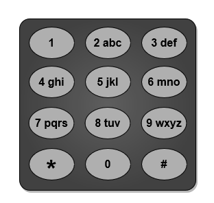

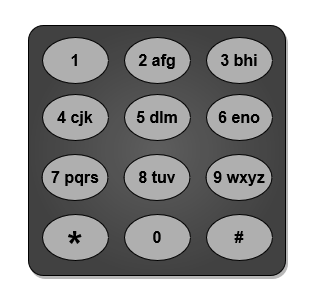

> Input: word = "abcde"
> Output: 5 
> Explanation: The remapped keypad given in the image provides the minimum cost.
> "a" -> one push on key 2
> "b" -> one push on key 3
> "c" -> one push on key 4
> "d" -> one push on key 5
> "e" -> one push on key 6
> Total cost is 1 + 1 + 1 + 1 + 1 = 5.
> It can be shown that no other mapping can provide a lower cost.

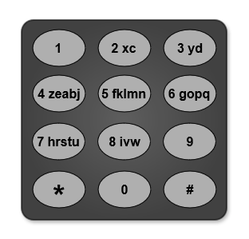

> Input: word = "xyzxyzxyzxyz"
> Output: 12
> Explanation: The remapped keypad given in the image provides the minimum cost.
> "x" -> one push on key 2
> "y" -> one push on key 3
> "z" -> one push on key 4
> Total cost is 1 * 4 + 1 * 4 + 1 * 4 = 12
> It can be shown that no other mapping can provide a lower cost.
> Note that the key 9 is not mapped to any letter: it is not necessary to map letters to every key, but to map all the letters.

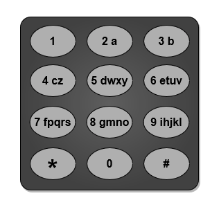

> Input: word = "aabbccddeeffgghhiiiiii"
> Output: 24
> Explanation: The remapped keypad given in the image provides the minimum cost.
> "a" -> one push on key 2
> "b" -> one push on key 3
> "c" -> one push on key 4
> "d" -> one push on key 5
> "e" -> one push on key 6
> "f" -> one push on key 7
> "g" -> one push on key 8
> "h" -> two pushes on key 9
> "i" -> one push on key 9
> Total cost is 1 * 2 + 1 * 2 + 1 * 2 + 1 * 2 + 1 * 2 + 1 * 2 + 1 * 2 + 2 * 2 + 6 * 1 = 24.
> It can be shown that no other mapping can provide a lower cost.

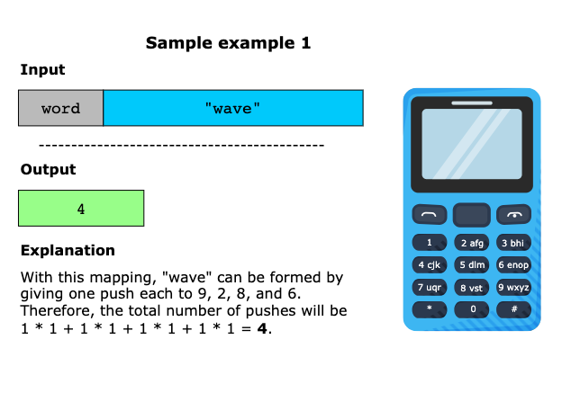
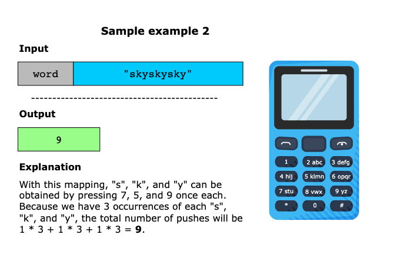
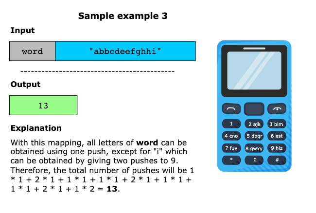

## Constraints

- 1 <= `word.length` <= 10^5
- `word` consists of lowercase English letters

## Topics

- Hash Table
- String
- Greedy
- Sorting
- Counting

## Solution

1. [Greedy Sorting](#greedy-sorting)
2. [Using a heap](#using-a-heap)

### Greedy Sorting

To solve this problem, we use a greedy algorithm approach combined with sorting. Keeping in mind that we have 8 keys
available (2-9), the primary intuition is to remap the keys so the 8 most frequently occurring characters in the given
string are assigned as first key presses, the next most common 8 characters as second key presses, and so on.

We begin by counting the occurrences of each letter using a counter, which provides the frequency of each distinct
letter. Next, we sort these frequencies in descending order.

Since there are 8 possible key assignments, we'll divide the frequency rank by 8 to group it as a first, second, or
third key press. Note that dividing the frequencies by 8 will result in 0, 1, and 2. We must add 1 to this group number
to get the actual number of presses required for letters in that group. Multiplying this by the number of times the
character appears in the given string yields the total number of presses for that letter.

Finally, we will sum the total presses required to type the word.

This greedy way, combined with sorting by frequency, ensures that each decision (assignment of letters to keys) is
optimal for minimizing key presses.

#### Algorithm

- Initialize a frequency vector frequency of size 26 to store the count of each letter in the word.
  - Iterate through each character c in word and increment the count in frequency at the index corresponding to c - 'a'.
- Sort the frequency vector in descending order to prioritize letters with higher counts.
- Initialize a variable totalPushes to store the total number of key presses required.
- Iterate through the sorted frequency vector:
  - If the frequency of a letter is zero, break the loop as there are no more letters to process.
  - Calculate the number of pushes for each letter based on its position in the sorted list: (i / 8 + 1) * frequency[i].
    > the number of pushes required to obtain a single instance of it is (i / 8 + 1). Because there are 8 available
    > keys (2 − 9), for the first 8 values of i (i = 0 to i = 7) corresponding to the first 8 frequent letters,
    > (i / 8 + 1) will give 1. For the next 8 values of i (i=8 to i=15) corresponding to the next 8 frequent letters,
    > (i / 8 + 1) will give 2, and this pattern continues.
  - Accumulate this value in totalPushes.
- Return totalPushes as the minimum number of key presses required to type the word.

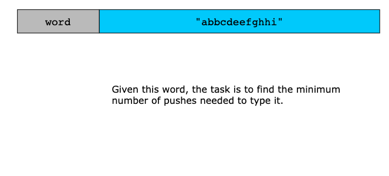
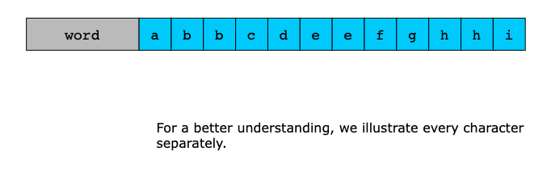
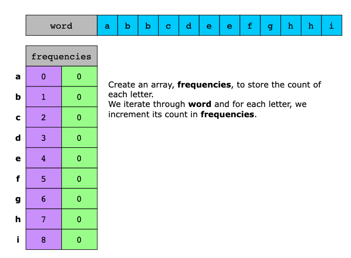
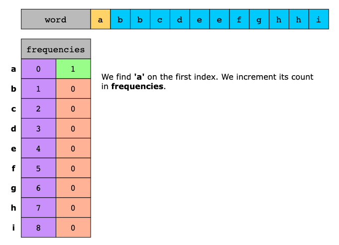
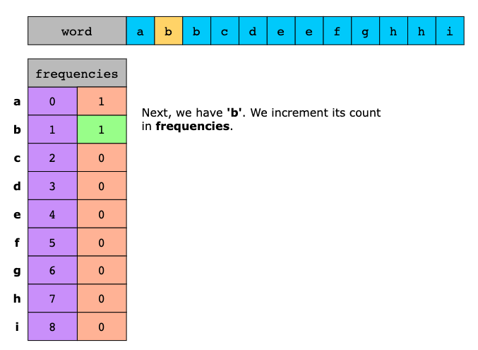
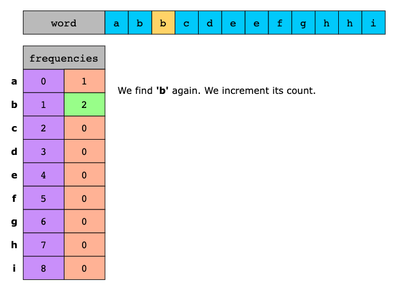
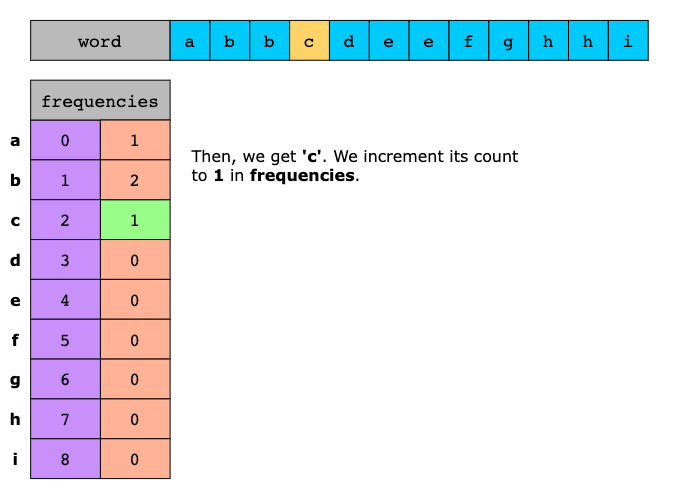
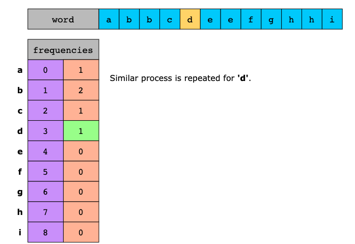
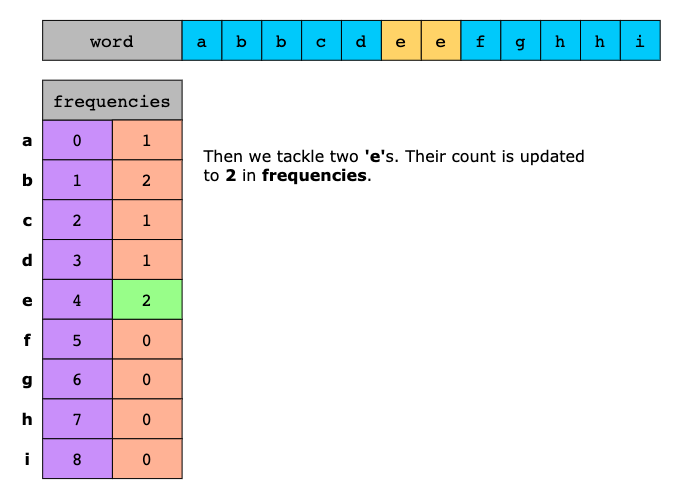
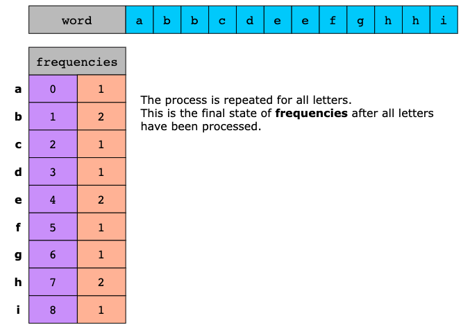
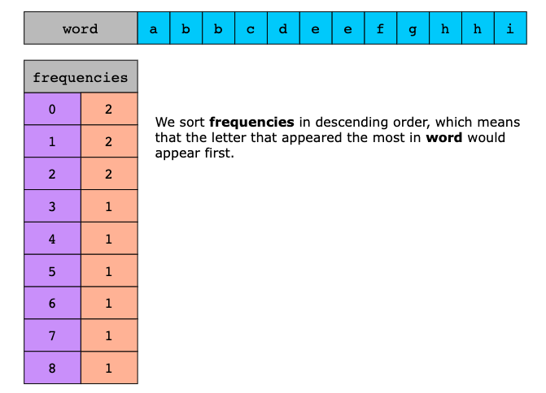

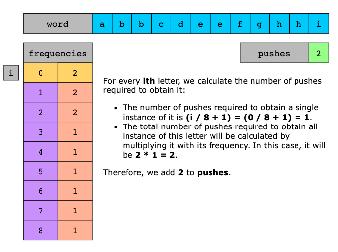
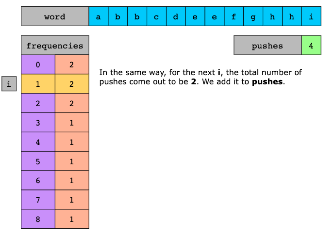
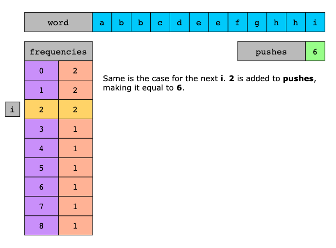
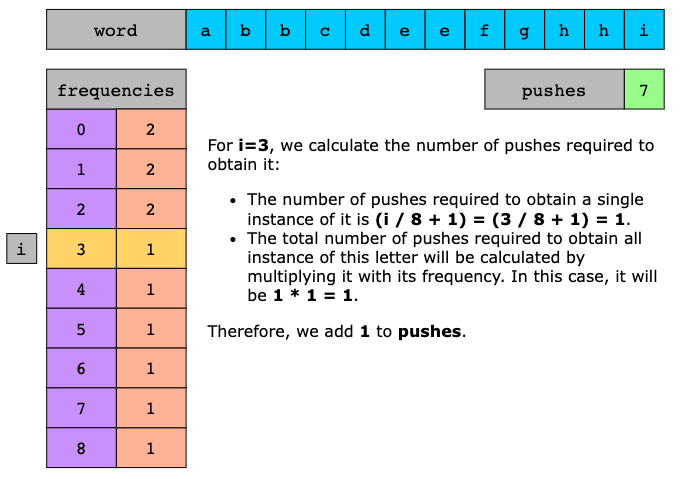
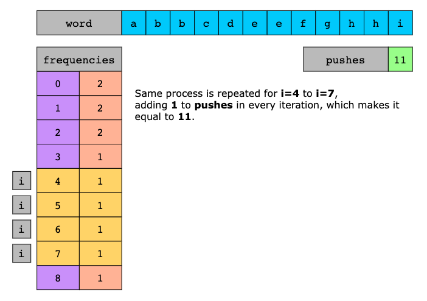
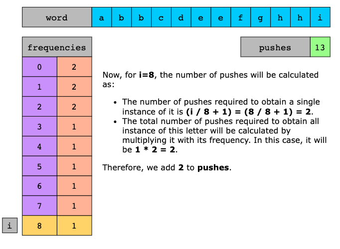
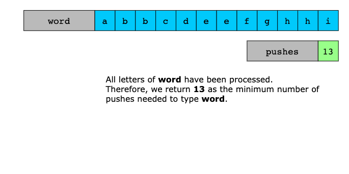

#### Complexity Analysis

Let `n` be the length of the string

##### Time Complexity

Iterating through the word string to count the frequency of each letter takes `O(n)`.

Sorting the frequency array, which has a fixed size of 26 (for each letter in the alphabet), takes O(1) because the size
of the array is constant.

Iterating through the frequency array to compute the total number of presses is O(1) because the array size is constant.

Overall, the dominant term is O(n) due to the frequency counting step.

##### Space Complexity

Frequency array and sorting takes O(1) space, as it always requires space for 26 integers.

Overall, the space complexity is O(1) because the space used does not depend on the input size.

---

### Using a Heap

Following the initial approach that used sorting and a greedy strategy, we now explore a similar yet refined method.

First, we count the frequency of each character in the word using an unordered map (or dictionary), where each key
represents a character, and its value indicates how many times it appears in the word.

Next, we use a priority queue (or max-heap) to efficiently manage these frequencies. The priority queue enables quick
retrieval of the character with the highest frequency by giving the most frequent characters the highest priority.

As we process characters from the priority queue, we dynamically assign them to keys based on their frequencies.
Specifically, at each iteration, we extract the character with the highest frequency and assign it to the key with the
least number of characters assigned.

To facilitate this, we maintain a record of the number of letters assigned to each key press count. This helps us
determine the next available key press count for assigning characters. For instance, once a key press count of 1 is
fully utilized, we proceed to a key press count of 2, and so on.

We assign the character with the highest frequency to the least costly available key press count, updating our record to
reflect this assignment and marking the key press count as occupied. This process continues until all characters are assigned.

Finally, we calculate the total number of key presses required by summing the product of each character’s frequency and
its assigned key press count. This gives us the optimal total number of key presses needed to type the word.

#### Algorithm

- Create a frequency map frequencyMap to store the count of each letter in the input string word.
  - Iterate through word and for each character, increment its count in frequencyMap.
- Create a priority queue frequencyQueue to store the frequencies of letters in descending order. 
  - Iterate through frequencyMap and push each frequency into frequencyQueue.
- Initialize a variable totalPushes to 0 to keep track of the total number of presses.
- Initialize an index variable index to 0.
- Calculate the total number of presses by processing the frequencies in the priority queue. 
  - While frequencyQueue is not empty:
    - Add the product of (1 + (index / 8)) and the top frequency from frequencyQueue to totalPushes. 
    - Remove the top element from frequencyQueue. 
    - Increment index by 1.
- Return totalPushes as the minimum number of presses needed.

> Note: As shown in Slide 4, when calculating totalPushes, we multiply by 1. This value represents frequencyQueue.top(),
> which is 1 in the visual example.

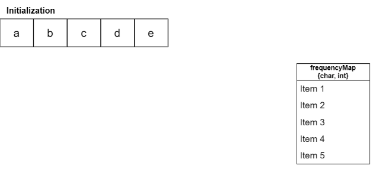
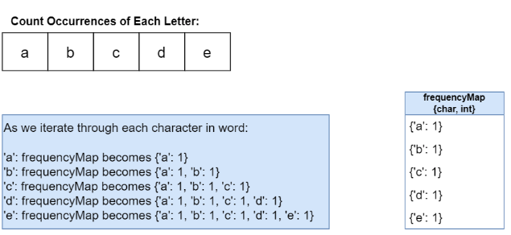
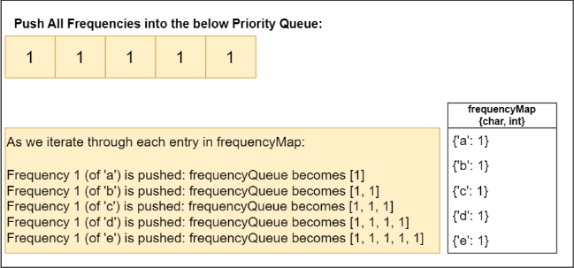
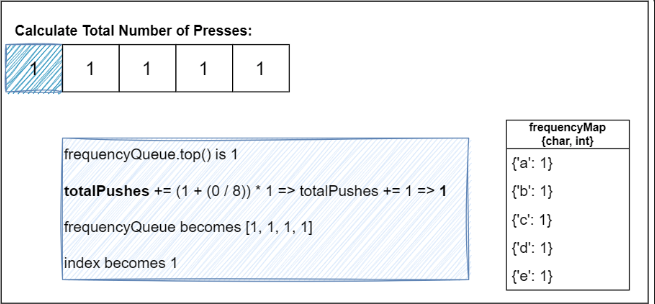
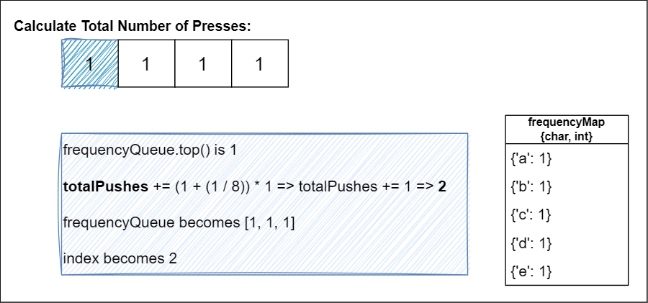
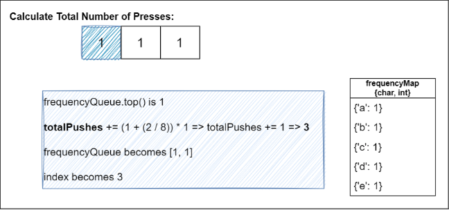
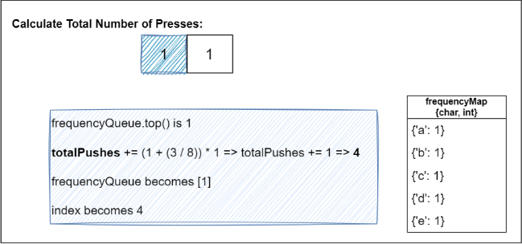
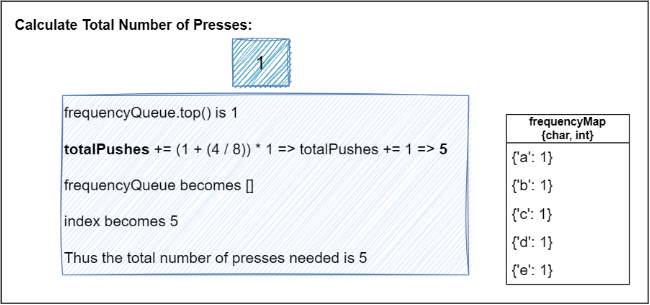

#### Complexity Analysis

##### Time Complexity

Iterating through the word string to count the frequency of each letter takes O(n).

Inserting each frequency into the priority queue and extracting the maximum frequency both operate with a time
complexity of O(klogk), where k represents the number of distinct letters. Each of these operations—insertions, and
extractions—is logarithmic due to the heap structure of the priority queue. However, since the number of distinct
letters is limited to a maximum of 26 (one for each letter in the alphabet), the size of the priority queue remains
constant and thus the time complexity effectively becomes O(1) in practice.

Overall, the dominant term is O(n) due to the frequency counting step.

##### Space Complexity

The frequency map and priority queue take O(26)=O(1) space, as it always requires a fixed space for 26 integers.  

Overall, the space complexity is O(1) because the space used does not depend on the input size.
