# Minimum Number of Refueling Stops

You need to find the minimum number of refueling stops that a car needs to make to cover a distance, target. For
simplicity, assume that the car has to travel from west to east in a straight line. There are various fuel stations on
the way that are represented as a 2-D array of stations, i.e., stations[i]=[di,fi], where di is the distance (in miles)
of the ith gas station from the starting position, and fi is the amount of fuel (in liters) that it stores. Initially,
the car starts with k liters of fuel. The car consumes one liter of fuel for every mile traveled. Upon reaching a gas
station, the car can stop and refuel using all the petrol stored at the station. If it cannot reach the target, the
program returns −1.

> Note: If the car reaches a station with 0 fuel left, it can refuel from that station, and all the fuel from that
> station can be transferred to the car. If the car reaches the target with 0 fuel left, it is still considered to have
> arrived.

## Constraints

- 1 <= `target`, `k` <= 10^9
- 0 <= `stations.length`, <= 900
- 1 <= di < di+1 < `target`
- 1 <= fi < 10^9

## Examples

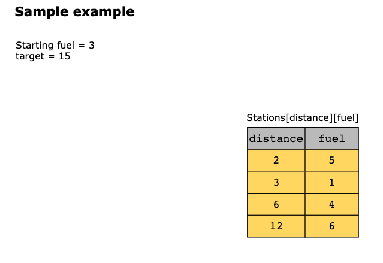
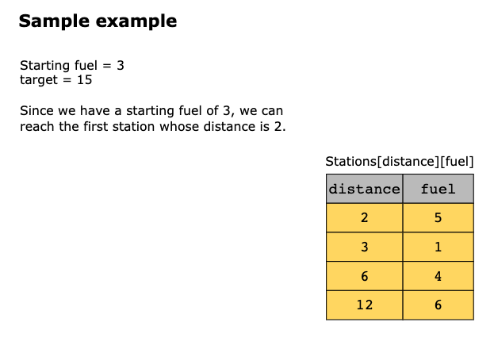
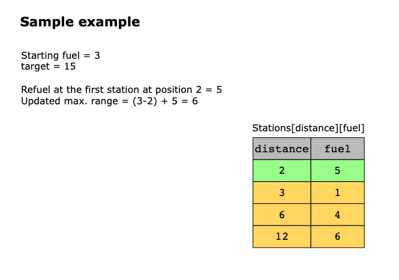
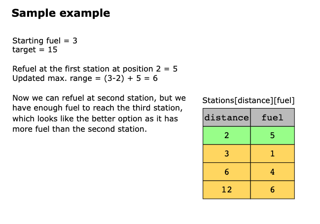
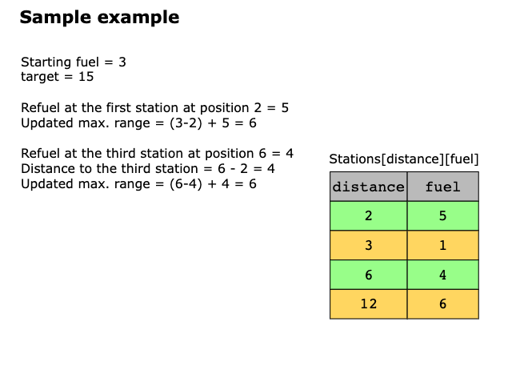
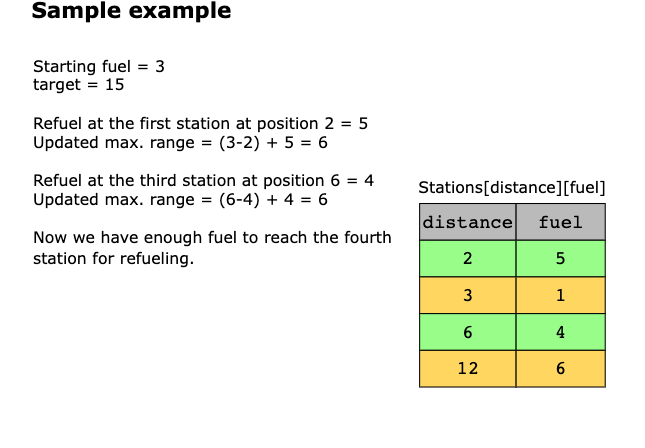
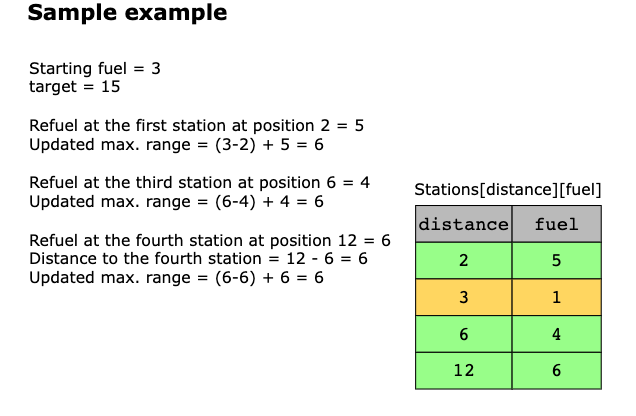
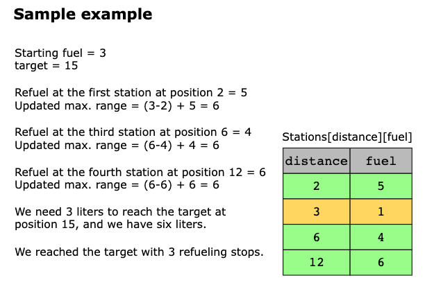

## Solutions

### Using Max Heap

This problem can be solved using the greedy algorithm, since the car has to reach the destination using a minimum number
of refueling stops. This means that the car needs a maximum fuel amount at any point. The idea is to make optimal choices
by selecting the fuel station with the maximum fuel capacity at each step to reach the target distance with the minimum
number of refueling stops.

To cater to the problem of selecting the maximum fuel value, we can use the max-heap to keep track of fuel capacity for
refueling because the top of the max-heap will always have the highest fuel value. Therefore we can take the highest fuel
value from the top of the max-heap to reach the target by using the minimum number of refueling stops. To implement this
methodology, we will create a function, min_refuel_stops. The steps of the function are given below:

1. If the starting fuel is greater than or equal to the target distance, return 0. It means no extra fuel is required,
   and the car can reach the target using the starting fuel.
2. Otherwise, iterate until the maximum distance is equal to or greater than the target, and the car is not out of fuel:
   - If we have a fuel station that can be used to refuel, and the vehicle has enough fuel to reach it, add the refueling
     station to the max-heap.
   - If the max-heap contains no fuel stations, the vehicle can’t reach the target, and the function returns −1. In
     simpler words, the car doesn’t have enough fuel to reach the target even after stopping at all the fuel stations.
   - Otherwise, if the max-heap has fuel stations and the vehicle doesn’t have enough fuel to go to the next station,
     the vehicle refuels from the fuel station with the maximum fuel value. After refueling, we remove the fuel value of
     this refueling station from the max-heap and also increment the number of stops.
3. After executing the loop, the function returns the total number of refueling stops required to reach the target
   distance.

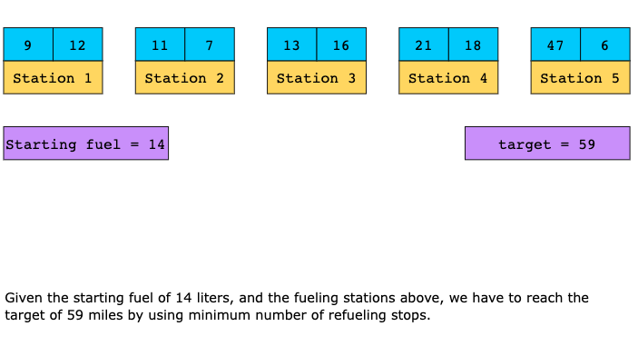
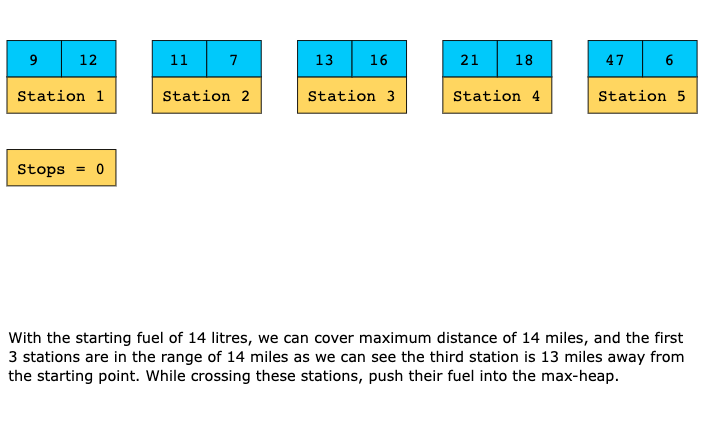
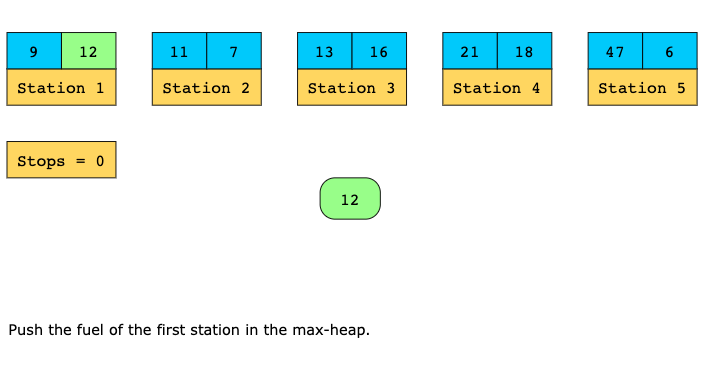
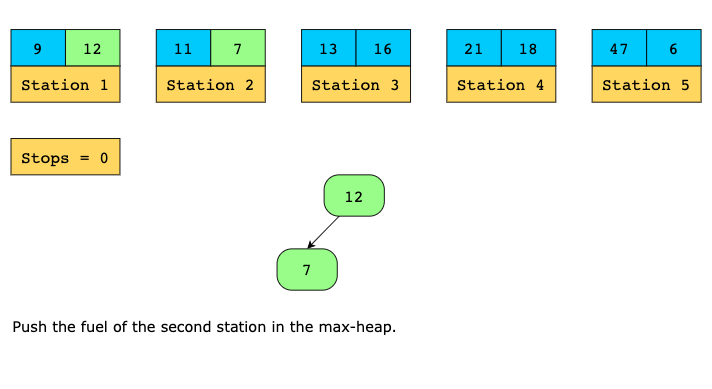
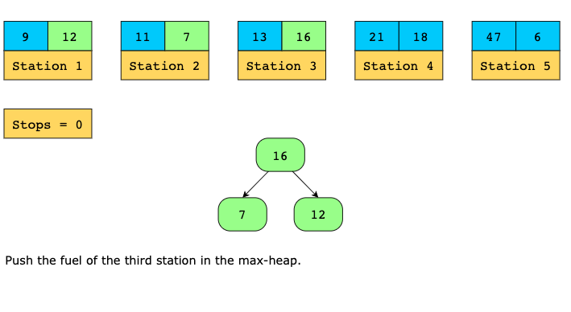
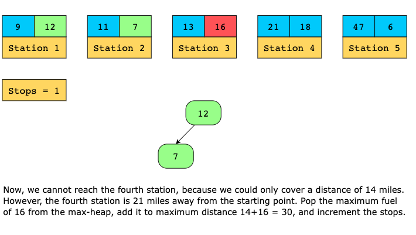
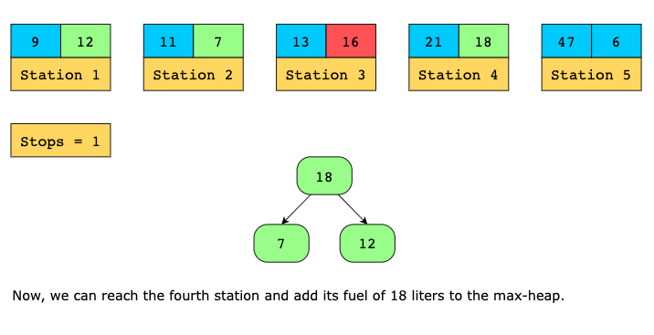
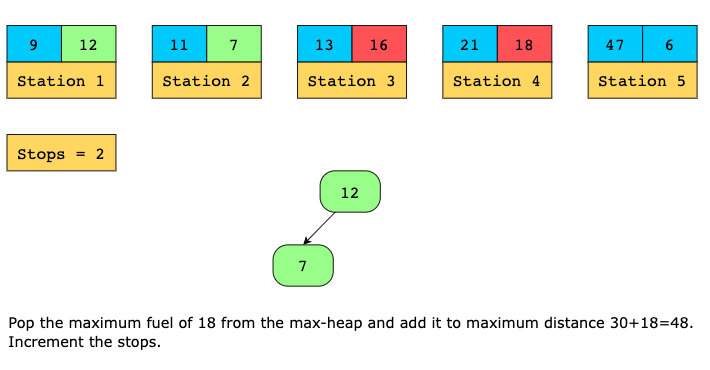
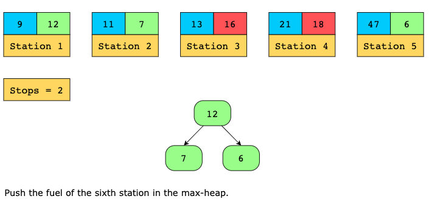
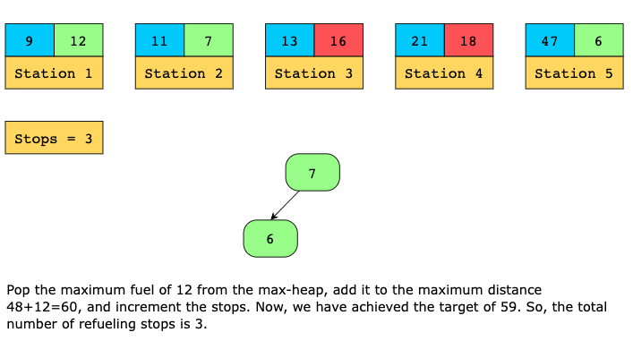

#### Time Complexity

The time complexity of the solution above is O(n×log(n)), where n is the total number of stations.

#### Space Complexity

The space complexity of the solution above is O(n), since there will be maximum n fuel capacities in a heap.

