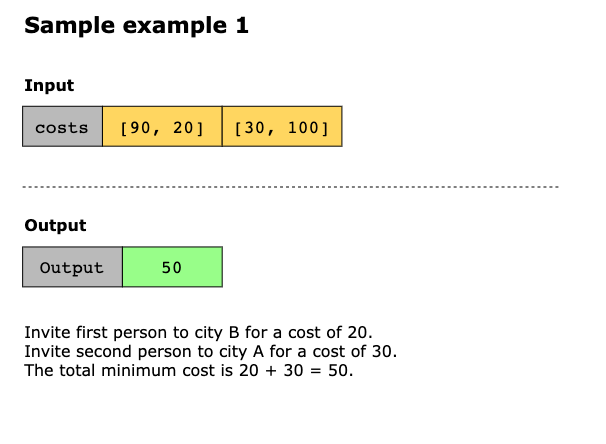
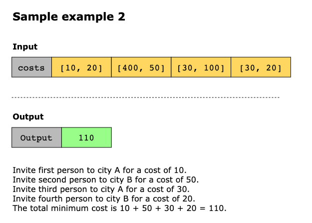
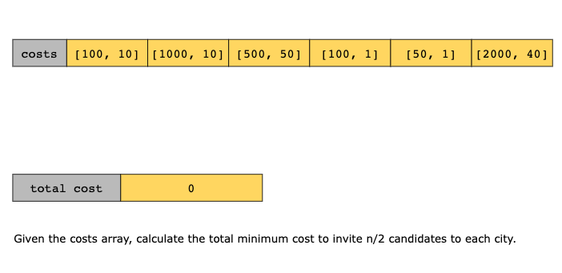
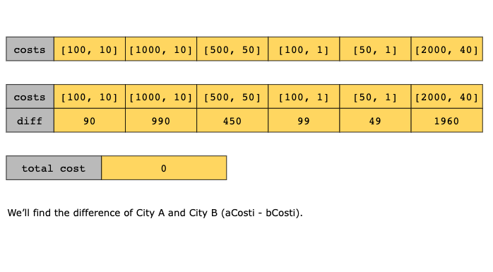
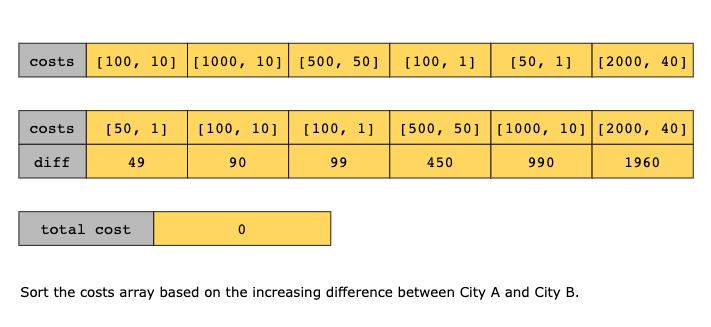
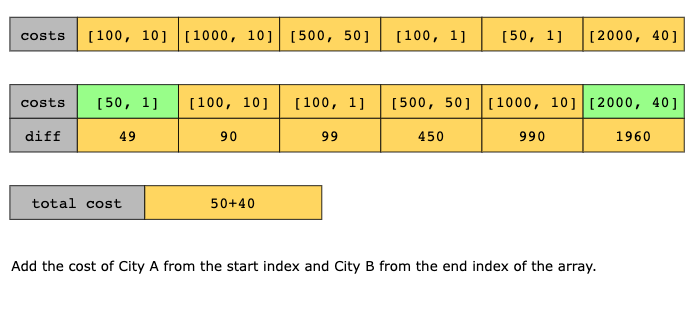
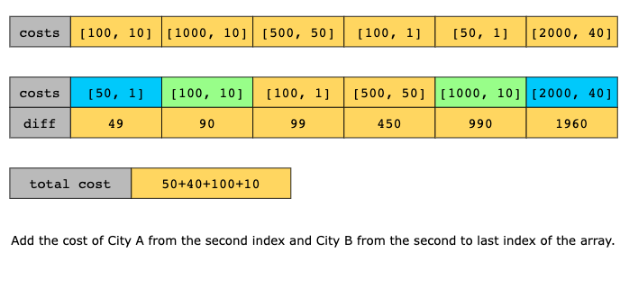
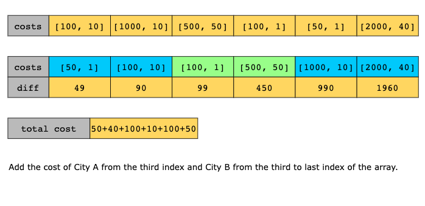
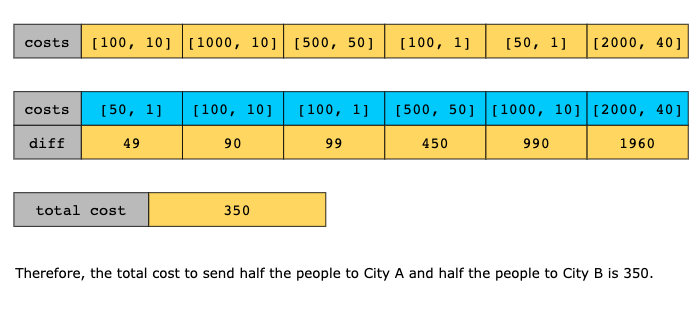

# Two City Scheduling

A recruiter plans to hire n people and conducts their interviews at two different locations of the company. He
evaluates the cost of inviting candidates to both these locations. The plan is to invite 50% at one location, and the
rest at the other location, keeping costs to a minimum.

We are given an array, costs, where costs[i]=[aCosti ,bCosti]], the cost of inviting the ith person to City A is aCosti,
and the cost of inviting the same person to City B bCosti.

You need to determine the minimum cost to invite all the candidates for the interview such that exactly n/2 people are
invited in each city.

## Constraints

- 2 <= `costs.length` <= 100
- `costs.length` is even
- 1 <= `aCosti`, `bCosti` <= 1000

## Examples

## Solution

Let’s take an example to understand the solution to this problem. Given the costs array [[100,10],[1000,10],[500,50],[100,1]],
we want to invite half the people to City A and the other half to City B. We can see that inviting the first person and
the fourth person to City A and the second and the third person to City B minimizes the cost to 100 + 100 + 50 + 10 = 260.

Let’s take the difference of all city pairs (aCosti − bCosti) [90,990,450,99]. If we sort our cost array based on these
differences ([90, 99, 450, 990]), then the cost array will be [[100,10],[100,1],[500,50],[1000,10]]. Now, if we invite
the first half of the array to City A and the next half to City B, then the cost is minimized to 100+100+50+10=260.

This algorithm uses a greedy approach that chooses the minimum cost for inviting a person to a city based on the difference
between the cost of inviting them to City A and City B. The idea behind this is that if the cost difference is large,
inviting a person to a city with a lower cost is optimal, because the difference is large. After sorting the array based
on difference, the costs with large differences will be in the second half of the array. When the difference is large,
it means the second value will be much less than the first value in the costs array. Therefore, we are inviting the
second half to City B for optimization.

The steps of the solution according to the above-mentioned methodology are given below:

1. Declare a variable, total_cost, initialized to 0.
2. Sort the costs array in ascending order based on the difference between the cost of sending a person to City A versus
   sending the same person to City B.
3. Iterate over the sorted costs array to calculate the minimum costs required to send n/2 people to each city. We will
   perform the following steps:
   - For the first n/2 elements in the costs array, add aCosti to the total cost for inviting candidates to City A.
   - For the remaining n/2 elements in the costs array, add bCosti to the total cost for inviting candidates to City B.
4. Return the total minimum cost after traversing the costs array.

### Time Complexity

We only traverse the array once but since we use sorting, the time complexity of the solution becomes O(nlog(n)).

### Space Complexity

In Python, the sorting algorithm takes O(n) space to sort the costs array. Therefore, the space complexity of the above
solution is O(n).

## Topics

- Array
- Greedy
- Sorting
