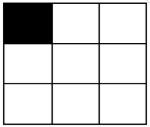
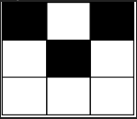

# Number of Black Blocks

You are given two integers m and n representing the dimensions of a 0-indexed m x n grid.

You are also given a 0-indexed 2D integer matrix coordinates, where coordinates[i] = [x, y] indicates that the cell with
coordinates [x, y] is colored black. All cells in the grid that do not appear in coordinates are white.

A block is defined as a 2 x 2 submatrix of the grid. More formally, a block with cell [x, y] as its top-left corner where
0 <= x < m - 1 and 0 <= y < n - 1 contains the coordinates [x, y], [x + 1, y], [x, y + 1], and [x + 1, y + 1].

Return a 0-indexed integer array arr of size 5 such that arr[i] is the number of blocks that contains exactly i black
cells.

## Examples

Example 1:

```text
Input: m = 3, n = 3, coordinates = [[0,0]]
Output: [3,1,0,0,0]
Explanation: The grid looks like this:

There is only 1 block with one black cell, and it is the block starting with cell [0,0].
The other 3 blocks start with cells [0,1], [1,0] and [1,1]. They all have zero black cells. 
Thus, we return [3,1,0,0,0]. 
```


Example 2:

```text
Input: m = 3, n = 3, coordinates = [[0,0],[1,1],[0,2]]
Output: [0,2,2,0,0]
Explanation: The grid looks like this:

There are 2 blocks with two black cells (the ones starting with cell coordinates [0,0] and [0,1]).
The other 2 blocks have starting cell coordinates of [1,0] and [1,1]. They both have 1 black cell.
Therefore, we return [0,2,2,0,0].
```


## Constraints

- 2 <= m <= 10^5
- 2 <= n <= 10^5
- 0 <= coordinates.length <= 10^4
- coordinates[i].length == 2
- 0 <= coordinates[i][0] < m
- 0 <= coordinates[i][1] < n
- It is guaranteed that coordinates contains pairwise distinct coordinates.

## Topics

- Array
- Hash Table
- Enumeration

## Hints

- The number of blocks is too much but the number of black cells is less than that.
- It means the number of blocks with at least one black cell is O(|coordinates|). let’s just hold them.
- Iterate through the coordinates and update the block counts accordingly. For each coordinate, determine which block(s)
  it belongs to and increment the count of black cells for those block(s).
- After processing all the coordinates, count the number of blocks with different numbers of black cells. You can use
  another data structure to keep track of the counts of blocks with 0 black cells, 1 black cell, and so on.
