# Ransom Note

Given two strings, ransom_note and magazine, check if ransom_note can be constructed using the letters from magazine.
Return TRUE if it can be constructed, FALSE otherwise.

> Note: A ransom note is a written message that can be constructed by using the letters available in the given magazine.
> The magazine can have multiple instances of the same letter. Each instance of the letter in the magazine can only be
> used once to construct the ransom note.

## Constraints

- 1 <= `ransom_note.length`, `magazine.length` <= 10^3
- The `ransom_note` and `magazine` consist of lowercase English letters

## Examples

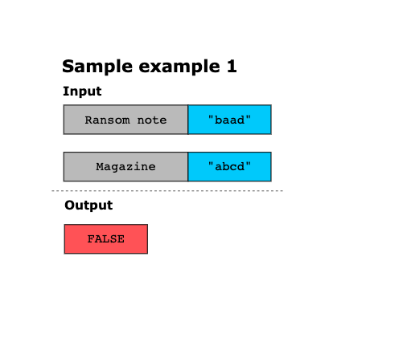
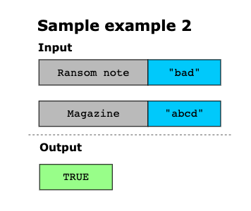
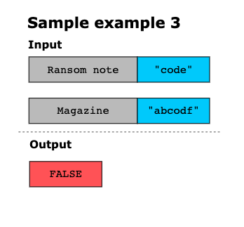
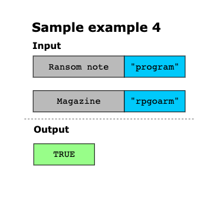

## Topics

- Hash Table
- String
- Counting

## Solution
An optimized approach to solve this problem is to keep track of the occurrences of characters using the hash map. We
store the frequency of each character of the magazine in the hash map. After storing the frequencies, we iterate over
each character in the ransom note and check if the character is present in the hash map and its frequency is greater
than zero. If it is, we decrement the frequency by 1, indicating that we’ve used that character to construct the ransom
note. If the character is not present in the hash map or its frequency is 0, we immediately return FALSE since it's
impossible to construct the ransom note.

If we successfully iterate through all characters in the ransom note without encountering a character that is not present
in the hash map or its frequency is 0, we return TRUE, indicating that we can construct the ransom note from the
characters available in the magazine.

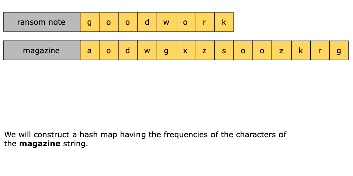
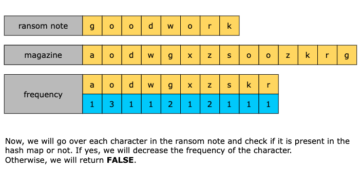
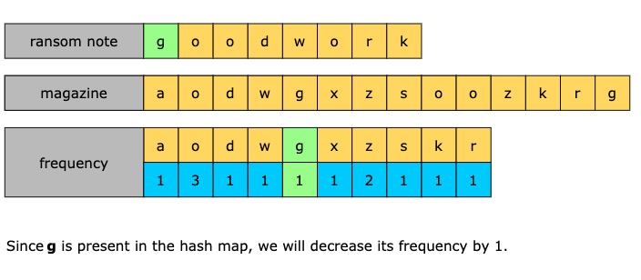
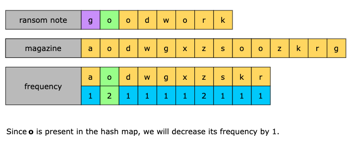
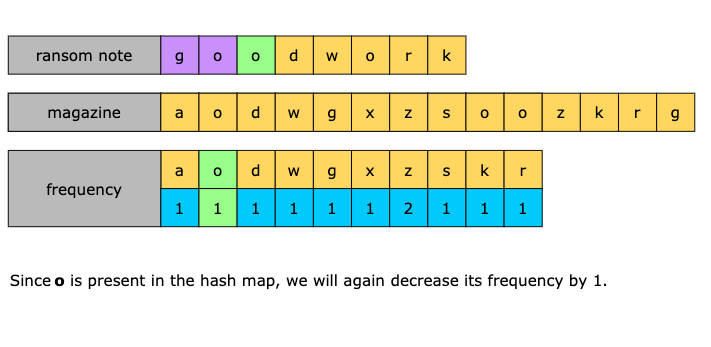
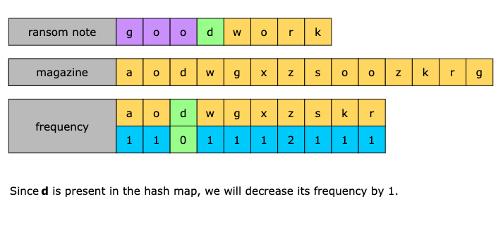
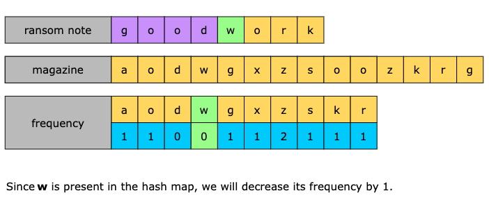
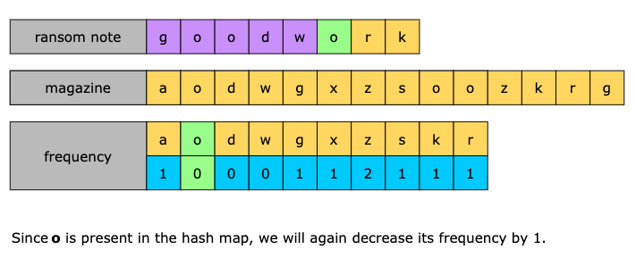
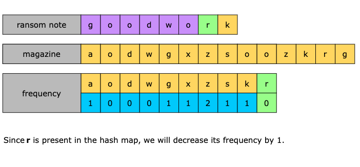
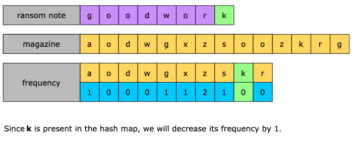
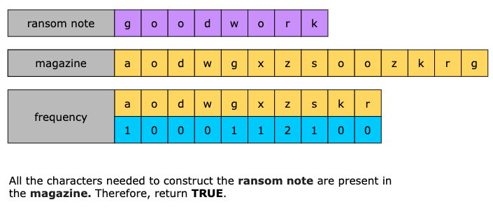

### Summary

- Create a hash map to store the frequencies of each character in the magazine.
- Iterate through each character in the ransom note and check the following conditions:
  - If the character is not in the hash map or the frequency of the character is 0, return FALSE 
  - Otherwise, decrement the frequency of the character in the hash map by 1.
- Return TRUE if we successfully iterate through all characters in the ransom note.

### Time Complexity

The time complexity of this solution is O(n+m), where n is the length of the ransom note and m is the length of the
magazine.

### Space Complexity

The space complexity of this solution is O(1) because we have a constant number of lowercase English letters
(26 unique characters). Therefore, the space required by the hash map will remain constant.
