# Construct Target Array With Multiple Sums

You are given an array `target` of `n` integers. From a starting array `arr` consisting of `n` 1's, you may perform the
following procedure :

- let x be the sum of all elements currently in your array.
- choose index i, such that 0 <= i < n and set the value of arr at index i to x.
- You may repeat this procedure as many times as needed.

Return true if it is possible to construct the target array from arr, otherwise, return false.

## Examples

Example 1:

```text
Input: target = [9,3,5]
Output: true
Explanation: Start with arr = [1, 1, 1] 
[1, 1, 1], sum = 3 choose index 1
[1, 3, 1], sum = 5 choose index 2
[1, 3, 5], sum = 9 choose index 0
[9, 3, 5] Done
```

Example 2:

```text
Input: target = [1,1,1,2]
Output: false
Explanation: Impossible to create target array from [1,1,1,1].
```

Example 3:

```text
Input: target = [8,5]
Output: true
```

## Constraints

- n == target.length
- 1 <= n <= 5 * 10^4
- 1 <= target[i] <= 10^9

## Topics

- Array
- Heap (Priority Queue)

## Hints

- Given that the sum is strictly increasing, the largest element in the target must be formed in the last step by adding
  the total sum in the previous step. Thus, we can simulate the process in a reversed way.
- Subtract the largest with the rest of the array, and put the new element into the array. Repeat until all elements
  become one

## Solution

The straightforward approach starts with an array of all 1’s and replaces one element with the sum of all elements,
repeating this process. For example, starting with [1, 1, 1, 1], the sum is 4, and one number is replaced with this sum,
leading to arrays like [4, 1, 1, 1], [1, 4, 1, 1], and so on. This process grows exponentially as the number of possible
paths increases, making it computationally expensive for larger arrays. The expanding sum makes it hard to predict the
correct path, and this approach struggles with large arrays due to its high computational cost and inefficiency.

The optimized approach works in reverse, starting from the target array and moving backward toward an array of all 1’s.
This method reduces the number of possibilities by eliminating unnecessary branching. Instead of growing the array toward
the target, the algorithm reduces the target by calculating the previous values. At each step, it identifies the largest
number in the array and computes the sum of the remaining elements.

Instead of directly subtracting the largest number from the sum, the algorithm uses the modulo operation to find the
previous value by computing the largest number modulo the sum of the other elements. This step-by-step reduction mimics
working backward through the array, simplifying the array structure. A max heap ensures that the largest number is always
processed first. This is crucial, as reducing the largest number drives the process toward convergence. The modulo
operation progressively reduces the largest element, avoiding unnecessary branching and computations. The algorithm
continues reducing until it reaches an array of all 1’s, confirming the target is achievable, or detects an invalid state,
signaling failure. This optimized approach handles larger arrays effectively, reducing the largest number step-by-step and
making the process computationally efficient and scalable. By working backward and minimizing the search space through
subtraction and modulo, the algorithm ensures a unique path to the target, making it faster and more efficient.

The steps of the algorithm are as follows:

1. Initialize a max-heap and push all elements of the target array into the heap.
2. Calculate the total_sum of the target array.
3. Iterate while the max-heap is not empty:
   - Pop the largest element from the heap (current_max).
   - Compute the sum of the remaining elements: remaining_sum = total_sum - current_max.
   - Check for base cases:
     - If current_max == 1 or remaining_sum == 1, return True, because we can construct the array.
     - If remaining_sum == 0, or current_max < remaining_sum, or current_max % remaining_sum == 0, return False — it’s
       invalid or stuck in an infinite loop.
   - Simulate the reverse of the operation:
     - Compute the previous value before current_max was formed: updated_value = current_max % remaining_sum.
     - Update the total sum: total_sum = remaining_sum + updated_value.
     - Push updated_value back into the heap.

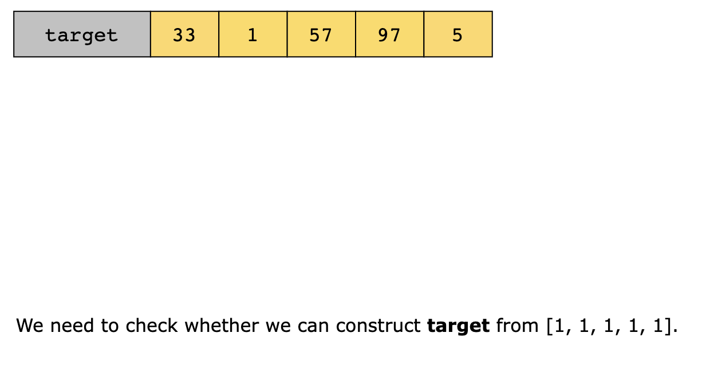
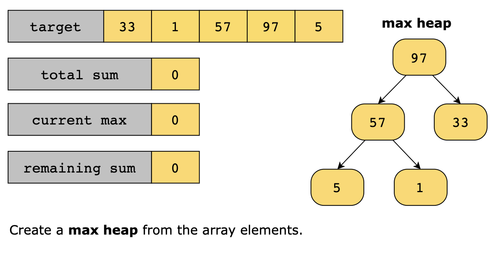
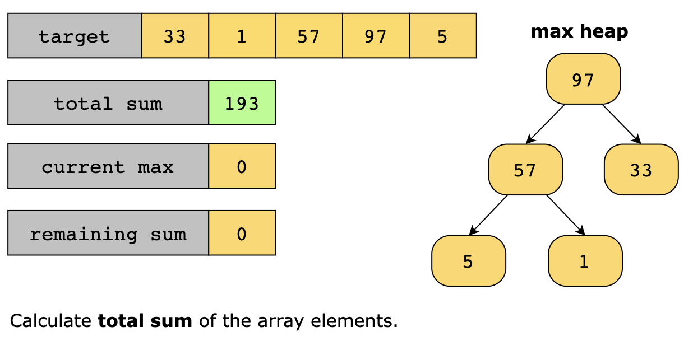
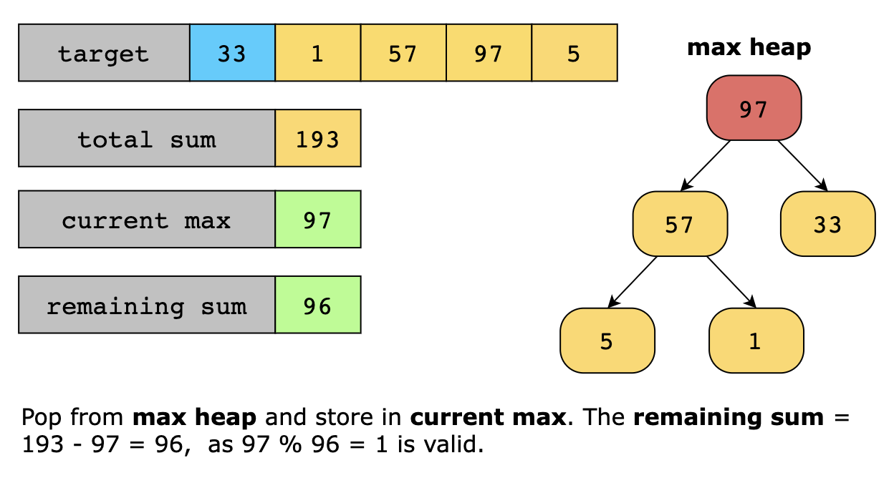
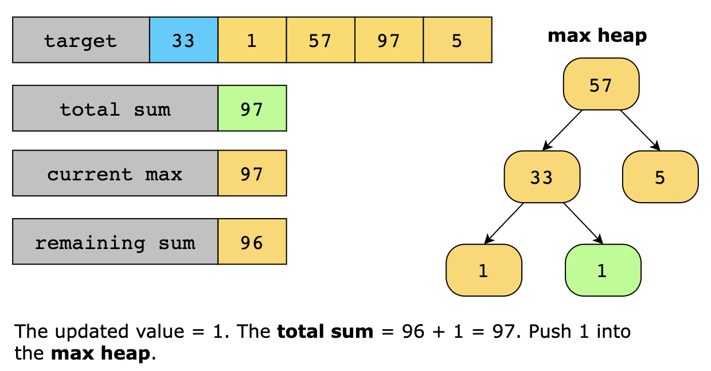
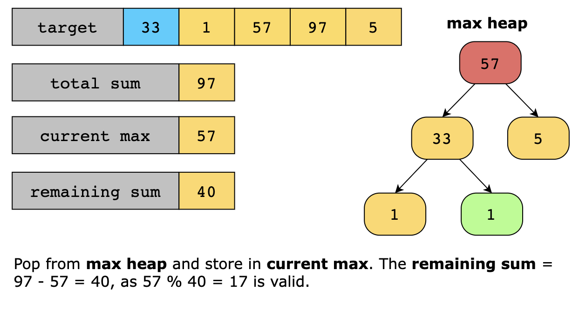
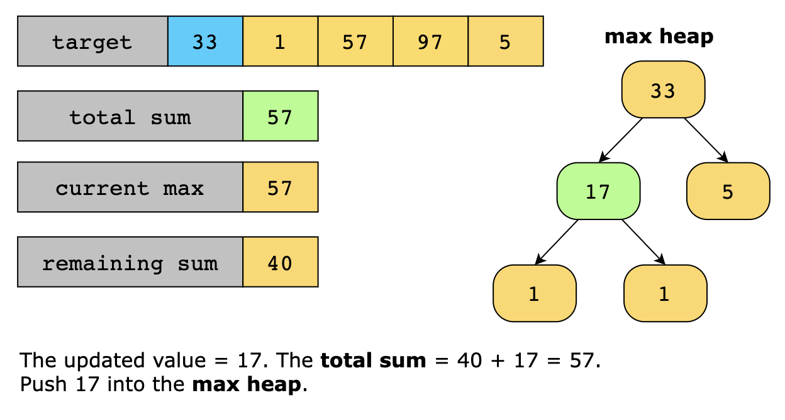
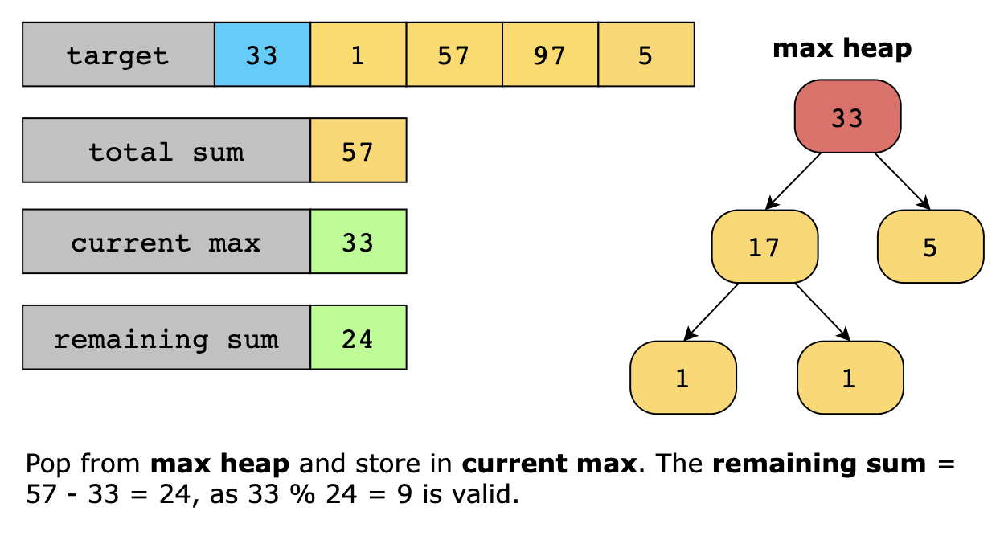
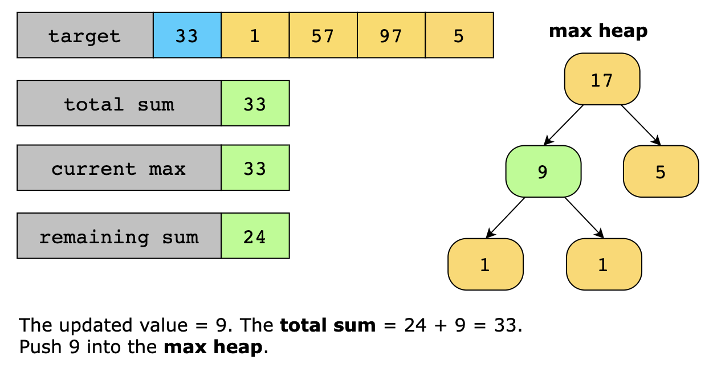
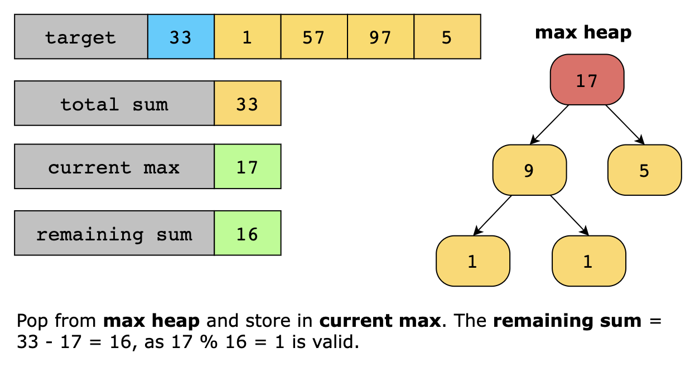
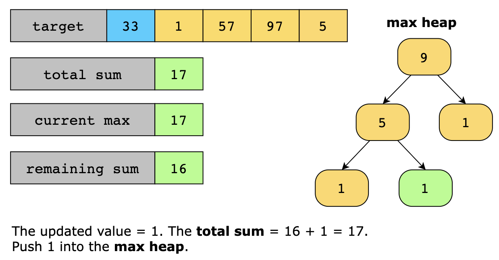
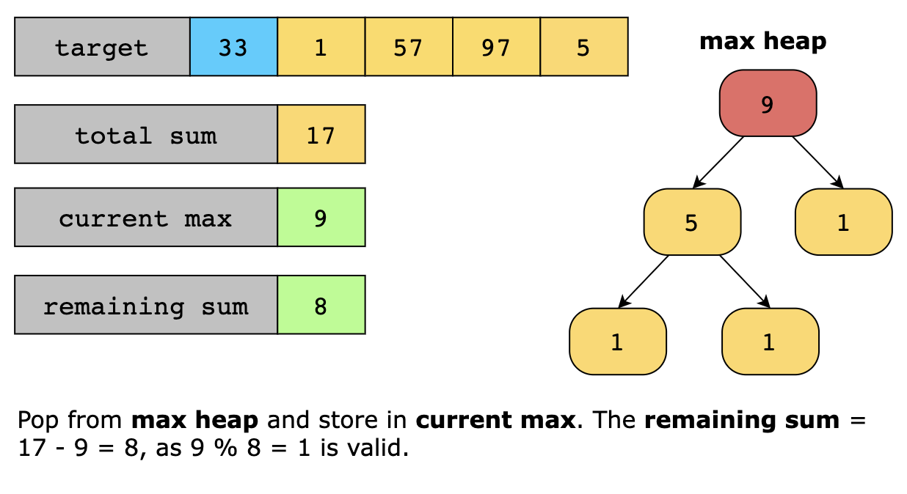
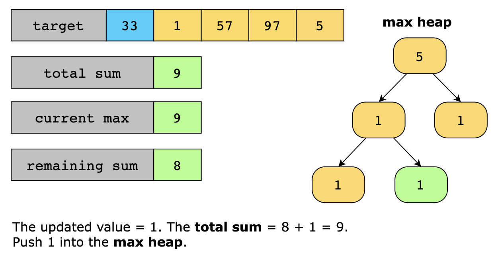


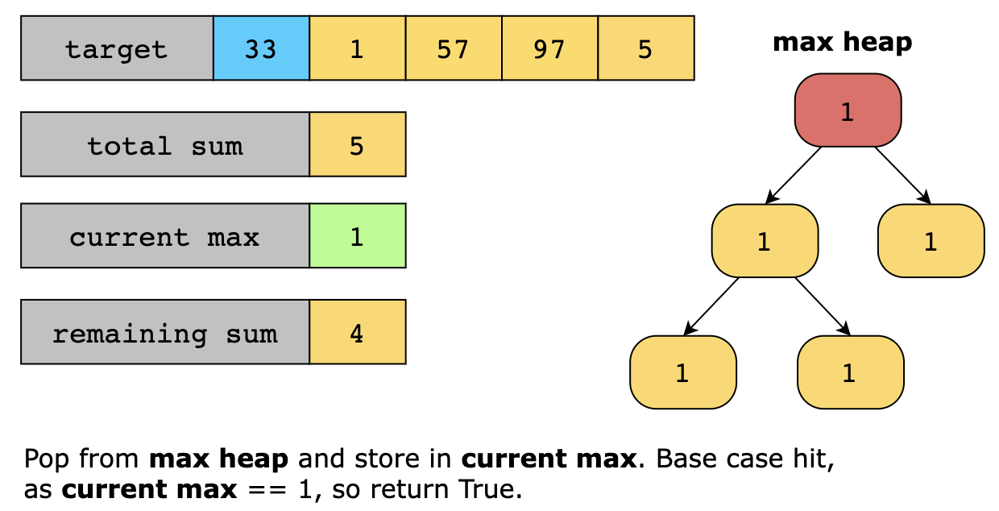

### Time Complexity

The time complexity of the solution is O(nlog(n)) because each heap operation (push and pop) takes log(n) time and we
may perform it up to O(n) times in the worst case.

### Space Complexity

The space complexity of the above solution is O(n), for storing the heap.
